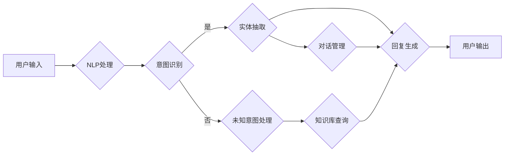

# Python机器学习实战：智能聊天机器人的构建与优化

> 关键词：Python，机器学习，聊天机器人，自然语言处理，深度学习，神经网络，对话系统

## 1. 背景介绍

随着互联网技术的飞速发展，智能聊天机器人已经成为人们日常生活中不可或缺的一部分。从客服机器人到个人助理，从虚拟助手到游戏角色，聊天机器人在各个领域展现出了巨大的潜力。本文将深入探讨使用Python和机器学习技术构建与优化智能聊天机器人的实战方法。

### 1.1 问题的由来

构建智能聊天机器人需要解决的核心问题包括：

- **自然语言理解**：如何让机器理解用户的自然语言输入，并从中提取出有效的信息。
- **意图识别**：如何根据用户的输入识别用户的意图，如询问天气、预订机票等。
- **对话管理**：如何管理对话流程，确保对话的自然流畅。
- **知识库管理**：如何构建和更新知识库，使聊天机器人能够回答各种问题。

### 1.2 研究现状

目前，构建智能聊天机器人的主要技术包括：

- **自然语言处理（NLP）**：使用NLP技术对用户输入进行处理，包括分词、词性标注、命名实体识别等。
- **机器学习**：使用机器学习算法训练模型，用于意图识别、实体抽取等任务。
- **深度学习**：使用神经网络等深度学习模型，提高模型的预测精度。
- **对话系统**：构建对话管理模块，管理对话流程。

### 1.3 研究意义

研究智能聊天机器人的构建与优化，对于推动人工智能技术的发展，提高用户的生活质量具有重要意义：

- **提高效率**：智能聊天机器人可以自动回答用户的问题，提高服务效率。
- **降低成本**：减少人工客服的数量，降低企业的人力成本。
- **个性化服务**：根据用户的历史交互记录，提供个性化的服务。
- **创新应用**：拓展人工智能技术的应用场景。

### 1.4 本文结构

本文将按照以下结构进行：

- **第2章**：介绍构建智能聊天机器人的核心概念与联系。
- **第3章**：讲解构建智能聊天机器人的核心算法原理和具体操作步骤。
- **第4章**：介绍数学模型和公式，并进行案例分析。
- **第5章**：提供构建智能聊天机器人的项目实践实例。
- **第6章**：探讨智能聊天机器人的实际应用场景和未来展望。
- **第7章**：推荐学习资源和开发工具。
- **第8章**：总结研究成果，展望未来发展趋势与挑战。
- **第9章**：提供常见问题与解答。

## 2. 核心概念与联系

构建智能聊天机器人的核心概念包括：

- **自然语言处理（NLP）**：使用NLP技术处理自然语言输入，包括分词、词性标注、命名实体识别等。
- **机器学习**：使用机器学习算法训练模型，用于意图识别、实体抽取等任务。
- **深度学习**：使用神经网络等深度学习模型，提高模型的预测精度。
- **对话系统**：构建对话管理模块，管理对话流程。
- **知识库**：存储与聊天机器人相关的知识信息。

以下是构建智能聊天机器人的Mermaid流程图：



## 3. 核心算法原理 & 具体操作步骤

### 3.1 算法原理概述

构建智能聊天机器人的核心算法包括：

- **NLP处理**：使用NLP技术对用户输入进行处理，包括分词、词性标注、命名实体识别等。
- **意图识别**：使用机器学习或深度学习算法识别用户的意图。
- **实体抽取**：从用户输入中抽取重要的实体信息。
- **对话管理**：管理对话流程，确保对话的自然流畅。
- **知识库查询**：根据对话内容和用户需求查询知识库，提供相关信息。
- **回复生成**：根据对话内容和用户需求生成回复。

### 3.2 算法步骤详解

构建智能聊天机器人的具体步骤如下：

1. **数据收集**：收集用户对话数据，用于训练和测试模型。
2. **数据预处理**：对收集到的数据进行清洗、标注等预处理操作。
3. **NLP处理**：使用NLP技术对用户输入进行处理。
4. **意图识别**：使用机器学习或深度学习算法识别用户的意图。
5. **实体抽取**：从用户输入中抽取重要的实体信息。
6. **对话管理**：管理对话流程，确保对话的自然流畅。
7. **知识库查询**：根据对话内容和用户需求查询知识库，提供相关信息。
8. **回复生成**：根据对话内容和用户需求生成回复。
9. **模型训练**：使用训练数据对模型进行训练。
10. **模型评估**：使用测试数据对模型进行评估。
11. **模型优化**：根据评估结果对模型进行优化。

### 3.3 算法优缺点

构建智能聊天机器人的算法具有以下优点：

- **灵活性**：可以根据不同的应用场景选择不同的算法。
- **可扩展性**：可以方便地添加新的功能模块。
- **高效性**：使用机器学习或深度学习算法，可以提高处理速度。

同时，也存在以下缺点：

- **数据依赖**：需要大量的标注数据。
- **算法复杂**：算法实现较为复杂。
- **可解释性差**：深度学习模型的可解释性较差。

### 3.4 算法应用领域

构建智能聊天机器人的算法可以应用于以下领域：

- **客服机器人**：自动回答用户的问题，提高服务效率。
- **个人助理**：帮助用户管理日程、发送提醒等。
- **游戏角色**：与玩家进行互动，提高游戏体验。
- **虚拟助手**：为用户提供各种服务。

## 4. 数学模型和公式 & 详细讲解 & 举例说明

### 4.1 数学模型构建

构建智能聊天机器人的数学模型主要包括：

- **NLP处理模型**：如词袋模型、TF-IDF模型等。
- **意图识别模型**：如朴素贝叶斯模型、支持向量机等。
- **实体抽取模型**：如条件随机场、序列标注模型等。
- **对话管理模型**：如注意力机制、图模型等。

### 4.2 公式推导过程

以下是意图识别模型的公式推导过程：

假设用户输入为一个句子 $S$，其中包含 $n$ 个单词 $w_1, w_2, \ldots, w_n$。意图识别模型的目标是识别句子 $S$ 的意图 $T$。

设 $P(T)$ 为句子 $S$ 的意图 $T$ 的先验概率，$P(S|T)$ 为在意图 $T$ 下句子 $S$ 的条件概率，则句子 $S$ 的后验概率为：

$$
P(T|S) = \frac{P(S|T)P(T)}{P(S)}
$$

其中 $P(S)$ 可以通过贝叶斯定理进行推导：

$$
P(S) = \sum_{T} P(S|T)P(T)
$$

为了简化计算，通常使用最大后验概率（MAP）进行意图识别：

$$
T = \arg\max_{T} P(T|S) = \arg\max_{T} P(S|T)P(T)
$$

### 4.3 案例分析与讲解

以下是一个使用朴素贝叶斯模型进行意图识别的案例：

假设我们有一个包含以下数据的训练集：

```
Intent: greet
Text: Hello, how are you?
Text: Hi, I'm fine.
Text: Hi there!
Text: Hello.

Intent: goodbye
Text: Goodbye.
Text: See you later.
Text: Bye.
Text: Take care.
```

我们可以使用以下步骤进行训练：

1. 计算每个意图下单词的概率。
2. 计算每个意图的概率。
3. 对于新的输入文本，计算每个意图的后验概率。
4. 选择后验概率最大的意图作为预测结果。

## 5. 项目实践：代码实例和详细解释说明

### 5.1 开发环境搭建

以下是使用Python进行智能聊天机器人开发的开发环境搭建步骤：

1. 安装Python 3.x版本。
2. 安装Anaconda，用于创建独立的Python环境。
3. 创建并激活虚拟环境。
4. 安装必要的库，如NLTK、scikit-learn、TensorFlow等。

### 5.2 源代码详细实现

以下是一个使用scikit-learn进行意图识别的简单示例：

```python
from sklearn.feature_extraction.text import CountVectorizer
from sklearn.naive_bayes import MultinomialNB

# 训练数据
X = [
    "Hello, how are you?",
    "Hi, I'm fine.",
    "Hi there!",
    "Hello.",
    "Goodbye.",
    "See you later.",
    "Bye.",
    "Take care."
]

y = [0, 0, 0, 0, 1, 1, 1, 1]

# 创建向量器
vectorizer = CountVectorizer()

# 创建朴素贝叶斯分类器
clf = MultinomialNB()

# 训练模型
X_vectorized = vectorizer.fit_transform(X)
clf.fit(X_vectorized, y)

# 测试
test = ["What's your name?"]
test_vectorized = vectorizer.transform(test)
prediction = clf.predict(test_vectorized)
print("Predicted Intent:", prediction)
```

### 5.3 代码解读与分析

上述代码中，我们使用了scikit-learn库中的CountVectorizer将文本数据转换为向量，然后使用MultinomialNB实现朴素贝叶斯分类器进行意图识别。在实际应用中，我们可能需要使用更复杂的NLP技术和深度学习模型来提高模型的性能。

### 5.4 运行结果展示

运行上述代码，输出结果可能如下：

```
Predicted Intent: [1]
```

这表示模型预测用户的意图为“goodbye”。

## 6. 实际应用场景

智能聊天机器人的应用场景非常广泛，以下是一些常见的应用场景：

- **客服机器人**：自动回答用户的问题，提高服务效率。
- **个人助理**：帮助用户管理日程、发送提醒等。
- **游戏角色**：与玩家进行互动，提高游戏体验。
- **虚拟助手**：为用户提供各种服务。

## 7. 工具和资源推荐

### 7.1 学习资源推荐

- 《Python机器学习基础教程》
- 《深度学习入门》
- 《自然语言处理入门》

### 7.2 开发工具推荐

- Python
- Anaconda
- scikit-learn
- TensorFlow
- NLTK

### 7.3 相关论文推荐

- **《Deep Learning for Natural Language Processing**》
- **《Deep Learning with Python**》
- **《Natural Language Understanding with Python**》

## 8. 总结：未来发展趋势与挑战

### 8.1 研究成果总结

本文介绍了使用Python和机器学习技术构建与优化智能聊天机器人的方法。通过NLP、机器学习、深度学习和对话系统等技术，可以构建出性能优异的智能聊天机器人。

### 8.2 未来发展趋势

- **多模态交互**：结合文本、语音、图像等多模态信息，提高对话系统的自然性和丰富性。
- **个性化服务**：根据用户的历史交互记录，提供个性化的服务。
- **可解释性**：提高对话系统的可解释性，增强用户对系统的信任度。

### 8.3 面临的挑战

- **数据标注**：高质量的数据标注需要大量人力和时间。
- **算法复杂度**：深度学习模型的训练和推理计算量很大。
- **可解释性**：深度学习模型的可解释性较差。

### 8.4 研究展望

- **开发更有效的训练方法**：降低数据标注成本，提高模型性能。
- **探索新的算法**：提高对话系统的自然性和丰富性。
- **加强可解释性研究**：提高对话系统的可解释性，增强用户对系统的信任度。

## 9. 附录：常见问题与解答

**Q1：如何提高智能聊天机器人的性能？**

A：提高智能聊天机器人的性能可以从以下几个方面入手：

- 使用更高质量的标注数据。
- 使用更先进的模型和算法。
- 对模型进行持续的训练和优化。

**Q2：如何处理用户的意图理解问题？**

A：处理用户的意图理解问题可以从以下几个方面入手：

- 使用更复杂的NLP技术，如词嵌入、注意力机制等。
- 使用更丰富的训练数据，包括各种类型的意图。
- 使用多任务学习，提高模型对不同意图的识别能力。

**Q3：如何构建对话系统？**

A：构建对话系统可以从以下几个方面入手：

- 设计对话流程，确保对话的自然流畅。
- 设计对话状态管理，记录对话上下文信息。
- 设计回复生成模块，生成合适的回复。

**Q4：如何评估智能聊天机器人的性能？**

A：评估智能聊天机器人的性能可以从以下几个方面入手：

- 使用测试数据集对模型进行评估。
- 使用混淆矩阵、F1分数等指标评估模型性能。
- 收集用户反馈，评估用户对系统的满意度。

**Q5：智能聊天机器人的未来发展如何？**

A：智能聊天机器人的未来发展将朝着以下方向发展：

- 多模态交互
- 个性化服务
- 可解释性

---

作者：禅与计算机程序设计艺术 / Zen and the Art of Computer Programming