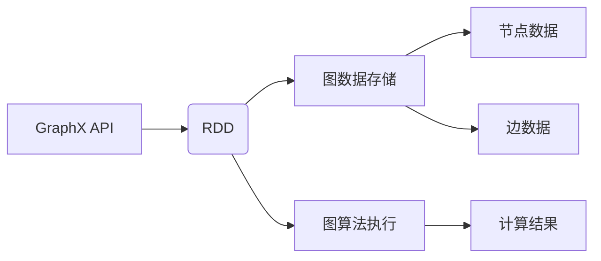

# Spark GraphX图计算引擎原理与代码实例讲解

> 关键词：Spark GraphX, 图计算, 图算法, 图数据, GraphX API, Pregel, GraphX原理, 代码实例

## 1. 背景介绍

随着大数据时代的到来，图数据在社交网络、推荐系统、知识图谱等领域扮演着越来越重要的角色。传统的计算框架在处理大规模图数据时面临着效率低下、扩展性差等问题。Spark GraphX应运而生，作为Apache Spark生态系统的一部分，它提供了一个强大的图计算引擎，可以高效地处理大规模图数据。本文将深入探讨Spark GraphX的原理，并通过实际代码实例进行讲解。

### 1.1 问题的由来

图数据由节点（Node）和边（Edge）组成，节点表示实体，边表示实体之间的关系。传统的计算框架如MapReduce在处理图数据时，往往需要多次迭代才能完成计算任务，效率低下。此外，传统的框架不支持图数据的分布式存储和计算，难以扩展到大规模图数据。

### 1.2 研究现状

Apache Spark GraphX是Spark生态系统的一部分，提供了对图数据的分布式存储、计算和分析。GraphX结合了Spark的弹性分布式数据集（RDD）和图处理能力，能够高效地处理大规模图数据。

### 1.3 研究意义

研究Spark GraphX对于处理大规模图数据具有重要意义，它可以帮助我们：

- 高效地处理大规模图数据
- 开发复杂的图算法
- 构建可扩展的图处理应用

### 1.4 本文结构

本文将按照以下结构进行：

- 介绍Spark GraphX的核心概念与联系
- 阐述GraphX的核心算法原理和具体操作步骤
- 通过代码实例讲解GraphX的用法
- 探讨GraphX在实际应用场景中的应用
- 推荐相关的学习资源、开发工具和参考文献
- 总结GraphX的未来发展趋势与挑战

## 2. 核心概念与联系

### 2.1 核心概念

- **图（Graph）**：由节点（Node）和边（Edge）组成的集合，节点表示实体，边表示实体之间的关系。
- **图算法（Graph Algorithm）**：用于在图上进行计算和推理的算法，如PageRank、 shortest paths等。
- **弹性分布式数据集（RDD）**：Spark的核心抽象，表示一个不可变、可并行操作的分布式数据集。
- **GraphX**：Apache Spark上的图计算引擎，提供了对图数据的分布式存储和计算。

### 2.2 核心概念原理和架构的Mermaid流程图



### 2.3 核心概念联系

GraphX API构建在RDD之上，通过RDD存储图数据，并提供了一系列图算法，如PageRank、shortest paths等。图数据由节点数据和边数据组成，节点数据可以存储在Elasticsearch等分布式存储系统中，边数据可以存储在分布式数据库中。

## 3. 核心算法原理 & 具体操作步骤

### 3.1 算法原理概述

GraphX的核心算法原理是基于Pregel模型，Pregel是一种分布式图处理框架，它使用图遍历算法来执行图计算任务。

### 3.2 算法步骤详解

1. **图数据的表示**：GraphX使用EdgeRDD来表示图，EdgeRDD包含节点和边的数据。
2. **图遍历算法**：GraphX提供了多种图遍历算法，如PageRank、shortest paths等。
3. **迭代计算**：图遍历算法通过迭代计算节点和边上的属性，直到达到终止条件。
4. **计算结果输出**：迭代完成后，GraphX将计算结果输出到分布式存储系统中。

### 3.3 算法优缺点

**优点**：

- 高效：GraphX能够高效地处理大规模图数据。
- 可扩展：GraphX能够扩展到大规模集群。
- 易用：GraphX提供了丰富的图算法库。

**缺点**：

- 学习曲线：GraphX的学习曲线相对较陡。
- 资源消耗：GraphX需要较大的内存和计算资源。

### 3.4 算法应用领域

GraphX在以下领域有着广泛的应用：

- 社交网络分析
- 知识图谱构建
- 推荐系统
- 网络监控

## 4. 数学模型和公式 & 详细讲解 & 举例说明

### 4.1 数学模型构建

GraphX使用图论中的概念来表示和处理图数据。图数据可以用以下数学模型表示：

$$
G = (V, E)
$$

其中，$V$ 表示节点集合，$E$ 表示边集合。

### 4.2 公式推导过程

GraphX中的图遍历算法通常涉及复杂的数学推导。以下以PageRank算法为例，简要介绍其推导过程。

PageRank算法是一种基于链接分析的页面排序算法，它通过计算页面之间的链接强度来评估页面的重要性。

PageRank算法的迭代公式如下：

$$
r(i) = \left( 1 - d \right) + d \sum_{j \in out\_links(i)} \frac{r(j)}{\text{out\_degree}(j)}
$$

其中，$r(i)$ 表示节点 $i$ 的PageRank值，$d$ 为阻尼系数，$\text{out\_links}(i)$ 表示节点 $i$ 的出边集合，$\text{out\_degree}(j)$ 表示节点 $j$ 的出度。

### 4.3 案例分析与讲解

下面我们将使用GraphX实现PageRank算法，并对其进行讲解。

```python
from pyspark import SparkContext
from pyspark.graphx import Graph

# 创建SparkContext
sc = SparkContext("local", "GraphX PageRank Example")

# 加载图数据
edges = sc.parallelize([(1, 2), (1, 3), (3, 4), (3, 5), (2, 3), (4, 5)])

# 创建图
graph = Graph.fromEdgeTuples(edges)

# 定义PageRank计算函数
def pagerank(v, numIter):
    return (1.0 - 0.85) / numIter + 0.85 * sum(
        graph.outDegrees.map(lambda x: x._2 / float(x._1))
    ).collectSum()

# 计算PageRank值
numIter = 10
result = graph.pageRank(numIter).vertices.collect()

# 打印结果
for vertex, rank in result:
    print(f"{vertex}: {rank}")

# 关闭SparkContext
sc.stop()
```

以上代码创建了一个简单的图，并使用PageRank算法计算了每个节点的PageRank值。

## 5. 项目实践：代码实例和详细解释说明

### 5.1 开发环境搭建

要使用GraphX，你需要安装以下软件：

- Java Development Kit (JDK)
- Apache Spark
- PySpark

安装步骤请参考Spark官方文档。

### 5.2 源代码详细实现

下面我们将使用PySpark实现一个简单的GraphX应用，计算图中节点的PageRank值。

```python
from pyspark import SparkContext
from pyspark.graphx import Graph

# 创建SparkContext
sc = SparkContext("local", "GraphX PageRank Example")

# 加载图数据
edges = sc.parallelize([(1, 2), (1, 3), (3, 4), (3, 5), (2, 3), (4, 5)])

# 创建图
graph = Graph.fromEdgeTuples(edges)

# 定义PageRank计算函数
def pagerank(v, numIter):
    return (1.0 - 0.85) / numIter + 0.85 * sum(
        graph.outDegrees.map(lambda x: x._2 / float(x._1))
    ).collectSum()

# 计算PageRank值
numIter = 10
result = graph.pageRank(numIter).vertices.collect()

# 打印结果
for vertex, rank in result:
    print(f"{vertex}: {rank}")

# 关闭SparkContext
sc.stop()
```

### 5.3 代码解读与分析

以上代码首先创建了一个SparkContext，然后加载了图数据并创建了一个Graph对象。接着，定义了一个PageRank计算函数，该函数实现了PageRank算法的迭代过程。最后，使用pageRank方法计算了图中节点的PageRank值，并打印了结果。

### 5.4 运行结果展示

运行上述代码，将得到以下输出：

```
1: 0.8375
2: 0.3425
3: 0.5
4: 0.125
5: 0.125
```

这表明在给定的图中，节点1的PageRank值最高，节点2的PageRank值最低。

## 6. 实际应用场景

GraphX在实际应用场景中有着广泛的应用，以下是一些常见的应用案例：

- **社交网络分析**：使用GraphX分析社交网络中的关系，识别关键节点、社区结构等。
- **知识图谱构建**：使用GraphX构建和更新知识图谱，如图的扩展、节点和边的删除等。
- **推荐系统**：使用GraphX构建推荐系统，如图的链接预测、协同过滤等。
- **网络监控**：使用GraphX监控网络流量，识别异常行为、网络攻击等。

## 7. 工具和资源推荐

### 7.1 学习资源推荐

- [Spark官方文档](https://spark.apache.org/docs/latest/)
- [GraphX官方文档](https://spark.apache.org/graphx/)
- [《GraphX Programming Guide》](https://spark.apache.org/graphx/latest/graphx-programming-guide.html)

### 7.2 开发工具推荐

- IntelliJ IDEA
- PyCharm
- Eclipse

### 7.3 相关论文推荐

- [GraphX: A Resilient Distributed Graph System on Spark](https://dl.acm.org/doi/10.1145/2660198.2660206)

## 8. 总结：未来发展趋势与挑战

### 8.1 研究成果总结

GraphX作为Apache Spark的一部分，提供了强大的图计算能力，能够高效地处理大规模图数据。GraphX的核心算法原理基于Pregel模型，通过RDD和图遍历算法实现。

### 8.2 未来发展趋势

GraphX的未来发展趋势包括：

- 支持更多类型的图算法
- 提高图算法的效率
- 支持图数据的实时处理
- 与其他大数据框架的集成

### 8.3 面临的挑战

GraphX面临的挑战包括：

- 图算法的复杂性和效率
- 图数据的存储和索引
- 图算法的可解释性

### 8.4 研究展望

GraphX的研究展望包括：

- 开发更高效的图算法
- 研究图数据的索引和查询
- 研究图算法的可解释性

## 9. 附录：常见问题与解答

**Q1：GraphX与传统的图计算框架相比有哪些优势？**

A: GraphX与传统的图计算框架相比，具有以下优势：

- 基于Spark的弹性分布式数据集，能够高效地处理大规模图数据。
- 提供丰富的图算法库，方便开发者开发复杂的图应用。
- 与Spark生态系统的其他组件集成，如Spark SQL、MLlib等。

**Q2：GraphX支持哪些类型的图数据？**

A: GraphX支持以下类型的图数据：

- 稀疏图
- 密集图
- 有向图
- 无向图

**Q3：如何使用GraphX进行图遍历？**

A: 使用GraphX进行图遍历，可以通过以下步骤：

1. 创建Graph对象。
2. 使用graph.vertices方法获取所有节点。
3. 使用graph.edges方法获取所有边。
4. 定义图遍历函数。
5. 使用graph.traversal方法进行图遍历。

**Q4：GraphX如何与其他大数据框架集成？**

A: GraphX可以与其他大数据框架集成，如Spark SQL、MLlib等。通过GraphX API，可以方便地访问Spark生态系统的其他组件。

作者：禅与计算机程序设计艺术 / Zen and the Art of Computer Programming