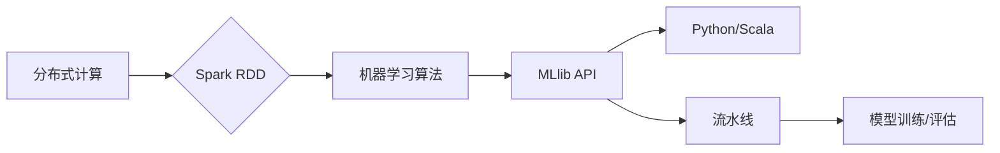

# Spark MLlib原理与代码实例讲解

> 关键词：Spark MLlib，机器学习库，分布式计算，数据挖掘，算法实现，Python API，Scala API

## 1. 背景介绍

随着大数据时代的到来，数据挖掘和机器学习技术在各个行业中得到了广泛的应用。Apache Spark 作为一款强大的分布式计算框架，凭借其高效、可伸缩的特点，成为了大数据处理和分析的首选工具之一。Spark MLlib 是 Spark 生态系统中的一部分，它提供了丰富的机器学习算法库，可以方便地构建和部署机器学习模型。

## 2. 核心概念与联系

### 2.1 Spark MLlib 核心概念

- **分布式计算**：Spark 通过其弹性分布式数据集（RDD）实现数据的分布式存储和处理。
- **机器学习算法**：MLlib 提供了多种常见的机器学习算法，包括分类、回归、聚类、协同过滤等。
- **MLlib API**：MLlib 提供了 Python 和 Scala 两种编程语言的 API，使得开发者可以方便地使用 Spark 进行机器学习。
- **流水线**：MLlib 支持将多个算法步骤连接成流水线，方便进行模型训练和评估。

### 2.2 Mermaid 流程图



## 3. 核心算法原理 & 具体操作步骤

### 3.1 算法原理概述

MLlib 中的算法原理与传统的机器学习算法原理相似，但考虑到分布式计算的特点，MLlib 在算法实现上有所优化。

### 3.2 算法步骤详解

1. 数据读取：使用 Spark 读取数据集，转换为 RDD 或 DataFrame 格式。
2. 数据预处理：进行数据清洗、特征工程等操作，将数据转换为适合机器学习算法的格式。
3. 选择算法：根据任务需求选择合适的机器学习算法。
4. 训练模型：使用选定的算法在数据集上训练模型。
5. 模型评估：使用测试集评估模型的性能。
6. 模型部署：将训练好的模型部署到生产环境中。

### 3.3 算法优缺点

**优点**：
- **高效**：利用 Spark 的分布式计算能力，可以处理大规模数据集。
- **易用**：提供 Python 和 Scala 两种 API，方便开发者使用。
- **丰富的算法**：提供多种机器学习算法，满足不同需求。

**缺点**：
- **学习曲线**：需要学习 Spark 和 MLlib 的基础知识。
- **资源消耗**：分布式计算需要更多的计算资源。

### 3.4 算法应用领域

MLlib 可以应用于各种机器学习任务，如：

- **分类**：文本分类、垃圾邮件过滤等。
- **回归**：房屋价格预测、股票价格预测等。
- **聚类**：客户细分、市场细分等。
- **协同过滤**：推荐系统。

## 4. 数学模型和公式 & 详细讲解 & 举例说明

### 4.1 数学模型构建

以逻辑回归为例，其数学模型如下：

$$
P(y=1|x;\theta) = \frac{1}{1+e^{-\theta^T x}}
$$

其中，$\theta$ 是模型参数，$x$ 是特征向量。

### 4.2 公式推导过程

逻辑回归模型的损失函数是负对数似然：

$$
L(\theta) = -\sum_{i=1}^N [y_i \log P(y_i|x;\theta) + (1-y_i) \log (1-P(y_i|x;\theta))]
$$

其中，$y_i$ 是真实标签，$P(y_i|x;\theta)$ 是预测概率。

### 4.3 案例分析与讲解

以 Spark MLlib 中的逻辑回归为例，展示如何使用 Python API 进行模型训练和评估。

```python
from pyspark.sql import SparkSession
from pyspark.ml.classification import LogisticRegression
from pyspark.ml.evaluation import MulticlassClassificationEvaluator

# 创建 Spark 会话
spark = SparkSession.builder.appName("LogisticRegressionExample").getOrCreate()

# 读取数据
data = spark.read.format("libsvm").load("data/mllib/libsvm_data.txt")

# 划分训练集和测试集
train_data, test_data = data.randomSplit([0.7, 0.3])

# 创建逻辑回归模型
lr = LogisticRegression(maxIter=10, regParam=0.01)

# 训练模型
model = lr.fit(train_data)

# 评估模型
predictions = model.transform(test_data)
evaluator = MulticlassClassificationEvaluator(labelCol="label", predictionCol="prediction", metricName="accuracy")
accuracy = evaluator.evaluate(predictions)
print(f"Accuracy: {accuracy}")

# 停止 Spark 会话
spark.stop()
```

## 5. 项目实践：代码实例和详细解释说明

### 5.1 开发环境搭建

1. 安装 Java：Spark 依赖于 Java，因此需要安装 Java 开发环境。
2. 安装 Scala：Spark MLlib 使用 Scala 编写，因此需要安装 Scala 开发环境。
3. 安装 Spark：从 Apache Spark 官网下载 Spark 安装包，并按照官方文档进行安装。

### 5.2 源代码详细实现

以下是一个使用 Spark MLlib 进行决策树分类的 Python 代码示例：

```python
from pyspark.sql import SparkSession
from pyspark.ml.classification import DecisionTreeClassifier
from pyspark.ml.evaluation import MulticlassClassificationEvaluator

# 创建 Spark 会话
spark = SparkSession.builder.appName("DecisionTreeExample").getOrCreate()

# 读取数据
data = spark.read.format("libsvm").load("data/mllib/libsvm_data.txt")

# 划分训练集和测试集
train_data, test_data = data.randomSplit([0.7, 0.3])

# 创建决策树分类器
dt = DecisionTreeClassifier(maxDepth=5)

# 训练模型
model = dt.fit(train_data)

# 评估模型
predictions = model.transform(test_data)
evaluator = MulticlassClassificationEvaluator(labelCol="label", predictionCol="prediction", metricName="accuracy")
accuracy = evaluator.evaluate(predictions)
print(f"Accuracy: {accuracy}")

# 停止 Spark 会话
spark.stop()
```

### 5.3 代码解读与分析

1. 创建 Spark 会话：使用 `SparkSession.builder.appName("DecisionTreeExample").getOrCreate()` 创建 Spark 会话。
2. 读取数据：使用 `spark.read.format("libsvm").load("data/mllib/libsvm_data.txt")` 读取数据集。
3. 划分训练集和测试集：使用 `randomSplit` 方法将数据集划分为训练集和测试集。
4. 创建决策树分类器：使用 `DecisionTreeClassifier(maxDepth=5)` 创建决策树分类器。
5. 训练模型：使用 `dt.fit(train_data)` 训练模型。
6. 评估模型：使用 `model.transform(test_data)` 对测试集进行预测，并使用 `MulticlassClassificationEvaluator` 评估模型性能。
7. 停止 Spark 会话：使用 `spark.stop()` 停止 Spark 会话。

## 6. 实际应用场景

Spark MLlib 在实际应用场景中有着广泛的应用，以下列举几个例子：

- **推荐系统**：使用协同过滤算法推荐电影、商品等。
- **欺诈检测**：使用异常检测算法识别金融欺诈行为。
- **文本分类**：使用文本分类算法对新闻、论坛帖子等进行分类。
- **图像识别**：使用卷积神经网络对图像进行分类、检测等。

## 7. 工具和资源推荐

### 7.1 学习资源推荐

- Apache Spark 官方文档：[https://spark.apache.org/docs/latest/](https://spark.apache.org/docs/latest/)
- Spark MLlib 官方文档：[https://spark.apache.org/docs/latest/mllib-guide.html](https://spark.apache.org/docs/latest/mllib-guide.html)
- 《Spark MLlib机器学习实战》
- 《Spark快速大数据分析》

### 7.2 开发工具推荐

- IntelliJ IDEA：支持 Spark 开发的集成开发环境。
- PyCharm：支持 PySpark 开发的集成开发环境。
- Eclipse：支持 Spark 开发的集成开发环境。

### 7.3 相关论文推荐

- M. Zaharia, M. Chowdhury, M. J. Franklin, S. Shenker, and I. Stoica. (2012). Spark: Efficient elastic batch processing for large datasets. In Proceedings of the 2nd USENIX conference on Big Data, pages 17-28.
- D. C. Park, J. Han, and H. H. Jo. (2014). Mining frequent patterns from big data: Current status, new directions, and challenges. ACM Computing Surveys (CSUR), 47(3), 1-42.

## 8. 总结：未来发展趋势与挑战

### 8.1 研究成果总结

Spark MLlib 为机器学习提供了强大的支持，使得机器学习在分布式系统上变得可行。MLlib 不断更新和扩展，提供更多高效的机器学习算法。

### 8.2 未来发展趋势

- **算法优化**：针对特定领域的数据和任务，对算法进行优化，提高性能。
- **模型解释性**：提高机器学习模型的解释性，使其更易于理解和信任。
- **多模态学习**：将多种数据类型（如文本、图像、视频）进行整合，进行多模态学习。

### 8.3 面临的挑战

- **可扩展性**：如何提高机器学习算法的可扩展性，以支持更大的数据集。
- **模型可解释性**：如何提高机器学习模型的解释性，使其更易于理解和信任。
- **算法创新**：如何创新机器学习算法，以解决更复杂的实际问题。

### 8.4 研究展望

随着 Spark 和 MLlib 的不断发展，机器学习在分布式系统上的应用将更加广泛。未来，MLlib 将继续扩展其功能，提供更多高效的机器学习算法，推动机器学习技术的发展。

## 9. 附录：常见问题与解答

**Q1：Spark MLlib 与其他机器学习库相比有哪些优势？**

A1：Spark MLlib 最大的优势是其分布式计算能力，可以处理大规模数据集。此外，MLlib 提供了丰富的机器学习算法，方便开发者使用。

**Q2：如何选择合适的机器学习算法？**

A2：选择合适的机器学习算法需要根据具体任务和数据进行。可以参考 MLlib 提供的算法文档，或者参考相关论文和书籍。

**Q3：Spark MLlib 支持哪些机器学习算法？**

A3：Spark MLlib 支持多种机器学习算法，包括分类、回归、聚类、协同过滤等。

**Q4：如何将 Spark MLlib 模型部署到生产环境中？**

A4：可以使用 Spark MLlib 的模型评估和部署工具，将模型导出为 PMML、PMX 或 ONNX 格式，然后部署到生产环境中。

作者：禅与计算机程序设计艺术 / Zen and the Art of Computer Programming