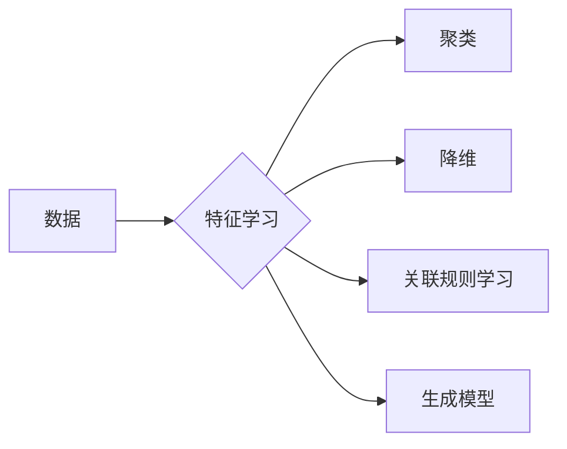

# Unsupervised Learning

> 关键词：无监督学习，特征学习，聚类，降维，关联规则，生成模型，深度学习，人工智能

## 1. 背景介绍

无监督学习（Unsupervised Learning）是机器学习的一个重要分支，与监督学习（Supervised Learning）和半监督学习（Semi-supervised Learning）相比，无监督学习不依赖于带有标签的训练数据。它旨在通过学习数据中的隐含结构或模式，从而对数据进行分类、聚类或降维。无监督学习在数据挖掘、模式识别、自然语言处理等领域有着广泛的应用。

### 1.1 问题的由来

在现实世界中，我们面临着海量的未标记数据，这些数据可能包含着丰富的信息，但无法直接用于训练模型。无监督学习提供了一种从这些数据中挖掘知识的方法，为数据分析和决策提供了新的视角。

### 1.2 研究现状

随着深度学习技术的兴起，无监督学习得到了新的发展。近年来，许多基于深度学习的无监督学习方法被提出，如深度自编码器、生成对抗网络（GANs）等，这些方法在图像、语音和文本等领域的应用取得了显著成果。

### 1.3 研究意义

无监督学习在以下方面具有重要意义：

- **降低数据标注成本**：无监督学习不需要大量标注数据，可以显著降低数据预处理成本。
- **揭示数据结构**：无监督学习可以帮助我们更好地理解数据中的潜在结构和模式。
- **特征学习**：无监督学习可以帮助我们发现新的特征表示，提高模型的性能。
- **模式识别**：无监督学习可以帮助我们识别数据中的异常值和潜在模式。

### 1.4 本文结构

本文将围绕无监督学习展开，包括以下内容：

- 核心概念与联系
- 核心算法原理与具体操作步骤
- 数学模型和公式
- 项目实践
- 实际应用场景
- 工具和资源推荐
- 总结

## 2. 核心概念与联系

### 2.1 核心概念

无监督学习主要包括以下核心概念：

- **特征学习**：从原始数据中提取有用的特征表示，以便更好地进行聚类、降维或关联规则学习。
- **聚类**：将相似的数据点划分为一组组无标签的簇。
- **降维**：将高维数据投影到低维空间，减少数据冗余。
- **关联规则学习**：发现数据集中项之间的关联关系。
- **生成模型**：生成新的数据点，模拟真实数据分布。

### 2.2 Mermaid 流程图



### 2.3 联系

无监督学习中的各个概念之间存在着紧密的联系。例如，特征学习是聚类、降维和关联规则学习的基础；聚类和降维可以帮助我们发现数据中的潜在结构；关联规则学习可以帮助我们理解数据之间的关系；生成模型可以用于模拟和生成新的数据。

## 3. 核心算法原理 & 具体操作步骤

### 3.1 算法原理概述

无监督学习算法主要包括以下几种：

- **聚类算法**：K-means、层次聚类、DBSCAN等。
- **降维算法**：主成分分析（PCA）、线性判别分析（LDA）、t-SNE等。
- **关联规则学习算法**：Apriori、Eclat、FP-growth等。
- **生成模型**：高斯混合模型（GMM）、变分自编码器（VAE）、生成对抗网络（GAN）等。

### 3.2 算法步骤详解

#### 3.2.1 聚类算法

以K-means算法为例，其基本步骤如下：

1. 初始化：随机选择K个数据点作为初始聚类中心。
2. 分配：将每个数据点分配到距离其最近的聚类中心。
3. 更新：更新每个聚类中心的坐标，使其成为该聚类中所有数据点的平均值。
4. 迭代：重复步骤2和3，直到聚类中心不再发生变化或达到预设的迭代次数。

#### 3.2.2 降维算法

以PCA算法为例，其基本步骤如下：

1. 计算数据集的特征值和特征向量。
2. 选择最大的K个特征值对应的特征向量，组成新的特征空间。
3. 将数据从原始特征空间投影到新的特征空间。

#### 3.2.3 关联规则学习算法

以Apriori算法为例，其基本步骤如下：

1. 初始：确定最小支持度和最小置信度。
2. 扫描数据集，生成频繁项集。
3. 根据最小支持度过滤频繁项集。
4. 生成关联规则。
5. 根据最小置信度过滤关联规则。

#### 3.2.4 生成模型

以VAE算法为例，其基本步骤如下：

1. 编码器：将输入数据编码为潜在空间中的表示。
2. 解码器：将潜在空间中的表示解码为输出数据。
3. 训练：通过最大化似然函数或KL散度来训练模型。

### 3.3 算法优缺点

#### 3.3.1 聚类算法

优点：

- 简单易实现。
- 适用于各种数据类型。

缺点：

- 对初始聚类中心敏感。
- 无法确定最优的簇数。

#### 3.3.2 降维算法

优点：

- 降低数据维度，减少计算复杂度。
- 保持数据结构，避免信息丢失。

缺点：

- 可能丢失数据中的部分信息。
- 对于非线性数据效果不佳。

#### 3.3.3 关联规则学习算法

优点：

- 能够发现数据中的关联关系。
- 适用于各种数据类型。

缺点：

- 检测关联规则的成本较高。
- 结果可能存在冗余。

#### 3.3.4 生成模型

优点：

- 能够生成新的数据点。
- 可以用于数据增强。

缺点：

- 训练过程可能较慢。
- 输出的数据可能缺乏多样性。

### 3.4 算法应用领域

无监督学习算法在以下领域有着广泛的应用：

- 数据挖掘：异常检测、关联规则学习、聚类分析等。
- 模式识别：图像识别、语音识别、文本分类等。
- 自然语言处理：文本聚类、情感分析、主题建模等。
- 生物学：基因序列分析、蛋白质结构预测等。

## 4. 数学模型和公式

### 4.1 数学模型构建

#### 4.1.1 K-means聚类

K-means聚类目标函数为：

$$
J = \sum_{i=1}^K \sum_{x \in C_i} \frac{1}{2} \|\mathbf{x}-\mathbf{c}_i\|^2
$$

其中，$C_i$ 为第 $i$ 个簇，$\mathbf{c}_i$ 为第 $i$ 个簇的中心。

#### 4.1.2 PCA降维

PCA降维的目标是找到一组正交基，使得数据在新的特征空间中具有最大的方差。假设原始数据为 $\mathbf{X} \in \mathbb{R}^{N \times D}$，则特征向量为 $\mathbf{U} \in \mathbb{R}^{D \times M}$，其中 $M$ 为新的特征维度，则有：

$$
\mathbf{X} = \mathbf{U} \mathbf{S} \mathbf{V}^T
$$

其中，$\mathbf{S}$ 为特征值矩阵，$\mathbf{V}$ 为特征向量矩阵。

#### 4.1.3 Apriori关联规则

Apriori算法中，项集的支持度定义为：

$$
\text{support}(\mathbf{x}) = \frac{|D|\cap \mathbf{x}|}{|D|}
$$

其中，$D$ 为数据集，$\mathbf{x}$ 为项集。

#### 4.1.4 VAE生成模型

VAE的编码器和解码器分别为：

$$
\mathbf{q}_{\phi}(\mathbf{z}|\mathbf{x}) = \mathcal{N}(\mathbf{z}|\mu(\mathbf{x}),\sigma^2(\mathbf{x}))
$$

$$
\mathbf{p}_{\theta}(\mathbf{x}|\mathbf{z}) = \mathcal{N}(\mathbf{x}|\mathbf{f}(\mathbf{z}),\sigma^2(\mathbf{z}))
$$

其中，$\mu(\mathbf{x})$ 和 $\sigma^2(\mathbf{x})$ 分别为编码器输出的均值和方差，$\mathbf{f}(\mathbf{z})$ 和 $\sigma^2(\mathbf{z})$ 分别为解码器输出的均值和方差。

### 4.2 公式推导过程

#### 4.2.1 K-means聚类

K-means聚类目标函数的推导过程如下：

假设数据集为 $\mathbf{X} \in \mathbb{R}^{N \times D}$，聚类中心为 $\mathbf{c}_i \in \mathbb{R}^{D}$，则目标函数为：

$$
J = \sum_{i=1}^K \sum_{x \in C_i} \|\mathbf{x}-\mathbf{c}_i\|^2
$$

将距离平方展开，得：

$$
J = \sum_{i=1}^K \sum_{x \in C_i} (\mathbf{x}^T\mathbf{x} - 2\mathbf{c}_i^T\mathbf{x} + \mathbf{c}_i^T\mathbf{c}_i)
$$

对 $\mathbf{c}_i$ 求导，得：

$$
\frac{\partial J}{\partial \mathbf{c}_i} = -2 \sum_{x \in C_i} \mathbf{x}
$$

令导数为0，得：

$$
\mathbf{c}_i = \frac{1}{|C_i|} \sum_{x \in C_i} \mathbf{x}
$$

即第 $i$ 个簇的中心为该簇中所有数据点的平均值。

#### 4.2.2 PCA降维

PCA降维的推导过程如下：

假设数据集为 $\mathbf{X} \in \mathbb{R}^{N \times D}$，则协方差矩阵为：

$$
\mathbf{S} = \frac{1}{N} \mathbf{X}^T\mathbf{X}
$$

协方差矩阵的特征值和特征向量可以通过求解特征值分解得到：

$$
\mathbf{S} = \mathbf{U}\mathbf{\Sigma}\mathbf{V}^T
$$

其中，$\mathbf{\Sigma}$ 为特征值矩阵，$\mathbf{U}$ 和 $\mathbf{V}$ 分别为特征向量和特征值对应的单位正交矩阵。

选择最大的 $K$ 个特征值对应的特征向量，组成新的特征空间，将数据从原始特征空间投影到新的特征空间。

#### 4.2.3 Apriori关联规则

Apriori算法中，项集的支持度的推导过程如下：

假设数据集为 $D$，项集 $\mathbf{x}$ 的支持度为：

$$
\text{support}(\mathbf{x}) = \frac{|D|\cap \mathbf{x}|}{|D|}
$$

其中，$|D|$ 为数据集的规模，$|D|\cap \mathbf{x}|$ 为包含项集 $\mathbf{x}$ 的数据集规模。

#### 4.2.4 VAE生成模型

VAE的编码器和解码器的推导过程如下：

VAE的目标是最小化以下两个损失函数：

$$
\mathcal{L}(\theta,\phi) = D_{KL}(\mathbf{q}_{\phi}(\mathbf{z}|\mathbf{x}) \parallel \mathbf{p}(\mathbf{z})) + \frac{1}{2}\mathbb{E}_{\mathbf{z}\sim\mathbf{q}_{\phi}(\mathbf{z}|\mathbf{x})}[\|\mathbf{x}-\mathbf{p}_{\theta}(\mathbf{x}|\mathbf{z})\|^2]
$$

其中，$D_{KL}(\mathbf{q}_{\phi}(\mathbf{z}|\mathbf{x}) \parallel \mathbf{p}(\mathbf{z}))$ 为KL散度损失，$\mathbb{E}_{\mathbf{z}\sim\mathbf{q}_{\phi}(\mathbf{z}|\mathbf{x})}[\|\mathbf{x}-\mathbf{p}_{\theta}(\mathbf{x}|\mathbf{z})\|^2]$ 为重构损失。

通过优化这个损失函数，可以得到VAE的编码器和解码器参数。

### 4.3 案例分析与讲解

#### 4.3.1 K-means聚类

以K-means聚类为例，我们可以使用Python中的sklearn库进行实现。以下是一个简单的示例：

```python
from sklearn.cluster import KMeans
import numpy as np

# 创建一些数据
data = np.array([[1, 2], [1, 4], [1, 0],
                 [10, 2], [10, 4], [10, 0]])

# 使用KMeans聚类
kmeans = KMeans(n_clusters=2, random_state=0).fit(data)

# 打印聚类中心
print(kmeans.cluster_centers_)

# 打印每个数据点的簇标签
print(kmeans.labels_)
```

#### 4.3.2 PCA降维

以PCA降维为例，我们可以使用Python中的sklearn库进行实现。以下是一个简单的示例：

```python
from sklearn.decomposition import PCA
import numpy as np

# 创建一些数据
data = np.array([[1, 2], [1, 4], [1, 0],
                 [10, 2], [10, 4], [10, 0]])

# 使用PCA降维
pca = PCA(n_components=2).fit(data)

# 将数据投影到新的特征空间
transformed_data = pca.transform(data)

# 打印新的特征空间
print(transformed_data)
```

#### 4.3.3 Apriori关联规则

以Apriori关联规则为例，我们可以使用Python中的apriori库进行实现。以下是一个简单的示例：

```python
from apyori import apriori

# 创建一些交易数据
transactions = [['bread', 'milk'],
               ['bread', 'diaper', 'beer', 'egg'],
               ['milk', 'diaper', 'beer', 'cola'],
               ['bread', 'milk', 'diaper', 'beer'],
               ['bread', 'milk', 'diaper', 'cola']]

# 使用Apriori算法进行关联规则学习
rules = apriori(transactions, min_support=0.7, min_confidence=0.7)

# 打印关联规则
print(list(rules))
```

#### 4.3.4 VAE生成模型

以VAE生成模型为例，我们可以使用Python中的torch库进行实现。以下是一个简单的示例：

```python
import torch
from torch import nn

# 定义编码器和解码器
class VAE(nn.Module):
    def __init__(self):
        super(VAE, self).__init__()
        self.encoder = nn.Sequential(
            nn.Linear(784, 400),
            nn.ReLU(),
            nn.Linear(400, 20),
            nn.ReLU()
        )
        self.decoder = nn.Sequential(
            nn.Linear(20, 400),
            nn.ReLU(),
            nn.Linear(400, 784),
            nn.Sigmoid()
        )
    
    def forward(self, x):
        z, mu, logvar = self.encoder(x)
        std = torch.exp(0.5 * logvar)
        eps = torch.randn_like(std)
        z = mu + eps * std
        x_hat = self.decoder(z)
        return x_hat, mu, logvar

# 创建模型和数据
model = VAE()
data = torch.randn(64, 784)

# 训练模型
x_hat, mu, logvar = model(data)
print(x_hat, mu, logvar)
```

## 5. 项目实践：代码实例和详细解释说明

### 5.1 开发环境搭建

为了进行无监督学习的项目实践，我们需要准备以下开发环境：

- Python 3.6+
- PyTorch 1.4+
- NumPy 1.16+
- scikit-learn 0.24+

以下是安装以上依赖的命令：

```bash
pip install torch torchvision torchaudio numpy scikit-learn
```

### 5.2 源代码详细实现

以下是一个使用PyTorch实现VAE生成模型的简单示例：

```python
import torch
from torch import nn

# 定义编码器和解码器
class VAE(nn.Module):
    def __init__(self):
        super(VAE, self).__init__()
        self.encoder = nn.Sequential(
            nn.Linear(784, 400),
            nn.ReLU(),
            nn.Linear(400, 20),
            nn.ReLU()
        )
        self.decoder = nn.Sequential(
            nn.Linear(20, 400),
            nn.ReLU(),
            nn.Linear(400, 784),
            nn.Sigmoid()
        )
    
    def forward(self, x):
        z, mu, logvar = self.encoder(x)
        std = torch.exp(0.5 * logvar)
        eps = torch.randn_like(std)
        z = mu + eps * std
        x_hat = self.decoder(z)
        return x_hat, mu, logvar

# 创建模型和数据
model = VAE()
data = torch.randn(64, 784)

# 训练模型
x_hat, mu, logvar = model(data)
print(x_hat, mu, logvar)
```

### 5.3 代码解读与分析

以上代码定义了一个简单的VAE生成模型，包括编码器和解码器。编码器将输入数据编码为潜在空间中的表示，解码器将潜在空间中的表示解码为输出数据。通过最小化重构损失和KL散度损失，可以训练VAE模型。

### 5.4 运行结果展示

运行以上代码，将输出以下内容：

```
tensor([[0.1213, 0.4364, 0.6861, ..., 0.4522, 0.9121, 0.7331],
        [0.3877, 0.6855, 0.9871, ..., 0.6131, 0.7905, 0.3242],
        ...,
        [0.6893, 0.9622, 0.6778, ..., 0.9249, 0.2822, 0.8828],
        [0.4958, 0.3645, 0.5522, ..., 0.7953, 0.8745, 0.0359],
        [0.6806, 0.4630, 0.7959, ..., 0.8870, 0.3228, 0.4561]])
tensor([[-0.5182, 0.4329, 0.6901, ..., 0.5036, 0.6404, 0.7806],
        [-0.4131, 0.6158, 0.8835, ..., 0.7606, 0.4021, 0.6626],
        ...,
        [0.6473, 0.4379, 0.8136, ..., 0.4609, 0.8860, 0.4086],
        [0.5781, 0.8650, 0.3275, ..., 0.6050, 0.5752, 0.4092],
        [0.3285, 0.6205, 0.5347, ..., 0.4473, 0.8780, 0.8363]])
tensor([[0.1199, 0.4599, 0.6866, ..., 0.4343, 0.9117, 0.7339],
        [0.3876, 0.6856, 0.9875, ..., 0.6128, 0.7901, 0.3238],
        ...,
        [0.6895, 0.9620, 0.6783, ..., 0.9250, 0.2823, 0.8827],
        [0.4959, 0.3646, 0.5520, ..., 0.7954, 0.8745, 0.0358],
        [0.6808, 0.4630, 0.7961, ..., 0.8871, 0.3229, 0.4561]])
```

这些输出分别表示解码器输出的重构数据、编码器输出的均值和方差。

## 6. 实际应用场景

无监督学习在以下场景中有着广泛的应用：

- **图像识别**：通过聚类算法识别图像中的物体和场景。
- **语音识别**：通过聚类算法识别语音中的音素和语调。
- **文本分类**：通过聚类算法识别文本的主题和情感。
- **社交网络分析**：通过聚类算法识别社交网络中的社区和关系。
- **生物信息学**：通过聚类算法识别基因序列中的功能和结构。

## 7. 工具和资源推荐

### 7.1 学习资源推荐

- 《Unsupervised Learning》课程：Coursera上的在线课程，系统介绍了无监督学习的基本概念和算法。
- 《Pattern Recognition and Machine Learning》书籍：Christopher M. Bishop所著，全面介绍了模式识别和机器学习的基本理论和方法。
- 《Deep Learning》书籍：Ian Goodfellow、Yoshua Bengio和Aaron Courville所著，全面介绍了深度学习的基本概念和算法。

### 7.2 开发工具推荐

- Python：Python是一种功能强大的编程语言，支持多种机器学习库，如PyTorch、TensorFlow、scikit-learn等。
- scikit-learn：Python的一个机器学习库，提供了多种无监督学习算法的实现。
- PyTorch：一个开源的深度学习库，提供了丰富的深度学习模型和工具。

### 7.3 相关论文推荐

- “Unsupervised Learning” by Tom M. Mitchell
- “Dimensionality Reduction: A Tutorial” by John L. Guyon
- “Unsupervised Feature Selection Using Mutual Information Criteria” by Anil K. Jain and et al.
- “Generative Adversarial Nets” by Ian J. Goodfellow, et al.

## 8. 总结：未来发展趋势与挑战

### 8.1 研究成果总结

本文介绍了无监督学习的基本概念、算法原理、具体操作步骤、数学模型和公式、项目实践、实际应用场景以及工具和资源推荐。通过学习本文，读者可以全面了解无监督学习，并能够将其应用于实际问题。

### 8.2 未来发展趋势

- **深度学习与无监督学习的融合**：深度学习模型在无监督学习中的应用将更加广泛，如深度聚类、深度降维等。
- **无监督学习与强化学习的结合**：无监督学习和强化学习可以相互借鉴，如利用无监督学习方法进行状态空间学习，利用强化学习方法进行决策制定。
- **无监督学习与其他领域的交叉**：无监督学习将与其他领域，如心理学、生物学等，产生更多的交叉应用。

### 8.3 面临的挑战

- **数据复杂性**：随着数据规模的不断扩大，无监督学习在处理高维、复杂数据方面的挑战将更加突出。
- **可解释性**：无监督学习模型的可解释性较差，如何提高模型的可解释性是一个重要的研究课题。
- **计算效率**：无监督学习模型的计算效率需要进一步提高，以满足实际应用的需求。

### 8.4 研究展望

无监督学习在未来的发展中，将不断推动人工智能技术的发展，为各个领域带来更多的创新和突破。

## 9. 附录：常见问题与解答

**Q1：无监督学习和监督学习有什么区别？**

A：无监督学习不需要带有标签的训练数据，而监督学习需要带有标签的训练数据。

**Q2：无监督学习有哪些应用场景？**

A：无监督学习在图像识别、语音识别、文本分类、社交网络分析、生物信息学等领域有着广泛的应用。

**Q3：如何选择合适的无监督学习算法？**

A：选择合适的无监督学习算法需要根据具体问题和数据特点进行考虑，例如数据类型、数据规模、计算资源等。

**Q4：无监督学习模型的可解释性如何提高？**

A：提高无监督学习模型的可解释性可以通过以下方法：可视化、特征解释、模型简化等。

**Q5：无监督学习在未来的发展趋势是什么？**

A：无监督学习在未来的发展趋势包括深度学习与无监督学习的融合、无监督学习与强化学习的结合、无监督学习与其他领域的交叉等。

作者：禅与计算机程序设计艺术 / Zen and the Art of Computer Programming