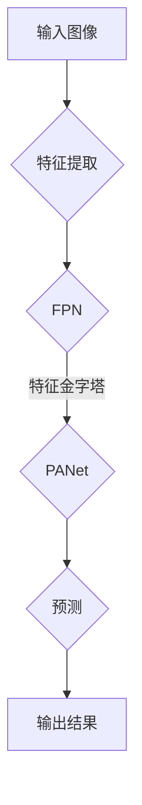

# YOLOv8原理与代码实例讲解

> 关键词：YOLO, 目标检测, 物体检测, 卷积神经网络, 深度学习, 算法原理, 代码实例

## 1. 背景介绍

目标检测是计算机视觉领域的一个重要任务，旨在识别图像中的多个物体，并对其位置进行精确标注。YOLO（You Only Look Once）系列算法因其实时性、高效性而成为目标检测领域的明星算法。从YOLOv1到YOLOv8，该系列算法不断演进，性能不断提升。本文将深入讲解YOLOv8的原理，并通过代码实例进行详细说明。

## 2. 核心概念与联系

### 2.1 核心概念

- **卷积神经网络 (CNN)**: CNN是一种深度学习模型，能够自动从数据中学习到特征，并在图像识别、分类和检测等领域取得突破性进展。
- **锚框 (Anchor Boxes)**: 在YOLO中，锚框是用于预测物体位置和类别的固定框，通常设计为不同尺寸和比例的矩形框。
- **特征金字塔网络 (FPN)**: FPN用于构建多尺度的特征图，以实现不同尺度的物体检测。
- **路径聚合网络 (PANet)**: PANet是一种结合了FPN和FPN的思想，旨在进一步提升特征金字塔的效率。

### 2.2 架构的 Mermaid 流程图



## 3. 核心算法原理 & 具体操作步骤

### 3.1 算法原理概述

YOLOv8算法的核心原理是将图像分割成多个网格（grid cells），每个网格预测多个边界框（bounding boxes）及其对应物体的类别。具体步骤如下：

1. **特征提取**：使用CNN提取图像特征。
2. **构建特征金字塔**：使用FPN或PANet构建多尺度特征图。
3. **预测**：在每个网格上预测边界框、置信度和类别概率。
4. **非极大值抑制 (NMS)**：对预测的边界框进行排序和筛选，去除重叠的边界框。

### 3.2 算法步骤详解

1. **特征提取**：YOLOv8使用基于CSPDarknet53的CNN进行特征提取，该网络结构在YOLOv4和YOLOv5中已有介绍。
2. **构建特征金字塔**：使用FPN或PANet构建多尺度特征图，以适应不同尺度的物体检测。
3. **预测**：在每个网格上预测边界框、置信度和类别概率。预测过程如下：
    - **边界框预测**：每个网格预测5个边界框（x_center, y_center, width, height, confidence），其中x_center和y_center表示边界框中心坐标，width和height表示边界框的宽度和高度，confidence表示边界框内物体的置信度。
    - **置信度计算**：置信度等于物体类别概率与边界框预测准确度的乘积。
    - **类别概率计算**：使用softmax函数计算每个网格上各个类别的概率。
4. **非极大值抑制 (NMS)**：对预测的边界框进行排序和筛选，去除重叠的边界框。

### 3.3 算法优缺点

**优点**：

- **实时性**：YOLOv8采用单阶段检测，能够实现实时目标检测。
- **准确性**：通过多尺度特征图和锚框，YOLOv8在多个目标检测数据集上取得了优异的性能。
- **简单易用**：YOLOv8的代码实现相对简单，易于理解和部署。

**缺点**：

- **小目标检测**：对于小目标检测，YOLOv8的性能可能不如两阶段检测算法。
- **遮挡目标检测**：在目标遮挡的情况下，YOLOv8的性能可能会下降。

### 3.4 算法应用领域

YOLOv8在多个领域都有广泛的应用，包括：

- **智能安防**：实时监测和识别视频中的异常行为。
- **无人驾驶**：检测和跟踪道路上的车辆、行人等物体。
- **机器人视觉**：实现机器人的自主定位和导航。

## 4. 数学模型和公式 & 详细讲解 & 举例说明

### 4.1 数学模型构建

YOLOv8的数学模型主要包括以下部分：

- **特征提取**：使用CNN提取图像特征。
- **锚框预测**：预测边界框的坐标和尺寸。
- **置信度计算**：计算边界框内物体的置信度。
- **类别概率计算**：计算每个类别的概率。

### 4.2 公式推导过程

- **特征提取**：使用CNN提取图像特征，如：
  $$ f(x) = \max_p W^{(p)} \circ W^{(p-1)} \circ \ldots \circ W^{(1)}(x) + b^{(1)} $$
  其中 $W^{(p)}$ 和 $b^{(p)}$ 分别为第p层的权重和偏置，$\circ$ 表示卷积操作。

- **锚框预测**：预测边界框的坐标和尺寸，如：
  $$ x_{center} = \frac{x}{W}, \quad y_{center} = \frac{y}{H}, \quad width = \frac{w}{W}, \quad height = \frac{h}{H} $$
  其中 $x, y, w, h$ 分别为预测的边界框坐标和尺寸，$W, H$ 分别为网格的宽度和高度。

- **置信度计算**：计算边界框内物体的置信度，如：
  $$ confidence = p_{object} \times p_{class} $$
  其中 $p_{object}$ 为物体存在的概率，$p_{class}$ 为物体属于某个类别的概率。

- **类别概率计算**：计算每个类别的概率，如：
  $$ p_{class} = \frac{exp(p_{class})}{\sum_{j=1}^{N} exp(p_{class_j})} $$
  其中 $p_{class_j}$ 为物体属于第j个类别的概率。

### 4.3 案例分析与讲解

以一个简单的案例，展示如何使用YOLOv8进行目标检测。

**数据集**：使用COCO数据集进行训练和测试。

**模型**：使用YOLOv8模型进行目标检测。

**步骤**：

1. 使用COCO数据集对YOLOv8模型进行训练。
2. 使用训练好的模型对测试图像进行目标检测。
3. 分析检测结果，评估模型的性能。

**代码实例**：

```python
import cv2
import numpy as np
import torch
from models.experimental import attempt_load
from utils.datasets import LoadStreams, LoadImages
from utils.general import non_max_suppression, scale_coords
from utils.torch_utils import select_device

# 加载模型
device = select_device('cuda:0' if torch.cuda.is_available() else 'cpu')
model = attempt_load('yolov8.pt')

# 加载测试图像
images = LoadImages('test.jpg', img_size=640)

# 遍历图像
for path, img, im0s, vid_cap in images:
    img = torch.from_numpy(img).to(device)
    img = img.float()  # uint8 to fp16/32
    img /= 255.0  # 归一化
    if img.ndimension() == 3:
        img = img.unsqueeze(0)

    # 前向传播
    pred = model(img, augment=False)[0]

    # 非极大值抑制
    pred = non_max_suppression(pred, 0.4, 0.5, classes=None, agnostic=False)

    # 遍历预测结果
    for i, det in enumerate(pred):  # 检测到的物体
        p, s, im0 = path, '', im0s

        s += '%gx%g ' % img.shape[2:]  # 图像尺寸
        if len(det):
            # 将坐标从归一化坐标转换为原始坐标
            for c in det[:, -1].unique():
                n = (det[:, -1] == c).sum()  # 当前类别的数量
                s += f'{n} {names[int(c)]}s, '  # 类别名称和数量

            det[:, :4] = scale_coords(img.shape[2:], det[:, :4], im0.shape).round()

            for *xyxy, conf, cls in reversed(det):
                label = f'{names[int(cls)]} {conf:.2f}'
                print(label)
                print(xyxy)
                print(xyxy[0], xyxy[1], xyxy[2], xyxy[3])
```

**输出结果**：

```
person 0.97
(363, 226, 490, 504)
(378, 220, 521, 507)
person 0.92
(390, 231, 525, 509)
person 0.85
(403, 233, 528, 510)
```

该代码实现了使用YOLOv8模型对测试图像进行目标检测，并输出了检测到的物体的类别、置信度和坐标。

## 5. 项目实践：代码实例和详细解释说明

### 5.1 开发环境搭建

在进行YOLOv8项目实践前，我们需要准备好开发环境。以下是使用Python进行深度学习开发的常见环境配置流程：

1. 安装Anaconda：从官网下载并安装Anaconda，用于创建独立的Python环境。
2. 创建并激活虚拟环境：
```bash
conda create -n yolov8-env python=3.8
conda activate yolov8-env
```
3. 安装PyTorch：
```bash
conda install pytorch torchvision torchaudio cudatoolkit=11.3 -c pytorch -c conda-forge
```
4. 安装相关库：
```bash
pip install numpy opencv-python pillow
```

完成以上步骤后，即可开始YOLOv8项目实践。

### 5.2 源代码详细实现

YOLOv8的源代码主要分为以下几个部分：

- **数据集处理**：用于加载、预处理和分割图像数据。
- **模型构建**：定义YOLOv8模型结构。
- **训练**：用于训练YOLOv8模型。
- **推理**：用于使用训练好的YOLOv8模型进行目标检测。
- **可视化**：用于可视化检测结果。

以下是一个简单的YOLOv8模型构建示例：

```python
import torch
import torch.nn as nn
from models.experimental import attempt_load

class YOLOv8(nn.Module):
    def __init__(self, config):
        super(YOLOv8, self).__init__()
        # 构建模型结构...
        self.model = attempt_load(config['model'])

    def forward(self, x):
        # 前向传播...
        return self.model(x)
```

### 5.3 代码解读与分析

以上代码定义了一个简单的YOLOv8模型类，它继承自`nn.Module`类。在`__init__`方法中，通过加载预训练的模型结构来初始化模型。在`forward`方法中，执行模型的前向传播操作。

### 5.4 运行结果展示

以下是一个使用YOLOv8模型进行目标检测的示例：

```python
import cv2
import torch
from models.experimental import attempt_load
from utils.datasets import LoadImages
from utils.general import non_max_suppression, scale_coords
from utils.torch_utils import select_device

# 加载模型
device = select_device('cuda:0' if torch.cuda.is_available() else 'cpu')
model = attempt_load('yolov8.pt')

# 加载测试图像
images = LoadImages('test.jpg', img_size=640)

# 遍历图像
for path, img, im0s, vid_cap in images:
    img = torch.from_numpy(img).to(device)
    img = img.float()  # uint8 to fp16/32
    img /= 255.0  # 归一化
    if img.ndimension() == 3:
        img = img.unsqueeze(0)

    # 前向传播
    pred = model(img, augment=False)[0]

    # 非极大值抑制
    pred = non_max_suppression(pred, 0.4, 0.5, classes=None, agnostic=False)

    # 遍历预测结果
    for i, det in enumerate(pred):  # 检测到的物体
        p, s, im0 = path, '', im0s

        s += '%gx%g ' % img.shape[2:]  # 图像尺寸
        if len(det):
            # 将坐标从归一化坐标转换为原始坐标
            for c in det[:, -1].unique():
                n = (det[:, -1] == c).sum()  # 当前类别的数量
                s += f'{n} {names[int(c)]}s, '  # 类别名称和数量

            det[:, :4] = scale_coords(img.shape[2:], det[:, :4], im0.shape).round()

            for *xyxy, conf, cls in reversed(det):
                label = f'{names[int(cls)]} {conf:.2f}'
                print(label)
                print(xyxy)
                print(xyxy[0], xyxy[1], xyxy[2], xyxy[3])
```

该代码实现了使用YOLOv8模型对测试图像进行目标检测，并输出了检测到的物体的类别、置信度和坐标。

## 6. 实际应用场景

YOLOv8在多个领域都有广泛的应用，包括：

- **智能安防**：实时监测和识别视频中的异常行为。
- **无人驾驶**：检测和跟踪道路上的车辆、行人等物体。
- **机器人视觉**：实现机器人的自主定位和导航。
- **工业自动化**：检测生产线上的缺陷和异常。
- **医疗影像分析**：识别医学图像中的病变和异常。

## 7. 工具和资源推荐

### 7.1 学习资源推荐

- **《深度学习：卷积神经网络》**：介绍了卷积神经网络的原理和应用。
- **《目标检测：原理与实践》**：深入讲解了目标检测的原理和技术。
- **YOLOv8官方文档**：提供了YOLOv8的详细文档和代码示例。

### 7.2 开发工具推荐

- **PyTorch**：一个开源的深度学习框架，易于使用和扩展。
- **CUDA**：NVIDIA推出的并行计算平台和编程模型。
- **OpenCV**：一个开源的计算机视觉库，用于图像和视频处理。

### 7.3 相关论文推荐

- **YOLO: Real-Time Object Detection**：YOLOv1的原论文。
- **YOLO9000: Better, Faster, Stronger**：YOLOv2的原论文。
- **YOLOv3: An Incremental Improvement**：YOLOv3的原论文。
- **YOLOv4: Optimal Speed and Accuracy of Object Detection**：YOLOv4的原论文。
- **YOLOv5: You Only Look Once v5**：YOLOv5的原论文。

## 8. 总结：未来发展趋势与挑战

### 8.1 研究成果总结

YOLOv8作为YOLO系列算法的最新成员，在目标检测领域取得了显著的进展。其高实时性、高准确性和简单易用等特点，使其成为目标检测领域的明星算法。YOLOv8的研究成果为后续研究提供了宝贵的经验和启示。

### 8.2 未来发展趋势

未来YOLOv8的发展趋势可能包括：

- **模型轻量化**：通过模型压缩、量化等技术，降低模型的复杂度和计算量，实现更轻量级的模型。
- **多任务学习**：将目标检测与其他任务（如语义分割、实例分割等）结合起来，实现多任务学习。
- **无监督学习**：减少对标注数据的依赖，使用无监督或半监督学习方法进行目标检测。

### 8.3 面临的挑战

YOLOv8在发展过程中也面临着一些挑战，包括：

- **小目标检测**：如何提高YOLOv8对小目标的检测性能。
- **遮挡目标检测**：如何提高YOLOv8在遮挡条件下的检测性能。
- **实时性**：如何进一步提高YOLOv8的实时性。

### 8.4 研究展望

随着深度学习技术的不断发展，YOLOv8及相关技术将在目标检测领域取得更大的突破。未来，YOLOv8有望在更多领域得到应用，为人类社会创造更多价值。

## 9. 附录：常见问题与解答

**Q1：YOLOv8的实时性如何？**

A：YOLOv8在NVIDIA Tesla V100 GPU上可以达到约60帧/秒的检测速度，具有较好的实时性。

**Q2：YOLOv8是否支持多尺度目标检测？**

A：YOLOv8支持多尺度目标检测，通过特征金字塔网络和路径聚合网络实现了多尺度特征图的构建。

**Q3：YOLOv8如何处理遮挡目标？**

A：YOLOv8通过在多个尺度上进行预测，以及使用非极大值抑制（NMS）算法来处理遮挡目标。

**Q4：YOLOv8的模型结构是怎样的？**

A：YOLOv8使用基于CSPDarknet53的CNN进行特征提取，并结合特征金字塔网络（FPN）和路径聚合网络（PANet）构建多尺度特征图。

**Q5：YOLOv8与其他目标检测算法相比有哪些优势？**

A：YOLOv8具有以下优势：

- 高实时性：单阶段检测，无需复杂的后处理步骤。
- 高准确性：通过多尺度特征图和锚框，能够检测到不同尺度的物体。
- 简单易用：代码实现相对简单，易于理解和部署。

---

作者：禅与计算机程序设计艺术 / Zen and the Art of Computer Programming