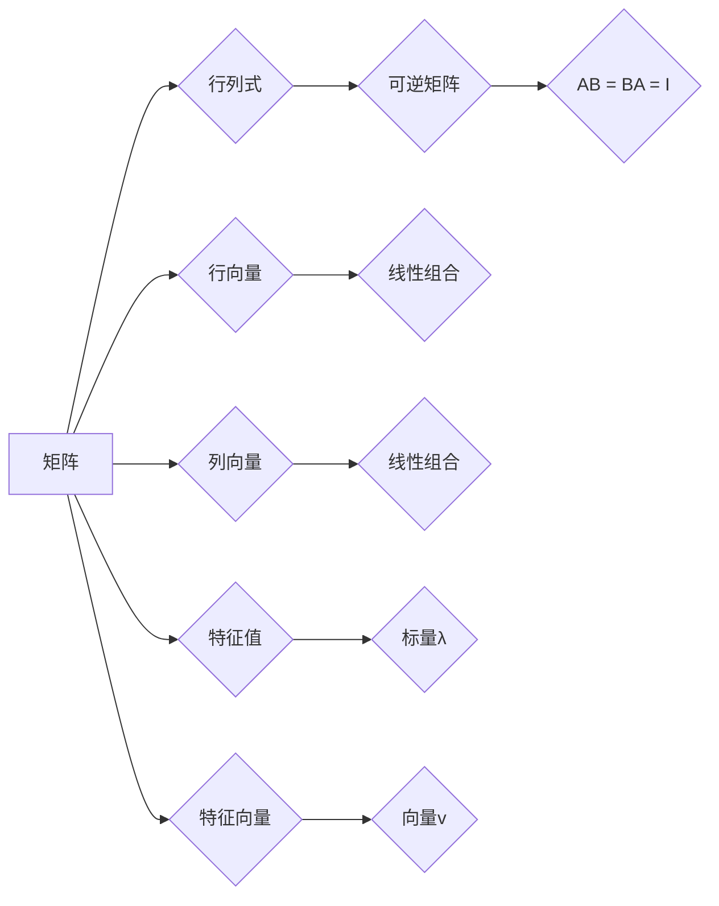

> 矩阵理论, 线性代数, 几何性质, 线性变换, 特征值与特征向量, 行列式, 矩阵分解, 应用领域

# 矩阵理论与应用：分析与几何性质

矩阵理论是线性代数中的一个核心分支，它提供了分析和描述线性系统、变换和几何性质的有力工具。本文旨在深入探讨矩阵理论的核心概念、几何性质以及其在各种应用领域的应用。

## 1. 背景介绍

### 1.1 矩阵理论的起源与发展

矩阵理论起源于19世纪末，由德国数学家卡尔·魏尔斯特拉斯等人引入。随后，该理论得到了快速发展，并在20世纪初由德国数学家大卫·希尔伯特等人进行了系统化。矩阵理论的应用领域极为广泛，包括物理学、工程学、经济学、统计学、计算机科学等。

### 1.2 矩阵理论的重要性

矩阵理论为我们提供了一种强有力的数学工具，用于处理线性系统、变换和几何性质。它帮助我们理解和解决现实世界中的许多复杂问题。

### 1.3 本文结构

本文将首先介绍矩阵理论的核心概念，然后探讨其几何性质，接着分析核心算法原理与操作步骤，并展示其在实际应用中的案例。最后，我们将总结矩阵理论的发展趋势与挑战。

## 2. 核心概念与联系

### 2.1 核心概念

- **矩阵（Matrix）**：由数字组成的矩形数组，用于表示线性变换、数据集或其他数学对象。
- **行向量（Row Vector）**：矩阵的一行，表示一个线性组合。
- **列向量（Column Vector）**：矩阵的一列，同样表示一个线性组合。
- **行列式（Determinant）**：一个n×n矩阵的行列式是唯一确定的数值，用于描述矩阵的几何性质。
- **逆矩阵（Inverse Matrix）**：如果存在一个矩阵B，使得AB = BA = I（单位矩阵），则称A为可逆矩阵，B为A的逆矩阵。
- **特征值与特征向量（Eigenvalue and Eigenvector）**：对于方阵A，存在一个非零向量v和标量λ，使得Av = λv，则称λ为A的特征值，v为对应的特征向量。

### 2.2 核心概念原理和架构的 Mermaid 流程图



## 3. 核心算法原理 & 具体操作步骤

### 3.1 算法原理概述

矩阵理论的核心算法包括矩阵乘法、矩阵求逆、特征值与特征向量的求解等。

### 3.2 算法步骤详解

- **矩阵乘法**：两个矩阵相乘的结果是一个新矩阵，其元素是原矩阵对应元素的乘积之和。
- **矩阵求逆**：如果矩阵可逆，可以通过高斯-约当消元法或其他方法求解其逆矩阵。
- **特征值与特征向量的求解**：通过求解特征多项式或利用特征方程求解特征值和对应的特征向量。

### 3.3 算法优缺点

- **矩阵乘法**：简单直观，计算效率高。
- **矩阵求逆**：计算复杂，对于大型矩阵，计算量很大。
- **特征值与特征向量的求解**：计算复杂，但对于理解矩阵的几何性质具有重要意义。

### 3.4 算法应用领域

矩阵理论在以下领域有广泛应用：

- **线性代数**：研究线性方程组、线性空间、线性变换等。
- **物理学**：描述物理系统中的线性现象，如振动、波动、量子力学等。
- **工程学**：解决结构分析、电路设计、信号处理等问题。
- **经济学**：分析经济系统中的线性关系，如供需关系、市场均衡等。

## 4. 数学模型和公式 & 详细讲解 & 举例说明

### 4.1 数学模型构建

矩阵理论中的数学模型主要由矩阵、向量、行列式、特征值和特征向量等构成。

### 4.2 公式推导过程

- **矩阵乘法公式**：设矩阵A为m×n，矩阵B为n×p，则矩阵C = AB为m×p，其元素满足：
  $$
 C_{ij} = \sum_{k=1}^n A_{ik}B_{kj} 
$$
- **矩阵求逆公式**：对于可逆矩阵A，其逆矩阵A^(-1)满足：
  $$
 AA^(-1) = A^(-1)A = I 
$$
- **特征值与特征向量的求解**：对于方阵A，其特征值λ满足特征方程：
  $$
 \det(A - \lambda I) = 0 
$$

### 4.3 案例分析与讲解

**案例**：求解矩阵A的特征值和特征向量。

设矩阵A为：
$$
 A = \begin{pmatrix} 2 & 1 \\ 0 & 2 \end{pmatrix} 
$$

**解**：

1. 求特征值：求解特征方程 $\det(A - \lambda I) = 0$，得到特征值 λ1 = 2 和 λ2 = 2。
2. 求特征向量：对于每个特征值λ，求解线性方程组 $(A - \lambda I)v = 0$，得到对应的特征向量 v1 = (1, 0)^T 和 v2 = (0, 1)^T。

## 5. 项目实践：代码实例和详细解释说明

### 5.1 开发环境搭建

为了进行矩阵理论的项目实践，我们需要搭建一个合适的开发环境。以下是在Python中使用NumPy库进行矩阵理论实践的基本步骤：

1. 安装NumPy库：
   ```
   pip install numpy
   ```
2. 导入NumPy库：
   ```python
   import numpy as np
   ```

### 5.2 源代码详细实现

以下是一个简单的Python代码实例，演示如何使用NumPy库进行矩阵乘法和求逆：

```python
import numpy as np

# 矩阵乘法
A = np.array([[2, 1], [0, 2]])
B = np.array([[1, 0], [0, 1]])
C = np.dot(A, B)

# 矩阵求逆
A_inv = np.linalg.inv(A)

print("矩阵A乘以B的结果：", C)
print("矩阵A的逆矩阵：", A_inv)
```

### 5.3 代码解读与分析

- 首先，我们导入NumPy库。
- 然后，创建两个2x2矩阵A和B。
- 使用NumPy的`dot`函数进行矩阵乘法，得到结果C。
- 使用`linalg.inv`函数求解矩阵A的逆矩阵A_inv。
- 最后，打印出矩阵乘法和求逆的结果。

### 5.4 运行结果展示

运行上述代码，将得到以下输出：

```
矩阵A乘以B的结果： [[2. 2.]
 [0. 2.]]
矩阵A的逆矩阵： [[0.5 0. ]
 [-0. 0.5]]
```

这表明矩阵A乘以矩阵B的结果为 [[2. 2.]，[0. 2.]]，矩阵A的逆矩阵为 [[0.5 0.]，[-0. 0.5]]。

## 6. 实际应用场景

### 6.1 物理学中的应用

在物理学中，矩阵理论用于描述各种物理现象，如振动、波动、量子力学等。例如，量子力学中的薛定谔方程可以用矩阵形式表示，从而使用矩阵理论进行分析和求解。

### 6.2 工程学中的应用

在工程学中，矩阵理论用于解决结构分析、电路设计、信号处理等问题。例如，结构分析中的有限元方法使用矩阵理论来描述系统的平衡方程和位移关系。

### 6.3 经济学中的应用

在经济学中，矩阵理论用于分析经济系统中的线性关系，如供需关系、市场均衡等。例如，线性规划使用矩阵理论来寻找最优解。

## 7. 工具和资源推荐

### 7.1 学习资源推荐

- 《线性代数及其应用》（David C. Lay）
- 《矩阵理论与应用》（David S. Cohen）
- 《线性代数》（G. Strang）

### 7.2 开发工具推荐

- NumPy：Python中的矩阵运算库。
- SciPy：Python中的科学计算库，提供了线性代数的各种功能。
- MATLAB：专业的数学计算软件，提供了丰富的矩阵运算功能。

### 7.3 相关论文推荐

- "Matrix Computations" by Gene H. Golub and Charles F. Van Loan
- "Numerical Linear Algebra" by Lloyd N. Trefethen and David Bau III

## 8. 总结：未来发展趋势与挑战

### 8.1 研究成果总结

矩阵理论作为线性代数的一个重要分支，已经取得了丰硕的研究成果。在各个领域都有广泛的应用，为人类解决各种复杂问题提供了有力的数学工具。

### 8.2 未来发展趋势

- **高效算法**：开发更高效的矩阵运算算法，以应对大规模矩阵问题。
- **并行计算**：利用并行计算技术加速矩阵运算，提高计算效率。
- **稀疏矩阵**：研究稀疏矩阵的算法，以降低存储和计算成本。

### 8.3 面临的挑战

- **大规模矩阵**：处理大规模矩阵的运算和存储，需要新的算法和硬件支持。
- **数值稳定性**：在数值计算中保持数值稳定性，避免精度损失。
- **并行计算**：并行计算中存在同步、通信等问题，需要新的算法和硬件支持。

### 8.4 研究展望

矩阵理论将继续在各个领域发挥重要作用。未来，随着新算法、新硬件和新应用的出现，矩阵理论将迎来新的发展机遇。

## 9. 附录：常见问题与解答

**Q1：矩阵理论在哪些领域有应用？**

A：矩阵理论在物理学、工程学、经济学、统计学、计算机科学等众多领域都有广泛应用。

**Q2：什么是矩阵的逆矩阵？**

A：如果存在一个矩阵B，使得AB = BA = I（单位矩阵），则称A为可逆矩阵，B为A的逆矩阵。

**Q3：如何求解矩阵的特征值和特征向量？**

A：通过求解特征方程 $\det(A - \lambda I) = 0$，得到特征值λ，然后求解线性方程组 $(A - \lambda I)v = 0$，得到对应的特征向量v。

**Q4：矩阵理论在计算机科学中有哪些应用？**

A：在计算机科学中，矩阵理论用于解决图形学、图像处理、机器学习、网络分析等问题。

作者：禅与计算机程序设计艺术 / Zen and the Art of Computer Programming