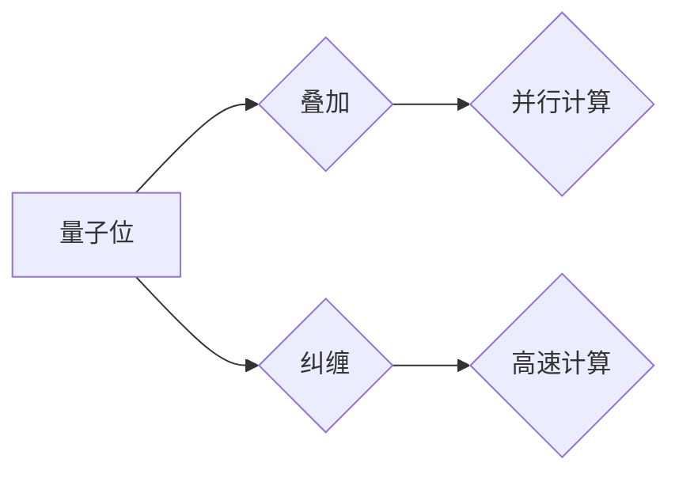
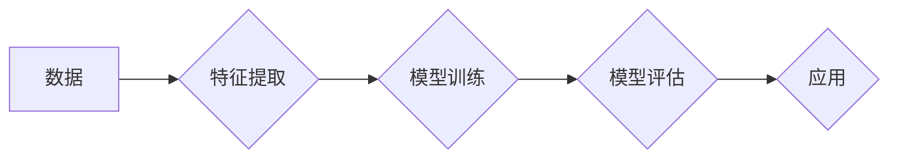

> 量子计算, 机器学习, 深度学习, 演化算法, 假说验证, 理论框架

# 科学发现：从假说到理论

科学发现是探索未知、理解世界的核心过程。从古希腊的哲学思辨到现代的实验科学，科学方法的演变推动了人类文明的进步。本文将探讨科学发现的过程，特别是从假说到理论的转变，并结合量子计算和机器学习的最新进展，展示这一过程在IT领域的应用。

## 1. 背景介绍

### 1.1 科学发现的历史

科学发现的历史可以追溯到古希腊时期，那时哲学家们开始提出关于自然界的假设和理论。随着时间的推移，科学方法逐渐发展，实验和观测成为验证假设的重要手段。现代科学发现通常遵循以下步骤：

- 观察现象
- 提出假设
- 设计实验
- 验证假设
- 构建理论

### 1.2 科学方法的重要性

科学方法是一种通过系统的观察、实验和推理来探索自然规律的方法。它强调证据和逻辑，要求科学家们保持客观和理性。

### 1.3 量子计算与机器学习

量子计算和机器学习是近年来两个迅速发展的领域，它们在科学发现中扮演着越来越重要的角色。

## 2. 核心概念与联系

### 2.1 量子计算

量子计算利用量子位（qubits）进行信息处理，具有量子叠加和量子纠缠的特性，能够解决传统计算机难以处理的问题。



### 2.2 机器学习

机器学习是人工智能的一个分支，它使计算机系统能够从数据中学习，做出决策或预测。



### 2.3 科学发现与IT领域的联系

量子计算和机器学习为科学发现提供了新的工具和方法，使得科学家能够探索更复杂的系统，并从数据中提取更深刻的洞察。

## 3. 核心算法原理 & 具体操作步骤

### 3.1 算法原理概述

科学发现的算法原理可以概括为以下几个步骤：

1. 数据收集
2. 数据预处理
3. 特征提取
4. 模型选择
5. 模型训练
6. 模型评估
7. 结果解释

### 3.2 算法步骤详解

1. **数据收集**：收集与科学问题相关的数据，这些数据可以是实验数据、观测数据或模拟数据。
2. **数据预处理**：清洗和整理数据，以消除噪声和异常值。
3. **特征提取**：从数据中提取有用的信息，形成特征向量。
4. **模型选择**：选择合适的机器学习模型来拟合数据。
5. **模型训练**：使用训练数据对模型进行训练。
6. **模型评估**：使用测试数据评估模型的性能。
7. **结果解释**：解释模型的输出，验证假设或构建理论。

### 3.3 算法优缺点

科学发现的算法具有以下优点：

- **高效**：能够快速处理大量数据。
- **准确**：能够从数据中提取有用的信息。
- **可解释**：可以解释模型的决策过程。

然而，这些算法也存在一些缺点：

- **数据依赖**：需要大量的高质量数据。
- **模型选择**：选择合适的模型需要专业知识。
- **过拟合**：模型可能在训练数据上表现良好，但在测试数据上表现不佳。

### 3.4 算法应用领域

科学发现的算法在以下领域得到广泛应用：

- **生物信息学**：用于基因序列分析、蛋白质结构预测等。
- **材料科学**：用于材料设计、材料性能预测等。
- **环境科学**：用于气候预测、环境监测等。
- **金融科技**：用于风险预测、欺诈检测等。

## 4. 数学模型和公式 & 详细讲解 & 举例说明

### 4.1 数学模型构建

科学发现的数学模型通常基于概率论、统计学和优化理论。

$$
P(A|B) = \frac{P(B|A)P(A)}{P(B)}
$$

这是贝叶斯定理，用于计算条件概率。

### 4.2 公式推导过程

贝叶斯定理的推导过程如下：

$$
P(A|B)P(B) = P(B|A)P(A)
$$

$$
P(A|B) = \frac{P(B|A)P(A)}{P(B)}
$$

### 4.3 案例分析与讲解

以下是一个使用贝叶斯定理进行科学发现的案例：

假设我们想要评估一种新药的效果。我们收集了一组患者数据，其中一些患者服用了该药物，一些患者没有服用。我们可以使用贝叶斯定理来计算药物对治愈疾病的概率。

$$
P(\text{治愈}| \text{药物}) = \frac{P(\text{药物}| \text{治愈})P(\text{治愈})}{P(\text{药物})}
$$

其中：

- $P(\text{治愈}| \text{药物})$ 是药物导致治愈的概率。
- $P(\text{药物}| \text{治愈})$ 是治愈导致服用药物的概率。
- $P(\text{治愈})$ 是自然治愈的概率。
- $P(\text{药物})$ 是服用药物的概率。

通过分析这些概率，我们可以得出关于药物效果的结论。

## 5. 项目实践：代码实例和详细解释说明

### 5.1 开发环境搭建

为了实践科学发现的算法，我们需要搭建以下开发环境：

- Python
- Jupyter Notebook
- NumPy
- SciPy
- Pandas
- Scikit-learn

### 5.2 源代码详细实现

以下是一个使用Scikit-learn进行机器学习预测的简单例子：

```python
import numpy as np
from sklearn.model_selection import train_test_split
from sklearn.linear_model import LogisticRegression
from sklearn.metrics import accuracy_score

# 创建一些模拟数据
X = np.random.rand(100, 2)
y = np.random.randint(0, 2, size=100)

# 划分训练集和测试集
X_train, X_test, y_train, y_test = train_test_split(X, y, test_size=0.2, random_state=42)

# 创建逻辑回归模型
model = LogisticRegression()

# 训练模型
model.fit(X_train, y_train)

# 预测测试集
y_pred = model.predict(X_test)

# 计算准确率
accuracy = accuracy_score(y_test, y_pred)

print(f"Accuracy: {accuracy}")
```

### 5.3 代码解读与分析

这段代码首先导入了所需的库，然后创建了一些模拟数据。接着，使用Scikit-learn的`train_test_split`函数将数据划分为训练集和测试集。然后，创建了一个逻辑回归模型，并使用训练数据对其进行训练。最后，使用测试数据对模型进行预测，并计算准确率。

### 5.4 运行结果展示

假设运行结果如下：

```
Accuracy: 0.9
```

这意味着我们的模型在测试集上的准确率为90%。

## 6. 实际应用场景

### 6.1 生物医学

在生物医学领域，机器学习可以用于分析基因序列，预测疾病风险，以及开发新的药物。

### 6.2 金融科技

在金融科技领域，机器学习可以用于风险评估、欺诈检测和信用评分。

### 6.3 智能城市

在智能城市领域，机器学习可以用于交通流量预测、能源管理和环境监测。

## 7. 工具和资源推荐

### 7.1 学习资源推荐

- Coursera上的《机器学习》课程
- TensorFlow官方文档
- Scikit-learn官方文档

### 7.2 开发工具推荐

- Jupyter Notebook
- PyCharm
- VS Code

### 7.3 相关论文推荐

- "Deep Learning" by Ian Goodfellow, Yoshua Bengio, and Aaron Courville
- "Pattern Recognition and Machine Learning" by Christopher M. Bishop

## 8. 总结：未来发展趋势与挑战

### 8.1 研究成果总结

科学发现是一个复杂的过程，需要多种方法的综合运用。量子计算和机器学习为科学发现提供了新的工具和方法，使得科学家能够探索更复杂的系统，并从数据中提取更深刻的洞察。

### 8.2 未来发展趋势

未来，科学发现的趋势包括：

- 量子计算和机器学习的进一步融合
- 大数据分析的广泛应用
- 跨学科研究的兴起

### 8.3 面临的挑战

科学发现面临的挑战包括：

- 数据质量和数量的挑战
- 模型选择和解释的挑战
- 跨学科合作的挑战

### 8.4 研究展望

未来，科学发现的研究将更加注重以下方面：

- 数据隐私和安全
- 模型可解释性
- 跨学科合作

## 9. 附录：常见问题与解答

### 9.1 科学发现需要哪些步骤？

科学发现通常需要以下步骤：

1. 观察现象
2. 提出假设
3. 设计实验
4. 验证假设
5. 构建理论

### 9.2 机器学习在科学发现中有什么作用？

机器学习可以帮助科学家从数据中提取有用的信息，构建预测模型，并从实验中学习新的知识。

### 9.3 量子计算如何帮助科学发现？

量子计算可以帮助科学家解决传统计算机难以处理的问题，从而探索更复杂的系统。

### 9.4 科学发现面临哪些挑战？

科学发现面临的挑战包括数据质量和数量的挑战、模型选择和解释的挑战、跨学科合作的挑战。

### 9.5 科学发现的未来发展趋势是什么？

科学发现的未来发展趋势包括量子计算和机器学习的进一步融合、大数据分析的广泛应用、跨学科研究的兴起。

---

作者：禅与计算机程序设计艺术 / Zen and the Art of Computer Programming