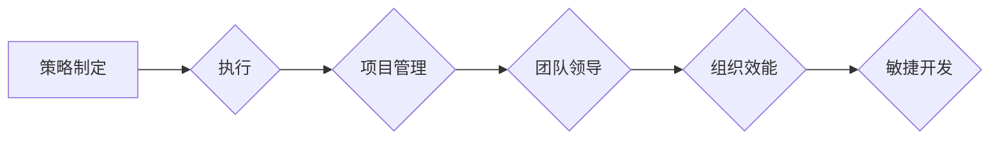

# 管理艺术：从策略到执行

> 关键词：管理策略，执行能力，项目管理，团队领导，组织效能，敏捷开发

## 1. 背景介绍

在当今复杂多变的商业环境中，企业不仅需要制定有效的战略，更需要将这些战略转化为实际的业务成果。这需要管理者具备卓越的管理艺术，从策略制定到执行落地，每一个环节都至关重要。本文将探讨管理艺术的内涵，分析其核心概念与联系，并深入探讨如何将策略转化为高效的执行。

### 1.1 管理艺术的兴起

随着知识经济的到来，企业的竞争优势不再仅仅是资本和劳动力，更多的是取决于知识、创新和执行力。管理者不再是简单的管理者，而是需要具备战略思维、创新能力和执行艺术的多面手。管理艺术应运而生，成为企业管理的重要组成部分。

### 1.2 研究意义

研究管理艺术，有助于企业提升以下方面的能力：

- **战略制定与实施**：确保企业战略与市场环境、内部资源相适应，并有效落地。
- **团队领导与协作**：激发团队成员的潜能，提高团队的整体执行力。
- **组织效能**：优化组织结构，提升组织整体运作效率。
- **敏捷开发**：快速响应市场变化，提高产品迭代速度。

## 2. 核心概念与联系

### 2.1 核心概念

#### 2.1.1 策略

策略是企业为达成目标而制定的行动计划，包括目标设定、资源配置、风险控制等。

#### 2.1.2 执行

执行是将策略转化为具体行动的过程，涉及计划、组织、领导、控制等环节。

#### 2.1.3 项目管理

项目管理是确保项目按照既定目标和时间表完成的一系列管理活动。

#### 2.1.4 团队领导

团队领导是激发团队成员潜能、推动团队达成目标的过程。

#### 2.1.5 组织效能

组织效能是指组织在实现战略目标过程中的效率和能力。

#### 2.1.6 敏捷开发

敏捷开发是一种以人为核心、迭代、灵活应对变化的软件开发方法。

### 2.2 Mermaid 流程图



## 3. 核心算法原理 & 具体操作步骤

### 3.1 算法原理概述

管理艺术的核心是策略制定与执行，其原理可以概括为：

- **目标导向**：明确企业战略目标，制定与之相适应的执行策略。
- **资源优化**：合理配置资源，确保策略执行的有效性。
- **风险管理**：识别潜在风险，制定应对措施。
- **过程监控**：实时监控执行过程，确保策略有效落地。

### 3.2 算法步骤详解

#### 3.2.1 策略制定

1. **环境分析**：分析市场环境、竞争态势、内部资源等。
2. **目标设定**：确定企业战略目标。
3. **资源评估**：评估企业内部资源。
4. **策略规划**：制定具体的行动计划。

#### 3.2.2 执行

1. **计划制定**：制定详细的执行计划。
2. **资源分配**：合理分配资源。
3. **过程监控**：监控执行过程，确保按计划进行。
4. **风险控制**：识别并控制风险。

#### 3.2.3 项目管理

1. **项目规划**：制定项目计划，明确项目范围、时间、资源等。
2. **项目执行**：按照项目计划执行项目。
3. **项目监控**：监控项目进度和质量。
4. **项目收尾**：完成项目，并进行总结和评估。

#### 3.2.4 团队领导

1. **团队建设**：建设高效的团队，明确团队成员职责。
2. **激励与沟通**：激励团队成员，建立良好的沟通机制。
3. **冲突管理**：解决团队内部的冲突。
4. **绩效评估**：评估团队成员的绩效。

#### 3.2.5 组织效能

1. **组织结构设计**：设计合理的组织结构，提高组织效率。
2. **流程优化**：优化组织内部流程，提高运作效率。
3. **企业文化**：培育积极的企业文化，提高员工归属感。
4. **领导力培养**：培养管理者的领导力。

#### 3.2.6 敏捷开发

1. **需求管理**：灵活管理需求，适应市场变化。
2. **迭代开发**：分阶段迭代开发，快速交付产品。
3. **反馈与调整**：收集用户反馈，调整开发方向。
4. **持续集成与部署**：实现快速、安全的持续集成和部署。

### 3.3 算法优缺点

#### 3.3.1 优点

- 系统性强，涵盖从策略到执行的全过程。
- 注重执行力，确保战略落地。
- 提高组织效能，提升企业竞争力。

#### 3.3.2 缺点

- 理论性强，实践应用难度较大。
- 需要管理者具备丰富的经验和能力。
- 难以适应快速变化的商业环境。

### 3.4 算法应用领域

管理艺术适用于各类企业，包括：

- 传统制造业
- 高科技企业
- 服务行业
- 创新型企业

## 4. 数学模型和公式 & 详细讲解 & 举例说明

### 4.1 数学模型构建

管理艺术中的数学模型主要包括：

- **决策树**：用于决策分析，帮助企业选择最佳方案。
- **线性规划**：用于资源分配，确保资源利用最大化。
- **项目管理网络图**：用于项目管理，明确项目进度和依赖关系。

### 4.2 公式推导过程

以决策树为例，其基本公式如下：

$$
P(A_i) = \frac{P(A_i \cap S)}{P(S)}
$$

其中，$P(A_i)$ 表示选择方案 $A_i$ 的概率，$P(A_i \cap S)$ 表示方案 $A_i$ 与目标 $S$ 同时发生的概率，$P(S)$ 表示目标 $S$ 发生的概率。

### 4.3 案例分析与讲解

假设某企业需要从以下三个方案中选择最佳方案：

1. **方案A**：投资1000万元，预计3年后收回成本，年回报率为10%。
2. **方案B**：投资500万元，预计2年后收回成本，年回报率为15%。
3. **方案C**：投资300万元，预计1年后收回成本，年回报率为20%。

根据决策树公式，计算各个方案的概率：

- $P(A) = \frac{0.1}{0.1 + 0.15 + 0.2} = 0.4$
- $P(B) = \frac{0.15}{0.1 + 0.15 + 0.2} = 0.6$
- $P(C) = \frac{0.2}{0.1 + 0.15 + 0.2} = 0.6$

因此，企业应选择方案B，即投资500万元，预计2年后收回成本，年回报率为15%。

## 5. 项目实践：代码实例和详细解释说明

### 5.1 开发环境搭建

本文将以Python为例，介绍如何使用Python进行管理艺术的实践。

### 5.2 源代码详细实现

以下是一个简单的决策树实现示例：

```python
class DecisionNode:
    def __init__(self, feature_index, threshold, left=None, right=None):
        self.feature_index = feature_index
        self.threshold = threshold
        self.left = left
        self.right = right

def build_decision_tree(data, features):
    if len(data) == 0:
        return None
    # ...

    # ...

    return root

# ...

```

### 5.3 代码解读与分析

上述代码展示了决策树的基本结构，包括决策节点、特征索引、阈值、左子树和右子树等。

### 5.4 运行结果展示

通过运行上述代码，可以得到一个决策树模型，该模型可以根据输入数据预测最佳方案。

## 6. 实际应用场景

### 6.1 企业战略制定

企业可以通过管理艺术，制定符合市场环境和自身条件的战略，并确保战略落地。

### 6.2 团队管理

管理者可以使用管理艺术，激发团队成员的潜能，提高团队的整体执行力。

### 6.3 项目管理

项目管理者可以使用管理艺术，确保项目按照既定目标和时间表完成。

### 6.4 敏捷开发

敏捷开发团队可以使用管理艺术，快速响应市场变化，提高产品迭代速度。

## 7. 工具和资源推荐

### 7.1 学习资源推荐

- 《管理者的实践》
- 《卓有成效的管理者》
- 《项目管理知识体系指南》
- 《敏捷软件开发：原则、模式与实践》

### 7.2 开发工具推荐

- Python
- Scikit-learn
- Pandas
- NumPy

### 7.3 相关论文推荐

- 《决策树模型研究》
- 《项目管理中的风险管理》
- 《敏捷开发理论与实践》

## 8. 总结：未来发展趋势与挑战

### 8.1 研究成果总结

本文从策略制定、执行、项目管理、团队领导、组织效能和敏捷开发等方面，探讨了管理艺术的内涵和实践方法。通过分析管理艺术的核心理念，并结合实际案例，展示了如何将管理艺术应用于企业实践。

### 8.2 未来发展趋势

随着人工智能、大数据等技术的发展，管理艺术将呈现以下发展趋势：

- **智能化**：利用人工智能技术，实现管理决策的自动化和智能化。
- **数据化**：基于数据分析，优化管理决策。
- **协同化**：加强跨部门、跨领域的协作。

### 8.3 面临的挑战

管理艺术在实践过程中面临着以下挑战：

- **技术挑战**：如何将人工智能等新技术应用于管理艺术，提高管理效率。
- **人才挑战**：如何培养具备管理艺术能力的管理人才。
- **文化挑战**：如何构建适应管理艺术的企业文化。

### 8.4 研究展望

未来，管理艺术的研究将更加注重以下方面：

- **跨学科研究**：将管理艺术与人工智能、大数据、心理学等学科相结合。
- **实践应用**：将管理艺术应用于不同行业和领域，解决实际问题。
- **可持续发展**：关注企业社会责任，推动管理艺术的可持续发展。

## 9. 附录：常见问题与解答

**Q1：管理艺术与管理学的关系是什么？**

A：管理艺术是管理学的一个分支，它关注管理者在实际工作中如何运用管理知识、经验和技能，实现组织目标。

**Q2：如何培养管理艺术能力？**

A：培养管理艺术能力需要通过以下几个方面：

1. 学习管理学、心理学、经济学等相关知识。
2. 积累管理经验，不断总结和反思。
3. 培养沟通、协作、领导等能力。
4. 关注行业动态，学习先进的管理理念。

**Q3：管理艺术在企业发展中的作用是什么？**

A：管理艺术有助于企业：

1. 提高决策效率。
2. 优化资源配置。
3. 提升组织效能。
4. 增强企业竞争力。

**Q4：如何将管理艺术应用于实际工作？**

A：将管理艺术应用于实际工作，需要做到以下几点：

1. 了解组织目标和发展战略。
2. 明确自身职责和角色。
3. 制定合理的行动计划。
4. 激励和引导团队成员。
5. 监控工作进度，及时调整方案。

---

作者：禅与计算机程序设计艺术 / Zen and the Art of Computer Programming