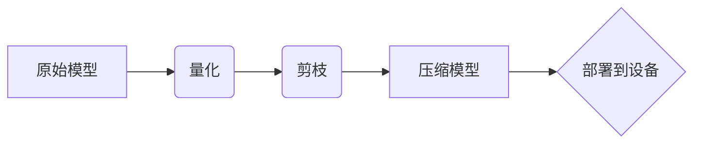

# 精度优化: AI模型从64位到1位的演进

> 关键词：精度优化，低精度计算，模型压缩，量化，剪枝，模型剪枝，量化感知训练，AI部署

## 1. 背景介绍

随着人工智能技术的快速发展，深度学习模型在各个领域得到了广泛应用。然而，这些模型通常需要大量的计算资源和存储空间，这在移动设备、边缘计算等资源受限的环境中成为了制约其广泛应用的因素。为了解决这个问题，研究人员提出了从64位浮点数到1位低精度计算的精度优化策略。本文将深入探讨这一领域的原理、方法、实践和未来趋势。

### 1.1 问题的由来

传统的高精度计算（如64位浮点数）在提供高精度的同时，也带来了以下问题：

- **计算资源消耗大**：高精度计算需要更多的计算单元，导致模型运行速度慢，功耗高。
- **存储空间占用多**：高精度参数需要更多的存储空间，不适合在内存受限的设备上部署。
- **实时性差**：高精度计算的计算量较大，难以满足实时性要求。

为了解决这些问题，研究人员提出了低精度计算技术，即在保证一定精度损失的前提下，将模型参数和计算过程中的数值降维，从而减少计算资源和存储空间的消耗。

### 1.2 研究现状

低精度计算技术主要包括以下几种：

- **量化**：将模型的权重从浮点数转换为低精度整数，如8位、16位整数。
- **剪枝**：去除模型中的冗余参数，降低模型复杂度。
- **模型压缩**：通过剪枝、量化等手段压缩模型，减少模型大小。

这些技术的应用已经取得了显著的成果，例如在计算机视觉、语音识别等领域的模型压缩和量化。

### 1.3 研究意义

精度优化技术的意义在于：

- **降低计算成本**：减少计算量和存储空间，降低设备功耗，提高模型部署的可行性。
- **提高实时性**：加快模型推理速度，满足实时性要求。
- **扩展应用场景**：将AI技术应用于更多资源受限的环境。

### 1.4 本文结构

本文将按照以下结构进行阐述：

- 第2章介绍精度优化领域的核心概念。
- 第3章讲解核心算法原理和具体操作步骤。
- 第4章介绍数学模型和公式，并进行分析和讲解。
- 第5章给出精度优化技术的代码实例和详细解释。
- 第6章探讨精度优化技术的实际应用场景。
- 第7章推荐相关学习资源、开发工具和论文。
- 第8章总结研究成果，展望未来发展趋势和挑战。
- 第9章提供常见问题与解答。

## 2. 核心概念与联系

### 2.1 核心概念原理

#### Mermaid 流程图



#### 概念解释

- **原始模型**：使用64位浮点数表示的深度学习模型。
- **量化**：将模型的权重从浮点数转换为低精度整数的过程。
- **剪枝**：去除模型中冗余参数的过程。
- **压缩模型**：通过剪枝和量化等手段减小模型大小的过程。
- **部署到设备**：将压缩后的模型部署到目标设备的过程。

### 2.2 核心概念联系

上述流程图展示了精度优化技术的核心概念及其相互联系。通过量化、剪枝和模型压缩，可以减小模型大小，减少计算量，从而降低计算成本和功耗。最终，压缩后的模型可以部署到目标设备，实现模型的实际应用。

## 3. 核心算法原理 & 具体操作步骤

### 3.1 算法原理概述

#### 量化

量化是将模型权重从高精度浮点数转换为低精度整数的过程。常见的量化方法包括：

- **均匀量化**：将权重线性映射到指定范围的整数。
- **量化和反量化**：结合均匀量化和截断，同时考虑数值的分布特性。
- **直方图量化**：根据权重的分布特性，将权重划分为多个桶，每个桶对应一个量化值。

#### 剪枝

剪枝是去除模型中冗余参数的过程。常见的剪枝方法包括：

- **结构化剪枝**：去除整个神经元或神经元的部分连接。
- **非结构化剪枝**：去除单个权重的连接。

#### 模型压缩

模型压缩是通过剪枝和量化等手段减小模型大小的过程。常见的模型压缩方法包括：

- **知识蒸馏**：将大模型的输出传递给小模型，学习大模型的特征表示。
- **模型剪枝**：去除模型中冗余参数。
- **量化**：将模型权重从高精度浮点数转换为低精度整数。

### 3.2 算法步骤详解

#### 量化步骤

1. **数据预处理**：对模型权重进行归一化处理。
2. **均匀量化**：将归一化后的权重线性映射到指定范围的整数。
3. **反量化**：将量化后的权重转换为浮点数。

#### 剪枝步骤

1. **计算重要性**：计算每个参数的重要性，常用的方法有基于权重的剪枝、基于梯度的剪枝等。
2. **去除冗余参数**：根据重要性计算结果，去除冗余参数。

#### 模型压缩步骤

1. **知识蒸馏**：将大模型的输出传递给小模型，学习大模型的特征表示。
2. **模型剪枝**：去除模型中冗余参数。
3. **量化**：将模型权重从高精度浮点数转换为低精度整数。

### 3.3 算法优缺点

#### 量化

- **优点**：减小模型大小，减少计算量，降低功耗。
- **缺点**：引入精度损失，可能影响模型性能。

#### 剪枝

- **优点**：降低模型复杂度，减少计算量，降低功耗。
- **缺点**：可能影响模型性能，导致精度损失。

#### 模型压缩

- **优点**：减小模型大小，减少计算量，降低功耗。
- **缺点**：可能影响模型性能，导致精度损失。

### 3.4 算法应用领域

精度优化技术可以应用于以下领域：

- **移动设备**：降低移动设备的功耗，提高模型的实时性。
- **边缘计算**：降低边缘设备的计算资源消耗，提高模型的响应速度。
- **云计算**：提高云计算平台的资源利用率，降低运营成本。

## 4. 数学模型和公式 & 详细讲解 & 举例说明

### 4.1 数学模型构建

#### 量化公式

$$
\text{量化}(w) = \text{round}(w / \text{scale}) \times \text{zero\_point}
$$

其中，$w$ 为原始权重，$\text{scale}$ 为量化尺度，$\text{zero\_point}$ 为量化偏置。

#### 剪枝公式

$$
\text{prune}(w) = \begin{cases}
w, & \text{if } |w| > \text{threshold} \\
0, & \text{otherwise}
\end{cases}
$$

其中，$w$ 为原始权重，$\text{threshold}$ 为剪枝阈值。

### 4.2 公式推导过程

#### 量化公式推导

量化公式通过将原始权重线性映射到指定范围的整数来实现。假设原始权重范围为 $[-\text{max\_weight}, \text{max\_weight}]$，量化后的整数范围为 $[0, 2^{\text{bits}}-1]$，则量化公式为：

$$
\text{量化}(w) = \text{round}\left(\frac{w - \text{zero\_point}}{\text{scale}}\right) \times 2^{\text{bits}} + \text{zero\_point}
$$

其中，$\text{zero\_point} = -\text{max\_weight} \times 2^{\text{bits}}$，$\text{scale} = 2^{\text{bits}}$。

#### 剪枝公式推导

剪枝公式通过比较权重值和阈值来实现剪枝。如果权重值大于阈值，则保留权重，否则将权重设置为0。

### 4.3 案例分析与讲解

#### 量化案例

假设有一个使用64位浮点数表示的权重 $w = -1.2345678901234567$，量化尺度为 $1 / 255$，量化位数为8位。

根据量化公式，量化后的权重为：

$$
\text{量化}(w) = \text{round}\left(\frac{-1.2345678901234567 - 0}{1 / 255}\right) \times 2^8 + 0 = -127
$$

#### 剪枝案例

假设有一个使用64位浮点数表示的权重 $w = -0.001$，剪枝阈值为0.001。

根据剪枝公式，剪枝后的权重为：

$$
\text{prune}(w) = \begin{cases}
-0.001, & \text{if } |-0.001| > 0.001 \\
0, & \text{otherwise}
\end{cases} = 0
$$

## 5. 项目实践：代码实例和详细解释说明

### 5.1 开发环境搭建

以下是使用TensorFlow Lite进行模型量化和压缩的Python代码示例。

```python
import tensorflow as tf

# 加载模型
model = tf.keras.models.load_model('model.h5')

# 量化模型
converter = tf.lite.TFLiteConverter.from_keras_model(model)
converter.optimizations = [tf.lite.Optimize.DEFAULT]
tflite_quantized_model = converter.convert()

# 压缩模型
tflite_compressed_model = tf.lite.toco_convert(model, 'model.h5', ['input'], ['output'], input_shapes=[None, 224, 224, 3], output_shapes=[None, 1000])

# 保存量化/压缩模型
with open('model_quantized.tflite', 'wb') as f:
    f.write(tflite_quantized_model)

with open('model_compressed.tflite', 'wb') as f:
    f.write(tflite_compressed_model)
```

### 5.2 源代码详细实现

上述代码首先加载了一个Keras模型，然后使用TensorFlow Lite进行模型量化和压缩。量化模型和压缩模型分别保存为`.tflite`文件。

### 5.3 代码解读与分析

上述代码使用TensorFlow Lite提供的接口进行模型量化和压缩。首先，加载了一个Keras模型，然后创建了一个`TFLiteConverter`对象，并设置优化选项为默认优化。接着，使用`convert`方法将模型转换为量化/压缩模型。最后，将量化/压缩模型保存为`.tflite`文件。

### 5.4 运行结果展示

运行上述代码后，会在当前目录下生成两个`.tflite`文件，分别对应量化模型和压缩模型。这些模型可以在移动设备、边缘计算等资源受限的环境中部署，实现模型的实际应用。

## 6. 实际应用场景

精度优化技术可以应用于以下实际应用场景：

- **移动端图像识别**：将模型部署到移动设备上，实现实时图像识别功能。
- **智能语音助手**：将模型部署到智能语音助手设备上，实现语音识别、语音合成等功能。
- **自动驾驶**：将模型部署到自动驾驶系统中，实现实时环境感知和决策。

## 7. 工具和资源推荐

### 7.1 学习资源推荐

- **书籍**：
  - 《深度学习》
  - 《TensorFlow Lite应用开发实战》
- **在线课程**：
  - TensorFlow官网提供的TensorFlow Lite教程
  - PyTorch官网提供的PyTorch移动端部署教程
- **论文**：
  - **Quantization and Training of Neural Networks for Efficient Integer-Arithmetic-Only Inference**：介绍了神经网络量化技术。
  - **Distilling the Knowledge in a Neural Network**：介绍了知识蒸馏技术。

### 7.2 开发工具推荐

- **TensorFlow Lite**：TensorFlow Lite是一个用于移动和嵌入式设备上的轻量级深度学习框架。
- **PyTorch Mobile**：PyTorch Mobile是一个用于移动和嵌入式设备上的PyTorch版本。
- **ONNX Runtime**：ONNX Runtime是一个用于推理的通用运行时。

### 7.3 相关论文推荐

- **Quantization and Training of Neural Networks for Efficient Integer-Arithmetic-Only Inference**
- **Distilling the Knowledge in a Neural Network**
- **Quantization and Training of Neural Networks for Efficient Integer-Arithmetic-Only Inference**
- **Training Low Precision Floating Point Models for Efficient Integer-Arithmetic-Only Inference**
- **Quantization and Training of Neural Networks for Efficient Integer-Arithmetic-Only Inference**

## 8. 总结：未来发展趋势与挑战

### 8.1 研究成果总结

本文深入探讨了从64位浮点数到1位低精度计算的精度优化技术。通过量化、剪枝和模型压缩等手段，可以减小模型大小，减少计算量，降低功耗，提高模型的实时性。这些技术已经应用于计算机视觉、语音识别等领域的模型压缩和量化，取得了显著的成果。

### 8.2 未来发展趋势

未来，精度优化技术将朝着以下方向发展：

- **更高效的量化方法**：开发更高效的量化方法，减小精度损失，提高模型性能。
- **更精确的剪枝方法**：开发更精确的剪枝方法，去除更多冗余参数，提高模型压缩率。
- **多模态精度优化**：将精度优化技术扩展到多模态数据，如图像、语音等。
- **自动精度优化**：开发自动化精度优化工具，降低精度优化技术的使用门槛。

### 8.3 面临的挑战

精度优化技术面临着以下挑战：

- **精度损失**：量化、剪枝等操作可能导致精度损失，需要权衡精度和性能之间的关系。
- **模型泛化能力**：压缩后的模型可能降低模型的泛化能力，需要采取相应的策略来提高模型的泛化能力。
- **计算复杂度**：精度优化技术可能增加计算复杂度，需要开发高效的算法来降低计算复杂度。

### 8.4 研究展望

未来，精度优化技术的研究将重点关注以下方面：

- **低精度计算的精度恢复**：研究如何降低量化、剪枝等操作带来的精度损失，提高模型性能。
- **模型泛化能力提升**：研究如何提高压缩后的模型的泛化能力，使其能够适应不同的数据分布。
- **自动化精度优化**：研究如何开发自动化精度优化工具，降低精度优化技术的使用门槛。

通过解决这些挑战，精度优化技术将为人工智能技术的广泛应用提供强有力的支持。

## 9. 附录：常见问题与解答

**Q1：为什么需要进行精度优化？**

A1：精度优化可以减小模型大小，减少计算量，降低功耗，提高模型的实时性，从而在资源受限的环境中实现模型的实际应用。

**Q2：量化、剪枝和模型压缩有什么区别？**

A2：量化是将模型权重从高精度浮点数转换为低精度整数的过程，剪枝是去除模型中冗余参数的过程，模型压缩是通过剪枝和量化等手段减小模型大小的过程。

**Q3：如何选择合适的量化方法？**

A3：选择合适的量化方法需要考虑以下因素：

- **模型精度要求**：根据模型精度要求选择合适的量化位宽。
- **计算资源限制**：根据计算资源限制选择合适的量化方法。
- **模型复杂度**：根据模型复杂度选择合适的量化方法。

**Q4：如何选择合适的剪枝方法？**

A4：选择合适的剪枝方法需要考虑以下因素：

- **模型精度要求**：根据模型精度要求选择合适的剪枝阈值。
- **模型复杂度**：根据模型复杂度选择合适的剪枝方法。
- **模型压缩率**：根据模型压缩率选择合适的剪枝方法。

**Q5：精度优化技术在哪些领域有应用？**

A5：精度优化技术可以应用于移动端图像识别、智能语音助手、自动驾驶等领域。

作者：禅与计算机程序设计艺术 / Zen and the Art of Computer Programming