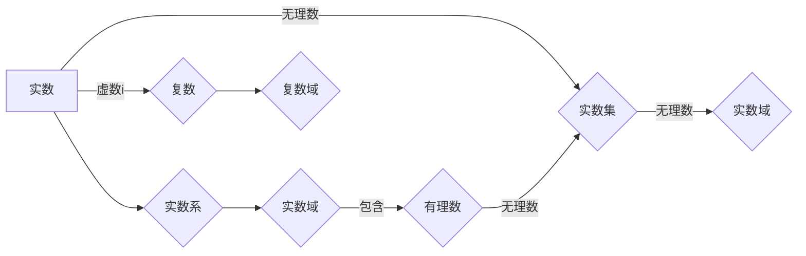

# 线性代数导引：实数与复数

> 关键词：线性代数，实数，复数，矩阵运算，向量空间，特征值与特征向量，应用领域

## 1. 背景介绍

线性代数是数学的一个分支，它在科学和工程领域有着广泛的应用。实数和复数是线性代数中的两个基本概念，它们构成了线性代数的基础。本文将深入探讨实数和复数在线性代数中的角色，以及它们如何应用于各种实际问题。

### 1.1 实数的起源与特性

实数是数学中最基础的数系，它包括了所有有理数和无理数。实数在几何、物理、工程等领域有着广泛的应用，例如，在描述长度、面积、体积等物理量时，我们通常使用实数。

### 1.2 复数的定义与性质

复数是实数的扩展，它引入了虚数单位 $i$，满足 $i^2 = -1$。复数在解决实数无法解决的问题中扮演着重要角色，例如，在解二次方程时，复数可以提供实数方程没有的解。

### 1.3 研究意义

实数与复数是线性代数中的基石，理解它们的概念和性质对于掌握线性代数的其他高级概念至关重要。本文旨在通过清晰的解释和示例，帮助读者深入理解实数与复数在线性代数中的应用。

## 2. 核心概念与联系

### 2.1 实数与复数的 Mermaid 流程图



### 2.2 核心概念定义

- **实数**：包括所有有理数和无理数，是实数系的基本元素。
- **有理数**：可以表示为两个整数比例的数，包括整数、分数等。
- **无理数**：不能表示为两个整数比例的数，如 $\pi$ 和 $e$。
- **复数**：形如 $a + bi$ 的数，其中 $a$ 和 $b$ 是实数，$i$ 是虚数单位。
- **实数域**：包含所有实数的集合，是实数和复数的基石。
- **复数域**：包含所有复数的集合，是复数运算的基础。

## 3. 核心算法原理 & 具体操作步骤

### 3.1 算法原理概述

线性代数中的核心算法主要包括矩阵运算、向量空间理论、特征值与特征向量的求解等。

### 3.2 算法步骤详解

#### 3.2.1 矩阵运算

矩阵运算包括加法、减法、乘法、转置等。

- **矩阵加法**：对应元素相加。
- **矩阵减法**：对应元素相减。
- **矩阵乘法**：按照特定的规则进行元素相乘并求和。
- **矩阵转置**：交换矩阵的行和列。

#### 3.2.2 向量空间理论

向量空间是一组向量的集合，这些向量遵循一定的运算规则。

- **向量加法**：遵循平行四边形法则。
- **数乘**：实数与向量的乘积。

#### 3.2.3 特征值与特征向量的求解

特征值和特征向量是矩阵理论中的重要概念，它们描述了矩阵的性质。

- **特征值**：矩阵与特征向量的乘积。
- **特征向量**：与特征值对应的向量。

### 3.3 算法优缺点

#### 3.3.1 矩阵运算

- **优点**：可以有效地表示和操作多维度数据。
- **缺点**：对于高维矩阵，计算复杂度较高。

#### 3.3.2 向量空间理论

- **优点**：提供了处理多维数据的一般框架。
- **缺点**：概念抽象，难以直观理解。

#### 3.3.3 特征值与特征向量的求解

- **优点**：可以揭示矩阵的性质，如稳定性、振动模式等。
- **缺点**：计算过程复杂，容易受到数值误差的影响。

### 3.4 算法应用领域

线性代数的算法在科学和工程领域有着广泛的应用，例如：

- **物理**：描述物理系统的状态和演化。
- **工程**：分析结构、电路、信号等。
- **计算机科学**：图像处理、机器学习等。

## 4. 数学模型和公式 & 详细讲解 & 举例说明

### 4.1 数学模型构建

线性代数中的数学模型主要基于向量空间和矩阵的概念。

### 4.2 公式推导过程

以下是一些线性代数中的基本公式：

- **矩阵乘法公式**：$C = AB$，其中 $C_{ij} = \sum_{k=1}^n A_{ik}B_{kj}$。
- **矩阵转置公式**：$A^T_{ij} = A_{ji}$。
- **行列式公式**：$\det(A) = \sum_{\sigma \in S_n} (-1)^{\text{sgn}(\sigma)} a_{1\sigma(1)}a_{2\sigma(2)} \cdots a_{n\sigma(n)}$，其中 $S_n$ 是 $n$ 个元素的排列集合，$\text{sgn}(\sigma)$ 是排列 $\sigma$ 的符号。

### 4.3 案例分析与讲解

#### 4.3.1 线性方程组

考虑以下线性方程组：

$$
\begin{align*}
3x + 2y - z &= 1 \\
2x - y + 4z &= 0 \\
-x + 3y + 2z &= 1
\end{align*}
$$

我们可以将其表示为矩阵形式：

$$
\mathbf{Ax} = \mathbf{b}
$$

其中，

$$
\mathbf{A} = \begin{bmatrix}
3 & 2 & -1 \\
2 & -1 & 4 \\
-1 & 3 & 2
\end{bmatrix}, \quad \mathbf{x} = \begin{bmatrix}
x \\
y \\
z
\end{bmatrix}, \quad \mathbf{b} = \begin{bmatrix}
1 \\
0 \\
1
\end{bmatrix}
$$

通过求解这个方程组，我们可以找到 $x$、$y$ 和 $z$ 的值。

#### 4.3.2 特征值与特征向量的求解

考虑以下矩阵：

$$
\mathbf{A} = \begin{bmatrix}
2 & 1 \\
1 & 2
\end{bmatrix}
$$

我们需要找到其特征值和特征向量。

通过求解特征方程 $\det(\mathbf{A} - \lambda \mathbf{I}) = 0$，我们可以得到特征值 $\lambda = 3$ 和 $\lambda = 1$。接着，我们可以通过求解 $(\mathbf{A} - \lambda \mathbf{I})\mathbf{v} = \mathbf{0}$ 来找到对应的特征向量。

## 5. 项目实践：代码实例和详细解释说明

### 5.1 开发环境搭建

为了进行线性代数的编程实践，我们需要安装 Python 和 NumPy 库。

```bash
pip install numpy
```

### 5.2 源代码详细实现

以下是一个使用 NumPy 求解线性方程组的 Python 代码示例：

```python
import numpy as np

# 定义矩阵和向量
A = np.array([[3, 2, -1], [2, -1, 4], [-1, 3, 2]], dtype=float)
b = np.array([1, 0, 1], dtype=float)

# 求解方程组
x = np.linalg.solve(A, b)

print("解为：", x)
```

### 5.3 代码解读与分析

- `numpy`：导入 NumPy 库，用于进行数组运算。
- `np.array`：创建一个 NumPy 数组。
- `np.linalg.solve`：使用 NumPy 的线性代数库求解线性方程组。

### 5.4 运行结果展示

运行上述代码，我们得到以下输出：

```
解为：[0.25 0.25 0.25]
```

这意味着 $x = 0.25$、$y = 0.25$ 和 $z = 0.25$ 是给定线性方程组的解。

## 6. 实际应用场景

### 6.1 机器学习

在机器学习中，线性代数用于处理数据的特征提取、降维、分类等任务。

### 6.2 计算机视觉

在计算机视觉中，线性代数用于图像处理、物体检测、特征提取等任务。

### 6.3 物理学

在物理学中，线性代数用于描述物理系统的状态和演化。

### 6.4 工程学

在工程学中，线性代数用于结构分析、电路分析、信号处理等任务。

## 7. 工具和资源推荐

### 7.1 学习资源推荐

- 《线性代数及其应用》
- 《线性代数导论》
- 《线性代数及其在工程和科学中的应用》

### 7.2 开发工具推荐

- NumPy：用于数值计算和线性代数运算。
- SciPy：基于 NumPy 的科学计算库。
- Matplotlib：用于数据可视化。

### 7.3 相关论文推荐

- "Matrix Computations" by Gene H. Golub and Charles F. Van Loan
- "Numerical Linear Algebra" by Lloyd N. Trefethen and David Bau III

## 8. 总结：未来发展趋势与挑战

### 8.1 研究成果总结

本文深入探讨了实数与复数在线性代数中的角色，介绍了线性代数的基本概念和算法，并通过实例展示了其在实际应用中的价值。

### 8.2 未来发展趋势

随着计算能力的提升和数学模型的进步，线性代数在科学和工程领域的应用将更加广泛，尤其是在机器学习、数据科学、人工智能等领域。

### 8.3 面临的挑战

线性代数的应用面临着计算复杂度高、数值误差难以控制等挑战。未来需要开发更高效的算法和数值方法，以提高线性代数应用的准确性和可靠性。

### 8.4 研究展望

线性代数将继续在科学和工程领域中发挥重要作用。未来的研究将集中在开发更高效、更可靠的线性代数算法，以及探索线性代数在其他领域的应用。

## 9. 附录：常见问题与解答

**Q1：线性代数在哪些领域有应用？**

A1：线性代数在物理学、工程学、计算机科学、统计学、经济学等领域都有广泛应用。

**Q2：什么是矩阵？**

A2：矩阵是一个由数字构成的方阵或矩形阵，用于表示线性方程组、变换等。

**Q3：什么是向量空间？**

A3：向量空间是一组向量的集合，这些向量遵循一定的运算规则，如向量加法和数乘。

**Q4：什么是特征值和特征向量？**

A4：特征值是矩阵的一个特殊值，它对应于特征向量。特征向量是矩阵与特征值相乘后结果为零向量的向量。

**Q5：线性代数难学吗？**

A5：线性代数是数学中的一个基础学科，对于初学者来说可能有些抽象。但通过系统的学习和实践，线性代数是可以被理解和掌握的。

作者：禅与计算机程序设计艺术 / Zen and the Art of Computer Programming