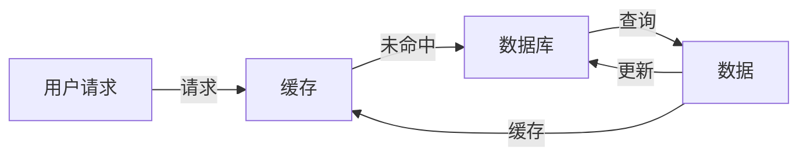

# 缓存技术在高吞吐量中的应用

> 关键词：缓存技术，高吞吐量，内存数据库，分布式缓存，缓存策略，一致性，性能优化

## 1. 背景介绍

在信息爆炸的时代，高吞吐量应用的需求日益增长。这类应用要求系统能够处理海量数据，并以极快的速度响应用户请求。然而，随着数据量的激增，数据访问速度成为了一个挑战。为了解决这一挑战，缓存技术应运而生。缓存技术通过在内存中存储频繁访问的数据，显著提高数据访问速度，从而实现高吞吐量应用的需求。

### 1.1 应用场景

缓存技术广泛应用于以下场景：

- **Web应用**：如电子商务网站、社交网络平台、内容管理系统等，用于缓存用户会话、页面内容、用户信息等。
- **移动应用**：缓存图片、视频、应用数据等，提高应用响应速度，减少网络请求。
- **大数据处理**：在数据仓库和数据分析平台中使用缓存，加速数据处理和分析。
- **实时系统**：如在线交易系统、实时消息系统等，保证数据访问速度和系统稳定性。

### 1.2 研究意义

研究缓存技术在高吞吐量中的应用，对于以下方面具有重要意义：

- **提高系统性能**：通过缓存减少数据访问延迟，提高系统响应速度。
- **降低资源消耗**：减少对后端存储系统的访问，降低计算和带宽成本。
- **提升用户体验**：快速响应用户请求，提供流畅的交互体验。
- **系统扩展性**：提高系统处理能力，支持更高的并发请求。

## 2. 核心概念与联系

### 2.1 核心概念

- **缓存**：将数据暂时存储在内存中，以便快速访问。
- **内存数据库**：专门为缓存设计的内存数据库，如Redis、Memcached等。
- **分布式缓存**：在多台服务器上分布存储缓存数据，提高缓存容量和性能。
- **缓存策略**：决定数据何时进入缓存、何时失效的策略，如LRU、LFU等。
- **一致性**：缓存数据与原始数据保持同步的状态。

### 2.2 架构流程图

```mermaid
graph LR
    A[用户请求] --> B{是否命中缓存?}
    B -- 是 --> |返回数据| C[返回数据]
    B -- 否 --> D[查询数据库]
    D --> E{数据是否存在?}
    E -- 是 --> |更新缓存| F[返回数据]
    E -- 否 --> |更新数据库并缓存| G[更新数据]
    G --> F[返回数据]
```

### 2.3 关系图



## 3. 核心算法原理 & 具体操作步骤

### 3.1 算法原理概述

缓存技术的基本原理是将频繁访问的数据存储在内存中，以便快速访问。当用户请求数据时，系统首先检查缓存中是否存在该数据。如果命中缓存，则直接返回数据；如果未命中缓存，则需要从数据库或其他存储系统中查询数据，并将查询结果存储在缓存中，以便后续快速访问。

### 3.2 算法步骤详解

1. 用户发送请求，系统接收到请求。
2. 系统检查缓存中是否包含请求的数据。
3. 如果命中缓存，则直接返回数据。
4. 如果未命中缓存，则从数据库或其他存储系统中查询数据。
5. 将查询结果存储在缓存中，并设置缓存过期时间。
6. 返回查询结果。

### 3.3 算法优缺点

#### 优点：

- **提高数据访问速度**：通过内存访问速度远快于磁盘访问速度，显著提高数据访问速度。
- **减少数据库负载**：频繁访问的数据存储在缓存中，减少对数据库的查询压力。
- **降低资源消耗**：减少对磁盘IO的访问，降低计算和带宽成本。

#### 缺点：

- **缓存一致性**：缓存数据可能与原始数据不一致，需要设计一致性策略。
- **缓存容量限制**：内存容量有限，需要合理设计缓存大小和淘汰策略。
- **缓存失效**：缓存数据可能过期，需要定期更新缓存。

### 3.4 算法应用领域

缓存技术广泛应用于以下领域：

- **Web应用**：缓存页面内容、用户会话、商品信息等。
- **移动应用**：缓存图片、视频、应用数据等。
- **大数据处理**：缓存数据仓库中的数据，加速数据处理和分析。
- **实时系统**：缓存交易数据、用户信息等，保证系统实时性。

## 4. 数学模型和公式 & 详细讲解 & 举例说明

### 4.1 数学模型构建

缓存命中率可以通过以下公式计算：

$$
\text{命中率} = \frac{\text{命中缓存的数据请求}}{\text{总数据请求}}
$$

### 4.2 公式推导过程

缓存命中率的计算公式为：

$$
\text{命中率} = \frac{\text{命中缓存的数据请求}}{\text{总数据请求}} = \frac{\text{命中缓存的数据请求} + \text{未命中缓存的数据请求}}{\text{总数据请求}} = \frac{\text{命中缓存的数据请求}}{\text{命中缓存的数据请求} + \text{未命中缓存的数据请求}}
$$

### 4.3 案例分析与讲解

假设某系统每天有1000次数据请求，其中有800次命中缓存，则缓存命中率为：

$$
\text{命中率} = \frac{800}{1000} = 0.8
$$

这意味着该系统的缓存命中率较高，可以有效提高数据访问速度。

## 5. 项目实践：代码实例和详细解释说明

### 5.1 开发环境搭建

以下是使用Python和Redis进行缓存实现的简单示例。

1. 安装Redis：从Redis官网下载并安装Redis服务器。
2. 安装Python Redis库：使用pip安装redis库。

### 5.2 源代码详细实现

```python
import redis

# 连接到Redis服务器
r = redis.Redis(host='localhost', port=6379, db=0)

# 将数据存储在缓存中
r.set('key', 'value')

# 从缓存中获取数据
value = r.get('key')

# 打印获取到的数据
print(value.decode())
```

### 5.3 代码解读与分析

- `import redis`：导入redis库。
- `r = redis.Redis(host='localhost', port=6379, db=0)`：连接到本地的Redis服务器。
- `r.set('key', 'value')`：将键名为'key'的值设置为'value'。
- `value = r.get('key')`：获取键名为'key'的值。
- `print(value.decode())`：打印获取到的值。

### 5.4 运行结果展示

运行上述代码后，将在控制台输出：

```
value
```

## 6. 实际应用场景

### 6.1 Web应用

在Web应用中，缓存技术可以用于：

- 缓存页面内容，减少页面加载时间。
- 缓存用户会话，提高用户体验。
- 缓存商品信息，减少数据库查询压力。

### 6.2 移动应用

在移动应用中，缓存技术可以用于：

- 缓存图片、视频等资源，提高应用性能。
- 缓存应用数据，减少网络请求。

### 6.3 大数据处理

在大数据处理中，缓存技术可以用于：

- 缓存数据仓库中的数据，加速数据处理和分析。
- 缓存中间结果，减少重复计算。

### 6.4 实时系统

在实时系统中，缓存技术可以用于：

- 缓存用户信息，提高系统响应速度。
- 缓存交易数据，保证系统实时性。

## 7. 工具和资源推荐

### 7.1 学习资源推荐

- 《Redis实战》
- 《Memcached实战》
- 《高性能MySQL》

### 7.2 开发工具推荐

- Redis：开源的内存数据库。
- Memcached：高性能的分布式缓存系统。
- Varnish：高性能的HTTP缓存和代理服务器。

### 7.3 相关论文推荐

- "Caching Strategies for the Web" by Avi Bryant
- "Memcached: A Distributed Memory Object Cache System" by Brian A.akanine, Sanjay Ghemawat, and Neil Daswani
- "Varnish Cache: High-performance HTTP/1.1 and HTTP/2 Cache" by Poul-Henning Kamp

## 8. 总结：未来发展趋势与挑战

### 8.1 研究成果总结

本文介绍了缓存技术在高吞吐量中的应用，阐述了缓存技术的基本原理、算法、应用场景等。通过实例演示了如何使用Python和Redis进行缓存实现。

### 8.2 未来发展趋势

- **内存技术发展**：随着内存技术的发展，缓存容量和性能将得到进一步提升。
- **分布式缓存**：分布式缓存将进一步提高缓存容量和性能，满足更大规模的应用需求。
- **缓存一致性**：缓存一致性技术将得到进一步发展，确保缓存数据与原始数据保持同步。
- **智能化缓存**：结合机器学习等技术，实现智能化缓存管理。

### 8.3 面临的挑战

- **缓存一致性**：确保缓存数据与原始数据保持同步。
- **缓存容量**：如何平衡缓存容量和性能。
- **缓存失效**：如何有效管理缓存数据，避免数据过时。
- **缓存安全**：确保缓存数据的安全性。

### 8.4 研究展望

随着技术的不断发展，缓存技术在高吞吐量应用中将发挥越来越重要的作用。未来，缓存技术将继续朝着高性能、高可用、高安全、智能化的方向发展。

## 9. 附录：常见问题与解答

**Q1：缓存技术是否适用于所有应用？**

A：缓存技术适用于对数据访问速度要求较高的应用，如Web应用、移动应用、大数据处理等。对于数据访问速度要求不高的应用，缓存技术的作用有限。

**Q2：如何选择合适的缓存策略？**

A：选择合适的缓存策略需要考虑以下因素：

- 数据访问模式：如随机访问、顺序访问等。
- 数据更新频率：如高频更新、低频更新等。
- 缓存容量：如缓存大小、缓存类型等。

**Q3：缓存数据是否需要定期更新？**

A：缓存数据是否需要定期更新取决于具体的应用场景。对于频繁更新的数据，需要定期更新缓存数据；对于不经常更新的数据，可以设置较长的缓存过期时间。

**Q4：如何保证缓存数据的安全性？**

A：为了保证缓存数据的安全性，可以采取以下措施：

- 使用加密技术对缓存数据进行加密。
- 限制对缓存数据的访问权限。
- 定期备份缓存数据。

**Q5：如何评估缓存效果？**

A：可以通过以下指标评估缓存效果：

- 缓存命中率：缓存命中率的提高意味着缓存效果越好。
- 数据访问速度：数据访问速度的提高意味着缓存效果越好。
- 系统性能：系统性能的提高意味着缓存效果越好。

---

作者：禅与计算机程序设计艺术 / Zen and the Art of Computer Programming