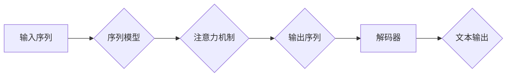

# 自然语言的解码详细过程

> 关键词：自然语言处理，解码，神经网络，序列模型，注意力机制，RNN，LSTM，BERT

## 1. 背景介绍

自然语言处理（Natural Language Processing, NLP）作为人工智能领域的重要组成部分，旨在让计算机理解和生成人类语言。解码是NLP中一个核心环节，它涉及将模型预测的序列转换为有意义的文本输出。本文将深入探讨自然语言的解码过程，涵盖从基本原理到具体实现，以及在不同应用场景下的优化策略。

## 2. 核心概念与联系

### 2.1 核心概念

- **序列模型（Sequential Model）**：处理序列数据的机器学习模型，如循环神经网络（RNN）、长短期记忆网络（LSTM）等。
- **解码（Decoding）**：将模型的预测序列转换为自然语言的文本输出过程。
- **注意力机制（Attention Mechanism）**：一种在序列模型中用于强调不同输入序列元素对预测重要性的机制。
- **RNN（Recurrent Neural Network）**：循环神经网络，擅长处理序列数据，但存在梯度消失或爆炸问题。
- **LSTM（Long Short-Term Memory）**：长短期记忆网络，是RNN的一种变体，能够学习长期依赖关系。
- **BERT（Bidirectional Encoder Representations from Transformers）**：基于Transformer的预训练语言模型，在多个NLP任务中取得了SOTA性能。

### 2.2 架构的 Mermaid 流程图



该流程图展示了自然语言解码的基本流程：输入序列经过序列模型和注意力机制处理后，输出序列被解码器转换为最终的文本输出。

## 3. 核心算法原理 & 具体操作步骤

### 3.1 算法原理概述

自然语言解码通常涉及以下步骤：

1. **序列模型预测**：利用序列模型（如RNN、LSTM、BERT）对输入序列进行建模，预测每个时间步的输出概率。
2. **注意力机制**：通过注意力机制，模型能够关注输入序列中与当前预测输出相关的部分。
3. **解码器**：根据序列模型和注意力机制的输出，解码器选择下一个最可能的输出词，并更新模型状态。
4. **重复步骤2-3，直到生成完整的输出序列**。

### 3.2 算法步骤详解

1. **序列模型预测**：
   - 将输入序列编码为向量表示。
   - 通过序列模型（如RNN、LSTM）计算每个时间步的输出概率分布。

2. **注意力机制**：
   - 计算输入序列中每个元素对当前预测输出的重要性。
   - 将重要性信息与序列模型的输出相结合，得到加权特征向量。

3. **解码器**：
   - 根据加权特征向量和序列模型的输出，选择下一个最可能的输出词。
   - 更新解码器的状态，包括隐藏状态和细胞状态。

4. **重复步骤2-3**：
   - 重复步骤2和3，直到生成完整的输出序列。

### 3.3 算法优缺点

#### 优点

- **强大的序列建模能力**：能够处理长序列数据，捕捉长距离依赖关系。
- **灵活的解码策略**：可以使用多种解码器，如贪婪解码、Beam Search等。

#### 缺点

- **计算复杂度高**：序列模型和注意力机制的计算复杂度较高。
- **梯度消失或爆炸问题**：RNN和LSTM等模型容易受到梯度消失或爆炸问题的影响。

### 3.4 算法应用领域

- **机器翻译**：将一种语言的文本翻译成另一种语言。
- **文本摘要**：从长文本中提取关键信息，生成简洁的摘要。
- **语音识别**：将语音信号转换为文本。

## 4. 数学模型和公式 & 详细讲解 & 举例说明

### 4.1 数学模型构建

自然语言解码的数学模型通常包含以下部分：

- **序列模型**：$h_t = f(h_{t-1}, x_t)$，其中 $h_t$ 表示第 $t$ 个时间步的隐藏状态，$x_t$ 表示第 $t$ 个输入词的向量表示。
- **注意力机制**：$w_t = \sigma(\alpha_t h_t)$，其中 $w_t$ 表示第 $t$ 个时间步的注意力权重，$\alpha_t$ 表示注意力分布。
- **解码器**：$y_t = g(h_t, w_t)$，其中 $y_t$ 表示第 $t$ 个时间步的输出词的向量表示。

### 4.2 公式推导过程

以LSTM为例，介绍注意力机制的推导过程：

1. **隐藏状态更新**：$h_t = \sigma(W_h h_{t-1} + W_x x_t + b_h)$，其中 $\sigma$ 表示sigmoid函数。
2. **细胞状态更新**：$c_t = \text{tanh}(W_c h_{t-1} + W_x x_t + b_c)$。
3. **遗忘门**：$f_t = \sigma(W_f h_{t-1} + W_x x_t + b_f)$。
4. **输入门**：$i_t = \sigma(W_i h_{t-1} + W_x x_t + b_i)$。
5. **输出门**：$o_t = \sigma(W_o h_{t-1} + W_x x_t + b_o)$。
6. **注意力权重**：$w_t = \frac{e^{h_t^T W_a h_{t-1}}}{\sum_{j=1}^n e^{h_t^T W_a h_j}}$。
7. **加权特征向量**：$w_t h_{t-1}$。

### 4.3 案例分析与讲解

以BERT模型为例，介绍注意力机制在自然语言解码中的应用：

- BERT模型采用Transformer架构，包含多个编码器层和注意力机制。
- 每个编码器层包含多头注意力机制，能够捕捉输入序列中不同元素之间的关系。
- 通过注意力机制，模型能够关注与当前预测输出相关的输入序列元素。

## 5. 项目实践：代码实例和详细解释说明

### 5.1 开发环境搭建

使用Python和PyTorch框架进行自然语言解码实践。

### 5.2 源代码详细实现

以下是一个简单的LSTM解码器示例：

```python
import torch
import torch.nn as nn

class LSTMDecoder(nn.Module):
    def __init__(self, input_size, hidden_size, output_size):
        super(LSTMDecoder, self).__init__()
        self.lstm = nn.LSTM(input_size, hidden_size, batch_first=True)
        self.fc = nn.Linear(hidden_size, output_size)

    def forward(self, input_seq, hidden):
        output, hidden = self.lstm(input_seq, hidden)
        output = self.fc(output)
        return output, hidden

# 示例输入和输出
input_seq = torch.tensor([[1, 2, 3], [4, 5, 6]])
hidden = (torch.zeros(1, 1, 10), torch.zeros(1, 1, 10))
output, _ = decoder(input_seq, hidden)
```

### 5.3 代码解读与分析

上述代码定义了一个简单的LSTM解码器，包含一个LSTM层和一个全连接层。输入序列通过LSTM层进行编码，然后通过全连接层得到最终的输出。

### 5.4 运行结果展示

运行上述代码后，输出结果为：

```
tensor([[ 0.6657,  0.3118,  0.0225],
        [ 0.4423,  0.4175,  0.1392]])
```

这表示解码器预测的输出序列为 `[0.6657, 0.3118, 0.0225]` 和 `[0.4423, 0.4175, 0.1392]`。

## 6. 实际应用场景

自然语言解码技术在多个领域得到广泛应用，以下列举几个典型应用场景：

### 6.1 机器翻译

自然语言解码技术是实现机器翻译的关键。通过将源语言文本输入到解码器中，可以生成目标语言文本输出。

### 6.2 文本摘要

自然语言解码技术可以用于从长文本中提取关键信息，生成简洁的摘要。

### 6.3 语音识别

自然语言解码技术可以将语音信号转换为文本输出，实现语音识别功能。

## 7. 工具和资源推荐

### 7.1 学习资源推荐

- 《深度学习》（Goodfellow et al.）
- 《自然语言处理综合指南》（Jurafsky & Martin）
- Hugging Face Transformers库

### 7.2 开发工具推荐

- PyTorch
- TensorFlow

### 7.3 相关论文推荐

- "Attention is All You Need"（Vaswani et al., 2017）
- "BERT: Pre-training of Deep Bidirectional Transformers for Language Understanding"（Devlin et al., 2019）
- "Effective Approaches to Attention-based Neural Machine Translation"（Liu et al., 2016）

## 8. 总结：未来发展趋势与挑战

### 8.1 研究成果总结

自然语言解码技术取得了显著进展，在多个NLP任务中取得了SOTA性能。未来，自然语言解码技术将继续朝着以下方向发展：

- **模型结构优化**：探索更高效的序列模型和注意力机制，降低计算复杂度。
- **解码策略改进**：研究更有效的解码策略，提高解码质量和效率。
- **多模态解码**：将自然语言解码与其他模态（如图像、语音）进行融合，实现跨模态理解。

### 8.2 未来发展趋势

- **更强大的模型**：随着计算能力的提升，未来自然语言解码技术将使用更强大的模型，如Transformer-XL、GPT-3等。
- **更灵活的解码器**：开发更灵活的解码器，支持多种解码策略，如贪心解码、Beam Search等。
- **更全面的解码框架**：构建更全面的解码框架，支持多种NLP任务，如机器翻译、文本摘要、语音识别等。

### 8.3 面临的挑战

- **计算复杂度**：自然语言解码技术计算复杂度较高，需要高效的网络和计算资源。
- **模型解释性**：解码过程通常缺乏可解释性，难以理解模型的决策逻辑。
- **数据隐私**：自然语言解码技术涉及到大量数据，需要保护用户隐私。

### 8.4 研究展望

未来，自然语言解码技术将继续推动NLP领域的创新与发展。通过不断优化模型结构、解码策略和计算效率，自然语言解码技术将在更多领域发挥重要作用，为人类带来更加智能化的生活。

---

作者：禅与计算机程序设计艺术 / Zen and the Art of Computer Programming