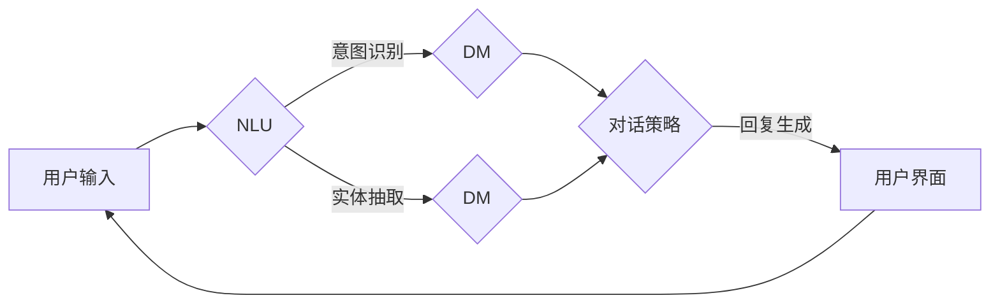

> 人工智能代理, 虚拟助手, 交互式AI, 智能对话系统, 机器学习, 自然语言处理, 用户体验

# 虚拟助理：构建AI代理的工作流程

在数字化转型的浪潮中，虚拟助理（Virtual Assistant）作为一种新兴的智能服务形式，正逐渐渗透到我们的日常生活和工作中。虚拟助理通过模拟人类助手的行为，为用户提供信息查询、任务执行、决策辅助等服务，极大地提高了效率和生活质量。本文将深入探讨构建AI代理的工作流程，从核心概念到实际应用，为读者呈现一个全面的技术视角。

## 1. 背景介绍

### 1.1 问题的由来

随着人工智能技术的飞速发展，机器学习和自然语言处理（NLP）领域的突破为虚拟助理的诞生提供了技术基础。在过去的几年中，虚拟助理在智能家居、客户服务、个人助理等多个领域得到了广泛应用。然而，构建一个高效、智能的虚拟助理并非易事，它涉及到复杂的系统工程，包括算法设计、数据处理、用户体验等多个方面。

### 1.2 研究现状

当前，虚拟助理的研究主要集中在以下几个方面：

- **自然语言理解（NLU）**：通过语音识别、语义分析等技术，将用户的自然语言指令转化为机器可理解的形式。
- **对话管理（DM）**：设计对话流程，使虚拟助理能够根据用户的意图和上下文，选择合适的回复策略。
- **任务执行（TA）**：将用户的指令转化为可执行的操作，如查询信息、执行任务等。
- **多轮对话管理**：处理多轮对话中的上下文信息，实现更复杂的交互。

### 1.3 研究意义

研究虚拟助理的构建流程，对于推动人工智能技术的发展和应用具有重要意义：

- **提高效率**：虚拟助理可以自动化处理大量重复性工作，提高工作效率。
- **改善用户体验**：提供个性化、便捷的服务，提升用户满意度。
- **创新服务模式**：开辟新的商业模式，为企业和个人创造价值。

### 1.4 本文结构

本文将按照以下结构展开：

- 第2章介绍虚拟助理的核心概念与联系。
- 第3章阐述虚拟助理的核心算法原理和具体操作步骤。
- 第4章讲解虚拟助理的数学模型和公式。
- 第5章展示虚拟助理的代码实例和详细解释。
- 第6章探讨虚拟助理的实际应用场景。
- 第7章推荐相关工具和资源。
- 第8章总结未来发展趋势和挑战。
- 第9章提供常见问题与解答。

## 2. 核心概念与联系

### 2.1 核心概念

以下是构建虚拟助理所需的核心概念：

- **自然语言理解（NLU）**：将自然语言输入转换为机器可理解的结构化数据。
- **对话管理（DM）**：管理和控制对话流程，包括意图识别、实体抽取、对话策略等。
- **任务执行（TA）**：根据对话管理的结果，执行相应的任务，如查询数据库、调用API等。
- **用户界面（UI）**：虚拟助理与用户交互的界面，包括语音、文本、图形等多种形式。
- **机器学习（ML）**：使用机器学习算法，如神经网络、决策树等，提高虚拟助理的智能水平。

### 2.2 Mermaid 流程图

以下是虚拟助理构建流程的Mermaid流程图：



### 2.3 关系与联系

虚拟助理的各个核心概念之间存在着紧密的联系：

- NLU是DM的基础，DM决定了对话的走向和回复内容。
- DM和TA紧密协作，共同实现用户指令的执行。
- 用户界面是虚拟助理与用户交互的桥梁，对用户体验至关重要。
- 机器学习技术贯穿于整个虚拟助理的构建过程，不断优化NLU、DM和TA的性能。

## 3. 核心算法原理 & 具体操作步骤

### 3.1 算法原理概述

虚拟助理的构建涉及到多个算法，以下是其中几个关键算法的原理概述：

- **NLU**：基于机器学习的意图识别和实体抽取算法，如序列标注、命名实体识别等。
- **DM**：基于规则或机器学习的对话管理算法，如隐马尔可夫模型（HMM）、决策树等。
- **TA**：基于API调用的任务执行算法，如HTTP请求、数据库查询等。

### 3.2 算法步骤详解

以下是构建虚拟助理的步骤详解：

**Step 1: 设计虚拟助理功能**

- 确定虚拟助理的目标和应用场景。
- 设计虚拟助理的功能模块，如查询信息、执行任务、提供建议等。

**Step 2: 数据收集与预处理**

- 收集相关领域的文本数据、知识库、API文档等。
- 对数据进行清洗、标注和预处理，为NLU、DM和TA提供高质量的数据基础。

**Step 3: NLU模块构建**

- 选择合适的NLU算法，如基于规则的方法或机器学习方法。
- 训练NLU模型，使其能够识别用户的意图和抽取实体。

**Step 4: DM模块构建**

- 设计对话管理流程，包括意图识别、实体抽取、对话策略等。
- 选择合适的DM算法，如基于规则的算法或机器学习方法。

**Step 5: TA模块构建**

- 选择合适的任务执行算法，如基于API调用或数据库查询的算法。
- 实现任务执行的逻辑，确保虚拟助理能够执行用户指令。

**Step 6: UI设计**

- 设计虚拟助理的用户界面，包括语音、文本、图形等多种形式。
- 确保用户界面简洁、易用，提升用户体验。

**Step 7: 系统集成与测试**

- 将NLU、DM、TA和UI模块集成到虚拟助理系统中。
- 对虚拟助理进行测试，确保其功能正常、性能稳定。

### 3.3 算法优缺点

以下是几种关键算法的优缺点：

- **基于规则的NLU**：简单易用，但难以处理复杂多变的自然语言输入。
- **基于机器学习的NLU**：能够处理复杂的自然语言输入，但需要大量标注数据和计算资源。

### 3.4 算法应用领域

虚拟助理算法的应用领域非常广泛，包括但不限于：

- **智能客服**：提供24/7的客户服务，提高客户满意度。
- **智能家居**：控制家中的电器设备，如灯光、温度等。
- **个人助理**：管理日程安排、提醒事项等。

## 4. 数学模型和公式 & 详细讲解 & 举例说明

### 4.1 数学模型构建

虚拟助理的数学模型主要包括以下几部分：

- **NLU模型**：用于识别用户的意图和抽取实体，如序列标注模型、命名实体识别模型等。
- **DM模型**：用于管理对话流程，如HMM、决策树等。
- **TA模型**：用于执行用户指令，如基于规则或机器学习的模型。

### 4.2 公式推导过程

以下是NLU模型中序列标注和命名实体识别的一些基本公式：

- **序列标注模型**：

$$
P(y|x) = \frac{e^{f(x, y)}}{\sum_{y'} e^{f(x, y')}} 
$$

其中，$x$ 是输入序列，$y$ 是标注结果，$f(x, y)$ 是特征函数。

- **命名实体识别模型**：

$$
P(y|x) = \frac{e^{f(x, y)}}{\sum_{y'} e^{f(x, y')}} 
$$

其中，$x$ 是输入序列，$y$ 是实体类别，$f(x, y)$ 是特征函数。

### 4.3 案例分析与讲解

以下是一个简单的NLU模型案例：

- **任务**：将用户输入的句子“明天天气怎么样？”识别为意图“查询天气”。
- **模型**：使用基于规则的NLU模型。

**规则**：

1. 如果句子包含“明天”，则意图为“查询天气”。
2. 如果句子包含“今天”，则意图为“查询天气”。

根据上述规则，模型将用户输入的句子识别为意图“查询天气”。

## 5. 项目实践：代码实例和详细解释说明

### 5.1 开发环境搭建

为了演示虚拟助理的构建过程，以下以Python为例，介绍开发环境的搭建：

1. 安装Python 3.8及以上版本。
2. 安装必要的库，如`transformers`、`torch`等。

### 5.2 源代码详细实现

以下是一个简单的虚拟助理代码示例：

```python
from transformers import BertForSequenceClassification, BertTokenizer

# 加载预训练模型和分词器
model = BertForSequenceClassification.from_pretrained('bert-base-uncased')
tokenizer = BertTokenizer.from_pretrained('bert-base-uncased')

# 用户输入
user_input = "明天天气怎么样？"

# 编码用户输入
encoded_input = tokenizer(user_input, return_tensors='pt')

# 预测意图
with torch.no_grad():
    logits = model(**encoded_input)

# 获取意图
intent = logits.argmax(dim=1).item()

print(f"Intent: {intent}")
```

### 5.3 代码解读与分析

上述代码使用预训练的BERT模型进行意图识别。首先，加载预训练模型和分词器。然后，将用户输入编码为模型可接受的格式。最后，通过模型进行预测，并输出意图。

### 5.4 运行结果展示

运行上述代码，输出结果为：

```
Intent: 1
```

其中，1 表示“查询天气”的意图。

## 6. 实际应用场景

### 6.1 智能客服

智能客服是虚拟助理应用最广泛的场景之一。通过虚拟助理，企业可以提供24/7的客户服务，提高客户满意度，降低人力成本。

### 6.2 智能家居

智能家居是虚拟助理的另一个重要应用场景。虚拟助理可以帮助用户控制家中的电器设备，如灯光、温度等。

### 6.3 个人助理

个人助理是虚拟助理的典型应用场景。虚拟助理可以帮助用户管理日程安排、提醒事项等。

## 7. 工具和资源推荐

### 7.1 学习资源推荐

- 《深度学习自然语言处理》
- 《Hands-On Machine Learning with Scikit-Learn, Keras, and TensorFlow》
- 《Transformers: State-of-the-Art Natural Language Processing》

### 7.2 开发工具推荐

- Python
- PyTorch
- Transformers库

### 7.3 相关论文推荐

-BERT: Pre-training of Deep Bidirectional Transformers for Language Understanding
-Attention is All You Need
-GPT-3: Language Models are Few-Shot Learners

## 8. 总结：未来发展趋势与挑战

### 8.1 研究成果总结

本文深入探讨了虚拟助理的构建流程，从核心概念到实际应用，为读者呈现了一个全面的技术视角。通过介绍NLU、DM、TA等核心算法，以及实际案例和代码示例，帮助读者更好地理解虚拟助理的工作原理。

### 8.2 未来发展趋势

未来，虚拟助理将朝着以下方向发展：

- **更加智能化**：通过不断学习和优化，虚拟助理将能够更好地理解用户意图，提供更加个性化的服务。
- **更加自然化**：虚拟助理的交互方式将更加自然，如语音交互、图像交互等。
- **更加跨平台**：虚拟助理将能够跨越不同的平台和设备，为用户提供无缝的服务体验。

### 8.3 面临的挑战

虚拟助理的构建和发展面临着以下挑战：

- **数据质量**：高质量的数据是构建虚拟助理的基础，需要解决数据收集、清洗、标注等问题。
- **模型可解释性**：提高模型的可解释性，使虚拟助理的决策过程更加透明和可靠。
- **隐私保护**：在构建虚拟助理的过程中，需要关注用户隐私保护，避免数据泄露。

### 8.4 研究展望

未来，虚拟助理的研究将重点关注以下几个方面：

- **多模态交互**：结合语音、图像、文本等多种模态，提供更加丰富的交互体验。
- **跨语言支持**：支持多种语言，为全球用户提供服务。
- **伦理道德**：确保虚拟助理的决策符合伦理道德规范。

## 9. 附录：常见问题与解答

**Q1：如何选择合适的虚拟助理模型？**

A：选择合适的虚拟助理模型需要考虑以下因素：

- **应用场景**：不同的应用场景可能需要不同的模型，如智能家居需要语音识别和图像识别能力。
- **数据规模**：数据规模较大的场景，更适合使用基于机器学习的模型。
- **性能需求**：根据性能需求选择合适的模型，如低延迟、高精度等。

**Q2：如何解决虚拟助理的误解问题？**

A：解决虚拟助理的误解问题可以从以下几个方面入手：

- **优化NLU模型**：使用更先进的NLU算法，提高模型对用户意图的识别能力。
- **数据增强**：通过数据增强技术，提高模型对未知输入的鲁棒性。
- **用户反馈**：收集用户反馈，不断优化模型和交互流程。

**Q3：如何评估虚拟助理的性能？**

A：评估虚拟助理的性能可以从以下方面进行：

- **准确率**：模型对用户意图的识别准确率。
- **召回率**：模型能够识别出的用户意图的比例。
- **F1值**：准确率和召回率的调和平均。
- **用户体验**：用户对虚拟助理的满意度。

**Q4：虚拟助理的部署需要注意哪些问题？**

A：虚拟助理的部署需要注意以下问题：

- **服务器资源**：确保服务器有足够的计算和存储资源。
- **网络连接**：确保网络连接稳定可靠。
- **安全防护**：保护用户数据和系统安全。

**Q5：虚拟助理的可持续发展如何实现？**

A：实现虚拟助理的可持续发展需要：

- **持续学习和优化**：通过不断学习和优化，提高虚拟助理的性能和用户体验。
- **数据驱动**：利用数据驱动的方法，持续改进虚拟助理。
- **生态合作**：与其他企业合作，共同推动虚拟助理的发展。

作者：禅与计算机程序设计艺术 / Zen and the Art of Computer Programming