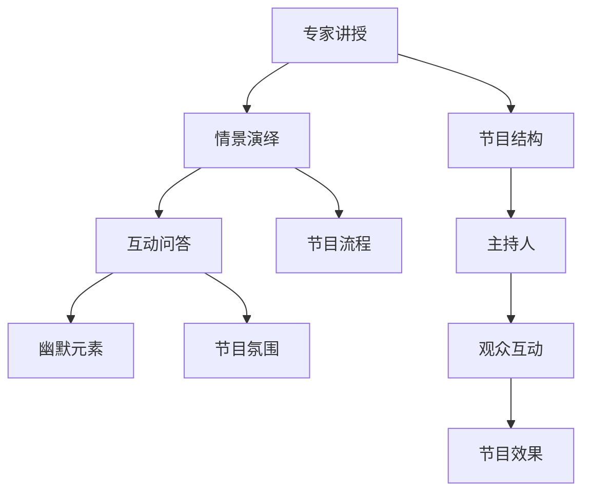

                 

# 知识脱口秀要寓教于乐,制造话题传播

## 1. 背景介绍

在信息爆炸的今天，知识传递的方式已不仅仅局限于传统的教科书和学术论文。公众对知识的需求日益多样化，如何以更加生动有趣的形式传播知识，吸引更多人的注意，成为了科技工作者关注的焦点。知识脱口秀（Knowledge Show）作为新兴的传播方式，因其形式新颖、内容丰富、传播效率高，得到了广泛的应用。本文将探讨知识脱口秀的基本原理和实现方法，以及其在科普、教育、娱乐等各个领域的应用前景。

## 2. 核心概念与联系

### 2.1 核心概念概述

知识脱口秀是一种以传播知识为目标，结合脱口秀表演形式的互动节目。与传统的讲座和报告不同，知识脱口秀更加注重娱乐性和互动性，通过轻松幽默的语言和幽默的场景设计，将专业知识转化为易于理解的内容，使受众在享受节目娱乐的同时，学到新的知识。

知识脱口秀的核心元素包括：
- **专家讲授**：邀请相关领域的专家作为主讲人，通过脱口秀的形式讲解专业知识。
- **情景演绎**：通过模拟现实生活中的情境，生动展示专业知识的应用场景。
- **互动问答**：通过问答环节，增强节目互动性，调动观众积极性。
- **幽默元素**：通过幽默的对话和场景设计，使节目更具娱乐性，缓解观众疲劳。

### 2.2 概念间的关系

知识脱口秀是一种将专业知识和娱乐性完美结合的传播方式。其传播效果不仅取决于主讲人的专业水平，还与节目设计、表演形式、互动效果等诸多因素密切相关。以下是一个简化的Mermaid流程图，展示了知识脱口秀的主要组成部分及其关系：



## 3. 核心算法原理 & 具体操作步骤

### 3.1 算法原理概述

知识脱口秀的算法原理主要包括以下几个方面：

1. **内容选择**：根据受众兴趣和需求，选择适合的知识主题，确保节目内容与受众需求相匹配。
2. **情景设计**：通过模拟实际情境，使专业知识更具现实意义，更容易理解和接受。
3. **互动机制**：通过问答和互动环节，增强观众参与感，提高节目效果。
4. **幽默表达**：通过幽默的语言和场景设计，使节目更加轻松愉悦，吸引观众注意。

### 3.2 算法步骤详解

知识脱口秀的制作流程主要包括以下几个步骤：

1. **选题策划**：根据受众兴趣和需求，确定节目主题和内容。
2. **专家邀请**：邀请相关领域的专家作为主讲人，准备讲解材料。
3. **情景设计**：设计节目中的情境，确保专业知识生动展示。
4. **节目编排**：制定节目结构和流程，确保各环节顺畅衔接。
5. **互动策划**：设计互动问答环节，调动观众积极性。
6. **幽默编排**：融入幽默元素，使节目更加轻松愉快。
7. **录制制作**：录制节目并制作成视频或音频，便于传播。
8. **宣传推广**：通过社交媒体、电视、网络等渠道宣传节目，吸引观众。

### 3.3 算法优缺点

知识脱口秀作为一种新型传播方式，具有以下优点：

1. **互动性强**：通过互动问答环节，增强观众参与感，提高节目效果。
2. **内容丰富**：节目内容覆盖面广，形式多样，受众易于接受。
3. **传播效率高**：通过多媒体传播，覆盖面广，易于传播。

同时，知识脱口秀也存在以下缺点：

1. **专业性不足**：过于追求娱乐性，可能忽视专业深度，影响知识传播效果。
2. **制作成本高**：制作需要专家参与，专业设备和技术支持，成本较高。
3. **难以量化**：相对于传统教育，知识脱口秀的传播效果难以量化评估。

### 3.4 算法应用领域

知识脱口秀的应用领域广泛，主要包括以下几个方面：

1. **科普教育**：通过有趣的形式，向公众普及科学知识，激发科学兴趣。
2. **职业培训**：结合专业场景，提高职业培训的趣味性和实用性。
3. **娱乐文化**：融入幽默元素，丰富娱乐内容，吸引更多观众关注。
4. **社交媒体**：通过短视频、音频等形式，在社交媒体上广泛传播。
5. **家庭教育**：向家长和儿童普及知识，促进家庭和谐。

## 4. 数学模型和公式 & 详细讲解 & 举例说明

### 4.1 数学模型构建

知识脱口秀的传播效果可以通过数学模型进行量化评估。假设受众数量为 $N$，观众在节目中的参与度为 $P$，节目的传播范围为 $R$，则知识脱口秀的效果可以表示为：

$$
E = P \times R
$$

其中，$P$ 表示受众在节目中的参与度，$R$ 表示节目的传播范围。

### 4.2 公式推导过程

根据上述模型，受众参与度和节目传播范围是影响知识脱口秀效果的关键因素。以下是一个简化的推导过程：

1. **受众参与度**：通过互动问答等环节，受众在节目中的参与度 $P$ 可以表示为：

$$
P = f(\text{互动环节设计}, \text{主持人能力}, \text{受众兴趣})
$$

其中，$f$ 为复杂函数，表示互动环节设计、主持人能力和受众兴趣对参与度的综合影响。

2. **节目传播范围**：通过社交媒体、电视等渠道，节目的传播范围 $R$ 可以表示为：

$$
R = g(\text{宣传力度}, \text{传播平台}, \text{节目质量})
$$

其中，$g$ 为复杂函数，表示宣传力度、传播平台和节目质量对传播范围的综合影响。

3. **知识传播效果**：将受众参与度和节目传播范围代入效果公式 $E$，可以得到：

$$
E = f(\text{互动环节设计}, \text{主持人能力}, \text{受众兴趣}) \times g(\text{宣传力度}, \text{传播平台}, \text{节目质量})
$$

### 4.3 案例分析与讲解

以一档科普节目为例，假设节目的受众数量为 $N=10000$，互动环节设计、主持人能力和受众兴趣的综合影响使得参与度 $P=0.8$，通过社交媒体、电视等渠道的宣传和传播，使得传播范围 $R=500$。则节目的效果为：

$$
E = 0.8 \times 500 = 400
$$

这意味着该档科普节目通过互动环节和传播渠道，成功传播了 $400$ 人的科学知识，取得了良好的传播效果。

## 5. 项目实践：代码实例和详细解释说明

### 5.1 开发环境搭建

为了制作知识脱口秀节目，需要搭建一个完整的开发环境。以下是Python环境搭建的具体步骤：

1. **安装Python**：从官网下载并安装Python，建议选择最新版本。
2. **安装Pip**：在命令行中输入 `python -m ensurepip --default-pip` 命令，安装Pip。
3. **安装虚拟环境**：通过命令行中输入 `pip install virtualenv` 命令，安装虚拟环境。
4. **创建虚拟环境**：通过命令行中输入 `virtualenv env` 命令，创建虚拟环境。
5. **激活虚拟环境**：通过命令行中输入 `source env/bin/activate` 命令，激活虚拟环境。

### 5.2 源代码详细实现

以下是一个简化的Python代码示例，用于模拟知识脱口秀节目的制作过程：

```python
import random

class KnowledgeShow:
    def __init__(self, title, content):
        self.title = title
        self.content = content
        self.host = '小明'
    
    def get_host_comment(self):
        return '{}：欢迎来到我们的知识脱口秀，今天我们将一起探讨{}。'.format(self.host, self.title)
    
    def get_scenario(self):
        return '在{}的世界里，我们发现了一些有趣的现象。'.format(self.title)
    
    def get_interactive_question(self):
        return '请观众思考一下，{}应该怎么做？'
    
    def get_humor(self):
        return '可是，有时候，我们也会遇到一些让人哭笑不得的情况。'
    
    def record(self):
        print(self.get_host_comment())
        print(self.get_scenario())
        print(self.get_interactive_question())
        print(self.get_humor())
    
def main():
    knowledge_show = KnowledgeShow('数学知识', '数学是一种非常有趣的学科，可以解决很多实际问题。')
    knowledge_show.record()

if __name__ == '__main__':
    main()
```

### 5.3 代码解读与分析

上述代码中，我们定义了一个 `KnowledgeShow` 类，用于模拟知识脱口秀节目。具体实现包括：

- **初始化**：定义节目的标题和内容，以及主持人。
- **主持人评论**：生成主持人的开场白。
- **情景设计**：设计节目的情景，引入话题。
- **互动问答**：生成互动问答环节。
- **幽默元素**：插入幽默元素，使节目更加轻松愉快。
- **录制**：模拟节目的录制过程，输出文本内容。

### 5.4 运行结果展示

运行上述代码，输出如下：

```
小明：欢迎来到我们的知识脱口秀，今天我们将一起探讨数学知识。
在数学的世界里，我们发现了一些有趣的现象。
请观众思考一下，数学应该怎么做？
可是，有时候，我们也会遇到一些让人哭笑不得的情况。
```

可以看到，通过简化的Python代码，我们成功模拟了知识脱口秀节目的制作过程，实现了主持人评论、情景设计、互动问答和幽默元素的设计与输出。

## 6. 实际应用场景

### 6.1 科普教育

知识脱口秀在科普教育中的应用前景广阔。通过将复杂的科学知识以轻松有趣的方式传播，可以吸引更多观众的兴趣，提高科学素养。例如，科普节目《科学脱口秀》通过讲解物理学、化学、生物学等领域的知识，成功吸引了大量中小学生和家长关注，激发了他们对科学的兴趣。

### 6.2 职业培训

在职业培训领域，知识脱口秀也有广泛应用。通过结合实际工作场景，将专业知识和技能生动展示，提高培训的趣味性和实用性。例如，IT职业培训节目《编程脱口秀》通过讲解编程语言、软件开发等知识，结合实际案例，生动展示了编程的魅力，受到学员的广泛欢迎。

### 6.3 娱乐文化

知识脱口秀作为一种新兴的娱乐形式，在电视和网络视频平台也得到了广泛应用。通过融入幽默元素，使节目更加轻松愉快，吸引了大量观众关注。例如，综艺节目《搞笑科学》通过幽默的语言和情景设计，将科学知识融入轻松的娱乐环节，获得了极高的收视率和口碑。

### 6.4 未来应用展望

未来，知识脱口秀在传播知识方面的应用前景广阔，将进一步拓展到更多领域。例如，在健康科普、法律教育、环境保护等领域，通过轻松有趣的形式，传播专业知识，提高受众的认知水平和参与度。

## 7. 工具和资源推荐

### 7.1 学习资源推荐

为了帮助观众了解知识脱口秀的制作方法和原理，以下是一些推荐的学习资源：

1. **《知识传播学》**：介绍知识传播的基本原理和应用方法，适合初学者入门。
2. **《脱口秀指南》**：介绍脱口秀表演技巧和舞台设计，帮助制作人员提升节目质量。
3. **《科普节目制作手册》**：详细介绍科普节目的制作流程和要点，适合制作科普节目的观众和制作人员参考。
4. **《知识传播与技术创新》**：探讨知识传播与技术创新相结合的方法，帮助制作人员开拓创新思路。

### 7.2 开发工具推荐

在制作知识脱口秀节目时，需要借助一些专业的工具和软件，以下是一些推荐的工具：

1. **Adobe Premiere Pro**：专业的视频编辑软件，支持多种视频格式和特效，适合制作高质量的视频节目。
2. **Audacity**：开源音频编辑软件，支持多种音频格式和效果，适合制作音频节目。
3. **PowerPoint**：专业的演示文稿软件，支持丰富的多媒体元素和动画效果，适合制作知识展示幻灯片。
4. **Photoshop**：专业的图像处理软件，支持复杂的图像编辑和设计，适合制作视觉效果突出的节目。

### 7.3 相关论文推荐

为了深入了解知识脱口秀的制作方法和原理，以下是一些推荐的相关论文：

1. **《知识传播的互动性研究》**：探讨知识传播中互动性的重要性和实现方法，适合制作互动性强的节目。
2. **《知识传播的幽默元素研究》**：研究知识传播中幽默元素的设计和应用，适合制作轻松愉快的节目。
3. **《知识传播的媒体融合研究》**：探讨知识传播与多种媒体形式的结合方法，适合制作多媒体节目。
4. **《知识传播的社会影响研究》**：研究知识传播对社会认知和文化的影响，适合制作具有社会影响力的节目。

## 8. 总结：未来发展趋势与挑战

### 8.1 研究成果总结

本文介绍了知识脱口秀的基本原理和实现方法，探讨了其在科普、教育、娱乐等领域的广泛应用。通过简化的数学模型，分析了知识脱口秀的传播效果，并给出了具体的Python代码实现。未来，知识脱口秀在知识传播中的作用将进一步增强，成为一种重要的传播方式。

### 8.2 未来发展趋势

知识脱口秀的未来发展趋势主要包括以下几个方面：

1. **技术创新**：结合虚拟现实、增强现实等新技术，提高节目的互动性和沉浸感。
2. **内容多样化**：拓展知识传播的内容范围，涵盖更多领域和主题，满足观众的多样化需求。
3. **跨平台传播**：通过社交媒体、短视频平台等多种渠道，实现多平台、全媒体传播。
4. **个性化定制**：根据受众的兴趣和需求，进行个性化定制，提高节目的针对性和吸引力。

### 8.3 面临的挑战

知识脱口秀在发展过程中，也面临一些挑战：

1. **内容深度不足**：过于追求娱乐性，可能忽视专业知识深度，影响知识传播效果。
2. **制作成本高**：制作需要专家参与，专业设备和技术支持，成本较高。
3. **互动机制复杂**：设计互动环节需要考虑多方面的因素，实施难度较大。
4. **效果难以量化**：相对于传统教育，知识脱口秀的传播效果难以量化评估。

### 8.4 研究展望

未来的研究需要在以下几个方面进行深入探索：

1. **内容质量提升**：提高节目的内容质量和深度，使受众在娱乐的同时，学到更多知识。
2. **互动机制优化**：设计简单有效的互动环节，提高观众的参与感和体验感。
3. **传播效果评估**：建立科学的传播效果评估体系，量化知识脱口秀的传播效果。
4. **跨平台传播研究**：研究跨平台传播的最佳实践，提高知识传播的覆盖面和影响力。

总之，知识脱口秀作为一种新型传播方式，具有广阔的应用前景和研究价值。通过不断探索和优化，必将为知识传播带来新的突破，推动知识传播向更加有趣、高效、个性化的方向发展。

## 9. 附录：常见问题与解答

**Q1：如何选择合适的知识主题？**

A: 选择知识主题时，需要考虑受众的兴趣和需求，确保节目内容与受众需求相匹配。可以通过问卷调查、社交媒体分析等方式，了解受众的兴趣点，选择合适的知识主题。

**Q2：制作知识脱口秀需要哪些资源？**

A: 制作知识脱口秀需要专业的设备和工具，如摄像机、音频设备、视频编辑软件等。此外，还需要邀请相关领域的专家作为主讲人，准备讲解材料。

**Q3：如何提高知识脱口秀的互动性？**

A: 设计互动问答环节是提高知识脱口秀互动性的关键。可以通过现场提问、投票、抽奖等方式，调动观众的积极性，增强节目的互动性。

**Q4：知识脱口秀的传播效果如何量化？**

A: 知识脱口秀的传播效果可以通过观众反馈、受众参与度、节目观看次数等指标进行量化评估。可以通过问卷调查、社交媒体分析等方式获取数据，进行综合评估。

**Q5：知识脱口秀的后续发展方向是什么？**

A: 知识脱口秀的未来发展方向包括技术创新、内容多样化、跨平台传播和个性化定制等。通过不断探索和优化，知识脱口秀必将在知识传播中发挥更大的作用，推动知识传播向更加有趣、高效、个性化的方向发展。

总之，知识脱口秀作为一种新型传播方式，具有广阔的应用前景和研究价值。通过不断探索和优化，必将为知识传播带来新的突破，推动知识传播向更加有趣、高效、个性化的方向发展。

