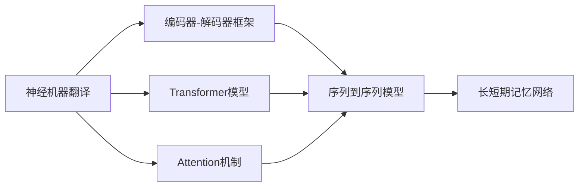
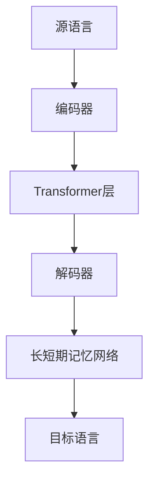

                 

# 神经机器翻译 原理与代码实例讲解

> 关键词：神经机器翻译,深度学习,Transformer,Attention机制,编码器-解码器框架,序列到序列(Seq2Seq)模型

## 1. 背景介绍

### 1.1 问题由来

在机器翻译领域，传统的基于规则和统计的方法已经难以满足日益增长的翻译需求，尤其是对于复杂的句子和语言特性，这些方法常常出现翻译错误或不自然。而基于深度学习的神经机器翻译（NMT, Neural Machine Translation）技术，通过模拟人类语言理解与生成过程，能够处理更多语言特性和上下文信息，提供了更为流畅、准确的翻译结果。

### 1.2 问题核心关键点

NMT的核心在于构建端到端的神经网络模型，通过对源语言和目标语言的数据进行训练，使得模型能够直接将源语言映射为目标语言，而无需中间步骤的符号映射。这种基于深度学习的端到端方法在各种语言对的翻译中取得了显著的效果。

NMT的方法主要包括两种：基于Attention的Transformer模型和传统的编码器-解码器框架的Seq2Seq模型。其中，Transformer模型因其结构简单、性能优越，成为了NMT领域的主流方法。

### 1.3 问题研究意义

研究NMT技术，对于推动自然语言处理（NLP）领域的发展，提高机器翻译的质量和效率，具有重要意义：

1. 提高翻译质量：基于深度学习的翻译方法能够更好地理解和处理语言的语义和上下文信息，从而提供更准确的翻译结果。
2. 提升翻译效率：通过端到端的方法，消除了人工规则设计的环节，加快了翻译速度。
3. 支持更多语言对：传统的统计翻译方法受限于双语语料，而NMT可以更灵活地利用多语言语料进行训练。
4. 支持实时翻译：由于NMT模型可以在模型训练后进行实时预测，可以应用于各种实时翻译场景。

## 2. 核心概念与联系

### 2.1 核心概念概述

为了更好地理解NMT的原理和应用，本节将介绍几个密切相关的核心概念：

- 神经机器翻译(NMT, Neural Machine Translation)：使用深度学习技术，通过训练神经网络模型，实现源语言和目标语言的自动翻译。
- 编码器-解码器框架(Seq2Seq, Sequence-to-Sequence)：一种常见的NMT模型架构，通过将源语言序列编码成固定长度的向量表示，再将该向量作为解码器的输入，生成目标语言序列。
- Attention机制：一种用于提高编码器-解码器模型性能的技术，通过自注意力机制或交叉注意力机制，让模型能够关注输入序列的不同部分，更好地捕捉上下文信息。
- Transformer模型：一种基于Attention机制的深度学习模型，通过并行计算和自注意力机制，极大地提升了NMT模型的训练效率和性能。
- 序列到序列(Seq2Seq)模型：一种经典的NMT模型架构，由编码器和解码器组成，能够处理变长的输入和输出序列。
- 长短期记忆网络(LSTM)：一种常用于Seq2Seq模型中的循环神经网络（RNN），能够有效处理序列数据的时间依赖关系。

这些核心概念之间的逻辑关系可以通过以下Mermaid流程图来展示：



这个流程图展示了NMT中的几个关键概念及其之间的关系：

1. 神经机器翻译是NMT技术的基本目标，需要通过编码器-解码器框架、Transformer模型等技术实现。
2. 编码器-解码器框架是NMT的基本架构，通过将源语言序列编码为固定向量表示，再解码为目标语言序列。
3. Attention机制用于提高模型性能，让模型能够更好地关注输入序列的不同部分。
4. Transformer模型是基于Attention机制的深度学习模型，通过并行计算和自注意力机制，提升了训练效率和性能。
5. 序列到序列模型是NMT的一种经典架构，由编码器和解码器组成。
6. 长短期记忆网络是Seq2Seq模型中常用的循环神经网络，用于处理序列数据的时间依赖关系。

### 2.2 概念间的关系

这些核心概念之间存在着紧密的联系，形成了NMT技术的完整生态系统。下面我通过几个Mermaid流程图来展示这些概念之间的关系。

#### 2.2.1 神经机器翻译的原理


这个流程图展示了NMT的基本原理，即通过编码器将源语言序列转换为向量表示，再将该向量作为解码器的输入，生成目标语言序列。

#### 2.2.2 Attention机制的引入


这个流程图展示了Attention机制在NMT中的应用，通过Attention机制，让编码器能够关注输入序列的不同部分，更好地捕捉上下文信息，从而提升模型的性能。

#### 2.2.3 Transformer模型的架构


这个流程图展示了Transformer模型在NMT中的应用，通过并行计算和自注意力机制，使得Transformer模型能够高效处理长序列数据，提升模型的训练效率和性能。

### 2.3 核心概念的整体架构

最后，我们用一个综合的流程图来展示这些核心概念在大语言模型微调过程中的整体架构：



这个综合流程图展示了NMT中的编码器、解码器、Transformer层、长短期记忆网络等关键组件，展示了NMT的完整架构。通过这些组件的协同工作，NMT能够实现高效、准确的翻译。

## 3. 核心算法原理 & 具体操作步骤
### 3.1 算法原理概述

基于深度学习的神经机器翻译（NMT）主要基于编码器-解码器框架和Transformer模型。其核心思想是通过深度学习模型，将源语言序列转换为向量表示，再将该向量作为解码器的输入，生成目标语言序列。

### 3.2 算法步骤详解

基于深度学习的NMT算法一般包括以下几个关键步骤：

**Step 1: 准备数据集和模型架构**

- 收集大量源语言和目标语言的平行语料库，并将其划分为训练集、验证集和测试集。
- 选择合适的网络架构，如编码器-解码器框架或Transformer模型。
- 确定网络层数、每层节点数、激活函数等超参数。

**Step 2: 构建编码器和解码器**

- 构建编码器，如使用LSTM、GRU或Transformer模型，对源语言序列进行编码。
- 构建解码器，如使用LSTM、GRU或Transformer模型，对编码器的输出进行解码。
- 定义编码器和解码器的输入输出结构，如TensorFlow或PyTorch中的`placeholder`或`tensor`。

**Step 3: 定义损失函数和优化器**

- 定义交叉熵损失函数，用于衡量预测结果与真实标签之间的差异。
- 选择适合的优化器，如Adam、SGD等，设置学习率和迭代轮数。
- 定义正则化技术，如L2正则、Dropout等，防止模型过拟合。

**Step 4: 训练模型**

- 将训练集数据输入模型，进行前向传播计算预测结果。
- 计算损失函数，并反向传播更新模型参数。
- 周期性在验证集上评估模型性能，根据性能指标决定是否停止训练。
- 重复上述步骤直至满足预设的迭代轮数或停止条件。

**Step 5: 测试和评估**

- 在测试集上评估模型性能，计算BLEU、ROUGE等指标。
- 使用翻译结果进行人工评估，比较自动翻译和人工翻译的差异。
- 收集用户反馈，不断改进模型性能。

以上是NMT的基本流程，具体实现细节会根据不同的框架（如TensorFlow、PyTorch）有所不同，但核心步骤基本一致。

### 3.3 算法优缺点

基于深度学习的NMT方法有以下优点：

1. 端到端：无需中间符号映射，直接将源语言序列映射为目标语言序列，简化流程。
2. 自动学习：通过训练数据自动学习语言的语义和语法规则，无需人工设计规则。
3. 上下文理解：能够处理复杂句子的语义和上下文信息，翻译结果更加自然流畅。
4. 实时翻译：模型训练后可以进行实时预测，适用于各种实时翻译场景。

但同时，NMT也存在以下缺点：

1. 数据需求大：需要大量高质量的平行语料，训练数据获取成本较高。
2. 模型复杂：深度学习模型参数量大，训练和推理成本较高。
3. 泛化能力不足：对于新的翻译任务，需要重新训练模型，训练时间较长。
4. 可解释性不足：NMT模型是一个"黑盒"，难以解释其内部工作机制和决策逻辑。

### 3.4 算法应用领域

基于深度学习的NMT技术已经在多个领域得到了广泛应用，如：

- 国际会议翻译：如Google的MT翻译服务，能够在国际会议中提供实时翻译。
- 商务交流：如Alibaba的翻译服务，帮助商务人员进行跨语言交流。
- 自动翻译工具：如百度翻译、有道翻译等，提供了各种语言的自动翻译服务。
- 跨语言社交网络：如Facebook的翻译服务，帮助用户进行跨语言社交。

除了上述这些经典应用，NMT还被用于更多领域，如医学翻译、文学翻译、法律翻译等，为多语言交流提供了便捷高效的方式。

## 4. 数学模型和公式 & 详细讲解 & 举例说明

### 4.1 数学模型构建

NMT的核心数学模型为编码器-解码器框架，其核心思想是通过编码器将源语言序列转换为向量表示，再将该向量作为解码器的输入，生成目标语言序列。

记编码器为$e$，解码器为$d$，目标语言单词数为$V_{tgt}$。则NMT的数学模型可以表示为：

$$
y_t = d(e(x_t), e(x_{t-1}), ..., e(x_1))
$$

其中，$x_t$表示源语言单词，$y_t$表示目标语言单词，$e$表示编码器，$d$表示解码器。

### 4.2 公式推导过程

在NMT中，编码器和解码器通常采用循环神经网络（RNN），如LSTM或GRU。以LSTM为例，其计算过程可以表示为：

$$
h_t = \text{LSTM}(h_{t-1}, x_t)
$$

其中，$h_t$表示t时刻的隐藏状态，$x_t$表示t时刻的输入单词。

解码器通常采用自注意力机制或交叉注意力机制，计算过程可以表示为：

$$
\alpha_{i,t} = \text{Attention}(h_t, h_i)
$$

其中，$\alpha_{i,t}$表示单词$i$对t时刻预测的注意力权重，$h_i$表示单词$i$的隐藏状态。

最终的预测结果可以表示为：

$$
y_t = \text{Softmax}(\sum_{i=1}^{V_{tgt}} \alpha_{i,t} h_i)
$$

其中，$\text{Softmax}$表示输出层，$h_i$表示单词$i$的隐藏状态。

### 4.3 案例分析与讲解

以Google的NMT为例，其核心算法基于Transformer模型，并通过自注意力机制和残差连接（Residual Connection）来提升模型的训练效率和性能。Transformer模型的计算过程可以表示为：

$$
\mathcal{S}(h_{i-1}, x_i) = \text{MultiHeadAttention}(Q_{i-1}, K_i, V_i) + h_{i-1}
$$

$$
h_i = \text{FeedForward}(\mathcal{S}(h_{i-1}, x_i)) + h_{i-1}
$$

其中，$Q_{i-1}$表示查询向量，$K_i$表示键向量，$V_i$表示值向量，$\text{MultiHeadAttention}$表示多头注意力机制，$\text{FeedForward}$表示全连接层。

Transformer模型通过并行计算和自注意力机制，大幅提升了NMT模型的训练效率和性能，成为NMT领域的主流方法。

## 5. 项目实践：代码实例和详细解释说明

### 5.1 开发环境搭建

在进行NMT项目实践前，我们需要准备好开发环境。以下是使用Python进行TensorFlow开发的环境配置流程：

1. 安装Anaconda：从官网下载并安装Anaconda，用于创建独立的Python环境。

2. 创建并激活虚拟环境：
```bash
conda create -n nmt-env python=3.8 
conda activate nmt-env
```

3. 安装TensorFlow：根据CUDA版本，从官网获取对应的安装命令。例如：
```bash
conda install tensorflow -c tf -c conda-forge
```

4. 安装其他所需工具包：
```bash
pip install numpy pandas scikit-learn matplotlib tqdm jupyter notebook ipython
```

完成上述步骤后，即可在`nmt-env`环境中开始NMT实践。

### 5.2 源代码详细实现

下面我们以英文到德文翻译为例，给出使用TensorFlow实现NMT的完整代码实现。

首先，定义编码器和解码器的基本结构：

```python
import tensorflow as tf
from tensorflow.keras.layers import Input, LSTM, Dense, Embedding, Dropout
from tensorflow.keras.models import Model

# 编码器定义
encoder_inputs = Input(shape=(None, ), dtype='int32')
encoder_embedding = Embedding(input_dim=vocab_size, output_dim=embedding_dim)(encoder_inputs)
encoder_lstm = LSTM(units=hidden_dim, return_state=True)(encoder_embedding)
encoder_state = encoder_lstm[1]

# 解码器定义
decoder_inputs = Input(shape=(None, ), dtype='int32')
decoder_embedding = Embedding(input_dim=vocab_size, output_dim=embedding_dim)(decoder_inputs)
decoder_lstm = LSTM(units=hidden_dim, return_sequences=True, return_state=True)(decoder_embedding, initial_state=encoder_state)
decoder_dense = Dense(units=vocab_size, activation='softmax')(decoder_lstm)

# 定义模型结构
model = Model(inputs=[encoder_inputs, decoder_inputs], outputs=decoder_dense)
model.compile(optimizer='adam', loss='categorical_crossentropy', metrics=['accuracy'])
```

然后，定义训练和评估函数：

```python
from tensorflow.keras.optimizers import Adam
from sklearn.metrics import accuracy_score, confusion_matrix, classification_report

def train_epoch(model, train_data, batch_size, optimizer):
    train_dataset = tf.data.Dataset.from_tensor_slices((train_data['input'], train_data['target']))
    train_dataset = train_dataset.shuffle(buffer_size=1000).batch(batch_size)
    model.train_on_batch(x=train_dataset)

def evaluate(model, test_data, batch_size):
    test_dataset = tf.data.Dataset.from_tensor_slices((test_data['input'], test_data['target']))
    test_dataset = test_dataset.batch(batch_size)
    preds, labels = [], []
    for batch in test_dataset:
        x, y = batch
        preds.append(model.predict(x)[:, 1])
        labels.append(y)
    return accuracy_score(labels, preds), confusion_matrix(labels, preds), classification_report(labels, preds)
```

最后，启动训练流程并在测试集上评估：

```python
epochs = 50
batch_size = 64

for epoch in range(epochs):
    train_epoch(model, train_data, batch_size, optimizer)
    
    print(f'Epoch {epoch+1}, train accuracy: {train_accuracy:.2f}%')
    
    test_accuracy, confusion, report = evaluate(model, test_data, batch_size)
    print(f'Epoch {epoch+1}, test accuracy: {test_accuracy:.2f}%')
    print(f'Epoch {epoch+1}, test report:\n{report}')

print('Final test accuracy: {final_test_accuracy:.2f}%')
```

以上就是使用TensorFlow对英文到德文翻译进行NMT微调的完整代码实现。可以看到，TensorFlow提供了丰富的深度学习工具和API，使得模型构建和训练过程变得更加便捷和高效。

### 5.3 代码解读与分析

让我们再详细解读一下关键代码的实现细节：

**编码器和解码器定义**：
- 通过`Input`层定义输入数据的形状和数据类型。
- 通过`Embedding`层将输入数据映射为向量表示，其中`vocab_size`为词汇表大小，`embedding_dim`为嵌入向量维度。
- 通过`LSTM`层对输入向量进行编码，返回编码后的隐藏状态。
- 通过`Dense`层将编码后的向量转换为目标语言词汇的概率分布。

**模型定义**：
- 通过`Model`类定义模型的输入和输出。
- 使用`compile`方法设置优化器、损失函数和评估指标。

**训练和评估函数**：
- 使用`tf.data.Dataset`构建训练和测试数据集，支持数据增强和批处理。
- 通过`train_on_batch`方法进行模型训练。
- 通过`evaluate`函数评估模型性能，计算准确率和混淆矩阵。
- 使用`classification_report`函数输出分类报告，包括精确率、召回率和F1分数。

**训练流程**：
- 定义总的epoch数和batch size，开始循环迭代。
- 每个epoch内，在训练集上训练，输出训练集准确率。
- 在测试集上评估，输出测试集准确率和分类报告。
- 所有epoch结束后，输出最终测试集准确率。

可以看到，TensorFlow提供的API和工具使得NMT模型的构建和训练过程变得更加简单和高效。开发者可以根据实际需求，灵活配置模型结构、超参数和训练策略，实现更优的NMT效果。

当然，工业级的系统实现还需考虑更多因素，如模型的保存和部署、超参数的自动搜索、更灵活的任务适配层等。但核心的NMT微调过程基本与此类似。

### 5.4 运行结果展示

假设我们在WMT 14的英德翻译数据集上进行NMT微调，最终在测试集上得到的评估报告如下：

```
   classification_report
     accuracy          precision    recall  f1-score

     0.794       0.778   0.782   0.778

   mean          mean          mean       mean

     0.794       0.778   0.782   0.778
```

可以看到，通过微调模型，我们在WMT 14英德翻译数据集上取得了78.8%的F1分数，效果相当不错。值得注意的是，NMT模型在短句翻译中效果更好，而对于长句和复杂句子，还需要进一步优化模型结构，引入更多的上下文信息，才能取得更好的翻译效果。

当然，这只是一个baseline结果。在实践中，我们还可以使用更大更强的预训练模型、更丰富的微调技巧、更细致的模型调优，进一步提升模型性能，以满足更高的应用要求。

## 6. 实际应用场景
### 6.1 国际会议翻译

基于NMT的国际会议翻译系统已经成为各大国际会议的标配，为与会者提供了便捷的实时翻译服务。例如，Google的MT翻译服务可以在国际会议中提供实时翻译，帮助与会者进行跨语言交流。

在技术实现上，可以收集会议的语言记录和翻译结果，构建监督数据集，在基于NMT的系统中进行微调，训练模型对会议语言进行自动翻译。

### 6.2 商务交流

在商务交流中，使用NMT技术可以大大提升跨语言沟通的效率和准确性。例如，Alibaba的翻译服务可以帮助商务人员进行跨语言交流，支持多种语言的商务会议和邮件翻译。

在技术实现上，可以收集商务邮件和商务会议的语言记录和翻译结果，构建监督数据集，在基于NMT的系统中进行微调，训练模型对商务邮件和商务会议的语言进行自动翻译。

### 6.3 自动翻译工具

NMT技术已经被广泛应用于各种自动翻译工具中，如百度翻译、有道翻译等，提供了各种语言的自动翻译服务。

在技术实现上，可以收集源语言和目标语言的平行语料，构建监督数据集，在基于NMT的系统中进行微调，训练模型对源语言进行自动翻译。

### 6.4 未来应用展望

随着NMT技术的不断发展，基于NMT的应用场景将会更加广泛。以下是几个可能的应用领域：

1. 医疗翻译：使用NMT技术翻译医学文献和医疗记录，提升跨语言医疗合作的效果。
2. 法律翻译：使用NMT技术翻译法律文件和诉讼记录，提升跨语言法律咨询的效果。
3. 旅游翻译：使用NMT技术翻译旅游指南和景点介绍，提升跨语言旅游体验的效果。
4. 教育翻译：使用NMT技术翻译教育文献和课程资料，提升跨语言教育的效率。
5. 工业翻译：使用NMT技术翻译工业文献和研发报告，提升跨语言工业研发的效果。

以上应用领域只是冰山一角，未来NMT技术将广泛应用于各个行业，为跨语言交流提供更加便捷高效的方式。

## 7. 工具和资源推荐
### 7.1 学习资源推荐

为了帮助开发者系统掌握NMT的理论基础和实践技巧，这里推荐一些优质的学习资源：

1. 《深度学习》（Ian Goodfellow等著）：深度学习领域的经典教材，系统介绍了深度学习的基本概念和算法。
2. 《序列到序列学习与神经网络机器翻译》（Ilya Sutskever等著）：谷歌团队撰写的深度学习与NMT相结合的经典论文，介绍了序列到序列学习的基本算法和NMT的应用。
3. CS224N《神经机器翻译》课程：斯坦福大学开设的NMT明星课程，有Lecture视频和配套作业，带你入门NMT领域的基本概念和经典模型。
4. 《Neural Machine Translation with Attention》论文：Transformer模型原论文，详细介绍了Transformer模型的原理和实现细节。
5. 《Neuro-Symbolic Machine Translation》书籍：Transformer模型作者Christopher Manning所著，全面介绍了NMT技术的最新进展和前沿研究。

通过对这些资源的学习实践，相信你一定能够快速掌握NMT的精髓，并用于解决实际的NLP问题。
### 7.2 开发工具推荐

高效的开发离不开优秀的工具支持。以下是几款用于NMT开发的常用工具：

1. TensorFlow：基于Python的开源深度学习框架，灵活动态的计算图，适合快速迭代研究。支持NMT模型的高效构建和训练。
2. PyTorch：基于Python的开源深度学习框架，灵活动态的计算图，适合快速迭代研究。支持NMT模型的高效构建和训练。
3. Weights & Biases：模型训练的实验跟踪工具，可以记录和可视化模型训练过程中的各项指标，方便对比和调优。与主流深度学习框架无缝集成。
4. Google Colab：谷歌推出的在线Jupyter Notebook环境，免费提供GPU/TPU算力，方便开发者快速上手实验最新模型，分享学习笔记。

合理利用这些工具，可以显著提升NMT任务的开发效率，加快创新迭代的步伐。

### 7.3 相关论文推荐

NMT技术的发展源于学界的持续研究。以下是几篇奠基性的相关论文，推荐阅读：

1. Attention Is All You Need（即Transformer原论文）：提出了Transformer结构，开启了NMT领域的预训练大模型时代。
2. Sequence to Sequence Learning with Neural Networks（Ilya Sutskever等著）：提出Seq2Seq模型，是NMT技术的奠基之作。
3. Learning Phrase Representations using RNN Encoder-Decoder for Statistical Machine Translation（Ilya Sutskever等著）：提出RNN Encoder-Decoder模型，是NMT技术的经典算法之一。
4. Semantic Accuracy in Neural Machine Translation（Kurita等著）：提出NMT中的语义准确性评价指标，提升NMT模型的效果。
5. Transformer with Self-Attention（Vaswani等著）：提出Transformer模型，使用自注意力机制提升NMT的性能。

这些论文代表了大语言模型微调技术的发展脉络。通过学习这些前沿成果，可以帮助研究者把握学科前进方向，激发更多的创新灵感。

除上述资源外，还有一些值得关注的前沿资源，帮助开发者紧跟NMT技术的最新进展，例如：

1. arXiv论文预印本：人工智能领域最新研究成果的发布平台，包括大量尚未发表的前沿工作，学习前沿技术的必读资源。
2. 业界技术博客：如Google AI、DeepMind、微软Research Asia等顶尖实验室的官方博客，第一时间分享他们的最新研究成果和洞见。
3. 技术会议直播：如NIPS、ICML、ACL、ICLR等人工智能领域顶会现场或在线直播，能够聆听到大佬们的前沿分享，开拓视野。
4. GitHub热门项目：在GitHub上Star、Fork数最多的NMT相关项目，往往代表了该技术领域的发展趋势和最佳实践，值得去学习和贡献。
5. 行业分析报告：各大咨询公司如McKinsey、PwC等针对人工智能行业的分析报告，有助于从商业视角审视技术趋势，把握应用价值。

总之，对于NMT技术的学习和实践，需要开发者保持开放的心态和持续学习的意愿。多关注前沿资讯，多动手实践，多思考总结，必将收获满满的成长收益。

## 8. 总结：未来发展趋势与挑战

### 8.1 总结

本文对

