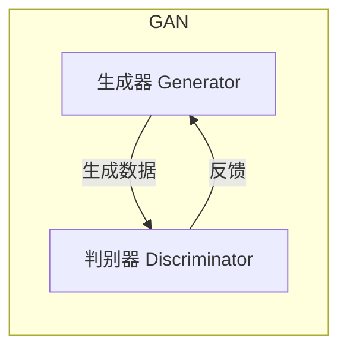
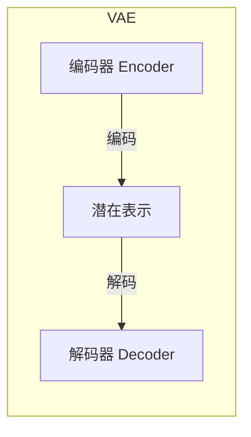
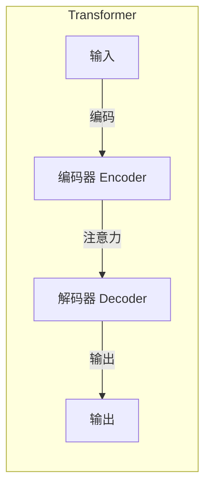
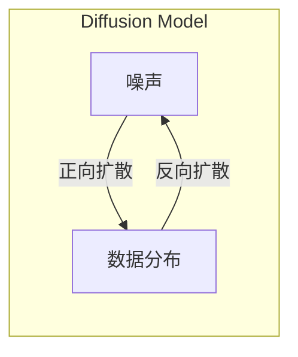

# AIGC从入门到实战：AI辅助设计：基于AI生成图像和PPT的创意设计

## 1. 背景介绍

### 1.1 问题的由来

在当今快节奏的商业环境中，设计师们面临着巨大的压力,需要快速高效地交付创意设计作品。传统的设计流程往往耗时耗力,需要从零开始构思创意,搜索素材,进行多次迭代修改。这不仅降低了设计效率,也容易导致设计师的创意枯竭。

随着人工智能(AI)技术的不断发展,AI生成内容(AIGC)应运而生,为设计领域带来了全新的机遇。AIGC可以辅助设计师快速生成图像、PPT等设计素材,极大提高了设计效率,释放了设计师的创意潜力。

### 1.2 研究现状

目前,AIGC在设计领域的应用主要集中在以下几个方面:

1. **AI生成图像**:基于文本描述,AI可以生成高质量的图像,为设计师提供丰富的视觉素材。
2. **AI生成PPT**:AI可以根据提示自动生成PPT幻灯片,包括布局、图表、图像等元素。
3. **AI辅助设计**:AI可以为设计师提供创意灵感,生成初步设计草案,加快设计迭代过程。

虽然AIGC在设计领域取得了一定进展,但仍存在一些挑战,如生成内容的多样性、质量控制、版权问题等,需要进一步研究和探索。

### 1.3 研究意义

AIGC在设计领域的应用,可以带来以下重要意义:

1. **提高设计效率**:AIGC可以自动完成部分重复性工作,加快设计流程,提高生产力。
2. **激发创意灵感**:AIGC生成的内容可以为设计师提供新颖的视角和灵感。
3. **降低设计门槛**:AIGC使非专业人士也能参与设计,扩大了设计的受众群体。
4. **促进设计民主化**:AIGC有助于打破设计资源的垄断,使设计更加平等和包容。

### 1.4 本文结构

本文将全面介绍AIGC在设计领域的应用,重点探讨AI生成图像和PPT的技术原理、实践案例及未来发展趋势。文章结构如下:

1. 背景介绍
2. 核心概念与联系
3. 核心算法原理与具体操作步骤
4. 数学模型和公式详细讲解与举例说明
5. 项目实践:代码实例和详细解释说明
6. 实际应用场景
7. 工具和资源推荐
8. 总结:未来发展趋势与挑战
9. 附录:常见问题与解答

## 2. 核心概念与联系

在探讨AIGC在设计领域的应用之前,我们需要了解一些核心概念及其内在联系。

### 2.1 生成式对抗网络(GAN)

生成式对抗网络(Generative Adversarial Networks, GAN)是一种深度学习架构,由两个神经网络组成:生成器(Generator)和判别器(Discriminator)。生成器的目标是生成逼真的数据(如图像、音频等),而判别器的目标是区分生成的数据和真实数据。两个网络相互对抗,最终达到生成器生成的数据无法被判别器识别的状态。GAN在图像生成、语音合成等领域有广泛应用。

### 2.2 变分自编码器(VAE)

变分自编码器(Variational Autoencoder, VAE)是一种生成模型,能够学习数据的潜在分布,并从该分布中采样生成新的数据。VAE由编码器(Encoder)和解码器(Decoder)组成。编码器将输入数据编码为潜在表示,解码器则从潜在表示重构原始数据。VAE在图像生成、语音合成等领域也有应用。

### 2.3 transformer

Transformer是一种基于注意力机制的序列到序列模型,最初用于机器翻译任务。它不依赖于循环神经网络(RNN)和卷积神经网络(CNN),而是通过自注意力机制直接捕获序列中任意两个位置之间的依赖关系。Transformer在自然语言处理、计算机视觉等领域有广泛应用。

### 2.4 扩散模型(Diffusion Model)

扩散模型是一种新兴的生成模型,通过学习从噪声到数据的反向过程,实现从低熵噪声分布到高熵数据分布的映射。扩散模型在图像生成、语音合成等领域表现出色,能够生成高质量、多样化的输出。

这些核心概念在AIGC设计应用中扮演着重要角色,相互影响和促进。例如,GAN可用于生成逼真的图像素材,而Transformer则可以根据文本描述生成PPT幻灯片。扩散模型和VAE也为图像生成提供了新的思路和方法。

## 3. 核心算法原理与具体操作步骤

### 3.1 算法原理概述

#### 3.1.1 GAN原理

GAN由生成器(Generator)和判别器(Discriminator)两个神经网络组成,相互对抗训练。生成器的目标是生成逼真的数据(如图像),以欺骗判别器;而判别器的目标是区分生成的数据和真实数据。两个网络通过最小化对应的损失函数进行训练,最终达到生成器生成的数据无法被判别器识别的状态。

$$
\min\limits_G \max\limits_D V(D,G) = \mathbb{E}_{x\sim p_{\text{data}}(x)}[\log D(x)] + \mathbb{E}_{z\sim p_z(z)}[\log(1-D(G(z)))]
$$

其中,$ p_{\text{data}}(x)$是真实数据分布,$ p_z(z)$是噪声先验分布,$ G(z)$是生成器输出,$ D(x)$是判别器对输入$ x$为真实数据的概率估计。

#### 3.1.2 VAE原理

VAE由编码器(Encoder)和解码器(Decoder)组成。编码器将输入数据$ x$编码为潜在表示$ z$,解码器则从潜在表示$ z$重构原始数据$ \hat{x}$。VAE的目标是最大化数据$ x$的边缘对数似然$ \log p(x)$,但由于计算困难,通常使用变分下界$ \mathcal{L}(\theta,\phi;x)$进行优化:

$$
\log p(x) \geq \mathcal{L}(\theta,\phi;x) = \mathbb{E}_{q_\phi(z|x)}[\log p_\theta(x|z)] - D_{\mathrm{KL}}(q_\phi(z|x)||p(z))
$$

其中,$ q_\phi(z|x)$是编码器的近似后验分布,$ p_\theta(x|z)$是解码器的条件概率分布,$ D_{\mathrm{KL}}$是KL散度。

#### 3.1.3 Transformer原理

Transformer主要由编码器(Encoder)和解码器(Decoder)组成,采用自注意力机制捕获序列中任意两个位置之间的依赖关系。自注意力机制的核心是通过查询(Query)、键(Key)和值(Value)之间的加权求和操作,计算出每个位置的注意力权重。

$$
\text{Attention}(Q,K,V) = \text{softmax}(\frac{QK^T}{\sqrt{d_k}})V
$$

其中,$ Q$、$ K$、$ V$分别表示查询、键和值,$ d_k$是缩放因子。Transformer通过多头注意力机制(Multi-Head Attention)和位置编码(Positional Encoding)等技术,实现了强大的序列建模能力。

#### 3.1.4 扩散模型原理

扩散模型通过学习从噪声到数据的反向过程,实现从低熵噪声分布到高熵数据分布的映射。具体地,正向扩散过程将数据$ x_0$逐步添加高斯噪声,得到一系列噪声图像$ x_1,x_2,...,x_T$;反向过程则通过训练一个反向模型$ p_\theta(x_{t-1}|x_t)$,从噪声图像$ x_T$重构原始数据$ x_0$。

$$
q(x_1,\ldots,x_T|x_0) = \prod_{t=1}^T q(x_t|x_{t-1})
$$
$$
p_\theta(x_0|x_1,\ldots,x_T) = p(x_T)\prod_{t=1}^T p_\theta(x_{t-1}|x_t)
$$

通过最小化简单的均方差损失函数,可以训练出高质量的反向模型$ p_\theta(x_{t-1}|x_t)$,从而生成逼真的数据。

### 3.2 算法步骤详解

#### 3.2.1 GAN训练步骤

1. **初始化生成器和判别器**:根据任务和数据,设计合适的神经网络架构作为生成器和判别器。
2. **加载训练数据**:准备真实的训练数据,如图像、音频等。
3. **生成器生成假数据**:从噪声先验分布$ p_z(z)$采样,输入生成器生成假数据$ G(z)$。
4. **判别器判别真假**:将真实数据和生成的假数据输入判别器,判别器输出对应的真实概率$ D(x)$和$ D(G(z))$。
5. **计算损失函数**:根据判别器的输出,计算生成器和判别器的损失函数。
6. **反向传播更新参数**:使用优化算法(如Adam)对生成器和判别器的参数进行更新。
7. **重复训练**:重复执行步骤3-6,直到达到收敛条件或满足训练轮次。

#### 3.2.2 VAE训练步骤

1. **初始化编码器和解码器**:设计合适的神经网络架构作为编码器和解码器。
2. **加载训练数据**:准备训练数据$ x$。
3. **编码器编码为潜在表示**:输入数据$ x$到编码器,获得潜在表示$ z$及其近似后验分布$ q_\phi(z|x)$。
4. **解码器重构数据**:从潜在表示$ z$出发,通过解码器重构数据$ \hat{x}=p_\theta(x|z)$。
5. **计算变分下界损失**:根据重构数据$ \hat{x}$和近似后验$ q_\phi(z|x)$,计算变分下界损失$ \mathcal{L}(\theta,\phi;x)$。
6. **反向传播更新参数**:使用优化算法(如Adam)对编码器和解码器的参数进行更新。
7. **重复训练**:重复执行步骤3-6,直到达到收敛条件或满足训练轮次。

#### 3.2.3 Transformer推理步骤

1. **输入编码**:将输入序列(如文本)编码为嵌入向量序列。
2. **位置编码**:为嵌入向量序列添加位置信息,得到位置编码向量。
3. **编码器编码**:输入位置编码向量到编码器,通过多头自注意力机制捕获序列内部依赖关系,得到编码后的序列表示。
4. **解码器解码**:将编码后的序列表示输入解码器,通过掩码多头自注意力和编码器-解码器注意力机制,生成输出序列(如翻译结果)。
5. **输出序列**:对解码器生成的输出序列进行后处理(如去掉特殊标记等),得到最终输出。

#### 3.2.4 扩散模型采样步骤

1. **初始化噪声**:从高斯噪声分布$ \mathcal{N}(0,1)$采样一个噪声图像$ x_T$。
2. **反向扩散采样