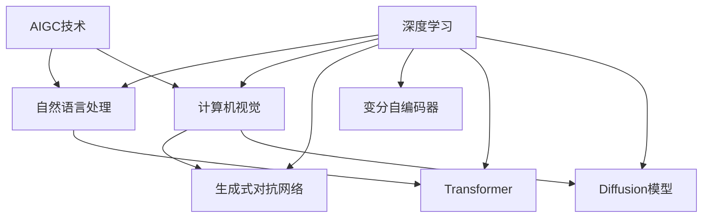

# AIGC从入门到实战：AIGC在金融行业的创新场景—银行零售新范式

## 1. 背景介绍

### 1.1 问题的由来

在当今数字化转型的浪潮中,金融行业正面临着前所未有的挑战与机遇。传统的银行业务模式和运营方式已经无法满足客户日益增长的需求和期望。客户期望获得更加个性化、高效和智能化的金融服务体验。与此同时,人工智能(AI)和大数据分析技术的快速发展,为金融行业带来了全新的发展契机。

在这一背景下,AIGC(AI生成式内容)技术应运而生,它结合了人工智能、自然语言处理、计算机视觉等多种技术,能够根据用户需求自动生成文本、图像、视频、音频等多种形式的内容。AIGC技术在金融行业的应用,有望为银行带来全新的零售服务范式,提升客户体验,优化运营效率,并创造新的收入来源。

### 1.2 研究现状

目前,AIGC技术在金融行业的应用还处于初级阶段,主要集中在以下几个领域:

1. **客户服务**: 利用自然语言处理和对话系统,提供智能化的客户服务和问答解决方案,如虚拟助手、智能机器人等。

2. **内容创作**: 利用AIGC技术自动生成金融报告、新闻稿、营销文案等内容,提高内容创作效率。

3. **个性化推荐**: 基于用户数据和行为模式,利用AIGC技术生成个性化的金融产品推荐和营销内容。

4. **风险管理**: 利用AIGC技术生成模拟场景和测试用例,提高风险管理的准确性和覆盖面。

然而,AIGC技术在银行零售领域的应用仍有待进一步探索和创新。

### 1.3 研究意义

AIGC技术在银行零售领域的应用,具有重大的理论意义和实践价值:

1. **理论意义**:探索AIGC技术在金融场景下的应用模式和技术路径,丰富AIGC技术的理论基础和方法论。

2. **实践价值**:利用AIGC技术优化银行零售服务流程,提升客户体验和运营效率,创造新的业务增长点。

本文将系统性地探讨AIGC技术在银行零售领域的创新应用场景,为金融机构提供实践指导和技术路线图。

### 1.4 本文结构

本文共分为九个部分:

1. 背景介绍
2. 核心概念与联系
3. 核心算法原理与具体操作步骤
4. 数学模型和公式详细讲解与举例说明
5. 项目实践:代码实例和详细解释说明
6. 实际应用场景
7. 工具和资源推荐
8. 总结:未来发展趋势与挑战
9. 附录:常见问题与解答

## 2. 核心概念与联系

在探讨AIGC技术在银行零售领域的应用之前,我们需要先了解几个核心概念及其相互关系:

1. **AIGC(AI生成式内容)**:利用人工智能技术自动生成文本、图像、视频、音频等多种形式的内容。

2. **自然语言处理(NLP)**:让计算机能够理解和生成人类语言的技术。

3. **计算机视觉(CV)**:赋予计算机识别和理解数字图像或视频的能力。

4. **深度学习(Deep Learning)**:一种基于人工神经网络的机器学习技术,是AIGC技术的核心驱动力。

5. **生成式对抗网络(GAN)**:一种用于生成式建模的深度学习框架,被广泛应用于图像、视频生成等领域。

6. **变分自编码器(VAE)**:一种用于生成式建模的深度学习框架,常用于文本、音频生成等领域。

7. **transformer**:一种基于注意力机制的序列到序列模型,在NLP任务中表现卓越,是AIGC文本生成的核心技术。

8. **diffusion模型**:一种新兴的生成模型,在图像、音频生成任务中表现优异,是AIGC技术的重要突破。

这些概念和技术相互关联、相辅相成,共同推动了AIGC技术的发展和应用。下图展示了它们之间的关系:

## 3. 核心算法原理与具体操作步骤

AIGC技术涉及多种算法和模型,本节将重点介绍文本生成和图像生成两大核心算法的原理和操作步骤。

### 3.1 算法原理概述

#### 3.1.1 文本生成算法原理

文本生成主要基于transformer模型和自回归(auto-regressive)语言模型,通过预测下一个单词的概率分布,逐个生成单词序列。具体来说:

1. 编码器(Encoder)将输入序列(如问题描述)映射为上下文向量表示。

2. 解码器(Decoder)基于上下文向量和已生成的单词序列,预测下一个单词的概率分布。

3. 通过贪婪搜索或束搜索等策略,从概率分布中采样出下一个单词。

4. 重复步骤2和3,直到生成完整的文本序列(如答案)。

#### 3.1.2 图像生成算法原理

图像生成主要基于生成式对抗网络(GAN)、变分自编码器(VAE)和diffusion模型等技术。

1. **GAN**:包含一个生成器(Generator)和一个判别器(Discriminator),通过对抗训练,生成器学习生成逼真图像,判别器学习区分真实和生成图像。

2. **VAE**:将图像编码为潜在空间的概率分布,再从分布中采样并解码生成图像。

3. **Diffusion模型**:通过学习从噪声到图像的逆过程,实现图像生成。

### 3.2 算法步骤详解

#### 3.2.1 文本生成算法步骤

以GPT(GenerativePre-trained Transformer)模型为例,文本生成算法主要包括以下步骤:

1. **预训练**:在大规模文本语料上预训练transformer模型,获得通用的语言表示能力。

2. **微调**:在特定任务的数据集上微调预训练模型,使其适应特定的文本生成任务。

3. **上下文编码**:将输入的问题或描述通过编码器编码为上下文向量表示。

4. **自回归生成**:
    - 解码器基于上下文向量和已生成的单词序列,预测下一个单词的概率分布。
    - 根据概率分布采样出下一个单词。
    - 将新单词附加到已生成序列,重复上一步,直到达到终止条件(如生成的序列长度等)。

5. **后处理**:对生成的文本进行去重、过滤、修正等后处理,提高质量。

以上步骤可以通过Python库如Hugging Face的Transformers实现。

#### 3.2.2 图像生成算法步骤

以StyleGAN2为例,基于GAN的图像生成算法主要包括以下步骤:

1. **数据预处理**:准备训练数据集,进行数据清洗、增强和标准化等预处理。

2. **模型构建**:构建生成器和判别器网络,生成器将噪声编码映射为图像,判别器判断输入是真实图像还是生成图像。

3. **对抗训练**:
    - 生成器生成假图像,判别器判断真伪并给出真实性评分。
    - 生成器根据判别器的评分,优化生成更逼真的图像。
    - 判别器根据生成器的优化,提高区分真伪的能力。
    - 生成器和判别器相互对抗,不断提高性能。

4. **图像生成**:训练收敛后,输入随机噪声向量,通过生成器生成目标图像。

5. **后处理**:对生成的图像进行裁剪、滤波、上色等后处理,提高质量和多样性。

以上步骤可以通过Python库如PyTorch、TensorFlow等实现。

### 3.3 算法优缺点

#### 3.3.1 文本生成算法

**优点**:

- 能够生成连贯、流畅的长文本。
- 可控性较强,能根据上下文和约束条件生成特定风格的文本。
- 通过预训练和微调,可快速适应新的领域和任务。

**缺点**:

- 存在重复、矛盾、偏差等问题,生成质量有待提高。
- 对于开放性问题,缺乏逻辑推理和常识知识的支持。
- 需要大量计算资源,训练和推理成本较高。

#### 3.3.2 图像生成算法

**优点**:

- 能够生成高分辨率、逼真的图像。
- 可控性较强,能根据输入条件生成特定类型的图像。
- 通过对抗训练,生成质量不断提高。

**缺点**:

- 生成多样性有限,难以生成全新的视觉概念。
- 对于复杂场景,细节质量仍有待提高。
- 训练过程不稳定,存在模式崩溃等问题。

### 3.4 算法应用领域

AIGC算法在金融行业有广泛的应用前景:

- **客户服务**:生成自然语言对话、解答常见问题。
- **营销广告**:生成个性化的广告文案、产品描述。
- **金融报告**:自动生成财务报表、研究报告等。
- **风险管理**:生成模拟场景,评估潜在风险。
- **反洗钱**:生成虚拟身份信息,检测身份欺诈行为。
- **投资分析**:生成专业的投资建议和分析报告。
- **数字化头像**:为虚拟人物生成逼真的头像和动作。

## 4. 数学模型和公式详细讲解与举例说明

AIGC算法中涉及大量数学模型和公式,本节将重点介绍transformer模型和GAN模型的核心数学原理。

### 4.1 数学模型构建

#### 4.1.1 Transformer模型

Transformer是一种基于注意力机制的序列到序列模型,广泛应用于自然语言处理任务。它的核心思想是通过自注意力(Self-Attention)机制捕获输入序列中任意两个位置之间的依赖关系,从而建模长距离依赖。

Transformer模型主要由编码器(Encoder)和解码器(Decoder)两个部分组成。编码器将输入序列映射为上下文向量表示,解码器基于上下文向量和已生成的序列,预测下一个单词的概率分布。

编码器和解码器的基本单元是多头注意力(Multi-Head Attention)和前馈神经网络(Feed-Forward Neural Network)。多头注意力通过计算查询(Query)、键(Key)和值(Value)之间的相似性,捕获序列中元素之间的依赖关系。前馈神经网络则对每个位置的向量表示进行非线性变换,提取高阶特征。

#### 4.1.2 生成式对抗网络(GAN)

GAN是一种用于生成式建模的深度学习框架,由生成器(Generator)和判别器(Discriminator)两个神经网络组成。生成器的目标是生成逼真的样本,判别器的目标是区分真实样本和生成样本。

在训练过程中,生成器和判别器相互对抗,形成一个最小化-最大化博弈:

$$\min_G \max_D V(D,G) = \mathbb{E}_{x\sim p_{\text{data}}(x)}[\log D(x)] + \mathbb{E}_{z\sim p_z(z)}[\log(1-D(G(z)))]$$

其中,$p_{\text{data}}(x)$是真实数据分布,$p_z(z)$是生成器的输入噪声分布,$G(z)$是生成器输出的假样本,$D(x)$是判别器对输入$x$为真实样本的概率评分。

生成器$G$的目标是最小化$V(D,G)$,使得生成的假样本$G(z)$