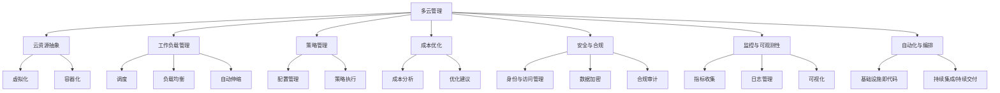

# AI系统多云管理原理与代码实战案例讲解

## 1. 背景介绍

### 1.1 问题的由来

在当今快速发展的数字时代，人工智能(AI)系统已经成为各行业不可或缺的核心驱动力。随着AI系统的复杂性和规模不断扩大,传统的单一云平台已经无法满足其高计算能力、弹性扩展和数据存储等多方面的需求。因此,多云管理成为确保AI系统高效、可靠运行的关键挑战。

### 1.2 研究现状

目前,多云管理技术正处于快速发展阶段。主流云服务提供商(如AWS、Azure和GCP)都提供了自身的多云管理解决方案,但这些解决方案往往存在着供应商锁定、成本高昂、灵活性差等问题。同时,开源社区也在积极探索更加开放、灵活和经济高效的多云管理方案。

### 1.3 研究意义

高效的多云管理对于AI系统的顺利部署和运行至关重要。它可以帮助企业:

1. 优化资源利用,降低总体拥有成本(TCO)
2. 实现无缝的云资源管理和工作负载迁移
3. 提高系统的可用性、弹性和容错能力
4. 满足不同业务场景的特定需求
5. 避免供应商锁定,提高灵活性和自主权

### 1.4 本文结构

本文将全面介绍AI系统多云管理的核心原理、关键技术、实践案例和未来趋势。内容包括:

1. 核心概念与联系
2. 核心算法原理与具体操作步骤
3. 数学模型和公式详细讲解与案例分析
4. 项目实践:代码实例和详细解释
5. 实际应用场景和未来展望
6. 工具和资源推荐
7. 总结:未来发展趋势与挑战
8. 附录:常见问题与解答

## 2. 核心概念与联系

多云管理涉及多个关键概念,它们之间存在着紧密的联系。下面我们将逐一介绍这些核心概念。

### 2.1 云资源抽象

云资源抽象是多云管理的基础,它通过虚拟化和容器化技术将底层硬件资源抽象为统一的资源池,实现跨云供应商的资源管理。

### 2.2 工作负载管理

工作负载管理负责在多云环境中调度、部署和运行应用程序及其相关服务。它包括调度、负载均衡、自动伸缩等功能,确保工作负载的高可用性和资源利用率。

### 2.3 策略管理

策略管理定义并执行各种策略,如资源配置、成本控制、安全合规等,以实现对多云环境的统一管理和自动化运维。

### 2.4 成本优化

成本优化通过持续监控、分析和优化,帮助企业降低多云环境的总体拥有成本(TCO),提高资源利用效率。

### 2.5 安全与合规

安全与合规确保多云环境中的数据、应用程序和基础设施的安全性和合规性,包括身份与访问管理、数据加密、合规审计等功能。

### 2.6 监控与可观测性

监控与可观测性收集和分析多云环境中的指标、日志和事件数据,为系统运维、故障排查和优化决策提供支持。

### 2.7 自动化与编排

自动化与编排通过基础设施即代码(IaC)和持续集成/持续交付(CI/CD)等技术,实现多云环境的自动化供给、配置和部署。

## 3. 核心算法原理与具体操作步骤

### 3.1 算法原理概述

多云管理算法的核心目标是在满足应用程序需求的前提下,实现资源的高效利用和成本的优化。常见的算法包括:

1. **资源调度算法**: 根据应用程序的资源需求、服务质量要求(QoS)和云资源的实时状态,选择最佳的资源部署方案。
2. **负载均衡算法**: 在多个云资源之间平衡工作负载,提高系统的吞吐量和响应时间。
3. **自动伸缩算法**: 根据实时负载情况动态调整资源数量,实现资源的弹性供给。
4. **成本优化算法**: 分析历史资源利用情况,预测未来需求,并提供成本优化建议。

### 3.2 算法步骤详解

以资源调度算法为例,其典型步骤如下:

1. **获取应用程序需求信息**
   - 收集应用程序的资源需求(CPU、内存、存储等)
   - 获取应用程序的服务质量要求(QoS),如响应时间、吞吐量等
2. **获取云资源状态信息**
   - 从各云供应商处收集资源的实时状态信息,包括可用资源、性能指标等
3. **构建资源调度模型**
   - 将应用程序需求和云资源状态信息转化为数学模型
   - 模型的目标函数可能包括成本最小化、QoS最大化等
4. **求解资源调度方案**
   - 使用启发式算法(如遗传算法、模拟退火等)或数学规划方法求解模型
   - 得到满足约束条件的最优或次优解
5. **执行资源调度**
   - 根据求解结果,在相应的云资源上部署应用程序
   - 实时监控资源利用情况,动态调整调度方案

### 3.3 算法优缺点

多云管理算法的优点包括:

- 提高资源利用率,降低成本
- 满足应用程序的服务质量要求
- 实现自动化、智能化管理

但也存在一些缺点和挑战:

- 算法复杂度高,求解效率较低
- 需要准确的应用程序需求信息和云资源状态信息
- 难以考虑所有实际场景的约束条件

### 3.4 算法应用领域

多云管理算法广泛应用于以下领域:

- 云计算和数据中心资源管理
- 边缘计算和物联网设备管理
- 人工智能和大数据分析平台
- 内容分发网络(CDN)和多媒体流服务
- 科学计算和高性能计算(HPC)

## 4. 数学模型和公式详细讲解与举例说明

### 4.1 数学模型构建

我们以资源调度问题为例,构建一个整数线性规划(ILP)模型。

**给定**:
- 云资源集合 $R = \{r_1, r_2, \ldots, r_m\}$
- 应用程序集合 $A = \{a_1, a_2, \ldots, a_n\}$
- 应用程序 $a_i$ 对资源 $r_j$ 的资源需求为 $d_{ij}$
- 资源 $r_j$ 的可用容量为 $c_j$
- 将应用程序 $a_i$ 部署到资源 $r_j$ 的成本为 $p_{ij}$

**决策变量**:
$$
x_{ij} =
\begin{cases}
1, & \text{if app } a_i \text{ is deployed on resource } r_j\
0, & \text{otherwise}
\end{cases}
$$

**目标函数**:
$$
\min \sum_{i=1}^{n}\sum_{j=1}^{m} p_{ij}x_{ij}
$$

**约束条件**:
$$
\begin{align}
\sum_{j=1}^{m}x_{ij} &= 1 &&\forall i \in \{1, \ldots, n\} \
\sum_{i=1}^{n}d_{ij}x_{ij} &\leq c_j &&\forall j \in \{1, \ldots, m\} \
x_{ij} &\in \{0, 1\} &&\forall i \in \{1, \ldots, n\}, j \in \{1, \ldots, m\}
\end{align}
$$

第一个约束条件确保每个应用程序只部署在一个资源上。第二个约束条件保证资源的总需求不超过其可用容量。第三个约束条件定义决策变量为0-1整数变量。

### 4.2 公式推导过程

我们来推导一下第二个约束条件的由来。

假设资源 $r_j$ 上已经部署了一组应用程序 $A_j = \{a_i | x_{ij} = 1\}$,则资源 $r_j$ 的总需求为:

$$
\sum_{a_i \in A_j} d_{ij} = \sum_{i=1}^{n} d_{ij}x_{ij}
$$

为了保证总需求不超过可用容量 $c_j$,我们有:

$$
\sum_{i=1}^{n} d_{ij}x_{ij} \leq c_j
$$

这就是第二个约束条件的由来。

### 4.3 案例分析与讲解

假设我们有3个应用程序 $\{a_1, a_2, a_3\}$ 和2个云资源 $\{r_1, r_2\}$,其资源需求和成本如下:

| 应用程序 | 资源1需求 | 资源2需求 | 资源1成本 | 资源2成本 |
|-----------|------------|------------|------------|------------|
| $a_1$     | 2          | 3          | 5          | 7          |
| $a_2$     | 3          | 2          | 6          | 4          |
| $a_3$     | 4          | 1          | 8          | 3          |

资源1和资源2的可用容量分别为6和4。

我们可以构建如下ILP模型:

**决策变量**:
$$
x_{ij} \in \{0, 1\}, i \in \{1, 2, 3\}, j \in \{1, 2\}
$$

**目标函数**:
$$
\min 5x_{11} + 7x_{12} + 6x_{21} + 4x_{22} + 8x_{31} + 3x_{32}
$$

**约束条件**:
$$
\begin{align}
x_{11} + x_{12} &= 1\
x_{21} + x_{22} &= 1\
x_{31} + x_{32} &= 1\
2x_{11} + 3x_{21} + 4x_{31} &\leq 6\
3x_{12} + 2x_{22} + x_{32} &\leq 4
\end{align}
$$

使用整数线性规划求解器(如CPLEX或Gurobi),我们可以得到最优解:

$$
x_{11} = 1, x_{22} = 1, x_{32} = 1
$$

也就是说,应用程序 $a_1$ 部署在资源1上,应用程序 $a_2$ 和 $a_3$ 部署在资源2上,总成本为 $5 + 4 + 3 = 12$。

### 4.4 常见问题解答

**Q: 为什么要使用整数线性规划模型?**

A: 整数线性规划模型可以准确描述资源调度问题的约束条件,并使用高效的求解器得到最优解。相比启发式算法,它可以保证获得全局最优解。

**Q: 如何处理动态的资源需求和可用容量?**

A: 我们可以在模型中引入时间维度,将资源需求和可用容量视为时间序列,并在约束条件中加入时间相关的限制。同时,我们也可以考虑在线算法,实时调整资源调度方案。

**Q: 如何将服务质量(QoS)要求纳入模型?**

A: 我们可以在目标函数中加入QoS相关的项,如最大化平均响应时间的负值。同时,约束条件也需要加入QoS相关的限制,如响应时间上限等。

## 5. 项目实践:代码实例