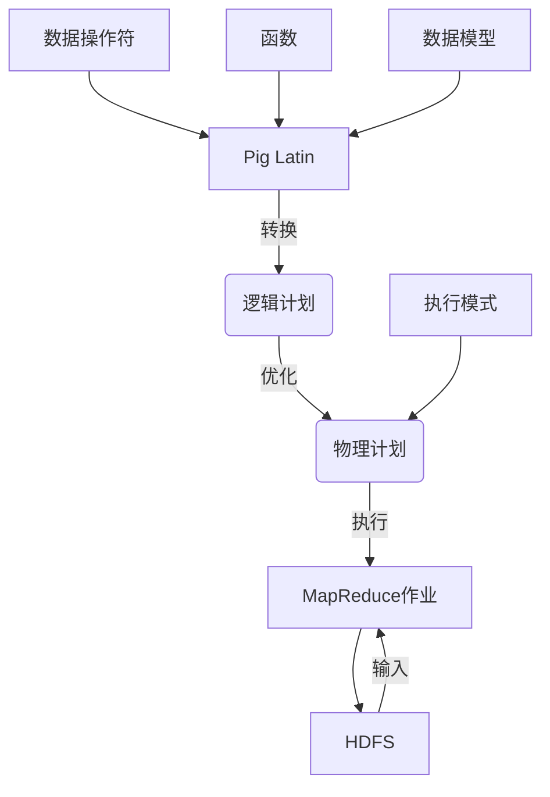
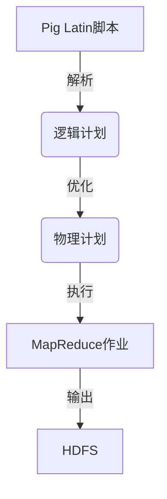

# Pig大规模数据分析平台原理与代码实例讲解

## 1. 背景介绍

### 1.1 问题的由来

在当今大数据时代，海量的结构化和非结构化数据不断涌现。传统的数据处理方式已经无法满足大规模数据分析的需求。为了有效地处理和分析这些大数据,需要一种高效、可扩展、容错的分布式计算框架。Apache Pig就是针对这一需求而诞生的大数据分析平台。

### 1.2 研究现状

Apache Pig是Apache软件基金会的一个开源项目,它提供了一种高级数据流语言(Pig Latin),可以用来描述复杂的数据分析任务。Pig Latin语言类似于SQL,但比SQL更加灵活和强大,可以处理各种半结构化和非结构化数据。Pig将Pig Latin脚本转换为一系列MapReduce任务,并在Hadoop集群上并行执行。

目前,Pig已经被广泛应用于各种大数据分析场景,如网络日志分析、社交网络分析、推荐系统等。它简化了MapReduce编程模型,提高了数据分析的效率和生产力。

### 1.3 研究意义

本文旨在深入探讨Pig大规模数据分析平台的原理和实现,帮助读者全面理解Pig的核心概念、算法原理、数学模型、代码实现等方面的知识。通过实际案例和代码示例,读者可以掌握Pig的使用方法,并能够将其应用于实际的大数据分析场景中。

### 1.4 本文结构

本文共分为9个部分:

1. 背景介绍
2. 核心概念与联系
3. 核心算法原理与具体操作步骤
4. 数学模型和公式详细讲解与举例说明
5. 项目实践:代码实例和详细解释说明
6. 实际应用场景
7. 工具和资源推荐
8. 总结:未来发展趋势与挑战
9. 附录:常见问题与解答

## 2. 核心概念与联系

在深入探讨Pig的原理和实现之前,我们需要先了解一些核心概念及它们之间的关系。



1. **Pig Latin**: Pig提供了一种高级数据流语言Pig Latin,用于描述数据分析任务。Pig Latin包含了各种数据操作符(如FILTER、JOIN等)和内置函数,可以对数据进行过滤、投影、连接等操作。

2. **数据模型**: Pig采用了自己的数据模型,主要包括Atom(原子值)、Tuple(元组)、Bag(包)和Map四种数据类型,用于表示各种结构化和非结构化数据。

3. **逻辑计划**: Pig将Pig Latin脚本转换为一系列逻辑操作符,构建逻辑计划。

4. **物理计划**: Pig优化器会对逻辑计划进行优化,生成对应的物理计划。

5. **执行模式**: Pig支持本地模式和MapReduce模式两种执行模式。本地模式适用于小数据集,而MapReduce模式则可以在Hadoop集群上并行执行,适用于大数据场景。

6. **MapReduce作业**: 物理计划最终会被转换为一系列MapReduce作业,并在Hadoop集群上执行。

7. **HDFS**: Hadoop分布式文件系统(HDFS)用于存储输入数据和输出结果。

这些核心概念相互关联,共同构成了Pig大规模数据分析平台的基础架构。

## 3. 核心算法原理与具体操作步骤

### 3.1 算法原理概述

Pig采用了一种基于数据流的计算模型,将数据分析任务表示为一系列数据转换操作。Pig Latin脚本会被转换为一个逻辑计划,然后经过优化器优化,生成对应的物理计划。物理计划由一系列MapReduce作业组成,最终在Hadoop集群上并行执行。



Pig的核心算法包括以下几个方面:

1. **解析器**: 将Pig Latin脚本解析为逻辑计划。
2. **优化器**: 对逻辑计划进行一系列优化,如投影优化、过滤器推送等,生成优化后的物理计划。
3. **执行引擎**: 将物理计划转换为一系列MapReduce作业,并在Hadoop集群上执行。

### 3.2 算法步骤详解

1. **解析Pig Latin脚本**

   Pig Latin解析器将Pig Latin脚本转换为一个逻辑计划,逻辑计划由一系列逻辑操作符组成,如LOAD、FILTER、JOIN等。

2. **逻辑计划优化**

   Pig优化器对逻辑计划进行一系列优化,包括:

   - **投影优化**: 尽早执行投影操作,减少数据传输量。
   - **过滤器推送**: 将过滤条件尽可能推送到数据源,减少不必要的数据传输。
   - **合并连接**: 将多个连接操作合并为一个操作,减少中间结果。
   - **分区排序**: 对数据进行分区和排序,提高连接效率。

3. **生成物理计划**

   优化后的逻辑计划会被转换为一个物理计划,物理计划由一系列MapReduce作业组成。

4. **执行MapReduce作业**

   物理计划会被提交到Hadoop集群上执行,每个MapReduce作业都会在多个节点上并行执行。

5. **输出结果**

   MapReduce作业的输出结果会被存储到HDFS中,供后续分析或处理使用。

### 3.3 算法优缺点

**优点**:

- **简化编程模型**: Pig Latin语言简洁易懂,降低了MapReduce编程的复杂性。
- **高度优化**: Pig优化器可以自动优化逻辑计划,提高执行效率。
- **容错性**: 基于Hadoop的容错机制,可以自动处理节点故障。
- **可扩展性**: 可以在Hadoop集群上线性扩展,处理大规模数据。

**缺点**:

- **延迟较高**: 由于需要启动MapReduce作业,存在一定的延迟。
- **内存开销**: 中间结果需要存储在磁盘上,导致额外的IO开销。
- **调试困难**: 由于分布式执行,调试过程较为复杂。

### 3.4 算法应用领域

Pig大规模数据分析平台可以广泛应用于以下领域:

- **网络日志分析**: 分析网站访问日志,了解用户行为。
- **社交网络分析**: 分析社交网络数据,发现用户关系和兴趣偏好。
- **推荐系统**: 基于用户历史数据,为用户推荐感兴趣的商品或内容。
- **机器学习**: 作为机器学习算法的数据预处理工具。
- **数据仓库**: 构建数据仓库,支持商业智能和数据分析。

## 4. 数学模型和公式详细讲解与举例说明

在Pig中,一些核心算法和优化策略都涉及到了数学模型和公式的应用。本节将详细讲解这些数学模型和公式,并通过实例进行说明。

### 4.1 数学模型构建

#### 4.1.1 数据模型

Pig采用了自己的数据模型,主要包括四种数据类型:

- **Atom(原子值)**: 代表单个值,如整数、浮点数、字符串等。
- **Tuple(元组)**: 由有序的Atom值组成,类似于关系数据库中的行。
- **Bag(包)**: 由一组Tuple组成,类似于关系数据库中的表。
- **Map(映射)**: 由(键,值)对组成,其中键是Atom,值可以是Atom、Tuple或Bag。

这些数据类型可以嵌套组合,形成复杂的数据结构。

#### 4.1.2 关系代数模型

Pig Latin语言的许多操作符都源自关系代数,如投影(Projection)、选择(Selection)、连接(Join)等。我们可以将Pig Latin操作符映射到关系代数操作,从而构建数学模型。

假设有两个关系R和S,分别表示为:

$$R(A_1, A_2, \ldots, A_n)$$
$$S(B_1, B_2, \ldots, B_m)$$

其中$A_i$和$B_j$分别表示R和S的属性。

则一些常见的Pig Latin操作符可以用关系代数表示如下:

- **投影(Projection)**:

  $$\Pi_{A_i, A_j, \ldots}(R) = \{t[A_i, A_j, \ldots] | t \in R\}$$

  即选择R中的$A_i$、$A_j$等属性。

- **选择(Selection)**:

  $$\sigma_{条件}(R) = \{t | t \in R \wedge 条件(t)\}$$

  即从R中选择满足条件的元组。

- **连接(Join)**:

  $$R \bowtie_\theta S = \{t_R \cup t_S | t_R \in R, t_S \in S \wedge \theta(t_R, t_S)\}$$

  其中$\theta$是连接条件,如$A_i = B_j$。

通过将Pig Latin操作符映射到关系代数,我们可以利用关系代数的性质对查询进行优化。

### 4.2 公式推导过程

#### 4.2.1 投影优化

投影优化的目标是尽早执行投影操作,减少不必要的数据传输。假设有一个查询:

$$\Pi_{A_i, A_j}(\sigma_{条件}(R))$$

即先对R进行选择,再对结果进行投影。我们可以将投影操作提前执行:

$$\sigma_{条件}(\Pi_{A_i, A_j}(R))$$

这样可以减少中间结果的大小,从而减少数据传输量。

#### 4.2.2 过滤器推送

过滤器推送的目标是将过滤条件尽可能推送到数据源,减少不必要的数据传输。假设有一个查询:

$$\Pi_{A_i, A_j}(\sigma_{条件_1}(\sigma_{条件_2}(R)))$$

我们可以将两个选择操作合并:

$$\Pi_{A_i, A_j}(\sigma_{条件_1 \wedge 条件_2}(R))$$

进一步,如果条件$条件_2$只依赖于R的某些属性$A_k$,我们可以先对R进行投影,再执行过滤:

$$\sigma_{条件_1}(\sigma_{条件_2}(\Pi_{A_i, A_j, A_k}(R)))$$

这样可以减少中间结果的大小,从而减少数据传输量。

#### 4.2.3 合并连接

合并连接的目标是将多个连接操作合并为一个操作,减少中间结果。假设有一个查询:

$$(R \bowtie_{\theta_1} S) \bowtie_{\theta_2} T$$

我们可以将两个连接操作合并为一个:

$$R \bowtie_{\theta_1 \wedge \theta_2} (S \bowtie T)$$

这样可以减少中间结果的大小,从而减少数据传输量。

#### 4.2.4 分区排序

分区排序是一种优化连接操作的技术。假设我们要执行一个连接操作:

$$R \bowtie_{A_i = B_j} S$$

我们可以先对R和S进行分区和排序:

$$\rho_{A_i}(R), \rho_{B_j}(S)$$

其中$\rho$表示分区和排序操作。然后,在每个分区内执行连接操作,可以大大提高连接效率。

### 4.3 案例分析与讲解

现在,让我们通过一个实际案例来说明上述数学模型和公式的应用。

假设我们有两个数据集:

- **用户数据(Users)**:包含用户ID、姓名、年龄等信息。
- **订单数据(Orders)**:包含订单ID、用户ID、订单金额等信息。

我们希望计算每个用户的总订单金额,并按照总订单金额降序排列。

#### 4.3.1 Pig Latin脚本

```pig
users = LOAD