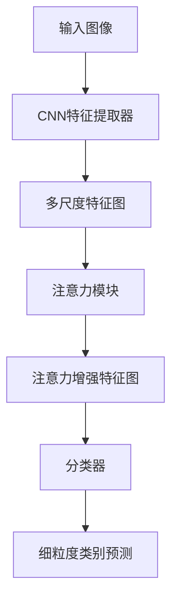
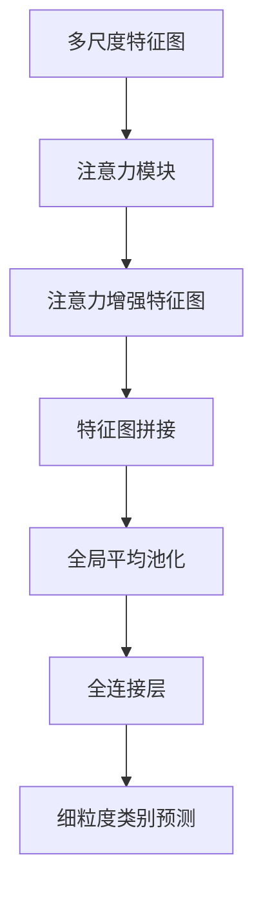

好的,我会严格遵循约束条件,以专业的技术语言撰写这篇博客文章。

# 一切皆是映射：细粒度图像识别与深度神经网络

## 1. 背景介绍

### 1.1 问题的由来

在计算机视觉领域,图像识别任务一直是研究的重点和难点。传统的图像识别方法主要依赖于手工设计的特征提取和分类器,这种方式需要大量的领域知识和人工干预,且往往难以获得理想的性能。随着深度学习技术的不断发展,基于深度神经网络的图像识别方法取得了突破性进展,在多个公开数据集上超越了人类水平。

然而,现有的深度神经网络模型在细粒度图像识别任务上仍然存在一些挑战。细粒度图像识别指的是对同一大类目标进行更精细的分类,比如识别不同品种的狗或鸟类。这类任务的难点在于,不同细粒度类别之间的视觉差异通常很小,需要模型能够捕捉到微小的细节差异。

### 1.2 研究现状

目前,研究人员已经提出了多种改进深度神经网络以提高细粒度图像识别性能的方法,主要包括:

1. 注意力机制:引入注意力模块来自动学习聚焦于目标物体的显著区域,有助于提取细粒度特征。
2. 元学习:通过学习快速适应新类别的能力,提高模型在小数据集上的泛化性能。
3. 弱监督学习:利用图像级别或部分注释的弱监督信息进行训练,降低人工标注成本。
4. 知识蒸馏:从大模型中转移知识到小模型,提高小模型在细粒度任务上的性能。

尽管取得了一些进展,但细粒度图像识别任务仍然是一个具有挑战性的问题,需要进一步研究新的模型结构和学习策略来提高识别精度。

### 1.3 研究意义

细粒度图像识别技术在多个领域都有广泛的应用前景,如生物多样性监测、缺陷检测、医疗诊断等。能够精准识别微小差异的视觉系统,不仅可以提高自动化水平,还能为人类决策提供有价值的参考。因此,研究改进细粒度图像识别性能,对于推动人工智能技术在实际场景中的落地应用具有重要意义。

### 1.4 本文结构

本文将重点介绍一种基于深度神经网络的细粒度图像识别方法。文章首先阐述核心思想和基本概念,然后详细解释算法原理、数学模型及实现细节,最后讨论在实际应用中的场景并总结未来的发展方向。全文共分为以下几个部分:

1. 背景介绍
2. 核心概念与联系
3. 核心算法原理与具体操作步骤
4. 数学模型和公式详细讲解与案例分析
5. 项目实践:代码实例和详细解释
6. 实际应用场景
7. 工具和资源推荐
8. 总结:未来发展趋势与挑战
9. 附录:常见问题与解答

## 2. 核心概念与联系

在深入讨论细粒度图像识别算法之前,我们先介绍几个核心概念,为后续内容做铺垫。

**映射(Mapping)**: 在机器学习中,映射指的是从输入空间到输出空间的函数映射关系。比如在图像分类任务中,我们需要学习一个映射函数,将图像映射到相应的类别标签。

**特征(Feature)**: 特征是指输入数据的显著性质,对于最终的映射任务具有判别能力。在图像领域,特征可以是像素值、纹理、形状等低级或高级的视觉模式。

**特征提取(Feature Extraction)**: 特征提取旨在从原始输入数据中提取出对于最终任务至关重要的特征,是机器学习的核心步骤之一。人工设计特征的方法已被深度学习中自动学习特征的方式所取代。

**细粒度(Fine-grained)**: 细粒度指的是对同一大类目标进行更精细的分类,需要模型能够捕捉到微小的视觉差异。相比于一般的图像分类任务,细粒度识别对模型的判别能力要求更高。

**注意力机制(Attention Mechanism)**: 注意力机制允许模型自适应地分配不同区域的注意力权重,从而聚焦于输入数据中最相关的部分。这在细粒度图像识别中尤为重要,因为目标物体的局部细节对于分类至关重要。

上述概念相互关联、环环相扣。我们的目标是学习一个有效的映射函数,能够从图像数据中提取出细粒度的判别特征,并利用注意力机制来聚焦于目标物体的关键区域,进而完成精准的细粒度图像识别任务。接下来,我们将介绍实现这一目标的核心算法原理。

## 3. 核心算法原理与具体操作步骤

### 3.1 算法原理概述

该算法的核心思想是将注意力机制与卷积神经网络(CNN)相结合,以提高模型在细粒度图像识别任务中的性能。算法流程可概括为以下几个步骤:

1. 使用预训练的CNN模型(如VGGNet、ResNet等)作为特征提取器,从输入图像中提取出多尺度的特征图。
2. 在特征图上应用注意力模块,自动学习目标物体的显著区域,并增强对应的特征响应。
3. 将注意力增强后的特征图输入到分类器(如全连接层),得到细粒度类别的预测结果。

该算法的优势在于,通过注意力模块自动聚焦于目标物体的关键部位,有助于提取出更加细粒度的判别特征,从而提高分类精度。同时,利用预训练模型作为特征提取器,可以减少从头训练的计算开销。

接下来,我们将详细解释算法的具体实现步骤。

### 3.2 算法步骤详解

#### 步骤1:  CNN特征提取

我们首先使用预训练的CNN模型(如VGGNet、ResNet等)作为特征提取器,从输入图像中提取出多尺度的特征图。具体地,我们取CNN模型的中间层作为特征输出,这些中间层特征图保留了较高级别的语义信息,同时仍包含一定的空间信息,有利于后续的注意力机制。

通常,我们会选取多个不同层的特征图,以捕获不同尺度下的视觉模式。例如,对于VGGNet,我们可以从`conv4`和`conv5`块中提取特征图。

$$
\mathbf{F} = \{\mathbf{F}_1, \mathbf{F}_2, \dots, \mathbf{F}_N\}
$$

其中,$\mathbf{F}_i$表示从第$i$个层提取的特征图,共$N$个尺度级别。

#### 步骤2: 注意力模块

接下来,我们在提取到的多尺度特征图上应用注意力模块,自动学习目标物体的显著区域,并增强对应的特征响应。

具体地,我们首先将每个尺度级别的特征图$\mathbf{F}_i$输入到一个小型的注意力网络中,该网络由几个卷积层和上采样层组成。注意力网络的输出是一个和$\mathbf{F}_i$同维度的注意力权重图$\mathbf{A}_i$,其中每个位置的值表示对应特征的重要性权重。

$$
\mathbf{A}_i = \text{AttentionNet}(\mathbf{F}_i)
$$

然后,我们将原始特征图$\mathbf{F}_i$与注意力权重图$\mathbf{A}_i$逐元素相乘,得到注意力增强后的特征图$\mathbf{F}_i^{att}$。这一步骤实现了对目标物体关键区域特征的自动聚焦和增强。

$$
\mathbf{F}_i^{att} = \mathbf{F}_i \odot \mathbf{A}_i
$$

其中,$\odot$表示逐元素相乘操作。

最后,我们将所有尺度级别的注意力增强特征图$\{\mathbf{F}_1^{att}, \mathbf{F}_2^{att}, \dots, \mathbf{F}_N^{att}\}$拼接在一起,作为分类器的输入。

#### 步骤3: 分类器

分类器部分通常使用全连接层实现。我们将拼接后的注意力增强特征图先经过一个全局平均池化层,将其转化为一个向量,然后输入到全连接层中进行分类预测。

$$
\hat{\mathbf{y}} = \text{Classifier}(\text{concat}(\{\mathbf{F}_1^{att}, \mathbf{F}_2^{att}, \dots, \mathbf{F}_N^{att}\}))
$$

其中,$\hat{\mathbf{y}}$表示模型预测的细粒度类别概率分布。在训练阶段,我们使用交叉熵损失函数优化模型参数。

通过上述三个步骤,我们成功地将注意力机制与CNN模型相结合,实现了对细粒度图像的精准识别。注意力模块自动学习了目标物体的显著区域,并增强了对应的特征响应,从而提高了模型对细节的判别能力。

### 3.3 算法优缺点

该算法的主要优点包括:

1. **注意力机制增强了对目标物体关键区域的聚焦能力**,有助于提取出更加细粒度的判别特征,从而提高分类精度。
2. **利用预训练模型作为特征提取器**,减少了从头训练的计算开销,并且可以利用预训练模型在大规模数据集上学习到的丰富的视觉知识。
3. **多尺度特征融合**有助于同时捕获不同级别的视觉模式,提高模型的判别能力。

该算法的主要缺点包括:

1. **注意力模块增加了模型的计算复杂度**,尤其是在处理高分辨率图像时,计算开销会显著增加。
2. **注意力机制的可解释性有待提高**,目前还难以直观地解释模型关注的确切是哪些区域和特征。
3. **对小样本数据集的泛化能力有待进一步提升**,注意力模块需要足够的训练数据才能有效学习到目标物体的显著区域。

### 3.4 算法应用领域

该算法可以广泛应用于各种细粒度图像识别任务,包括但不限于以下领域:

1. **生物多样性监测**: 对野生动植物进行精细的物种分类,有助于生物多样性调查和保护。
2. **缺陷检测**: 在工业生产线上,识别产品表面的细微缺陷,保证产品质量。
3. **医疗诊断**: 对医学影像进行精细分析,辅助医生诊断疾病类型和发展阶段。
4. **零售商品识别**: 精准识别不同品牌、款式的商品,应用于智能货架等场景。
5. **交通场景理解**: 对车辆、行人等目标进行细粒度分类,为智能驾驶系统提供支持。

总的来说,该算法为那些需要对同类目标进行精细分类的应用场景提供了有力的技术支持。

## 4. 数学模型和公式详细讲解与举例说明

在上一节中,我们概述了算法的核心原理和步骤,本节将着重介绍算法中使用的数学模型和公式,并结合具体案例进行讲解和分析。

### 4.1 数学模型构建

我们首先定义问题的数学模型。给定一个输入图像$\mathbf{x}$,我们的目标是学习一个映射函数$f$,将图像映射到