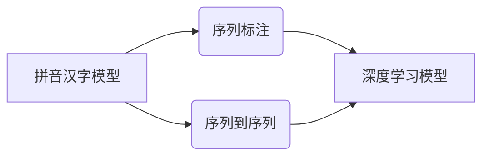

# 从零开始大模型开发与微调：拼音汉字模型的训练

作者：禅与计算机程序设计艺术 / Zen and the Art of Computer Programming

## 1. 背景介绍
### 1.1 问题的由来

在中文信息处理领域，拼音汉字模型是一个基础而重要的工具。它将汉字转换为拼音，方便检索、语音合成和机器翻译等应用。然而，传统的拼音汉字模型往往依赖于规则或人工标注，难以处理复杂的语言现象。近年来，随着深度学习技术的发展，基于深度神经网络的大模型在自然语言处理任务中取得了显著成果，为拼音汉字模型的开发提供了新的思路。

### 1.2 研究现状

目前，基于深度学习的大模型在拼音汉字模型领域主要分为两类：

- **基于序列标注的模型**：这类模型将拼音汉字转换任务视为序列标注问题，使用序列标注技术进行训练和预测。例如，基于条件随机场（CRF）和基于深度学习的标注模型。
- **基于序列到序列的模型**：这类模型将拼音汉字转换任务视为序列到序列的翻译问题，使用序列到序列模型进行训练和预测。例如，基于注意力机制的模型如Transformer。

### 1.3 研究意义

开发高效、准确、可扩展的拼音汉字模型，对于中文信息处理领域的应用具有重要意义：

- **提高效率**：拼音汉字模型可以快速将汉字转换为拼音，提高信息检索、语音合成等应用的效率。
- **降低成本**：拼音汉字模型可以减少人工标注工作量，降低应用开发成本。
- **提升体验**：拼音汉字模型可以提高用户输入体验，尤其是在语音输入和手写输入场景。

### 1.4 本文结构

本文将围绕拼音汉字模型的开发与微调展开，内容安排如下：

- 第2部分，介绍拼音汉字模型的相关概念和联系。
- 第3部分，介绍拼音汉字模型的核心算法原理和具体操作步骤。
- 第4部分，介绍拼音汉字模型涉及的数学模型和公式，并举例说明。
- 第5部分，给出拼音汉字模型的代码实例，并进行详细解释和分析。
- 第6部分，探讨拼音汉字模型在实际应用场景中的应用。
- 第7部分，推荐拼音汉字模型相关的学习资源、开发工具和参考文献。
- 第8部分，总结全文，展望拼音汉字模型的未来发展趋势与挑战。
- 第9部分，提供拼音汉字模型的常见问题解答。

## 2. 核心概念与联系

本节将介绍拼音汉字模型涉及的相关概念，并阐述它们之间的联系。

### 2.1 拼音汉字模型

拼音汉字模型是将汉字转换为拼音的模型，主要包括以下几种类型：

- **基于规则的方法**：利用拼音规则进行转换，如拼音查字典法、拼音转换法等。
- **基于统计的方法**：利用统计信息进行转换，如隐马尔可夫模型（HMM）和条件随机场（CRF）。
- **基于深度学习的方法**：利用深度神经网络进行转换，如卷积神经网络（CNN）和循环神经网络（RNN）。

### 2.2 序列标注

序列标注是将序列中的每个元素标注为特定类别的任务，如词性标注、命名实体识别等。拼音汉字模型可以被视为序列标注问题，将汉字序列标注为对应的拼音序列。

### 2.3 序列到序列

序列到序列是将一个序列转换为另一个序列的任务，如机器翻译、语音识别等。拼音汉字模型可以被视为序列到序列问题，将汉字序列转换为拼音序列。

这些概念之间的联系如下：



## 3. 核心算法原理 & 具体操作步骤
### 3.1 算法原理概述

基于深度学习的大模型在拼音汉字模型领域主要采用序列到序列的模型架构，以下以Transformer为例进行介绍。

### 3.2 算法步骤详解

1. **数据预处理**：将汉字文本数据清洗、分词，并转换为序列格式。
2. **模型构建**：构建Transformer模型，包括编码器和解码器。
3. **预训练**：在大量无标注文本数据上对模型进行预训练，学习通用语言表示。
4. **微调**：在拼音汉字数据集上对模型进行微调，优化模型参数。
5. **评估**：在测试集上评估模型性能，如准确率、召回率和F1值等。

### 3.3 算法优缺点

**优点**：

- **高效**：Transformer模型可以快速处理大规模数据。
- **准确**：预训练过程可以学习到丰富的语言知识，提高模型准确率。
- **泛化能力强**：Transformer模型具有良好的泛化能力，适用于不同任务。

**缺点**：

- **计算复杂度高**：Transformer模型参数量庞大，训练和推理计算复杂度高。
- **数据需求量大**：预训练和微调过程需要大量无标注和标注数据。

### 3.4 算法应用领域

基于深度学习的大模型在拼音汉字模型领域应用广泛，如：

- **语音合成**：将汉字文本转换为语音。
- **机器翻译**：将汉字文本翻译为其他语言。
- **信息检索**：将汉字文本转换为拼音，提高检索效率。

## 4. 数学模型和公式 & 详细讲解 & 举例说明
### 4.1 数学模型构建

以Transformer模型为例，其数学模型可以表示为：

$$
Y = M_{\theta}(X)
$$

其中：

- $Y$ 为输出序列，表示拼音序列。
- $X$ 为输入序列，表示汉字序列。
- $M_{\theta}$ 为Transformer模型，包含编码器和解码器。

### 4.2 公式推导过程

1. **编码器**：编码器将输入序列 $X$ 转换为隐藏状态序列 $H = (H_1, H_2, ..., H_L)$。

$$
H_i = \text{Encoder}(X_i, H_{<i}, W_e)
$$

其中：

- $X_i$ 为输入序列的第 $i$ 个元素。
- $H_{<i}$ 为输入序列前 $i-1$ 个元素对应的隐藏状态。
- $W_e$ 为编码器权重。

2. **解码器**：解码器将隐藏状态序列 $H$ 转换为输出序列 $Y$。

$$
Y_i = \text{Decoder}(H_i, H, Y_{<i}, W_d)
$$

其中：

- $H_i$ 为隐藏状态序列的第 $i$ 个元素。
- $H$ 为隐藏状态序列。
- $Y_{<i}$ 为输出序列前 $i-1$ 个元素。
- $W_d$ 为解码器权重。

### 4.3 案例分析与讲解

假设输入序列为“你好，世界！”，输出序列为“ni hao shi jie”。

编码器将输入序列“你好，世界！”转换为隐藏状态序列：

```
H_1 = [ ... ]
H_2 = [ ... ]
...
H_L = [ ... ]
```

解码器根据隐藏状态序列和输入序列的前 $L-1$ 个输出序列，逐步生成输出序列：

```
Y_1 = "n"
Y_2 = "i"
...
Y_L = "jie"
```

最终，解码器输出完整的拼音序列“ni hao shi jie”。

### 4.4 常见问题解答

**Q1：如何选择合适的预训练语言模型？**

A：选择预训练语言模型时，需要考虑以下因素：

- **模型规模**：根据任务需求和计算资源选择合适的模型规模。
- **预训练数据**：选择与任务领域相关的预训练数据，以提高模型在特定领域的表现。
- **模型效果**：参考相关论文和评估指标，选择效果较好的模型。

**Q2：如何优化模型参数？**

A：优化模型参数可以通过以下方法：

- **学习率调整**：调整学习率大小，找到最优的学习率。
- **正则化**：使用L2正则化、Dropout等技术，防止过拟合。
- **数据增强**：使用数据增强技术，扩大训练数据规模，提高模型泛化能力。

**Q3：如何评估模型性能？**

A：评估模型性能可以通过以下指标：

- **准确率**：模型预测正确的样本占比。
- **召回率**：模型预测正确的正样本占比。
- **F1值**：准确率和召回率的调和平均值。

## 5. 项目实践：代码实例和详细解释说明
### 5.1 开发环境搭建

以下是使用PyTorch和Hugging Face Transformers库进行拼音汉字模型开发的步骤：

1. 安装PyTorch和Transformers库：

```bash
pip install torch transformers
```

2. 下载预训练语言模型，如BERT：

```bash
transformers-cli download model_name bert-base-uncased
```

3. 下载拼音汉字数据集，如IPT。

### 5.2 源代码详细实现

以下是一个简单的拼音汉字模型代码实例：

```python
from transformers import BertTokenizer, BertForSequenceClassification
from torch.utils.data import DataLoader, Dataset

# 初始化模型和分词器
tokenizer = BertTokenizer.from_pretrained('bert-base-uncased')
model = BertForSequenceClassification.from_pretrained('bert-base-uncased', num_labels=2)

# 定义数据集
class PinyinDataset(Dataset):
    def __init__(self, texts, labels):
        self.texts = texts
        self.labels = labels

    def __len__(self):
        return len(self.texts)

    def __getitem__(self, item):
        text = self.texts[item]
        encoding = tokenizer(text, return_tensors='pt', padding=True, truncation=True)
        labels = torch.tensor(self.labels[item], dtype=torch.long)
        return encoding, labels

# 加载数据集
train_dataset = PinyinDataset(train_texts, train_labels)
dev_dataset = PinyinDataset(dev_texts, dev_labels)

# 定义训练函数
def train_epoch(model, dataset, dataloader, optimizer):
    model.train()
    total_loss = 0
    for batch in dataloader:
        inputs, labels = batch
        outputs = model(**inputs, labels=labels)
        loss = outputs.loss
        loss.backward()
        optimizer.step()
        optimizer.zero_grad()
        total_loss += loss.item()
    return total_loss / len(dataloader)

# 定义评估函数
def evaluate(model, dataset, dataloader):
    model.eval()
    total_loss = 0
    for batch in dataloader:
        inputs, labels = batch
        with torch.no_grad():
            outputs = model(**inputs, labels=labels)
        loss = outputs.loss
        total_loss += loss.item()
    return total_loss / len(dataloader)

# 训练模型
optimizer = torch.optim.Adam(model.parameters(), lr=1e-5)
train_loader = DataLoader(train_dataset, batch_size=16, shuffle=True)
dev_loader = DataLoader(dev_dataset, batch_size=16, shuffle=False)

for epoch in range(10):
    train_loss = train_epoch(model, train_dataset, train_loader, optimizer)
    print(f"Epoch {epoch+1}, train loss: {train_loss:.4f}")
    dev_loss = evaluate(model, dev_dataset, dev_loader)
    print(f"Epoch {epoch+1}, dev loss: {dev_loss:.4f}")
```

### 5.3 代码解读与分析

1. **导入库**：导入PyTorch、Transformers库等所需库。

2. **初始化模型和分词器**：加载预训练的BERT模型和分词器。

3. **定义数据集**：定义PinyinDataset类，实现Dataset接口，用于加载和处理拼音汉字数据。

4. **加载数据集**：加载数据集，包括训练集和验证集。

5. **定义训练函数**：定义train_epoch函数，实现模型的训练过程。

6. **定义评估函数**：定义evaluate函数，实现模型的评估过程。

7. **训练模型**：使用Adam优化器和DataLoader加载数据，进行模型训练。

### 5.4 运行结果展示

运行上述代码后，将在控制台输出训练和验证集的loss值，以及每轮训练的验证集loss值。

## 6. 实际应用场景
### 6.1 语音合成

拼音汉字模型可以应用于语音合成，将汉字文本转换为语音。在语音合成过程中，拼音汉字模型将汉字文本转换为拼音序列，再将拼音序列转换为语音。

### 6.2 机器翻译

拼音汉字模型可以应用于机器翻译，将汉字文本翻译为其他语言。在机器翻译过程中，拼音汉字模型将汉字文本转换为拼音序列，再将拼音序列翻译为其他语言。

### 6.3 信息检索

拼音汉字模型可以应用于信息检索，将汉字文本转换为拼音序列，提高检索效率。

### 6.4 未来应用展望

随着深度学习技术的不断发展，拼音汉字模型的应用领域将进一步拓展，如：

- **智能客服**：将拼音汉字模型应用于智能客服，实现智能语音输入和回复。
- **教育领域**：将拼音汉字模型应用于教育领域，辅助学生学习汉字和拼音。
- **医疗领域**：将拼音汉字模型应用于医疗领域，实现医学文本的拼音标注和检索。

## 7. 工具和资源推荐
### 7.1 学习资源推荐

- 《深度学习自然语言处理》课程：由斯坦福大学开设的NLP课程，详细介绍NLP基本概念和经典模型。
- 《PyTorch深度学习实践》书籍：详细介绍PyTorch库的使用方法，适合初学者入门。
- Hugging Face Transformers官方文档：提供Transformers库的详细文档和示例代码。

### 7.2 开发工具推荐

- PyTorch：开源深度学习框架，功能强大，易于使用。
- Hugging Face Transformers：预训练语言模型库，提供大量预训练模型和示例代码。
- Colab：Google提供的在线Jupyter Notebook环境，免费提供GPU/TPU算力。

### 7.3 相关论文推荐

- Attention is All You Need：Transformer模型的开创性论文。
- BERT: Pre-training of Deep Bidirectional Transformers for Language Understanding：BERT模型的开创性论文。
- Language Models are Unsupervised Multitask Learners：GPT-2模型的开创性论文。

### 7.4 其他资源推荐

- arXiv论文预印本：人工智能领域最新研究成果的发布平台。
- NLP相关技术博客：如Hugging Face博客、BERT博客等。
- GitHub热门项目：如Hugging Face的Transformers库、BERT模型等。

## 8. 总结：未来发展趋势与挑战
### 8.1 研究成果总结

本文从零开始介绍了大模型在拼音汉字模型领域的应用，包括核心概念、算法原理、实践案例等。通过本文的学习，读者可以了解大模型在拼音汉字模型领域的应用现状和发展趋势。

### 8.2 未来发展趋势

1. **模型小型化**：为了降低模型计算和存储成本，未来拼音汉字模型将朝着小型化方向发展。
2. **模型可解释性**：为了提高模型的可解释性，未来研究将关注模型的可解释性技术，如注意力机制可视化等。
3. **多模态融合**：为了更好地理解语义信息，未来拼音汉字模型将与其他模态信息（如图像、语音等）进行融合。

### 8.3 面临的挑战

1. **数据标注成本**：拼音汉字模型需要大量标注数据，数据标注成本较高。
2. **模型计算复杂度**：拼音汉字模型参数量庞大，计算复杂度高。
3. **模型可解释性**：拼音汉字模型的决策过程难以解释，可解释性不足。

### 8.4 研究展望

为了克服拼音汉字模型面临的挑战，未来研究方向包括：

1. **数据增强**：利用无标注数据或弱标注数据进行数据增强，降低数据标注成本。
2. **模型压缩**：通过模型压缩技术降低模型计算复杂度，提高模型效率。
3. **可解释性研究**：研究模型的可解释性技术，提高模型的可信度和可接受度。

相信随着研究的不断深入，大模型在拼音汉字模型领域的应用将更加广泛，为中文信息处理领域的发展带来更多可能性。

## 9. 附录：常见问题与解答

**Q1：什么是预训练语言模型？**

A：预训练语言模型是在大量无标注文本数据上预训练得到的语言模型，可以学习到丰富的语言知识，提高模型在下游任务上的性能。

**Q2：如何选择合适的预训练语言模型？**

A：选择预训练语言模型时，需要考虑以下因素：

- **模型规模**：根据任务需求和计算资源选择合适的模型规模。
- **预训练数据**：选择与任务领域相关的预训练数据，以提高模型在特定领域的表现。
- **模型效果**：参考相关论文和评估指标，选择效果较好的模型。

**Q3：如何优化模型参数？**

A：优化模型参数可以通过以下方法：

- **学习率调整**：调整学习率大小，找到最优的学习率。
- **正则化**：使用L2正则化、Dropout等技术，防止过拟合。
- **数据增强**：使用数据增强技术，扩大训练数据规模，提高模型泛化能力。

**Q4：如何评估模型性能？**

A：评估模型性能可以通过以下指标：

- **准确率**：模型预测正确的样本占比。
- **召回率**：模型预测正确的正样本占比。
- **F1值**：准确率和召回率的调和平均值。

**Q5：如何将拼音汉字模型应用于语音合成？**

A：将拼音汉字模型应用于语音合成，需要将汉字文本转换为拼音序列，再将拼音序列转换为语音。可以使用TTS（Text-to-Speech）技术实现拼音序列到语音的转换。

**Q6：如何将拼音汉字模型应用于机器翻译？**

A：将拼音汉字模型应用于机器翻译，需要将汉字文本转换为拼音序列，再将拼音序列翻译为其他语言。可以使用机器翻译技术实现拼音序列到其他语言的翻译。

**Q7：如何将拼音汉字模型应用于信息检索？**

A：将拼音汉字模型应用于信息检索，需要将汉字文本转换为拼音序列，提高检索效率。可以使用搜索引擎技术实现基于拼音序列的信息检索。

**Q8：如何解决拼音汉字模型面临的挑战？**

A：为了克服拼音汉字模型面临的挑战，可以采取以下措施：

- **数据增强**：利用无标注数据或弱标注数据进行数据增强，降低数据标注成本。
- **模型压缩**：通过模型压缩技术降低模型计算复杂度，提高模型效率。
- **可解释性研究**：研究模型的可解释性技术，提高模型的可信度和可接受度。

通过以上问答，相信读者对拼音汉字模型有了更深入的了解。希望本文能够帮助读者入门大模型在拼音汉字模型领域的应用，并为其后续研究提供参考。

---

作者：禅与计算机程序设计艺术 / Zen and the Art of Computer Programming