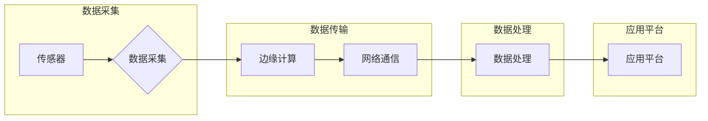

# 物联网 (Internet of Things)

> 关键词：物联网，边缘计算，M2M通信，传感器网络，智能家居，工业物联网，智能城市，区块链，5G

## 1. 背景介绍

随着信息技术的飞速发展，物联网（Internet of Things，IoT）已经逐渐成为全球范围内的一项重要技术。物联网通过将各种物体连接到互联网，使得这些物体能够相互感知、相互通信，并智能地执行任务。物联网技术的应用领域广泛，从智能家居到工业生产，从智能城市到农业监测，几乎无处不在。本文将深入探讨物联网的核心概念、技术原理、应用场景以及未来发展趋势。

### 1.1 问题的由来

物联网的出现源于人们对信息时代背景下，物体智能化、网络化需求的日益增长。随着互联网的普及和移动互联网的快速发展，人们对于信息获取和处理的需求不断增长，而传统的互联网技术已经无法满足人们对物体智能化、网络化的需求。因此，物联网作为一种新兴的技术，应运而生。

### 1.2 研究现状

物联网技术的研究和应用已经取得了显著的进展。目前，物联网已经形成了较为完善的产业链，包括芯片、传感器、网络通信、数据处理、应用平台等多个环节。在应用领域，物联网技术已经广泛应用于智能家居、智能交通、智能医疗、智能工业、智能农业、智能城市等领域。

### 1.3 研究意义

物联网技术的研究和应用对于推动社会经济发展、提高人们生活质量具有重要意义。它可以提高资源利用效率，降低生产成本，创造新的经济增长点，并促进社会管理的智能化和高效化。

### 1.4 本文结构

本文将按照以下结构进行阐述：

- 第2部分，介绍物联网的核心概念与联系，并给出Mermaid流程图。
- 第3部分，阐述物联网的核心算法原理和具体操作步骤。
- 第4部分，讲解物联网的数学模型和公式。
- 第5部分，通过项目实践展示物联网的代码实例。
- 第6部分，探讨物联网的实际应用场景。
- 第7部分，展望物联网的未来发展趋势和挑战。
- 第8部分，总结研究成果，并展望未来研究方向。

## 2. 核心概念与联系

### 2.1 物联网的核心概念

物联网的核心概念包括：

- **传感器**：用于感知物理世界的信息，并将信息转化为数字信号。
- **边缘计算**：在数据产生的地方进行处理，减少数据传输延迟，提高数据处理效率。
- **M2M通信**：机器与机器之间的通信，实现设备间的互联互通。
- **数据处理**：对传感器采集到的数据进行处理和分析，提取有价值的信息。
- **应用平台**：提供数据存储、分析和可视化等功能，支持用户进行应用开发。

### 2.2 物联网的Mermaid流程图

以下为物联网的Mermaid流程图：



### 2.3 物联网的核心概念联系

物联网的核心概念之间相互联系，形成一个完整的生态系统。传感器采集到的数据经过边缘计算、网络通信等环节，最终在应用平台上进行处理和分析，为用户提供有价值的信息和服务。

## 3. 核心算法原理 & 具体操作步骤

### 3.1 算法原理概述

物联网的核心算法主要涉及以下几个方面：

- **数据采集算法**：用于从传感器中采集数据。
- **数据传输算法**：用于将数据传输到边缘计算节点或中心服务器。
- **边缘计算算法**：用于在边缘节点上进行数据处理。
- **数据处理算法**：用于对采集到的数据进行分析和处理。

### 3.2 算法步骤详解

#### 3.2.1 数据采集算法

数据采集算法的主要步骤如下：

1. 选择合适的传感器。
2. 将传感器连接到数据采集设备。
3. 采集传感器数据。
4. 对采集到的数据进行预处理。

#### 3.2.2 数据传输算法

数据传输算法的主要步骤如下：

1. 选择合适的传输协议。
2. 将数据打包成数据包。
3. 将数据包发送到目标节点。
4. 接收并处理接收到的数据包。

#### 3.2.3 边缘计算算法

边缘计算算法的主要步骤如下：

1. 接收数据包。
2. 对数据包进行解析。
3. 对数据进行初步处理。
4. 将处理后的数据发送到中心服务器或进行进一步处理。

#### 3.2.4 数据处理算法

数据处理算法的主要步骤如下：

1. 接收边缘计算节点发送的数据。
2. 对数据进行清洗、去噪等预处理。
3. 使用数据挖掘、机器学习等方法对数据进行分析。
4. 提取有价值的信息。

### 3.3 算法优缺点

#### 3.3.1 数据采集算法

优点：

- 可采集各种类型的传感器数据。
- 数据采集速度快。
- 数据采集质量高。

缺点：

- 传感器种类繁多，选择合适的传感器较为困难。
- 数据采集成本较高。

#### 3.3.2 数据传输算法

优点：

- 传输速度快。
- 传输距离远。
- 支持多种传输方式。

缺点：

- 传输协议复杂。
- 传输成本较高。

#### 3.3.3 边缘计算算法

优点：

- 减少数据传输量，降低传输成本。
- 提高数据处理效率。
- 支持实时数据处理。

缺点：

- 需要部署边缘计算设备。
- 边缘计算设备的计算能力有限。

#### 3.3.4 数据处理算法

优点：

- 可提取有价值的信息。
- 可支持实时决策。

缺点：

- 数据处理算法复杂。
- 需要大量的计算资源。

### 3.4 算法应用领域

物联网的核心算法广泛应用于以下领域：

- **智能家居**：如智能家电、智能安防、智能照明等。
- **智能交通**：如智能交通信号灯、智能停车系统等。
- **智能医疗**：如远程医疗、智能健康监测等。
- **智能工业**：如工业自动化、智能生产等。
- **智能农业**：如智能灌溉、智能温室等。
- **智能城市**：如智能交通管理、智能环保等。

## 4. 数学模型和公式 & 详细讲解 & 举例说明

### 4.1 数学模型构建

物联网的数学模型主要涉及以下几个方面：

- **数据采集模型**：用于描述传感器数据采集的过程。
- **数据传输模型**：用于描述数据传输的过程。
- **数据处理模型**：用于描述数据处理的过程。

### 4.2 公式推导过程

以下是一个简单的数据采集模型的示例：

假设传感器采集到的数据为 $X(t)$，其中 $t$ 为时间。则数据采集模型可以表示为：

$$
X(t) = f(t) + \epsilon(t)
$$

其中 $f(t)$ 为传感器采集到的真实信号，$\epsilon(t)$ 为噪声信号。

### 4.3 案例分析与讲解

以下是一个智能交通信号灯的案例分析：

假设交通信号灯需要根据交通流量实时调整红绿灯的时长。我们可以使用以下模型来描述这个过程：

- **数据采集**：通过传感器采集实时交通流量数据。
- **数据传输**：将交通流量数据传输到控制中心。
- **数据处理**：根据交通流量数据调整红绿灯时长。

通过这个模型，我们可以实现智能交通信号灯，提高交通效率，减少拥堵。

## 5. 项目实践：代码实例和详细解释说明

### 5.1 开发环境搭建

以下是使用Python进行物联网项目开发的环境搭建步骤：

1. 安装Python。
2. 安装Python包管理器pip。
3. 使用pip安装所需的库，如PyTorch、TensorFlow、paho-mqtt等。

### 5.2 源代码详细实现

以下是一个简单的物联网项目的源代码示例：

```python
import paho.mqtt.client as mqtt

# MQTT服务器配置
broker = "mqtt.example.com"
port = 1883
topic = "sensor/data"

# MQTT客户端配置
client = mqtt.Client()

# 连接MQTT服务器
client.connect(broker, port)

# 发布传感器数据
client.publish(topic, "Temperature: 25°C")

# 断开连接
client.disconnect()
```

### 5.3 代码解读与分析

以上代码演示了如何使用paho-mqtt库连接MQTT服务器，发布传感器数据。代码首先导入了paho-mqtt库，并定义了MQTT服务器配置。然后，创建了一个MQTT客户端对象，连接到MQTT服务器。接着，发布了一个传感器数据消息。最后，断开了与MQTT服务器的连接。

### 5.4 运行结果展示

运行以上代码，将在终端输出以下内容：

```
Connected to mqtt.example.com:1883
```

这表示客户端成功连接到了MQTT服务器，并发布了传感器数据。

## 6. 实际应用场景

### 6.1 智能家居

智能家居是物联网应用最广泛的一个领域，包括智能家电、智能安防、智能照明等。通过物联网技术，人们可以实现远程控制家电、实时监测家居环境、提高生活品质。

### 6.2 智能交通

智能交通是物联网应用的重要领域之一，包括智能交通信号灯、智能停车系统等。通过物联网技术，可以实现交通流量的实时监测、交通信号的智能调整，提高交通效率，减少拥堵。

### 6.3 智能医疗

智能医疗是物联网应用的重要领域之一，包括远程医疗、智能健康监测等。通过物联网技术，可以实现患者的实时监测、医疗资源的优化配置，提高医疗服务水平。

### 6.4 智能工业

智能工业是物联网应用的重要领域之一，包括工业自动化、智能生产等。通过物联网技术，可以实现生产过程的自动化、智能化，提高生产效率，降低生产成本。

### 6.5 智能农业

智能农业是物联网应用的重要领域之一，包括智能灌溉、智能温室等。通过物联网技术，可以实现农业生产的自动化、智能化，提高农业产量，保障粮食安全。

### 6.6 智能城市

智能城市是物联网应用的重要领域之一，包括智能交通管理、智能环保等。通过物联网技术，可以实现城市管理的智能化、高效化，提高城市居民的生活质量。

## 7. 工具和资源推荐

### 7.1 学习资源推荐

- 《物联网技术与应用》
- 《物联网编程实战》
- 《物联网架构设计》

### 7.2 开发工具推荐

- MQTT服务器：EMQX、Mosquitto
- MQTT客户端：Paho MQTT Client、MQTTX
- 物联网开发平台：阿里云IoT、腾讯云物联网、华为云物联网

### 7.3 相关论文推荐

- "The Internet of Things: A Survey" by Y. Fang, Y. Sun, and S. Wang
- "An Overview of Internet of Things: Architecture, Enabling Technologies, Security and Privacy, and Applications" by C. P. White
- "Internet of Things: A Survey on Enabling Technologies, Protocols, and Applications" by R. Zhang, H. Zhang, and Y. Q. Zhang

## 8. 总结：未来发展趋势与挑战

### 8.1 研究成果总结

物联网技术作为一项新兴技术，已经取得了显著的进展。在数据采集、数据传输、数据处理、应用平台等方面，都取得了显著的成果。

### 8.2 未来发展趋势

物联网技术在未来将呈现以下发展趋势：

- **万物互联**：更多的物体将接入互联网，形成更加庞大的物联网。
- **边缘计算**：边缘计算将得到更加广泛的应用，提高数据处理效率。
- **人工智能**：人工智能技术将与物联网技术深度融合，实现更加智能化的应用。
- **区块链**：区块链技术将应用于物联网，提高数据安全和可靠性。

### 8.3 面临的挑战

物联网技术在未来将面临以下挑战：

- **数据安全与隐私**：物联网设备数量庞大，数据安全问题亟待解决。
- **互联互通**：不同厂商、不同协议的设备互联互通问题。
- **标准规范**：物联网技术需要制定更加完善的标准规范。

### 8.4 研究展望

物联网技术在未来将有更广阔的应用前景，将为人类社会带来更多的便利和福祉。未来，我们需要更加关注数据安全、互联互通、标准规范等问题，推动物联网技术的健康发展。

## 9. 附录：常见问题与解答

**Q1：什么是物联网？**

A：物联网是指通过各种设备连接到互联网，实现设备之间、设备与人类之间的互联互通，并通过网络进行数据采集、传输、处理和应用的技术。

**Q2：物联网有哪些应用场景？**

A：物联网的应用场景非常广泛，包括智能家居、智能交通、智能医疗、智能工业、智能农业、智能城市等。

**Q3：物联网技术有哪些优势？**

A：物联网技术可以实现对物体的智能化、网络化，提高资源利用效率，降低生产成本，创造新的经济增长点，并促进社会管理的智能化和高效化。

**Q4：物联网技术有哪些挑战？**

A：物联网技术面临的主要挑战包括数据安全与隐私、互联互通、标准规范等。

**Q5：物联网技术有哪些发展趋势？**

A：物联网技术在未来将呈现万物互联、边缘计算、人工智能、区块链等发展趋势。

---

作者：禅与计算机程序设计艺术 / Zen and the Art of Computer Programming