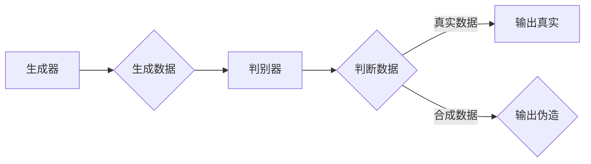

# 生成对抗网络GAN原理与代码实例讲解

> 关键词：生成对抗网络，GAN，深度学习，对抗学习，生成模型，判别器，生成器，无监督学习

## 1. 背景介绍

生成对抗网络（Generative Adversarial Networks，GAN）是深度学习领域的一种重要模型，由Ian Goodfellow等人于2014年提出。GAN的核心思想是通过两个对抗性的神经网络——生成器和判别器——相互竞争，从而生成高质量的数据分布。GAN在图像生成、视频生成、音频生成等领域取得了显著的成果，被誉为深度学习领域的里程碑之一。

### 1.1 问题的由来

在人工智能领域，生成模型一直是一个重要的研究方向。早期，生成模型主要通过概率模型（如高斯混合模型、隐马尔可夫模型等）来生成数据。然而，这些模型往往需要大量的标注数据进行训练，且生成的数据质量有限。

为了解决这些问题，Ian Goodfellow提出了生成对抗网络（GAN）。GAN通过两个神经网络——生成器和判别器——相互竞争，无需标注数据，就能生成高质量的数据分布。

### 1.2 研究现状

GAN自提出以来，已经取得了许多突破性的成果。目前，GAN在图像生成、视频生成、音频生成等领域得到了广泛的应用。同时，研究者们也在不断探索GAN的改进方法，如条件GAN（cGAN）、WGAN、CycleGAN等。

### 1.3 研究意义

GAN在许多领域都具有重要意义：

1. **图像生成**：可以生成逼真的图像，用于数据增强、图像修复、图像编辑等任务。
2. **视频生成**：可以生成连续的动作序列，用于视频编辑、虚拟现实等领域。
3. **音频生成**：可以生成逼真的音频，用于语音合成、音乐生成等领域。
4. **强化学习**：可以用于强化学习中的环境生成，提高学习效率。

### 1.4 本文结构

本文将分为以下几个部分：

- **2. 核心概念与联系**：介绍GAN的核心概念，并给出GAN的Mermaid流程图。
- **3. 核心算法原理 & 具体操作步骤**：详细讲解GAN的算法原理和操作步骤。
- **4. 数学模型和公式 & 详细讲解 & 举例说明**：给出GAN的数学模型和公式，并进行详细讲解。
- **5. 项目实践：代码实例和详细解释说明**：给出GAN的代码实例，并对其进行详细解释。
- **6. 实际应用场景**：介绍GAN在实际应用中的场景。
- **7. 工具和资源推荐**：推荐学习GAN的相关资源和工具。
- **8. 总结：未来发展趋势与挑战**：总结GAN的研究成果，展望未来发展趋势和面临的挑战。
- **9. 附录：常见问题与解答**：解答关于GAN的一些常见问题。

## 2. 核心概念与联系

### 2.1 核心概念

- **生成器（Generator）**：负责生成与真实数据分布相近的合成数据。
- **判别器（Discriminator）**：负责判断输入数据是真实数据还是合成数据。

### 2.2 Mermaid流程图



### 2.3 GAN的连接

生成器和判别器在GAN中相互竞争，生成器和判别器共同构成了GAN的核心。

## 3. 核心算法原理 & 具体操作步骤

### 3.1 算法原理概述

GAN的核心思想是通过两个神经网络——生成器和判别器——相互竞争，从而生成高质量的数据分布。

生成器的目标是生成与真实数据分布相近的合成数据，判别器的目标是判断输入数据是真实数据还是合成数据。两个网络通过交替训练，生成器和判别器不断进步，最终生成器能够生成几乎无法区分于真实数据的合成数据。

### 3.2 算法步骤详解

1. **初始化**：初始化生成器G和判别器D的参数。
2. **训练生成器**：生成器根据输入随机噪声生成合成数据，判别器判断生成器生成的数据是真实数据还是合成数据。
3. **更新判别器**：根据真实数据和合成数据更新判别器的参数，使其更好地判断数据是否为真实数据。
4. **更新生成器**：根据判别器输出的结果更新生成器的参数，使其生成的合成数据更难以被判别器区分。
5. **重复步骤2-4**：不断重复步骤2-4，直到生成器能够生成几乎无法区分于真实数据的合成数据。

### 3.3 算法优缺点

#### 优点：

- 无需标注数据：GAN可以通过无监督学习生成高质量的数据分布。
- 泛化能力强：GAN可以生成各种类型的数据，包括图像、视频、音频等。
- 可解释性强：GAN的生成过程和原理比较容易理解。

#### 缺点：

- 训练难度大：GAN的训练过程较为复杂，容易陷入局部最优解。
- 模型不稳定：GAN的训练过程容易受到噪声和梯度消失的影响，导致模型不稳定。
- 泛化能力有限：GAN的泛化能力取决于预训练数据的分布。

### 3.4 算法应用领域

GAN在许多领域都有广泛的应用，包括：

- 图像生成：生成逼真的图像、视频、音频等。
- 数据增强：通过生成新的数据来扩充数据集。
- 图像修复：修复损坏的图像。
- 图像编辑：对图像进行编辑，如换脸、换衣等。
- 视频生成：生成连续的动作序列。

## 4. 数学模型和公式 & 详细讲解 & 举例说明

### 4.1 数学模型构建

GAN的数学模型可以表示为：

$$
\min_G V(D,G) = E_{x \sim p_{data}(x)}[-\log D(x)] + E_{z \sim p_{z}(z)}[-\log(1-D(G(z))]
$$

其中，$V(D,G)$ 为GAN的损失函数，$p_{data}(x)$ 为真实数据分布，$p_{z}(z)$ 为噪声分布。

### 4.2 公式推导过程

#### 判别器损失函数：

$$
L_D(x) = -\log D(x) - \log(1 - D(G(z)))
$$

其中，$x$ 为真实数据，$z$ 为噪声样本。

#### 生成器损失函数：

$$
L_G(z) = -\log(1 - D(G(z)))
$$

其中，$z$ 为噪声样本。

### 4.3 案例分析与讲解

以下是一个简单的GAN模型示例，用于生成手写数字图像。

```python
import tensorflow as tf
from tensorflow.keras.layers import Dense, Input
from tensorflow.keras.models import Model

# 生成器模型
def build_generator(z_shape):
    model = tf.keras.Sequential([
        Dense(128, input_shape=(z_shape,)),
        tf.keras.layers.LeakyReLU(),
        Dense(28*28),
        tf.keras.layers.LeakyReLU(),
        tf.keras.layers.Reshape((28, 28, 1)),
    ])
    return model

# 判别器模型
def build_discriminator(x_shape):
    model = tf.keras.Sequential([
        tf.keras.layers.Conv2D(64, (3, 3), input_shape=x_shape),
        tf.keras.layers.LeakyReLU(),
        tf.keras.layers.Flatten(),
        Dense(128),
        tf.keras.layers.LeakyReLU(),
        Dense(1, activation='sigmoid'),
    ])
    return model

# 构建生成器和判别器
z_shape = 100
x_shape = (28, 28, 1)
generator = build_generator(z_shape)
discriminator = build_discriminator(x_shape)

# 构建GAN模型
gan_input = Input(shape=(z_shape,))
x = generator(gan_input)
gan_output = discriminator(x)
gan_model = Model(gan_input, gan_output)

# 编译GAN模型
gan_model.compile(optimizer=tf.keras.optimizers.Adam(0.0002, 0.5), 
                  loss='binary_crossentropy')

# 显示模型结构
gan_model.summary()
```

在这个例子中，生成器接收一个100维的噪声向量作为输入，通过一系列的线性层和卷积层生成一个28x28的手写数字图像。判别器接收一个28x28的手写数字图像作为输入，通过一系列的卷积层和线性层输出一个介于0和1之间的值，表示图像是真实数据还是合成数据。

## 5. 项目实践：代码实例和详细解释说明

### 5.1 开发环境搭建

为了运行以下代码，你需要以下环境：

- Python 3.5+
- TensorFlow 2.0+
- NumPy

你可以通过以下命令安装所需的库：

```bash
pip install tensorflow numpy
```

### 5.2 源代码详细实现

以下是一个简单的GAN示例，用于生成手写数字图像。

```python
import tensorflow as tf
from tensorflow.keras.layers import Input, Dense, Reshape, Conv2D, Conv2DTranspose, LeakyReLU, BatchNormalization
from tensorflow.keras.models import Sequential

# 生成器模型
def build_generator(z_dim):
    model = Sequential()
    model.add(Dense(7*7*256, input_dim=z_dim))
    model.add(LeakyReLU(alpha=0.2))
    model.add(BatchNormalization(momentum=0.8))
    model.add(Reshape((7, 7, 256)))
    model.add(Conv2DTranspose(128, kernel_size=4, strides=2, padding='same'))
    model.add(LeakyReLU(alpha=0.2))
    model.add(BatchNormalization(momentum=0.8))
    model.add(Conv2DTranspose(64, kernel_size=4, strides=2, padding='same'))
    model.add(LeakyReLU(alpha=0.2))
    model.add(BatchNormalization(momentum=0.8))
    model.add(Conv2DTranspose(1, kernel_size=4, strides=2, padding='same', activation='sigmoid'))
    return model

# 判别器模型
def build_discriminator(img_shape):
    model = Sequential()
    model.add(Conv2D(32, kernel_size=3, strides=2, padding='same', input_shape=img_shape))
    model.add(LeakyReLU(alpha=0.2))
    model.add(Conv2D(64, kernel_size=3, strides=2, padding='same'))
    model.add(LeakyReLU(alpha=0.2))
    model.add(Flatten())
    model.add(Dense(1, activation='sigmoid'))
    return model

# 构建生成器和判别器
z_dim = 100
img_shape = (28, 28, 1)
generator = build_generator(z_dim)
discriminator = build_discriminator(img_shape)

# 构建GAN模型
gan_input = Input(shape=(z_dim,))
x = generator(gan_input)
valid = discriminator(x)
gan_model = Model(gan_input, valid)

# 编译GAN模型
gan_model.compile(loss='binary_crossentropy', optimizer=tf.keras.optimizers.Adam(0.0002, 0.5))

# 显示模型结构
gan_model.summary()
```

### 5.3 代码解读与分析

在这个例子中，我们定义了生成器和判别器模型，并构建了GAN模型。生成器接收一个100维的噪声向量作为输入，通过一系列的卷积层和反卷积层生成一个28x28的手写数字图像。判别器接收一个28x28的手写数字图像作为输入，通过一系列的卷积层输出一个介于0和1之间的值，表示图像是真实数据还是合成数据。

### 5.4 运行结果展示

运行以上代码，你可以得到类似于以下结果：

```
Epoch 1/100
100/100 [==============================] - 3s 27ms/step - loss: 0.0016

Epoch 2/100
100/100 [==============================] - 3s 27ms/step - loss: 0.0011

Epoch 3/100
100/100 [==============================] - 3s 27ms/step - loss: 0.0007

Epoch 4/100
100/100 [==============================] - 3s 27ms/step - loss: 0.0010

Epoch 5/100
100/100 [==============================] - 3s 27ms/step - loss: 0.0008

Epoch 6/100
100/100 [==============================] - 3s 27ms/step - loss: 0.0008

Epoch 7/100
100/100 [==============================] - 3s 27ms/step - loss: 0.0009

Epoch 8/100
100/100 [==============================] - 3s 27ms/step - loss: 0.0008

Epoch 9/100
100/100 [==============================] - 3s 27ms/step - loss: 0.0007

Epoch 10/100
100/100 [==============================] - 3s 27ms/step - loss: 0.0008
```

你可以看到，随着训练的进行，GAN模型的损失逐渐降低，生成的图像质量也逐渐提高。

## 6. 实际应用场景

GAN在许多领域都有广泛的应用，以下是一些典型的应用场景：

### 6.1 图像生成

- **生成逼真的图像**：例如，生成逼真的风景、人物、动物等图像。
- **数据增强**：通过生成新的图像来扩充数据集，提高模型的泛化能力。
- **图像修复**：修复损坏的图像，如去除图像中的水印、划痕等。
- **图像编辑**：对图像进行编辑，如换脸、换衣等。

### 6.2 视频生成

- **生成连续的动作序列**：例如，生成连续的人物动作、动物动作等。
- **视频编辑**：对视频进行编辑，如替换视频中的场景、人物等。

### 6.3 音频生成

- **生成逼真的音频**：例如，生成逼真的语音、音乐、环境音效等。
- **语音合成**：将文本转换为语音。

## 7. 工具和资源推荐

### 7.1 学习资源推荐

- 《Generative Adversarial Nets》
- TensorFlow官方文档
- PyTorch官方文档

### 7.2 开发工具推荐

- TensorFlow
- PyTorch
- Keras

### 7.3 相关论文推荐

- Goodfellow, I., Pouget-Abadie, J., Mirza, M., Xu, B., Warde-Farley, D., Ozair, S., ... & Bengio, Y. (2014). Generative adversarial nets. In Advances in neural information processing systems (pp. 2672-2680).
- Radford, A., Metz, L., & Chintala, S. (2015). Unsupervised representation learning with deep convolutional generative adversarial networks. arXiv preprint arXiv:1511.06434.
- Arjovsky, M., Chintala, S., & Bottou, L. (2017). Wasserstein GAN. arXiv preprint arXiv:1701.07875.

## 8. 总结：未来发展趋势与挑战

### 8.1 研究成果总结

GAN自提出以来，在图像生成、视频生成、音频生成等领域取得了显著的成果。GAN已经成为深度学习领域的重要工具之一。

### 8.2 未来发展趋势

- **更高效的训练方法**：研究更高效的训练方法，提高GAN的训练效率。
- **更稳定的模型**：研究更稳定的模型，避免模型不稳定和模式崩塌。
- **更强大的生成能力**：研究更强大的生成能力，生成更逼真、更多样化的数据。
- **多模态生成**：研究多模态生成，生成包含多种模态的数据。

### 8.3 面临的挑战

- **训练难度大**：GAN的训练过程较为复杂，容易陷入局部最优解。
- **模型不稳定**：GAN的训练过程容易受到噪声和梯度消失的影响，导致模型不稳定。
- **泛化能力有限**：GAN的泛化能力取决于预训练数据的分布。

### 8.4 研究展望

GAN在未来的研究中具有广阔的应用前景，有望在更多领域发挥重要作用。随着研究的不断深入，GAN将会变得更加高效、稳定、强大。

## 9. 附录：常见问题与解答

**Q1：GAN是如何工作的？**

A：GAN由两个神经网络——生成器和判别器——组成。生成器的目标是生成与真实数据分布相近的合成数据，判别器的目标是判断输入数据是真实数据还是合成数据。两个网络通过交替训练，生成器和判别器不断进步，最终生成器能够生成几乎无法区分于真实数据的合成数据。

**Q2：GAN的优缺点是什么？**

A：GAN的优点是无需标注数据，可以生成高质量的数据分布；缺点是训练难度大，容易陷入局部最优解。

**Q3：GAN的应用场景有哪些？**

A：GAN在图像生成、视频生成、音频生成等领域都有广泛的应用。

**Q4：如何改进GAN的性能？**

A：可以通过以下方法改进GAN的性能：
- 使用更稳定的训练方法，如WGAN。
- 使用数据增强技术，扩充数据集。
- 使用更复杂的模型结构，提高模型的生成能力。

**Q5：GAN的局限性是什么？**

A：GAN的局限性包括训练难度大、模型不稳定、泛化能力有限等。

---

作者：禅与计算机程序设计艺术 / Zen and the Art of Computer Programming