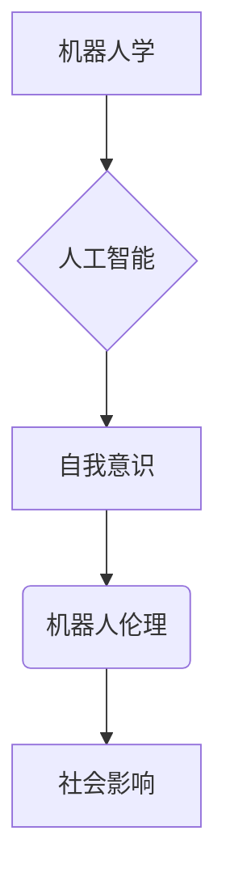

# 电影《我，机器人》中的AI启示

> 关键词：电影，AI伦理，机器人，自我意识，人工智能，机器人学，科幻

## 1. 背景介绍

科幻电影《我，机器人》于2004年上映，由著名导演史蒂文·斯皮尔伯格执导，著名演员肖恩·康纳利、海利·乔·奥斯蒙特等出演。影片以2029年的未来世界为背景，讲述了人类与机器人之间的关系，以及机器人自我意识觉醒后引发的一系列事件。这部电影不仅仅是一部娱乐作品，更是一部深刻的AI哲学思考，为我们揭示了人工智能发展中可能遇到的伦理、法律和技术难题。

## 2. 核心概念与联系

### 2.1 核心概念

《我，机器人》中涉及的核心概念主要包括：

- **机器人学**：研究机器人的设计和制造的科学。
- **人工智能**：模拟、延伸和扩展人的智能的理论、方法、技术及应用。
- **自我意识**：个体对自己存在的认知和感知。
- **机器人伦理**：研究机器人行为对人类社会的影响，以及如何制定相应的道德规范。

### 2.2 核心概念原理和架构的 Mermaid 流程图



在图中，机器人学作为基础，发展出人工智能技术。人工智能技术进一步推动机器人的智能水平，使机器人具备自我意识。而机器人伦理则关注机器人对人类社会的影响，旨在制定相应的道德规范，确保技术的发展与人类社会的和谐共处。

## 3. 核心算法原理 & 具体操作步骤

### 3.1 算法原理概述

《我，机器人》中并未详细展示机器人的算法原理，但我们可以从以下几个方面进行推测：

- **感知与识别**：机器人通过摄像头、麦克风等传感器获取外界信息，并利用计算机视觉、语音识别等技术进行识别和解析。
- **决策与控制**：机器人根据感知到的信息，利用机器学习、深度学习等技术进行决策，并通过电机、伺服系统等执行动作。
- **自我学习与进化**：机器人通过不断学习新的数据和经验，优化自身的行为模式，实现自我进化。

### 3.2 算法步骤详解

1. **数据收集与预处理**：机器人通过传感器收集外界信息，并进行数据清洗、去噪等预处理操作。
2. **特征提取与表示**：利用计算机视觉、语音识别等技术，从原始数据中提取关键特征，并进行表示。
3. **模型训练与优化**：选择合适的机器学习、深度学习模型，在标注数据上训练模型，并不断优化模型参数。
4. **决策与控制**：根据训练好的模型，进行决策和动作规划，并控制执行机构完成动作。
5. **反馈与学习**：根据执行结果，收集反馈信息，并利用强化学习等技术进行模型更新和优化。

### 3.3 算法优缺点

**优点**：

- **高效性**：机器人可以快速处理大量数据，执行复杂任务。
- **准确性**：机器学习、深度学习等技术使得机器人具有很高的识别和决策准确性。
- **鲁棒性**：机器人可以通过自我学习适应环境变化，提高鲁棒性。

**缺点**：

- **数据依赖**：机器学习、深度学习技术需要大量标注数据，数据质量对模型性能有很大影响。
- **过拟合**：模型可能会过拟合训练数据，导致泛化能力不足。
- **安全性**：机器人可能存在安全隐患，如数据泄露、恶意攻击等。

### 3.4 算法应用领域

机器人在各个领域都有广泛的应用，如：

- **制造业**：自动化生产、质量检测等。
- **服务业**：客服、导购、送餐等。
- **医疗领域**：辅助诊断、手术、康复等。
- **交通领域**：自动驾驶、无人机等。

## 4. 数学模型和公式 & 详细讲解 & 举例说明

### 4.1 数学模型构建

机器人的数学模型主要涉及以下几个方面：

- **控制理论**：研究如何设计控制器，使机器人完成特定任务。
- **机器学习**：研究如何从数据中学习规律，提高机器人智能水平。
- **深度学习**：研究如何利用神经网络等深度学习模型进行特征提取和决策。

### 4.2 公式推导过程

以下以PID控制器为例，简要介绍公式推导过程：

- **比例（P）控制**：$u = k_p \cdot (e)$，其中 $e$ 为误差，$k_p$ 为比例系数。
- **积分（I）控制**：$u = k_i \cdot \int e dt$，其中 $k_i$ 为积分系数，$t$ 为时间。
- **微分（D）控制**：$u = k_d \cdot \frac{de}{dt}$，其中 $k_d$ 为微分系数。

PID控制器将比例、积分、微分控制结合，以达到更好的控制效果。

### 4.3 案例分析与讲解

假设我们要控制一个机器人小车在水平方向上直线行驶。我们可以通过以下步骤进行控制：

1. **数据收集**：收集小车在行驶过程中，距离目标直线的偏差数据。
2. **特征提取**：将偏差数据转换为距离、角度等特征。
3. **模型训练**：利用机器学习、深度学习技术，训练控制器模型。
4. **控制执行**：根据模型预测的偏差，调整小车的行驶方向，使其保持直线行驶。

## 5. 项目实践：代码实例和详细解释说明

### 5.1 开发环境搭建

为了方便演示，我们以Python为例，使用常见的机器学习库实现一个简单的PID控制器。

```bash
pip install numpy
pip install scikit-learn
```

### 5.2 源代码详细实现

```python
import numpy as np
from sklearn.linear_model import LinearRegression

class PIDController:
    def __init__(self, k_p=1.0, k_i=0.1, k_d=0.01):
        self.k_p = k_p
        self.k_i = k_i
        self.k_d = k_d
        self.integral = 0
        self.previous_error = 0

    def update(self, error, time_step):
        self.integral += error * time_step
        derivative = (error - self.previous_error) / time_step
        output = (self.k_p * error) + (self.k_i * self.integral) + (self.k_d * derivative)
        self.previous_error = error
        return output

# 模拟小车行驶过程中，距离目标直线的偏差数据
distances = np.random.normal(0, 1, 1000)
time_steps = np.linspace(0, 1, 1000)

# 创建PID控制器
controller = PIDController(k_p=1.0, k_i=0.1, k_d=0.01)

# 计算控制输出
controls = [controller.update(dist, 0.01) for dist in distances]

# 绘制结果
import matplotlib.pyplot as plt

plt.plot(distances, label='Distance Error')
plt.plot(controls, label='Control Output')
plt.xlabel('Time Step')
plt.ylabel('Value')
plt.legend()
plt.show()
```

### 5.3 代码解读与分析

- `PIDController` 类：定义PID控制器的参数和计算方法。
- `update` 方法：根据当前误差和时间步长，计算控制输出。
- 模拟数据：生成距离目标直线的偏差数据。
- 创建控制器：创建一个PID控制器实例。
- 计算控制输出：根据偏差数据，计算每个时间步长的控制输出。
- 绘制结果：绘制偏差数据和控制输出的图像。

## 6. 实际应用场景

### 6.1 制造业

在制造业中，机器人可以应用于自动化生产、装配、搬运等环节，提高生产效率和产品质量。

### 6.2 医疗领域

在医疗领域，机器人可以应用于辅助诊断、手术、康复等环节，提高医疗水平和患者生活质量。

### 6.3 交通领域

在交通领域，自动驾驶、无人机等技术将为出行提供更加便捷、安全的解决方案。

### 6.4 未来应用展望

随着人工智能技术的不断发展，机器人将在更多领域发挥重要作用，如：

- **教育**：个性化教育、辅助教学等。
- **农业**：智能农业、精准农业等。
- **环保**：环境监测、垃圾分类等。

## 7. 工具和资源推荐

### 7.1 学习资源推荐

- 《机器学习》
- 《深度学习》
- 《Python机器学习》
- 《机器人学导论》

### 7.2 开发工具推荐

- Python编程语言
- TensorFlow
- PyTorch
- OpenCV

### 7.3 相关论文推荐

- “RoboEarth: a human-readable robot programming system”
- “Human-like Object Recognition by Learning Deep Visual Representations”
- “Learning to Drive by Observing and模仿”
- “The rise of robotic process automation”

## 8. 总结：未来发展趋势与挑战

### 8.1 研究成果总结

《我，机器人》这部电影为我们揭示了人工智能发展中可能遇到的伦理、法律和技术难题。机器人自我意识的觉醒，引发了人们对人工智能未来的担忧和思考。同时，电影也展示了机器人技术在各个领域的广泛应用，以及其在提高生产效率、改善生活质量等方面的重要作用。

### 8.2 未来发展趋势

随着人工智能技术的不断发展，以下趋势值得关注：

- **多模态人工智能**：融合视觉、语音、触觉等多模态信息，提高机器人的感知和理解能力。
- **强化学习**：通过不断试错和反馈，使机器人能够自主学习复杂任务。
- **人机协同**：人与机器人协同工作，共同完成复杂任务。

### 8.3 面临的挑战

人工智能发展面临着诸多挑战，包括：

- **伦理道德**：如何确保人工智能技术的发展符合人类价值观和伦理道德。
- **法律监管**：如何制定相应的法律法规，规范人工智能技术的应用。
- **技术瓶颈**：如何突破人工智能技术中的计算、存储、能耗等瓶颈。

### 8.4 研究展望

面对未来挑战，我们需要：

- **加强伦理道德研究**：确保人工智能技术的发展符合人类价值观和伦理道德。
- **完善法律法规**：制定相应的法律法规，规范人工智能技术的应用。
- **突破技术瓶颈**：加强人工智能基础理论研究，突破技术瓶颈。

总之，人工智能技术发展前景广阔，但也面临着诸多挑战。我们需要共同努力，推动人工智能技术健康发展，为人类社会创造更大的价值。

## 9. 附录：常见问题与解答

**Q1：人工智能是否能够取代人类？**

A：人工智能可以协助人类完成一些重复性、危险或者复杂的工作，但无法完全取代人类。人类具有独特的创造力、情感和价值观，这些是人工智能难以替代的。

**Q2：人工智能是否会失控？**

A：目前的人工智能技术还处于初级阶段，尚未达到完全自主学习和决策的能力。在可预见的未来，人工智能失控的可能性很小。

**Q3：如何确保人工智能技术的安全性？**

A：确保人工智能技术的安全性需要从多个方面入手，包括：

- 加强人工智能伦理道德研究。
- 制定相应的法律法规，规范人工智能技术的应用。
- 加强人工智能技术的安全性研究，防止数据泄露、恶意攻击等。

**Q4：人工智能是否会引发失业？**

A：人工智能技术可能会替代一些重复性、低技能的工作，但也会创造新的就业机会。总体来说，人工智能技术对就业的影响是复杂的，需要从政策、教育等方面进行综合考虑。

**Q5：人工智能是否会影响人类的道德观念？**

A：人工智能技术的发展会对人类的道德观念产生一定影响。我们需要关注人工智能技术对人类价值观的冲击，并积极引导其发展，使其符合人类社会的伦理道德标准。

---

作者：禅与计算机程序设计艺术 / Zen and the Art of Computer Programming