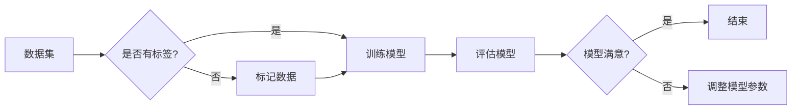

# 监督学习 原理与代码实例讲解

> 关键词：监督学习，机器学习，分类，回归，决策树，随机森林，支持向量机，神经网络，Python，Scikit-learn

## 1. 背景介绍

监督学习（Supervised Learning）是机器学习（Machine Learning）中的一种重要学习方法。它通过从已标记的数据集中学习，使得模型能够对未知数据进行预测或分类。监督学习在各个领域都有广泛的应用，如图像识别、自然语言处理、推荐系统等。

本篇文章将深入探讨监督学习的原理，并通过实际代码实例讲解如何使用Python和Scikit-learn库来实现常见的监督学习算法。

## 2. 核心概念与联系

### 2.1 监督学习核心概念

- **特征（Feature）**：用于表示数据的属性或变量。
- **标签（Label）**：数据对应的真实值，用于训练模型。
- **训练集（Training Set）**：用于训练模型的已标记数据集。
- **测试集（Test Set）**：用于评估模型性能的未标记数据集。
- **验证集（Validation Set）**：用于调整模型超参数的额外数据集。

### 2.2 监督学习架构的Mermaid流程图



## 3. 核心算法原理 & 具体操作步骤

### 3.1 算法原理概述

监督学习算法可分为两大类：**分类算法**和**回归算法**。

- **分类算法**：将数据分为不同的类别。例如，将邮件分为垃圾邮件和非垃圾邮件。
- **回归算法**：预测连续值。例如，预测房价。

### 3.2 算法步骤详解

1. 数据预处理：对数据进行清洗、转换和标准化。
2. 选择模型：根据任务类型选择合适的算法。
3. 训练模型：使用训练数据集对模型进行训练。
4. 评估模型：使用测试集评估模型的性能。
5. 调整超参数：根据评估结果调整模型参数。
6. 模型部署：将训练好的模型部署到实际应用中。

### 3.3 算法优缺点

以下是几种常见监督学习算法的优缺点：

- **决策树（Decision Tree）**：
  - 优点：易于理解和解释。
  - 缺点：容易过拟合，对异常值敏感。

- **随机森林（Random Forest）**：
  - 优点：能够处理高维数据，减少过拟合。
  - 缺点：解释性不如决策树。

- **支持向量机（SVM）**：
  - 优点：泛化能力强，对噪声和异常值鲁棒。
  - 缺点：计算量大，对参数敏感。

- **神经网络**：
  - 优点：能够处理复杂的数据关系。
  - 缺点：需要大量数据和计算资源，难以解释。

### 3.4 算法应用领域

监督学习算法在各个领域都有广泛的应用，以下是一些常见的应用场景：

- 电子商务：推荐系统、客户细分、欺诈检测。
- 医疗健康：疾病诊断、药物发现、患者预后。
- 金融：信用评分、风险评估、欺诈检测。
- 交通：自动驾驶、交通流量预测、车辆定位。

## 4. 数学模型和公式 & 详细讲解 & 举例说明

### 4.1 数学模型构建

监督学习模型的数学模型通常包括损失函数、优化算法等。

- **损失函数**：用于衡量模型预测值与真实值之间的差异。常见的损失函数有均方误差（MSE）和交叉熵损失（Cross-Entropy）。
- **优化算法**：用于找到最小化损失函数的模型参数。常见的优化算法有梯度下降（Gradient Descent）和Adam。

### 4.2 公式推导过程

以下以线性回归为例，介绍损失函数的推导过程。

假设我们要拟合一个线性模型：

$$
y = \beta_0 + \beta_1x
$$

其中 $y$ 为预测值，$x$ 为特征，$\beta_0$ 和 $\beta_1$ 为模型参数。

均方误差损失函数为：

$$
MSE(\beta_0, \beta_1) = \frac{1}{N}\sum_{i=1}^{N}(y_i - (\beta_0 + \beta_1x_i))^2
$$

### 4.3 案例分析与讲解

以下使用Python和Scikit-learn库实现线性回归，并分析模型的预测结果。

```python
from sklearn.linear_model import LinearRegression
import numpy as np
import matplotlib.pyplot as plt

# 生成模拟数据
x = np.linspace(0, 10, 100)
y = 2*x + 3 + np.random.normal(0, 1, 100)

# 创建线性回归模型
model = LinearRegression()

# 训练模型
model.fit(x.reshape(-1, 1), y)

# 预测
x_pred = np.linspace(0, 10, 100).reshape(-1, 1)
y_pred = model.predict(x_pred)

# 绘图
plt.scatter(x, y, label='真实数据')
plt.plot(x_pred, y_pred, label='预测结果', color='red')
plt.legend()
plt.show()
```

## 5. 项目实践：代码实例和详细解释说明

### 5.1 开发环境搭建

1. 安装Python 3.6及以上版本。
2. 安装Scikit-learn库。

```bash
pip install scikit-learn
```

### 5.2 源代码详细实现

以下使用Scikit-learn库实现决策树分类器，并分析模型的预测结果。

```python
from sklearn.tree import DecisionTreeClassifier
from sklearn.model_selection import train_test_split
from sklearn.metrics import classification_report

# 生成模拟数据
x = np.linspace(0, 10, 100)
y = np.sin(x)

# 创建决策树分类器
model = DecisionTreeClassifier()

# 划分训练集和测试集
x_train, x_test, y_train, y_test = train_test_split(x, y, test_size=0.3, random_state=42)

# 训练模型
model.fit(x_train, y_train)

# 预测
y_pred = model.predict(x_test)

# 评估模型
print(classification_report(y_test, y_pred))
```

### 5.3 代码解读与分析

- 生成模拟数据：使用numpy生成线性数据，并添加噪声。
- 创建决策树分类器：使用Scikit-learn的DecisionTreeClassifier创建模型。
- 划分训练集和测试集：使用train_test_split将数据划分为训练集和测试集。
- 训练模型：使用fit方法训练模型。
- 预测：使用predict方法对测试集进行预测。
- 评估模型：使用classification_report输出模型的分类报告。

## 6. 实际应用场景

### 6.1 金融领域

在金融领域，监督学习算法可以用于以下应用：

- 信用评分：根据借款人的历史数据预测其信用风险。
- 欺诈检测：识别异常交易行为，预防金融欺诈。
- 股票预测：根据历史股价、成交量等数据预测股票价格走势。

### 6.2 医疗领域

在医疗领域，监督学习算法可以用于以下应用：

- 疾病诊断：根据患者症状、病史等数据预测疾病类型。
- 药物发现：根据药物分子结构预测其药效。
- 病情预测：根据患者病情变化趋势预测患者预后。

## 7. 工具和资源推荐

### 7.1 学习资源推荐

- 《统计学习方法》（周志华）
- 《机器学习》（Tom M. Mitchell）
- 《Python机器学习》（Sebastian Raschka）

### 7.2 开发工具推荐

- Scikit-learn：Python机器学习库。
- TensorFlow：Google的深度学习框架。
- PyTorch：Facebook的深度学习框架。

### 7.3 相关论文推荐

- "A Few Useful Things to Know about Machine Learning"（Pedro Domingos）
- "Understanding Deep Learning"（Yoshua Bengio）
- "Learning from Data"（Trevor Hastie, Robert Tibshirani, Jerome Friedman）

## 8. 总结：未来发展趋势与挑战

### 8.1 研究成果总结

监督学习作为机器学习的重要分支，在各个领域都有广泛的应用。本文介绍了监督学习的核心概念、算法原理、代码实例，并探讨了其应用场景和未来发展趋势。

### 8.2 未来发展趋势

- **深度学习的融合**：将深度学习技术融入监督学习，提高模型的精度和泛化能力。
- **无监督和半监督学习**：减少对标注数据的依赖，降低数据获取成本。
- **可解释性增强**：提高模型的可解释性，便于理解和信任。

### 8.3 面临的挑战

- **数据标注成本**：高质量的标注数据获取成本高，难以满足大规模模型的训练需求。
- **模型可解释性**：深度学习模型的可解释性较差，难以理解模型的决策过程。
- **数据隐私和安全**：在处理敏感数据时，需要保护用户隐私和数据安全。

### 8.4 研究展望

未来，监督学习将继续发展，并在更多领域发挥作用。通过不断创新，我们期待监督学习能够更好地服务于人类社会。

## 9. 附录：常见问题与解答

**Q1：什么是监督学习？**

A：监督学习是一种机器学习方法，通过从已标记的数据集中学习，使得模型能够对未知数据进行预测或分类。

**Q2：监督学习有哪些常见算法？**

A：常见的监督学习算法包括线性回归、逻辑回归、决策树、支持向量机、神经网络等。

**Q3：如何选择合适的监督学习算法？**

A：选择合适的监督学习算法需要考虑数据特点、任务类型、模型复杂度等因素。

**Q4：什么是过拟合？如何解决过拟合问题？**

A：过拟合是指模型在训练数据上表现良好，但在测试数据上表现不佳。解决过拟合问题的方法包括数据增强、正则化、集成学习等。

**Q5：什么是模型可解释性？为什么重要？**

A：模型可解释性是指模型决策过程的透明度和可理解性。模型可解释性重要，因为只有理解模型的决策过程，才能更好地信任和应用模型。

作者：禅与计算机程序设计艺术 / Zen and the Art of Computer Programming