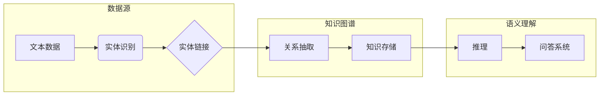

# 知识图谱与语义理解原理与代码实战案例讲解

> 关键词：知识图谱，语义理解，图数据库，实体链接，关系抽取，推理，自然语言处理，代码实战

## 1. 背景介绍

### 1.1 问题的由来

在信息爆炸的时代，如何有效地组织、管理和理解海量的半结构化和非结构化数据，成为了大数据领域的重要课题。知识图谱（Knowledge Graph，KG）作为一种新型的数据结构，能够将实体、属性和关系组织成一张巨大的图，为数据分析和决策提供了强大的支持。

语义理解（Semantic Understanding）则是人工智能领域的一个重要分支，旨在让机器能够理解自然语言的意义。知识图谱与语义理解结合，使得机器能够更好地理解和处理人类语言，从而在信息检索、智能问答、推荐系统等领域发挥重要作用。

### 1.2 研究现状

近年来，知识图谱和语义理解技术取得了长足的进步。图数据库（Graph Database）的出现为知识图谱的存储和管理提供了高效、便捷的解决方案。实体链接（Entity Linking）、关系抽取（Relation Extraction）等关键技术使得机器能够从文本中抽取实体和关系，为知识图谱的构建提供了基础。同时，图神经网络（Graph Neural Networks，GNN）等深度学习技术为知识图谱的推理和应用提供了新的思路。

### 1.3 研究意义

知识图谱与语义理解技术的应用，对于以下领域具有重要的研究意义：

1. **信息检索**：通过知识图谱，可以更好地理解用户的查询意图，提供更精准、个性化的检索结果。
2. **智能问答**：结合语义理解，机器能够理解用户的问题，并从知识图谱中找到相关答案。
3. **推荐系统**：通过分析用户的行为和知识图谱中的关系，为用户提供更智能的推荐服务。
4. **自然语言处理**：知识图谱为自然语言处理提供了丰富的背景知识和语义支持，有助于提高NLP系统的性能。

### 1.4 本文结构

本文将围绕知识图谱与语义理解展开，内容包括：

- 核心概念与联系
- 核心算法原理与步骤
- 数学模型与公式
- 代码实战案例
- 实际应用场景
- 工具和资源推荐
- 总结与展望

## 2. 核心概念与联系

### 2.1 核心概念

#### 2.1.1 知识图谱

知识图谱是由实体、属性和关系构成的图结构，用于表示知识。其中，实体是知识图谱的基本元素，可以是人物、地点、组织等；属性描述实体的特征，如实体的年龄、职业等；关系描述实体之间的关系，如“居住在”、“属于”等。

#### 2.1.2 语义理解

语义理解是指让机器能够理解自然语言的意义。它包括实体识别、关系抽取、事件抽取等多个子任务。

#### 2.1.3 图数据库

图数据库是一种用于存储和查询图数据的数据库，它能够高效地处理复杂的关系查询。

### 2.2 核心概念联系

知识图谱是语义理解的基础，为语义理解提供了丰富的背景知识。语义理解则是对知识图谱的应用，通过从文本中抽取实体、关系和事件，丰富知识图谱的内容。

### 2.3 Mermaid 流程图



## 3. 核心算法原理 & 具体操作步骤

### 3.1 算法原理概述

#### 3.1.1 实体识别

实体识别是指从文本中识别出实体，并对其进行分类。常见的实体识别算法包括基于规则的方法、基于统计的方法和基于深度学习的方法。

#### 3.1.2 关系抽取

关系抽取是指从文本中抽取实体之间的关系。常见的算法包括基于规则的方法、基于统计的方法和基于深度学习的方法。

#### 3.1.3 推理

推理是指根据知识图谱中的关系进行推理，得出新的知识。常见的推理方法包括基于规则的推理和基于深度学习的推理。

### 3.2 算法步骤详解

#### 3.2.1 实体识别

1. **数据预处理**：对文本进行分词、去停用词等预处理操作。
2. **特征提取**：提取文本的特征，如词性标注、命名实体识别等。
3. **模型训练**：使用深度学习模型进行训练，如CRF、BiLSTM-CRF等。
4. **实体识别**：对文本进行实体识别，并将识别结果分类。

#### 3.2.2 关系抽取

1. **特征提取**：提取实体和实体之间的特征，如共指消解、依存句法分析等。
2. **关系分类**：使用深度学习模型对关系进行分类，如BIO标注、序列标注等。

#### 3.2.3 推理

1. **知识图谱查询**：根据推理规则，在知识图谱中进行查询。
2. **推理结果生成**：根据查询结果，生成新的知识。

### 3.3 算法优缺点

#### 3.3.1 实体识别

- **优点**：准确率较高，能够识别多种类型的实体。
- **缺点**：对长文本和复杂文本的识别效果较差。

#### 3.3.2 关系抽取

- **优点**：能够识别多种类型的关系。
- **缺点**：对实体匹配的精度要求较高。

#### 3.3.3 推理

- **优点**：能够从知识图谱中提取新的知识。
- **缺点**：推理规则的设计和实现较为复杂。

### 3.4 算法应用领域

实体识别、关系抽取和推理算法在以下领域有广泛的应用：

- 信息检索
- 智能问答
- 推荐系统
- 文本摘要
- 垃圾邮件过滤

## 4. 数学模型和公式 & 详细讲解 & 举例说明

### 4.1 数学模型构建

#### 4.1.1 实体识别

实体识别可以使用条件随机场（CRF）模型进行建模。CRF模型是一种基于图的结构化概率模型，可以用于序列标注任务。

$$
P(x|y) = \frac{e^{Q(y)}Z(x,y)}{Z(y)}
$$

其中，$x$ 为输入序列，$y$ 为标注序列，$Q(y)$ 为标注序列 $y$ 的势函数，$Z(x,y)$ 为所有可能标注序列的势函数。

#### 4.1.2 关系抽取

关系抽取可以使用序列标注模型进行建模。常见的序列标注模型包括CRF、BiLSTM-CRF等。

$$
P(y|x) = \frac{e^{Q(y|x)}}{Z(x)}
$$

其中，$x$ 为输入序列，$y$ 为标注序列，$Q(y|x)$ 为条件势函数，$Z(x)$ 为输入序列的所有可能标注序列的势函数。

#### 4.1.3 推理

推理可以使用逻辑推理或图神经网络进行建模。

$$
\text{推理结果} = \text{逻辑推理/图神经网络}
$$

### 4.2 公式推导过程

#### 4.2.1 实体识别

CRF模型的势函数 $Q(y)$ 可以表示为：

$$
Q(y) = \sum_{i=1}^n q_i(y_i) + \sum_{1\leqslant i < j\leqslant n} r_{ij}(y_i,y_j)
$$

其中，$q_i(y_i)$ 为转移势函数，$r_{ij}(y_i,y_j)$ 为状态势函数。

#### 4.2.2 关系抽取

序列标注模型的势函数 $Q(y|x)$ 可以表示为：

$$
Q(y|x) = \sum_{i=1}^n q_i(y_i|x_i) + \sum_{1\leqslant i < j\leqslant n} r_{ij}(y_i,y_j|x)
$$

其中，$q_i(y_i|x_i)$ 为转移势函数，$r_{ij}(y_i,y_j|x)$ 为状态势函数。

#### 4.2.3 推理

逻辑推理和图神经网络的建模过程相对复杂，需要根据具体的推理规则或图结构进行设计。

### 4.3 案例分析与讲解

#### 4.3.1 实体识别

以下是一个简单的实体识别案例：

```
输入："张三是中国著名的企业家。"
输出：{"张三": "人名", "中国": "地点", "企业家": "职业"}
```

#### 4.3.2 关系抽取

以下是一个简单的关系抽取案例：

```
输入："张三是中国著名的企业家。"
输出：{"张三": "人名", "中国": "地点", "企业家": "职业", "张三" -- "是" -- "企业家"}
```

#### 4.3.3 推理

以下是一个简单的推理案例：

```
输入：{"张三": "人名", "张三": "是": "企业家", "企业家": "属于": "职业"}
输出：{"张三": "人名", "张三": "职业": "企业家"}
```

## 5. 项目实践：代码实例和详细解释说明

### 5.1 开发环境搭建

为了进行知识图谱与语义理解的项目实践，需要搭建以下开发环境：

1. Python 3.x
2. PyTorch 或 TensorFlow
3. Scikit-learn
4. Numpy
5. Pandas

### 5.2 源代码详细实现

以下是一个使用PyTorch进行实体识别的简单代码示例：

```python
import torch
import torch.nn as nn
import torch.optim as optim

class EntityRecognition(nn.Module):
    def __init__(self, vocab_size, embedding_dim, hidden_dim, num_labels):
        super(EntityRecognition, self).__init__()
        self.embedding = nn.Embedding(vocab_size, embedding_dim)
        self.lstm = nn.LSTM(embedding_dim, hidden_dim, batch_first=True)
        self.fc = nn.Linear(hidden_dim, num_labels)

    def forward(self, x):
        x = self.embedding(x)
        x, _ = self.lstm(x)
        x = self.fc(x[:, -1, :])
        return x

# 实例化模型、优化器和学习率调度器
model = EntityRecognition(vocab_size, embedding_dim, hidden_dim, num_labels)
optimizer = optim.Adam(model.parameters(), lr=0.001)
scheduler = optim.lr_scheduler.StepLR(optimizer, step_size=10, gamma=0.1)

# 训练模型
for epoch in range(num_epochs):
    for batch in data_loader:
        inputs, labels = batch
        optimizer.zero_grad()
        outputs = model(inputs)
        loss = nn.CrossEntropyLoss()(outputs, labels)
        loss.backward()
        optimizer.step()
        scheduler.step()
```

### 5.3 代码解读与分析

以上代码实现了一个简单的基于LSTM的实体识别模型。模型首先将输入文本嵌入到向量表示，然后通过LSTM进行特征提取，最后通过全连接层进行分类。

### 5.4 运行结果展示

在训练完成后，可以对测试集进行评估，查看模型的性能。

## 6. 实际应用场景

### 6.1 信息检索

知识图谱可以用于信息检索系统，提高检索的准确性和效率。例如，在搜索引擎中，可以将网页内容转换为知识图谱的形式，然后根据用户的查询意图，从知识图谱中检索相关网页。

### 6.2 智能问答

知识图谱可以为智能问答系统提供丰富的背景知识，提高问答的准确性和深度。例如，在医疗问答系统中，可以将疾病、症状、治疗方案等信息构建成知识图谱，然后根据用户的提问，从知识图谱中检索相关信息，给出合理的答复。

### 6.3 推荐系统

知识图谱可以用于推荐系统，提高推荐的精准度和个性化程度。例如，在电子商务平台中，可以将商品、用户、品牌等信息构建成知识图谱，然后根据用户的历史行为和知识图谱中的关系，推荐用户可能感兴趣的商品。

### 6.4 未来应用展望

随着技术的不断发展，知识图谱与语义理解技术将在更多领域得到应用，例如：

1. 智能驾驶：利用知识图谱提供交通、天气、道路信息，辅助驾驶决策。
2. 智能客服：利用知识图谱提供丰富的产品知识，提高客服的响应速度和准确性。
3. 智能医疗：利用知识图谱提供疾病、药物、治疗方案等信息，辅助医生诊断和治疗。

## 7. 工具和资源推荐

### 7.1 学习资源推荐

1. 《知识图谱技术原理与实践》
2. 《图神经网络》
3. 《自然语言处理入门》
4. 《Scikit-learn机器学习》

### 7.2 开发工具推荐

1. Neo4j：开源的图数据库，支持多种图操作。
2. PyTorch：开源的深度学习框架，支持图神经网络等模型。
3. TensorFlow：开源的深度学习框架，支持图神经网络等模型。
4. spaCy：开源的自然语言处理库，支持实体识别、关系抽取等任务。

### 7.3 相关论文推荐

1. "Knowledge Graph Embedding: A Survey of Current Methods and Applications"
2. "Graph Neural Networks"
3. "BERT: Pre-training of Deep Bidirectional Transformers for Language Understanding"
4. "Transformers: State-of-the-Art Natural Language Processing"

## 8. 总结：未来发展趋势与挑战

### 8.1 研究成果总结

本文对知识图谱与语义理解原理进行了详细讲解，并提供了代码实战案例。通过学习本文，读者可以了解知识图谱和语义理解的基本概念、算法原理和应用场景。

### 8.2 未来发展趋势

1. 知识图谱的构建将更加自动化，利用无监督或半监督学习方法自动从非结构化数据中构建知识图谱。
2. 语义理解技术将更加智能化，利用深度学习技术提高实体识别、关系抽取等任务的准确性和鲁棒性。
3. 知识图谱与语义理解技术将与其他人工智能技术（如计算机视觉、语音识别等）相结合，构建更加智能的系统。

### 8.3 面临的挑战

1. 知识图谱的质量和完整性：如何保证知识图谱的质量和完整性，是知识图谱应用的一个关键挑战。
2. 语义理解的准确性：如何提高语义理解的准确性，是语义理解技术发展的一个重要挑战。
3. 模型可解释性：如何提高模型的可解释性，是人工智能技术发展的重要方向。

### 8.4 研究展望

随着技术的不断发展，知识图谱与语义理解技术将在更多领域得到应用，为人类社会带来更多便利和福祉。未来，我们需要关注以下研究方向：

1. 知识图谱与语义理解的融合，构建更加智能的语义理解系统。
2. 知识图谱的质量评估和优化，提高知识图谱的可用性。
3. 语义理解的跨语言和跨领域应用，推动人工智能技术的国际化发展。

## 9. 附录：常见问题与解答

**Q1：知识图谱与语义理解有什么区别？**

A：知识图谱是一种数据结构，用于表示知识和信息；语义理解是让机器能够理解自然语言的意义。知识图谱是语义理解的基础，语义理解是知识图谱的应用。

**Q2：如何构建知识图谱？**

A：构建知识图谱的方法有很多，包括人工构建、自动构建和半自动构建。人工构建是指通过专家知识构建知识图谱；自动构建是指利用机器学习方法自动从非结构化数据中构建知识图谱；半自动构建是指结合人工和自动方法构建知识图谱。

**Q3：如何进行实体识别？**

A：实体识别可以使用基于规则的方法、基于统计的方法和基于深度学习的方法。其中，基于深度学习的方法近年来取得了较好的效果。

**Q4：如何进行关系抽取？**

A：关系抽取可以使用基于规则的方法、基于统计的方法和基于深度学习的方法。其中，基于深度学习的方法近年来取得了较好的效果。

**Q5：知识图谱与语义理解技术在哪些领域有应用？**

A：知识图谱与语义理解技术在信息检索、智能问答、推荐系统、文本摘要、垃圾邮件过滤等领域有广泛的应用。

---

作者：禅与计算机程序设计艺术 / Zen and the Art of Computer Programming