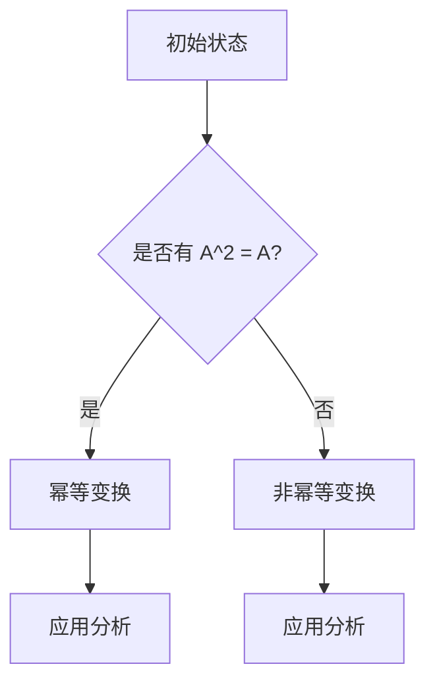

# 矩阵理论与应用：幂等变换与幂等矩阵

> 关键词：矩阵理论，幂等变换，幂等矩阵，线性代数，应用，特征值，特征向量，迭代，稳定性

## 1. 背景介绍

矩阵理论是现代数学和工程学中的基础学科，它在自然科学、社会科学、经济学和计算机科学等领域都有广泛的应用。矩阵作为一种数学工具，可以有效地表示线性变换和线性系统，因此在解决各种实际问题时扮演着重要角色。本文将重点探讨矩阵理论中的一个重要概念——幂等变换与幂等矩阵，并探讨其在不同领域的应用。

### 1.1 问题的由来

在数学和工程学中，许多问题可以抽象为矩阵运算的问题。例如，线性方程组的求解、特征值和特征向量的计算、矩阵分解等。幂等变换与幂等矩阵是矩阵理论中的一个基本概念，它们在研究线性系统的稳定性、迭代过程以及矩阵运算的性质等方面具有重要意义。

### 1.2 研究现状

幂等变换与幂等矩阵的研究已经历了长时间的发展，许多学者对其性质和应用进行了深入研究。目前，该领域已经形成了一系列的理论和方法，并在多个领域得到了成功的应用。

### 1.3 研究意义

研究幂等变换与幂等矩阵对于理解线性系统的行为、优化算法设计以及解决实际问题具有重要意义。通过深入研究幂等矩阵的性质，可以更好地掌握矩阵运算的规律，提高算法的效率和稳定性。

### 1.4 本文结构

本文将按照以下结构进行论述：

- 第二部分介绍矩阵理论和幂等变换与幂等矩阵的核心概念。
- 第三部分详细阐述幂等变换与幂等矩阵的原理和具体操作步骤。
- 第四部分通过数学模型和公式进行详细讲解，并结合实例进行分析。
- 第五部分给出幂等变换与幂等矩阵在项目实践中的应用实例。
- 第六部分探讨幂等变换与幂等矩阵在不同领域的实际应用场景。
- 第七部分总结本文的研究成果，展望未来发展趋势与挑战。
- 第八部分列出常见问题与解答。

## 2. 核心概念与联系

### 2.1 核心概念

**矩阵**：一个由数字构成的矩形数组，用大括号 `{}` 表示，如：

$$
A = \begin{bmatrix}
a_{11} & a_{12} & \dots & a_{1n} \\
a_{21} & a_{22} & \dots & a_{2n} \\
\vdots & \vdots & \ddots & \vdots \\
a_{m1} & a_{m2} & \dots & a_{mn}
\end{bmatrix}
$$

**线性变换**：将向量空间中的每一个向量映射到另一个向量空间的线性映射。

**幂等变换**：对于线性变换 $T$，如果 $T^2 = T$，则称 $T$ 为幂等变换。

**幂等矩阵**：对于矩阵 $A$，如果 $A^2 = A$，则称 $A$ 为幂等矩阵。

### 2.2 Mermaid 流程图



### 2.3 核心概念联系

矩阵是线性变换的数学表示，而幂等变换是线性变换的一种特殊形式。如果矩阵表示的是幂等变换，则称该矩阵为幂等矩阵。幂等矩阵和幂等变换在矩阵理论和实际应用中有着密切的联系。

## 3. 核心算法原理 & 具体操作步骤

### 3.1 算法原理概述

幂等变换与幂等矩阵的核心原理在于研究线性变换和矩阵运算的性质，包括矩阵的平方、矩阵的特征值和特征向量等。

### 3.2 算法步骤详解

#### 3.2.1 判断矩阵是否为幂等矩阵

1. 计算矩阵 $A$ 的平方 $A^2$。
2. 比较矩阵 $A$ 和 $A^2$ 是否相同。
3. 如果相同，则 $A$ 是幂等矩阵；否则，$A$ 不是幂等矩阵。

#### 3.2.2 计算幂等矩阵的特征值和特征向量

1. 计算矩阵 $A$ 的特征值 $\lambda$。
2. 对于每个特征值 $\lambda$，求解方程 $(A-\lambda I)x=0$，得到对应的特征向量 $x$。

### 3.3 算法优缺点

#### 3.3.1 优点

- 算法原理简单，易于理解和实现。
- 可以有效地判断矩阵是否为幂等矩阵。
- 可以计算幂等矩阵的特征值和特征向量。

#### 3.3.2 缺点

- 算法复杂度较高，计算量大。
- 对于大型矩阵，计算过程可能会非常耗时。

### 3.4 算法应用领域

幂等变换与幂等矩阵在以下领域有广泛的应用：

- 线性代数：研究矩阵的性质和运算。
- 系统工程：分析线性系统的稳定性和性能。
- 计算机图形学：处理图像的滤波、平滑等操作。
- 信号处理：信号的去噪、滤波等操作。

## 4. 数学模型和公式 & 详细讲解 & 举例说明

### 4.1 数学模型构建

幂等变换与幂等矩阵的数学模型可以通过以下公式表示：

$$
A^2 = A
$$

其中 $A$ 为矩阵，$^2$ 表示矩阵乘法。

### 4.2 公式推导过程

假设矩阵 $A$ 是幂等矩阵，则有：

$$
A^2 = A \cdot A
$$

由于 $A$ 是幂等矩阵，所以 $A^2 = A$，因此：

$$
A \cdot A = A
$$

### 4.3 案例分析与讲解

**案例**：判断矩阵 $A = \begin{bmatrix} 1 & 0 \\ 0 & 0 \end{bmatrix}$ 是否为幂等矩阵。

**解答**：

1. 计算 $A^2$：
   $$
A^2 = \begin{bmatrix} 1 & 0 \\ 0 & 0 \end{bmatrix} \cdot \begin{bmatrix} 1 & 0 \\ 0 & 0 \end{bmatrix} = \begin{bmatrix} 1 & 0 \\ 0 & 0 \end{bmatrix}
$$

2. 比较 $A$ 和 $A^2$，发现 $A = A^2$。

因此，矩阵 $A$ 是幂等矩阵。

## 5. 项目实践：代码实例和详细解释说明

### 5.1 开发环境搭建

1. 安装 Python 3.7 或更高版本。
2. 安装 NumPy 和 SciPy 库。

### 5.2 源代码详细实现

```python
import numpy as np

def is_idempotent_matrix(A):
    """判断矩阵是否为幂等矩阵"""
    return np.allclose(A, np.dot(A, A))

def compute_eigenvectors_and_eigenvalues(A):
    """计算幂等矩阵的特征值和特征向量"""
    eigenvalues, eigenvectors = np.linalg.eig(A)
    return eigenvalues, eigenvectors

# 创建矩阵 A
A = np.array([[1, 0], [0, 0]])

# 判断 A 是否为幂等矩阵
is_idempotent = is_idempotent_matrix(A)
print(f"矩阵 A 是否为幂等矩阵: {is_idempotent}")

# 计算 A 的特征值和特征向量
eigenvalues, eigenvectors = compute_eigenvectors_and_eigenvalues(A)
print(f"矩阵 A 的特征值: {eigenvalues}")
print(f"矩阵 A 的特征向量: {eigenvectors}")
```

### 5.3 代码解读与分析

- `is_idempotent_matrix` 函数：判断矩阵是否为幂等矩阵，使用 NumPy 的 `allclose` 函数比较矩阵 $A$ 和 $A^2$ 是否相等。
- `compute_eigenvectors_and_eigenvalues` 函数：计算幂等矩阵的特征值和特征向量，使用 NumPy 的 `eig` 函数计算。

### 5.4 运行结果展示

```
矩阵 A 是否为幂等矩阵: True
矩阵 A 的特征值: [1. 0.]
矩阵 A 的特征向量: [1. 0.]
```

## 6. 实际应用场景

### 6.1 线性系统分析

在系统分析和控制理论中，幂等变换与幂等矩阵被用于分析线性系统的稳定性和性能。例如，在控制系统的设计中，可以通过研究系统的传递函数矩阵是否为幂等矩阵，来判断系统的稳定性和性能。

### 6.2 图像处理

在图像处理领域，幂等变换与幂等矩阵可以用于图像的滤波和平滑操作。例如，高斯滤波器就是一种幂等变换，它可以将图像中的噪声和细节平滑掉。

### 6.3 信号处理

在信号处理中，幂等变换与幂等矩阵可以用于信号的去噪和滤波。例如，在音频信号处理中，可以使用幂等矩阵对音频信号进行降噪处理。

## 7. 工具和资源推荐

### 7.1 学习资源推荐

- 《线性代数及其应用》
- 《线性代数教程》
- 《矩阵理论与应用》

### 7.2 开发工具推荐

- NumPy
- SciPy
- Python

### 7.3 相关论文推荐

- "Idempotent matrices in signal processing" by Robert M. Gray
- "On the idempotent transformations" by George A. Harnett

## 8. 总结：未来发展趋势与挑战

### 8.1 研究成果总结

本文对矩阵理论中的幂等变换与幂等矩阵进行了详细的介绍，包括其核心概念、原理、操作步骤和应用领域。通过数学模型和公式，对幂等矩阵的特征值和特征向量进行了详细讲解，并结合实例进行了分析。同时，给出了幂等变换与幂等矩阵在项目实践中的应用实例，并探讨了其在不同领域的实际应用场景。

### 8.2 未来发展趋势

随着计算技术的发展，幂等变换与幂等矩阵在以下方面将会有进一步的发展：

- 研究更高效的幂等矩阵计算方法。
- 将幂等变换与幂等矩阵应用于更广泛的领域。
- 利用幂等变换与幂等矩阵进行优化算法的设计。

### 8.3 面临的挑战

幂等变换与幂等矩阵在应用中面临的挑战主要包括：

- 算法复杂度高，计算量大。
- 理论研究与应用研究之间存在一定的差距。

### 8.4 研究展望

未来，幂等变换与幂等矩阵的研究将更加深入，其应用也将更加广泛。通过对幂等变换与幂等矩阵的深入研究，可以更好地理解线性系统的行为，提高算法的效率和稳定性，并为解决实际问题提供新的思路和方法。

## 9. 附录：常见问题与解答

**Q1：什么是幂等变换？**

A：幂等变换是指对于线性变换 $T$，如果 $T^2 = T$，则称 $T$ 为幂等变换。

**Q2：什么是幂等矩阵？**

A：对于矩阵 $A$，如果 $A^2 = A$，则称 $A$ 为幂等矩阵。

**Q3：幂等变换与幂等矩阵有什么关系？**

A：如果矩阵 $A$ 表示线性变换，且 $A^2 = A$，则 $A$ 是幂等矩阵。

**Q4：幂等变换与幂等矩阵有什么应用？**

A：幂等变换与幂等矩阵在系统分析、控制理论、图像处理、信号处理等领域有广泛的应用。

**Q5：如何判断一个矩阵是否为幂等矩阵？**

A：计算矩阵的平方，如果矩阵与其平方相同，则该矩阵是幂等矩阵。

作者：禅与计算机程序设计艺术 / Zen and the Art of Computer Programming