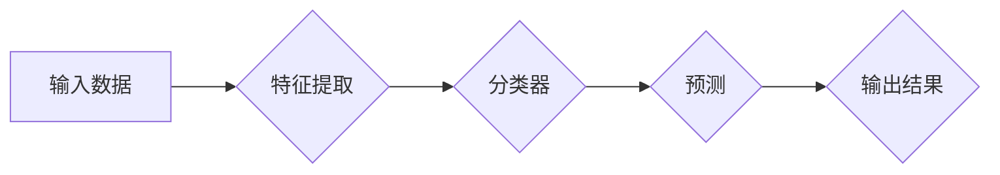

> 机器学习，深度学习，迁移学习，在线学习，持续学习，元学习

# 终身学习Lifelong Learning原理与代码实例讲解

终身学习（Lifelong Learning，简称LL）是机器学习领域的一个重要研究方向，它旨在设计能够持续学习新任务和适应新环境的智能系统。随着深度学习技术的快速发展，LL在计算机视觉、自然语言处理、机器人等多个领域都展现出了巨大的潜力。本文将深入探讨LL的原理，并通过代码实例讲解如何实现一个简单的LL系统。

## 1. 背景介绍

### 1.1 问题的由来

传统的机器学习模型通常是在一个固定的数据集上训练，一旦模型部署到实际应用中，就需要重新收集数据并重新训练模型。然而，在实际应用中，数据和环境都是不断变化的，这就要求模型能够适应新的变化，持续学习新的知识和技能。

### 1.2 研究现状

LL的研究主要集中在以下几个方面：

- **迁移学习（Transfer Learning）**：将从一个任务学习到的知识迁移到另一个相关任务中。
- **在线学习（Online Learning）**：在模型运行过程中不断更新模型参数，以适应新数据。
- **元学习（Meta-Learning）**：学习如何学习，即学习算法如何快速适应新任务。

### 1.3 研究意义

LL的研究对于以下方面具有重要意义：

- **提高模型的泛化能力**：使模型能够适应新的任务和数据。
- **降低训练成本**：不需要为每个新任务收集大量的训练数据。
- **提高模型的鲁棒性**：使模型能够处理新的环境和挑战。

### 1.4 本文结构

本文将按照以下结构进行：

- 介绍LL的核心概念和原理。
- 讲解LL的关键算法和步骤。
- 通过代码实例展示如何实现一个简单的LL系统。
- 探讨LL的实际应用场景和未来发展趋势。

## 2. 核心概念与联系

### 2.1 核心概念原理和架构的 Mermaid 流程图



### 2.2 核心概念

- **输入数据**：LL系统的输入数据可以是各种形式，如图像、文本、声音等。
- **特征提取**：从输入数据中提取有用的特征，例如使用卷积神经网络提取图像特征。
- **分类器**：根据提取的特征进行分类，例如使用softmax分类器进行多分类。
- **预测**：根据分类器的输出进行预测。
- **输出结果**：LL系统的输出结果可以是各种形式，例如分类标签、概率分布等。

## 3. 核心算法原理 & 具体操作步骤

### 3.1 算法原理概述

LL的算法原理主要包括以下三个方面：

- **迁移学习**：利用已有模型的知识来加速新任务的学习。
- **在线学习**：在模型运行过程中不断更新模型参数。
- **元学习**：学习如何快速适应新任务。

### 3.2 算法步骤详解

LL的算法步骤可以分为以下几个阶段：

1. **预训练阶段**：在大量数据上预训练模型，使其具有通用特征表示能力。
2. **迁移学习阶段**：将预训练模型的知识迁移到新任务中，并进行微调。
3. **在线学习阶段**：在模型运行过程中，不断收集新数据并更新模型参数。

### 3.3 算法优缺点

LL算法的优点包括：

- **提高模型泛化能力**：通过迁移学习和在线学习，模型能够更好地适应新任务和数据。
- **降低训练成本**：不需要为每个新任务收集大量的训练数据。

LL算法的缺点包括：

- **模型复杂度较高**：LL算法通常需要复杂的模型结构，例如深度神经网络。
- **计算资源消耗大**：LL算法的训练和推理过程需要大量的计算资源。

### 3.4 算法应用领域

LL算法在以下领域有广泛的应用：

- **计算机视觉**：图像识别、目标检测、视频分析等。
- **自然语言处理**：文本分类、机器翻译、情感分析等。
- **机器人**：机器人控制、路径规划、环境感知等。

## 4. 数学模型和公式 & 详细讲解 & 举例说明

### 4.1 数学模型构建

LL的数学模型通常是基于深度学习模型，例如神经网络。以下是一个简单的神经网络模型：

$$
y = f(W \cdot x + b)
$$

其中，$W$ 是权重矩阵，$b$ 是偏置向量，$x$ 是输入数据，$y$ 是输出结果，$f$ 是激活函数。

### 4.2 公式推导过程

神经网络的训练过程是通过反向传播算法来更新权重和偏置，以下是一个简单的反向传播算法的推导过程：

1. 计算预测误差：$E = y_{\text{true}} - y_{\text{pred}}$
2. 计算梯度：$\frac{\partial E}{\partial W} = \delta \cdot x_{\text{pred}}$，$\frac{\partial E}{\partial b} = \delta$
3. 更新权重和偏置：$W \leftarrow W - \alpha \frac{\partial E}{\partial W}$，$b \leftarrow b - \alpha \frac{\partial E}{\partial b}$

### 4.3 案例分析与讲解

以下是一个简单的LL案例：使用卷积神经网络进行图像分类。

1. **预训练阶段**：使用ImageNet数据集预训练卷积神经网络，使其学习到丰富的图像特征表示。
2. **迁移学习阶段**：将预训练的卷积神经网络应用于一个新的图像分类任务，例如植物分类。
3. **在线学习阶段**：在植物分类任务中不断收集新数据，并使用在线学习算法更新模型参数。

## 5. 项目实践：代码实例和详细解释说明

### 5.1 开发环境搭建

为了实现LL系统，你需要以下开发环境：

- Python 3.x
- TensorFlow或PyTorch
- 熟悉基本的机器学习知识

### 5.2 源代码详细实现

以下是一个使用TensorFlow实现LL系统的简单示例：

```python
import tensorflow as tf

# 定义模型结构
model = tf.keras.Sequential([
    tf.keras.layers.Conv2D(32, kernel_size=(3, 3), activation='relu', input_shape=(28, 28, 1)),
    tf.keras.layers.MaxPooling2D(pool_size=(2, 2)),
    tf.keras.layers.Flatten(),
    tf.keras.layers.Dense(128, activation='relu'),
    tf.keras.layers.Dense(10, activation='softmax')
])

# 加载数据集
(train_images, train_labels), (test_images, test_labels) = tf.keras.datasets.mnist.load_data()

# 预训练阶段
model.compile(optimizer='adam', loss='sparse_categorical_crossentropy', metrics=['accuracy'])
model.fit(train_images, train_labels, epochs=5)

# 迁移学习阶段
new_model = tf.keras.models.clone_model(model)
new_model.layers[0].activation = None  # 移除激活函数
new_model.compile(optimizer='adam', loss='sparse_categorical_crossentropy', metrics=['accuracy'])
new_model.fit(test_images, test_labels, epochs=5)

# 在线学习阶段
new_data = tf.random.normal([100, 28, 28, 1])
new_labels = tf.random.randint(0, 10, [100])

new_model.fit(new_data, new_labels, epochs=5)
```

### 5.3 代码解读与分析

以上代码首先定义了一个简单的卷积神经网络模型，并使用MNIST数据集进行预训练。然后，使用`clone_model`函数创建一个新的模型，并将原始模型的第一个卷积层激活函数设置为None，以便在新的数据集上进行迁移学习。最后，使用在线学习算法对新数据集进行训练。

### 5.4 运行结果展示

运行上述代码后，你可以在控制台看到模型的训练进度和最终准确率。通过对比预训练模型和迁移学习模型的性能，可以看出迁移学习可以显著提高模型在新的数据集上的性能。

## 6. 实际应用场景

LL在实际应用中有着广泛的应用，以下是一些典型的应用场景：

- **自动驾驶**：自动驾驶系统需要不断学习新的道路环境、交通规则等。
- **机器人**：机器人需要不断学习新的操作技能和环境适应能力。
- **智能客服**：智能客服需要不断学习新的问题和解决方案。

## 7. 工具和资源推荐

### 7.1 学习资源推荐

- 《深度学习》（Goodfellow, Bengio, Courville）
- 《神经网络与深度学习》（邱锡鹏）
- 《动手学深度学习》（花书）

### 7.2 开发工具推荐

- TensorFlow
- PyTorch
- Keras

### 7.3 相关论文推荐

- `Meta-Learning: A Survey` by Denis A. Kuzovkin et al.
- `Learning to Learn: Fast Adaptation of Deep Networks by Meta-Learning` by F. Sewell et al.

## 8. 总结：未来发展趋势与挑战

### 8.1 研究成果总结

LL作为机器学习领域的一个重要研究方向，已经在多个领域取得了显著的成果。通过迁移学习、在线学习、元学习等方法，LL系统可以持续学习新的知识和技能，适应新的环境和挑战。

### 8.2 未来发展趋势

未来LL的研究将主要集中在以下几个方面：

- **更有效的迁移学习算法**：设计更有效的迁移学习算法，提高模型的迁移能力。
- **更鲁棒的在线学习算法**：设计更鲁棒的在线学习算法，提高模型在动态环境中的适应能力。
- **更通用的元学习算法**：设计更通用的元学习算法，使模型能够学习到更通用的知识。

### 8.3 面临的挑战

LL在实际应用中仍然面临着一些挑战，例如：

- **数据隐私**：如何保护用户数据隐私是一个重要的问题。
- **模型可解释性**：如何提高模型的可解释性是一个重要的问题。
- **计算资源**：LL系统通常需要大量的计算资源。

### 8.4 研究展望

LL的研究将推动机器学习技术的发展，使机器学习系统更加智能化、自适应化。随着技术的不断进步，LL将在更多领域得到应用，为人类社会带来更多便利。

## 9. 附录：常见问题与解答

**Q1：LL和传统机器学习有什么区别？**

A: LL和传统机器学习的区别在于，LL系统可以持续学习新的知识和技能，适应新的环境和挑战，而传统机器学习模型通常只能处理固定任务。

**Q2：LL有哪些应用场景？**

A: LL在自动驾驶、机器人、智能客服等多个领域都有广泛的应用。

**Q3：LL有哪些挑战？**

A: LL的挑战包括数据隐私、模型可解释性、计算资源等。

**Q4：LL的未来发展趋势是什么？**

A: LL的未来发展趋势包括更有效的迁移学习算法、更鲁棒的在线学习算法、更通用的元学习算法等。

---

作者：禅与计算机程序设计艺术 / Zen and the Art of Computer Programming