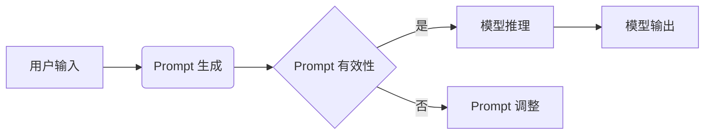

>Prompt 设计, NLP, 语言模型, 生成式AI, 对话系统, 指令微调, 模型理解, 应用场景

# 聚焦应用自身的 Prompt 设计

在人工智能领域，特别是在自然语言处理（NLP）和生成式人工智能（Generative AI）的快速发展下，Prompt 设计成为了提升模型性能和应用效果的关键因素。一个精心设计的 Prompt 能够引导模型更好地理解用户意图，生成更符合期望的输出。本文将深入探讨 Prompt 设计的核心概念、原理、步骤，以及在实际应用中的挑战和未来趋势。

## 1. 背景介绍

随着深度学习技术的不断进步，语言模型如 GPT-3、BERT 等，在理解和生成自然语言方面取得了显著的成果。然而，这些模型在实际应用中往往需要通过 Prompt 来引导其生成更符合特定需求的输出。Prompt 设计成为了一个重要的研究领域，它涉及到如何将用户的意图和需求有效地转化为模型能够理解和响应的格式。

### 1.1 问题的由来

传统的 NLP 应用，如机器翻译、问答系统等，往往依赖于固定的输入格式和输出模板。这种方式在处理简单任务时效果尚可，但在面对复杂、多样化的用户需求时，往往无法提供满意的用户体验。Prompt 设计的出现，正是为了解决这一问题，它通过提供更加灵活和个性化的输入，使模型能够更好地适应不同的应用场景。

### 1.2 研究现状

目前，Prompt 设计的研究主要集中在以下几个方面：

- **指令微调（Instruction Tuning）**：通过对模型进行微调，使其能够更好地理解复杂的指令。
- **示例学习（Example Learning）**：通过提供示例来指导模型学习特定任务的模式。
- **可解释性Prompt（Explainable Prompt）**：设计能够解释模型决策过程的 Prompt。

### 1.3 研究意义

Prompt 设计对于以下方面具有重要意义：

- **提升用户体验**：通过更精确的 Prompt，模型能够生成更符合用户需求的输出，从而提升用户体验。
- **增强模型可解释性**：通过设计可解释的 Prompt，用户能够更好地理解模型的决策过程。
- **拓展应用场景**：Prompt 设计能够使模型适应更多样化的应用场景。

### 1.4 本文结构

本文将分为以下几个部分：

- **第2章**：介绍 Prompt 设计的核心概念和原理。
- **第3章**：详细讲解 Prompt 设计的步骤和方法。
- **第4章**：分析 Prompt 设计在数学模型和公式中的应用。
- **第5章**：通过项目实践展示 Prompt 设计的代码实现。
- **第6章**：探讨 Prompt 设计在实际应用场景中的应用。
- **第7章**：推荐相关的学习资源、开发工具和参考文献。
- **第8章**：总结 Prompt 设计的未来发展趋势与挑战。
- **第9章**：提供常见问题与解答。

## 2. 核心概念与联系

### 2.1 核心概念

- **Prompt**：用于引导模型生成输出的文本或语音指令。
- **指令微调**：通过微调模型来提高其对特定指令的理解能力。
- **示例学习**：通过提供示例来指导模型学习特定任务的模式。
- **可解释性Prompt**：设计能够解释模型决策过程的 Prompt。

### 2.2 架构的 Mermaid 流程图



## 3. 核心算法原理 & 具体操作步骤

### 3.1 算法原理概述

Prompt 设计的核心原理是利用用户输入的意图和需求，生成一个能够有效引导模型生成期望输出的指令。这个过程涉及到以下几个方面：

- **意图识别**：理解用户输入的意图。
- **知识检索**：从知识库中检索与意图相关的信息。
- **Prompt 生成**：根据意图和检索到的知识，生成有效的 Prompt。
- **模型推理**：使用生成的 Prompt 进行模型推理。
- **输出生成**：根据模型推理结果生成最终的输出。

### 3.2 算法步骤详解

1. **意图识别**：通过自然语言处理技术，如词性标注、命名实体识别等，识别用户输入的意图。
2. **知识检索**：根据识别出的意图，从知识库中检索相关的信息。
3. **Prompt 生成**：根据检索到的知识，生成一个能够引导模型生成期望输出的 Prompt。
4. **模型推理**：使用生成的 Prompt 对模型进行推理。
5. **输出生成**：根据模型推理结果，生成最终的输出。

### 3.3 算法优缺点

**优点**：

- **提高模型性能**：通过有效的 Prompt，模型能够更好地理解用户意图，生成更符合期望的输出。
- **提升用户体验**：用户能够得到更个性化的服务。
- **增强模型可解释性**：用户能够更好地理解模型的决策过程。

**缺点**：

- **设计难度高**：需要深入理解用户意图和模型特性。
- **成本高**：需要大量的数据和计算资源。

### 3.4 算法应用领域

- **问答系统**：通过有效的 Prompt，使模型能够更好地理解用户问题，并给出准确的答案。
- **对话系统**：通过设计合适的 Prompt，使模型能够与用户进行更加自然、流畅的对话。
- **文本生成**：通过 Prompt，指导模型生成特定风格或内容的文本。

## 4. 数学模型和公式 & 详细讲解 & 举例说明

### 4.1 数学模型构建

Prompt 设计的数学模型可以看作是一个多步骤的序列到序列模型。首先，输入的文本被编码成一个向量表示，然后这个向量通过一个编码器被转换成一个隐藏状态。隐藏状态随后被用于生成一个提示文本，这个提示文本再被解码成一个输出序列。

$$
\text{input\_embeddings} = \text{Embedding}(W_{\text{input}}, X)
$$

$$
\text{hidden\_state} = \text{Encoder}(H_{\text{hidden}}, \text{input\_embeddings})
$$

$$
\text{prompt} = \text{Prompt\_Generator}(H_{\text{hidden}}, \text{config})
$$

$$
\text{output\_embeddings} = \text{Embedding}(W_{\text{output}}, \text{prompt})
$$

$$
\text{output} = \text{Decoder}(H_{\text{output}}, \text{output\_embeddings})
$$

### 4.2 公式推导过程

公式推导过程涉及到自然语言处理的多个步骤，包括词嵌入、编码器、解码器和注意力机制等。

### 4.3 案例分析与讲解

假设我们要设计一个用于生成电影评论的 Prompt。我们可以使用一个简单的文本生成模型，如 GPT-2，来生成评论。

1. **意图识别**：用户想要生成一部电影的评论。
2. **知识检索**：从数据库中检索该电影的相关信息，如导演、演员、剧情简介等。
3. **Prompt 生成**：根据检索到的信息，生成一个包含电影名称、导演、演员等信息的 Prompt。
4. **模型推理**：使用生成的 Prompt 对 GPT-2 进行推理。
5. **输出生成**：GPT-2 根据推理结果生成一部电影评论。

## 5. 项目实践：代码实例和详细解释说明

### 5.1 开发环境搭建

1. 安装 Python 和必要的库，如 transformers、torch 等。
2. 准备数据集，如电影评论数据集。
3. 选择合适的模型，如 GPT-2。

### 5.2 源代码详细实现

```python
from transformers import GPT2Tokenizer, GPT2LMHeadModel

# 加载预训练模型和分词器
tokenizer = GPT2Tokenizer.from_pretrained('gpt2')
model = GPT2LMHeadModel.from_pretrained('gpt2')

# 生成评论
def generate_review(movie_title, director, actors, plot):
    prompt = f"《{movie_title}》是一部由{director}执导，{actors}主演的电影，剧情简介：{plot}。请写一篇电影评论："
    inputs = tokenizer(prompt, return_tensors='pt', padding=True, truncation=True)
    outputs = model.generate(**inputs, max_length=150)
    review = tokenizer.decode(outputs[0], skip_special_tokens=True)
    return review

# 示例
review = generate_review("星际穿越", "克里斯托弗·诺兰", "莱昂纳多·迪卡普里奥, 汤姆·哈迪", "一名宇航员穿越虫洞寻找新的可居住星球...")
print(review)
```

### 5.3 代码解读与分析

上述代码演示了如何使用 GPT-2 生成电影评论。首先加载预训练的模型和分词器，然后定义一个 `generate_review` 函数，该函数接收电影标题、导演、演员和剧情简介作为输入，生成一个包含这些信息的 Prompt，并使用 GPT-2 生成电影评论。

### 5.4 运行结果展示

运行上述代码，将生成类似以下的电影评论：

> 《星际穿越》是一部由克里斯托弗·诺兰执导，莱昂纳多·迪卡普里奥, 汤姆·哈迪主演的电影，剧情简介：一名宇航员穿越虫洞寻找新的可居住星球... 这是一部引人深思的电影，不仅展示了人类探索未知的勇气，还探讨了人类在宇宙中的地位。

## 6. 实际应用场景

### 6.1 对话系统

在对话系统中，Prompt 设计可以帮助模型更好地理解用户的意图，并生成更符合期望的回复。

### 6.2 问答系统

在问答系统中，Prompt 设计可以帮助模型更好地理解用户的问题，并给出更准确的答案。

### 6.3 文本生成

在文本生成系统中，Prompt 设计可以帮助模型生成更符合特定风格的文本。

## 7. 工具和资源推荐

### 7.1 学习资源推荐

- 《自然语言处理综合指南》
- 《深度学习与自然语言处理》
- 《生成式AI：从NLP到计算机视觉》

### 7.2 开发工具推荐

- Hugging Face Transformers
- TensorFlow
- PyTorch

### 7.3 相关论文推荐

- "Generative Language Modeling with Transformer"
- "BERT: Pre-training of Deep Bidirectional Transformers for Language Understanding"
- "Instruction Tuning and Inverse Feedback for Robust Instruction Following"

## 8. 总结：未来发展趋势与挑战

### 8.1 研究成果总结

Prompt 设计是提升模型性能和应用效果的关键因素。通过精心设计的 Prompt，模型能够更好地理解用户意图，生成更符合期望的输出。

### 8.2 未来发展趋势

- **更加个性化的 Prompt 设计**：根据用户的行为和偏好，生成更加个性化的 Prompt。
- **可解释的 Prompt 设计**：设计能够解释模型决策过程的 Prompt。
- **多模态 Prompt 设计**：将文本、图像、语音等多种模态信息融合到 Prompt 中。

### 8.3 面临的挑战

- **设计难度高**：需要深入理解用户意图和模型特性。
- **数据依赖性强**：需要大量的数据和计算资源。
- **模型可解释性不足**：难以解释模型的决策过程。

### 8.4 研究展望

Prompt 设计将在 NLP 和 AI 领域发挥越来越重要的作用。未来，随着技术的不断进步，Prompt 设计将变得更加智能、高效、可解释。

## 9. 附录：常见问题与解答

**Q1：Prompt 设计是否适用于所有任务？**

A1：Prompt 设计适用于大多数 NLP 任务，如对话系统、问答系统、文本生成等。

**Q2：如何设计有效的 Prompt？**

A2：设计有效的 Prompt 需要深入理解用户意图和模型特性。可以从以下几个方面入手：

- **明确意图**：理解用户的意图是设计 Prompt 的第一步。
- **提供上下文信息**：提供足够的上下文信息可以帮助模型更好地理解用户意图。
- **使用简洁明了的语言**：使用简洁明了的语言可以帮助模型更好地理解用户意图。

**Q3：Prompt 设计的成本高吗？**

A3：Prompt 设计的成本取决于具体的应用场景和需求。对于一些简单的任务，如文本分类，Prompt 设计的成本可能较低。但对于一些复杂的任务，如对话系统，Prompt 设计的成本可能较高。

**Q4：Prompt 设计是否会影响模型的性能？**

A4：精心设计的 Prompt 可以显著提升模型的性能。但不当的 Prompt 设计可能会导致模型性能下降。

**Q5：Prompt 设计是否需要专业的技术背景？**

A5：虽然专业的技术背景可以帮助更好地理解 Prompt 设计的原理和方法，但并不绝对必要。通过学习和实践，任何人都可以掌握 Prompt 设计的基本技巧。

作者：禅与计算机程序设计艺术 / Zen and the Art of Computer Programming