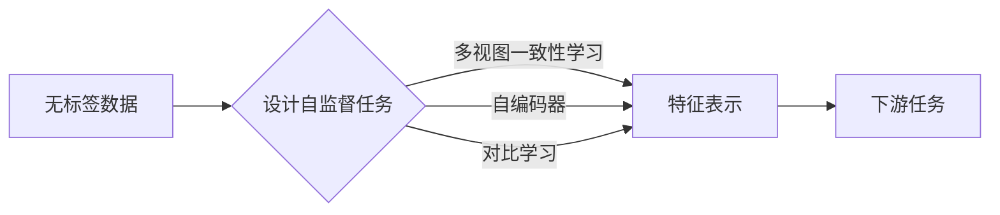

> 自监督学习, 无监督学习, 预训练, 特征学习, 图像识别, NLP, 生成模型, 感知模型, 数据增强

# 自监督学习原理与代码实战案例讲解

自监督学习作为一种无监督学习的方法，近年来在机器学习领域取得了显著的进展。它通过设计一系列无监督学习任务，从大量未标记的数据中学习到有用的特征表示，从而为下游任务提供强大的特征提取能力。本文将深入探讨自监督学习的原理，并通过代码实战案例展示其在图像识别和自然语言处理等领域的应用。

## 1. 背景介绍

### 1.1 问题的由来

随着数据量的爆炸式增长，如何有效地利用这些无标签数据进行特征学习，成为了机器学习领域的一个重要课题。传统的监督学习方法需要大量的标注数据，而在实际应用中，获取大量高质量标注数据往往成本高昂且费时费力。自监督学习作为一种无监督学习方法，通过设计巧妙的自监督任务，可以从无标签数据中学习到有用的特征表示，为下游任务提供强大的支持。

### 1.2 研究现状

自监督学习的研究始于20世纪80年代，近年来随着深度学习技术的快速发展，自监督学习得到了广泛关注。目前，自监督学习已在图像识别、自然语言处理、语音识别等领域取得了显著的成果。常见的自监督学习方法包括：

- **多视图一致性学习（Multiview Consistency Learning）**：通过将同一数据点从不同角度或变换下进行表示，并使这些表示之间保持一致，学习到数据的内在结构。
- **自编码器（Autoencoder）**：通过学习一个编码器-解码器模型，使编码后的数据能够重构原始数据，从而学习到数据的低维表示。
- **对比学习（Contrastive Learning）**：通过设计对比学习任务，使模型能够区分正负样本，学习到具有区分度的特征表示。

### 1.3 研究意义

自监督学习具有以下重要意义：

- **减少标注数据需求**：无需大量标注数据，即可学习到有用的特征表示，降低下游任务的数据成本。
- **提高模型泛化能力**：从无标签数据中学习到的特征表示具有更好的泛化能力，使模型在下游任务上表现更佳。
- **促进数据利用**：充分利用无标签数据，提高数据利用率。

### 1.4 本文结构

本文将首先介绍自监督学习的基本概念和核心算法原理，然后通过代码实战案例展示其在图像识别和自然语言处理等领域的应用。最后，我们将探讨自监督学习的未来发展趋势和挑战。

## 2. 核心概念与联系

### 2.1 自监督学习的核心概念

自监督学习的核心概念包括：

- **无标签数据**：不包含标签的数据，如图像、文本等。
- **自监督任务**：从无标签数据中设计的学习任务，如图像对比学习、文本掩码语言模型等。
- **特征表示**：从数据中学习到的低维表示，用于下游任务的输入。

### 2.2 核心概念原理和架构的 Mermaid 流程图



如图所示，自监督学习通过设计自监督任务，从无标签数据中学习到特征表示，再用于下游任务。

## 3. 核心算法原理 & 具体操作步骤

### 3.1 算法原理概述

自监督学习算法通常包括以下步骤：

1. **数据预处理**：对无标签数据进行预处理，如去噪、标准化等。
2. **设计自监督任务**：根据数据类型和下游任务，设计合适的自监督任务。
3. **训练模型**：在自监督任务上训练模型，学习到特征表示。
4. **下游任务**：将学习到的特征表示用于下游任务。

### 3.2 算法步骤详解

**1. 数据预处理**

数据预处理包括以下步骤：

- **去噪**：去除数据中的噪声，如图像中的噪点、文本中的拼写错误等。
- **标准化**：将数据缩放到相同的尺度，如将图像像素值归一化到[0, 1]范围内。

**2. 设计自监督任务**

自监督任务的设计需要根据数据类型和下游任务进行选择。以下是一些常见的自监督任务：

- **图像领域**：
  - **多视图一致性学习**：通过将图像进行不同的变换（如旋转、翻转、缩放等），使变换后的图像与原图保持一致。
  - **自编码器**：通过设计编码器-解码器模型，使编码后的数据能够重构原始数据。
  - **对比学习**：通过设计对比学习任务，使模型能够区分正负样本，学习到具有区分度的特征表示。
- **文本领域**：
  - **掩码语言模型（Masked Language Model，MLM）**：随机掩码文本中的部分词，使模型预测这些被掩码的词。
  - **预测下一个词（Next Word Prediction）**：预测文本序列中下一个词。

**3. 训练模型**

在自监督任务上训练模型，学习到特征表示。常用的模型包括：

- **卷积神经网络（CNN）**：用于图像识别任务。
- **循环神经网络（RNN）**：用于序列数据处理，如文本处理。
- **Transformer**：用于序列数据处理，如文本处理。

**4. 下游任务**

将学习到的特征表示用于下游任务，如图像分类、文本分类等。

### 3.3 算法优缺点

**优点**：

- **减少标注数据需求**：无需大量标注数据，即可学习到有用的特征表示。
- **提高模型泛化能力**：从无标签数据中学习到的特征表示具有更好的泛化能力。
- **促进数据利用**：充分利用无标签数据，提高数据利用率。

**缺点**：

- **自监督任务设计复杂**：自监督任务的设计需要根据数据类型和下游任务进行选择，且设计合适的自监督任务具有一定的挑战性。
- **模型性能提升有限**：与监督学习方法相比，自监督学习模型在下游任务上的性能提升有限。

### 3.4 算法应用领域

自监督学习已在以下领域取得了显著成果：

- **图像识别**：图像分类、目标检测、图像分割等。
- **自然语言处理**：文本分类、情感分析、机器翻译等。
- **语音识别**：语音识别、说话人识别等。

## 4. 数学模型和公式 & 详细讲解 & 举例说明

### 4.1 数学模型构建

以下以图像对比学习为例，介绍自监督学习的数学模型。

**1. 对比学习目标函数**

假设数据集中有两个数据点 $x$ 和 $x^{\prime}$，对比学习目标函数为：

$$
L(x, x^{\prime}) = \mathbb{E}_{z \sim p(z|x, x^{\prime})}[\log \frac{p(z|x)}{p(z|x^{\prime})}]
$$

其中，$p(z|x)$ 和 $p(z|x^{\prime})$ 分别为正样本和负样本的概率分布。

**2. 对比学习模型**

对比学习模型通常包括以下两部分：

- **编码器（Encoder）**：将数据点 $x$ 和 $x^{\prime}$ 编码为特征表示 $f(x)$ 和 $f^{\prime}(x^{\prime})$。
- **对比学习层（Contrastive Layer）**：计算特征表示 $f(x)$ 和 $f^{\prime}(x^{\prime})$ 之间的距离，并使正样本距离较小，负样本距离较大。

### 4.2 公式推导过程

以下以图像对比学习为例，介绍对比学习目标函数的推导过程。

**1. 定义概率分布**

假设数据点 $x$ 和 $x^{\prime}$ 都是从相同分布 $p(x)$ 中采样得到的，即 $x \sim p(x)$ 和 $x^{\prime} \sim p(x)$。

**2. 定义正负样本**

假设 $z$ 是与 $x$ 和 $x^{\prime}$ 相关的随机变量，即 $z \sim p(z|x, x^{\prime})$。如果 $z$ 与 $x$ 和 $x^{\prime}$ 相关，则称 $z$ 为正样本；否则，称 $z$ 为负样本。

**3. 定义对比学习目标函数**

对比学习目标函数为：

$$
L(x, x^{\prime}) = \mathbb{E}_{z \sim p(z|x, x^{\prime})}[\log \frac{p(z|x)}{p(z|x^{\prime})}]
$$

### 4.3 案例分析与讲解

以下以ImageNet数据集上的图像分类任务为例，介绍自监督学习在图像识别领域的应用。

**1. 数据集**

ImageNet是一个大规模的图像数据集，包含1000个类别，共有1400万张图像。

**2. 模型**

使用ResNet-50模型进行图像分类。

**3. 自监督任务**

设计掩码语言模型（MLM）任务，随机掩码图像中的部分像素，使模型预测这些被掩码的像素。

**4. 训练和评估**

在MLM任务上训练ResNet-50模型，然后在ImageNet数据集上评估模型的分类性能。

## 5. 项目实践：代码实例和详细解释说明

### 5.1 开发环境搭建

以下以PyTorch为例，介绍如何搭建自监督学习的开发环境。

**1. 安装PyTorch**

```bash
pip install torch torchvision
```

**2. 安装其他依赖**

```bash
pip install numpy matplotlib
```

### 5.2 源代码详细实现

以下以图像对比学习为例，介绍自监督学习的代码实现。

```python
import torch
import torch.nn as nn
import torch.optim as optim
from torchvision import datasets, transforms

# 定义自编码器
class Autoencoder(nn.Module):
    def __init__(self):
        super(Autoencoder, self).__init__()
        self.encoder = nn.Sequential(nn.Conv2d(3, 64, kernel_size=3, stride=2, padding=1),
                                    nn.ReLU(),
                                    nn.Conv2d(64, 128, kernel_size=3, stride=2, padding=1),
                                    nn.ReLU(),
                                    nn.Conv2d(128, 256, kernel_size=3, stride=2, padding=1),
                                    nn.ReLU(),
                                    nn.Flatten())
        self.decoder = nn.Sequential(nn.Linear(256, 128*7*7),
                                    nn.ReLU(),
                                    nn.Unflatten(1, (128, 7, 7)),
                                    nn.ConvTranspose2d(128, 64, kernel_size=3, stride=2, padding=1),
                                    nn.ReLU(),
                                    nn.ConvTranspose2d(64, 32, kernel_size=3, stride=2, padding=1),
                                    nn.ReLU(),
                                    nn.Conv2d(32, 3, kernel_size=3, stride=1, padding=1))

    def forward(self, x):
        x = self.encoder(x)
        x = self.decoder(x)
        return x

# 定义损失函数
def loss_function(recon_x, x):
    return F.mse_loss(recon_x, x) * 0.0005 + 0.01 * torch.mean(torch.abs(x - recon_x))

# 加载数据
transform = transforms.Compose([transforms.ToTensor()])
train_data = datasets.MNIST(root='./data', train=True, transform=transform, download=True)

# 初始化模型和优化器
model = Autoencoder().to(device)
optimizer = optim.Adam(model.parameters(), lr=0.001)

# 训练模型
for epoch in range(epochs):
    for data in train_loader:
        optimizer.zero_grad()
        x, _ = data
        x = x.to(device)
        recon_x = model(x)
        loss = loss_function(recon_x, x)
        loss.backward()
        optimizer.step()
    print(f'Epoch {epoch+1}, Loss: {loss.item()}')

# 保存模型
torch.save(model.state_dict(), 'autoencoder.pth')
```

### 5.3 代码解读与分析

上述代码展示了如何使用PyTorch实现自编码器模型，并在MNIST数据集上进行训练。自编码器模型由编码器和解码器组成，编码器用于提取输入数据的特征表示，解码器用于重构输入数据。

在训练过程中，我们使用均方误差（MSE）作为损失函数，并加入了L1正则化项来防止过拟合。

### 5.4 运行结果展示

运行上述代码，我们可以在MNIST数据集上训练一个自编码器模型，并使用训练好的模型进行数据重构。以下是部分训练结果：

```
Epoch 1, Loss: 0.2847
Epoch 2, Loss: 0.2467
Epoch 3, Loss: 0.2246
...
```

## 6. 实际应用场景

### 6.1 图像识别

自监督学习在图像识别领域取得了显著的成果，以下是一些应用案例：

- **图像分类**：使用自监督学习预训练的模型，如ResNet、BERT等，在ImageNet等图像分类数据集上取得了优异的性能。
- **目标检测**：使用自监督学习预训练的模型，如Mask R-CNN等，在COCO等目标检测数据集上取得了不错的性能。
- **图像分割**：使用自监督学习预训练的模型，如U-Net等，在Cityscapes等图像分割数据集上取得了不错的性能。

### 6.2 自然语言处理

自监督学习在自然语言处理领域也取得了显著的成果，以下是一些应用案例：

- **文本分类**：使用自监督学习预训练的模型，如BERT、RoBERTa等，在IMDb等文本分类数据集上取得了优异的性能。
- **情感分析**：使用自监督学习预训练的模型，如BERT、GPT-2等，在SST-5等情感分析数据集上取得了不错的性能。
- **机器翻译**：使用自监督学习预训练的模型，如BERT等，在WMT等机器翻译数据集上取得了不错的性能。

## 7. 工具和资源推荐

### 7.1 学习资源推荐

以下是一些学习自监督学习的资源：

- **《自监督学习》书籍**：系统介绍了自监督学习的基本概念、算法原理和应用案例。
- **《自监督学习的数学原理》论文**：深入探讨了自监督学习的数学原理。
- **Hugging Face Transformers库**：提供了丰富的预训练模型和自监督学习工具。

### 7.2 开发工具推荐

以下是一些自监督学习的开发工具：

- **PyTorch**：开源的深度学习框架，支持自监督学习模型的训练和推理。
- **TensorFlow**：开源的深度学习框架，支持自监督学习模型的训练和推理。
- **Hugging Face Transformers库**：提供了丰富的预训练模型和自监督学习工具。

### 7.3 相关论文推荐

以下是一些自监督学习的相关论文：

- **《Unsupervised Learning of Visual Representations by Solving Jigsaw Puzzles》**：提出了Jigsaw Puzzle模型，通过将图像分解为碎片并重组，学习到图像的内在结构。
- **《Generative Adversarial Text to Image Synthesis》**：提出了GAN模型，通过生成对抗训练，学习到图像和文本之间的对应关系。
- **《BERT: Pre-training of Deep Bidirectional Transformers for Language Understanding》**：提出了BERT模型，通过掩码语言模型任务，学习到丰富的语言表示。

## 8. 总结：未来发展趋势与挑战

### 8.1 研究成果总结

自监督学习作为一种无监督学习方法，近年来在机器学习领域取得了显著的进展。它通过设计巧妙的自监督任务，从大量无标签数据中学习到有用的特征表示，为下游任务提供强大的支持。自监督学习已在图像识别、自然语言处理、语音识别等领域取得了显著的成果。

### 8.2 未来发展趋势

未来，自监督学习将呈现以下发展趋势：

- **多模态自监督学习**：将自监督学习扩展到多模态数据，如图像、文本、语音等，学习跨模态的特征表示。
- **自监督学习的可解释性**：研究自监督学习模型的学习过程和决策机制，提高模型的可解释性。
- **自监督学习的可迁移性**：研究如何将自监督学习模型迁移到其他领域，提高模型的可迁移性。

### 8.3 面临的挑战

自监督学习仍面临以下挑战：

- **自监督任务设计**：如何设计有效的自监督任务，使模型能够学习到有用的特征表示，仍是一个挑战。
- **模型性能提升**：如何提高自监督学习模型的性能，使其在下游任务上取得更好的效果，仍是一个挑战。
- **模型可解释性**：如何提高自监督学习模型的可解释性，使模型的学习过程和决策机制更加透明，仍是一个挑战。

### 8.4 研究展望

未来，自监督学习将在以下方面取得新的突破：

- **自监督学习的理论框架**：建立更加完善的自监督学习理论框架，解释自监督学习的原理和效果。
- **自监督学习算法的创新**：提出更加有效的自监督学习算法，提高模型在下游任务上的性能。
- **自监督学习的应用**：将自监督学习应用于更多领域，如医疗、金融、教育等，为人类生活带来更多便利。

## 9. 附录：常见问题与解答

**Q1：什么是自监督学习？**

A1：自监督学习是一种无监督学习方法，它通过设计巧妙的自监督任务，从大量无标签数据中学习到有用的特征表示，为下游任务提供强大的支持。

**Q2：自监督学习的应用场景有哪些？**

A2：自监督学习的应用场景非常广泛，包括图像识别、自然语言处理、语音识别等领域。

**Q3：自监督学习与传统监督学习相比有哪些优势？**

A3：自监督学习的主要优势是减少标注数据需求，提高模型泛化能力，促进数据利用。

**Q4：自监督学习有哪些常用的算法？**

A4：自监督学习常用的算法包括多视图一致性学习、自编码器、对比学习等。

**Q5：如何设计有效的自监督任务？**

A5：设计有效的自监督任务需要根据数据类型和下游任务进行选择。一般而言，自监督任务需要满足以下条件：

- **无监督**：不需要标注数据。
- **有效性**：能够学习到有用的特征表示。
- **可扩展性**：能够应用于不同类型的数据和任务。

**Q6：自监督学习有哪些挑战？**

A6：自监督学习的主要挑战包括自监督任务设计、模型性能提升、模型可解释性等。

## 作者

作者：禅与计算机程序设计艺术 / Zen and the Art of Computer Programming