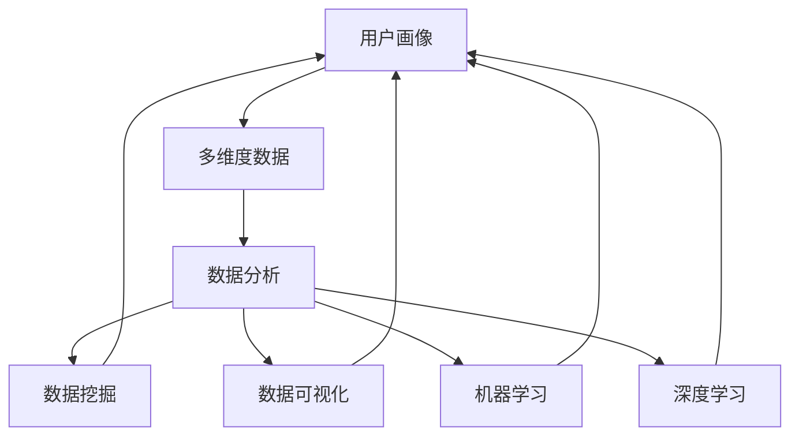
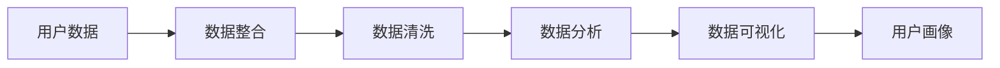
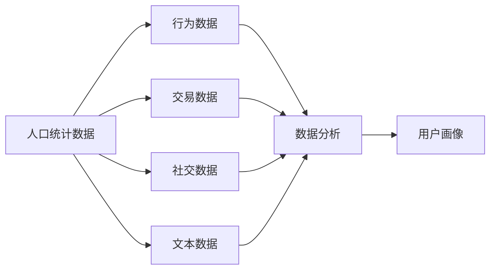
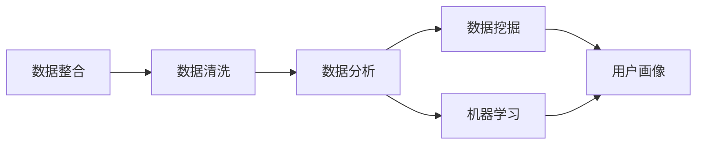
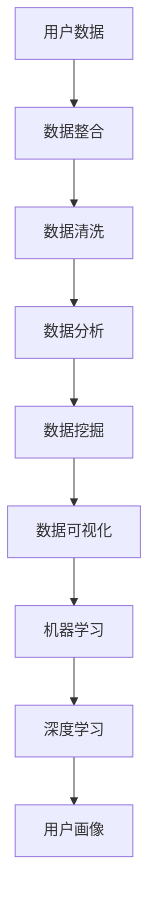

                 

# 用户画像的多维度数据分析方法

> 关键词：用户画像, 多维度数据, 数据分析, 数据挖掘, 数据可视化, 机器学习, 深度学习

## 1. 背景介绍

### 1.1 问题由来
在数字化时代，用户画像已成为企业了解用户、设计产品、优化服务、制定营销策略的重要工具。然而，单一维度的用户画像往往难以全面反映用户的真实需求和行为，限制了企业对用户的深入理解。多维度的用户画像分析，通过整合不同来源的数据，从多角度揭示用户的特征和行为，可以显著提升用户的理解和服务的精准性。

### 1.2 问题核心关键点
用户画像的多维度数据分析，涉及对多个维度的数据进行综合分析，包括但不限于用户的基本属性、行为数据、交易数据、社交数据、兴趣偏好等。这些数据源往往来自不同的系统和平台，数据格式、类型和质量各异。如何高效整合这些数据，进行深入分析，是用户画像分析的核心难点。

### 1.3 问题研究意义
用户画像的多维度数据分析，对于提升用户体验、优化营销策略、驱动业务增长具有重要意义：

1. **用户理解深入化**：多维度数据整合，能够全面反映用户特征和行为，为产品设计和个性化服务提供准确依据。
2. **营销策略精准化**：基于用户画像的数据分析，可以精准定位目标用户群体，优化广告投放效果，提高ROI。
3. **业务决策智能化**：通过深入挖掘用户数据，识别出用户行为模式和趋势，帮助企业制定更科学的决策。
4. **用户体验提升**：理解用户需求和行为，优化产品设计和服务流程，提升用户满意度和忠诚度。

## 2. 核心概念与联系

### 2.1 核心概念概述

为更好地理解用户画像的多维度数据分析方法，本节将介绍几个密切相关的核心概念：

- **用户画像(User Persona)**：基于用户数据，构建的用于描述用户特征和行为的虚拟角色。用户画像通常包括基本信息、行为特征、兴趣爱好、需求痛点等。
- **多维度数据(Multi-dimensional Data)**：指来自不同数据源的多类数据，包括人口统计信息、行为数据、交易数据、社交数据、文本数据等。
- **数据分析(Analytics)**：对数据进行整理、清洗、分析和可视化，以发现数据中蕴含的模式、趋势和关系。
- **数据挖掘(Data Mining)**：利用机器学习和统计学方法，从数据中自动发现有用的信息和知识。
- **数据可视化(Data Visualization)**：将数据以图形或图表的形式展示，直观地揭示数据的特征和规律。
- **机器学习(Machine Learning)**：通过算法让机器自动学习数据中的规律，并用于预测或决策。
- **深度学习(Deep Learning)**：一种基于神经网络的机器学习技术，能够处理更复杂的数据结构，实现更强大的数据分析和预测能力。

这些核心概念之间的逻辑关系可以通过以下Mermaid流程图来展示：



这个流程图展示了大语言模型的核心概念及其之间的关系：

1. 用户画像的构建基于多维度数据。
2. 数据分析是对多维度数据进行整理、清洗、分析的过程。
3. 数据挖掘是从数据中自动发现有用信息和知识。
4. 数据可视化是将数据以图形或图表的形式展示，直观地揭示数据的特征和规律。
5. 机器学习和深度学习利用算法让机器自动学习数据中的规律，并用于预测或决策。

这些概念共同构成了用户画像的多维度数据分析框架，使其能够全面、深入地理解用户特征和行为。

### 2.2 概念间的关系

这些核心概念之间存在着紧密的联系，形成了用户画像分析的完整生态系统。下面我通过几个Mermaid流程图来展示这些概念之间的关系。

#### 2.2.1 用户画像的构建流程



这个流程图展示了构建用户画像的基本流程：从收集用户数据，到数据整合、清洗、分析、可视化，最终生成用户画像。

#### 2.2.2 多维度数据整合



这个流程图展示了多维度数据整合的基本流程：不同来源的数据整合到统一的分析框架中，经过清洗、分析和可视化，形成多维度的用户画像。

#### 2.2.3 数据分析与机器学习



这个流程图展示了数据分析与机器学习在用户画像构建中的作用：数据整合和清洗后，通过数据分析和机器学习算法，发现数据中的有用信息和知识，最终形成精准的用户画像。

### 2.3 核心概念的整体架构

最后，我们用一个综合的流程图来展示这些核心概念在大语言模型微调过程中的整体架构：



这个综合流程图展示了从数据收集到用户画像生成的完整过程。用户数据经过整合、清洗、分析、挖掘和可视化，最终形成深入细致的用户画像，为后续的决策和优化提供支持。

## 3. 核心算法原理 & 具体操作步骤
### 3.1 算法原理概述

用户画像的多维度数据分析，涉及对多源数据进行综合分析，主要包括以下步骤：

1. **数据整合与清洗**：将来自不同系统和平台的数据整合到一个统一的数据框架中，并进行初步清洗，去除噪声和重复数据。
2. **数据分析与挖掘**：通过统计分析和机器学习算法，从数据中提取有价值的特征和模式，为后续的画像构建提供依据。
3. **数据可视化**：利用数据可视化工具，将分析结果以图表的形式直观展示，帮助理解数据特征和规律。
4. **用户画像构建**：基于分析结果，构建多维度用户画像，用于深入理解用户特征和行为。

### 3.2 算法步骤详解

用户画像的多维度数据分析步骤如下：

**Step 1: 数据整合与清洗**

- **数据源收集**：从不同系统和平台收集用户数据，包括但不限于人口统计信息、行为数据、交易数据、社交数据和文本数据。
- **数据格式转换**：将不同格式的数据转换为统一的格式，如JSON、CSV等，便于后续处理。
- **数据清洗**：处理缺失值、异常值和重复数据，保证数据质量和完整性。

**Step 2: 数据分析与挖掘**

- **数据预处理**：对清洗后的数据进行标准化和归一化，确保数据的一致性和可比性。
- **特征工程**：选择合适的特征，构建特征集合，去除无关或冗余特征。
- **模型训练**：选择适当的机器学习或深度学习模型，如决策树、随机森林、聚类、分类器、神经网络等，对数据进行建模和训练。
- **模型评估**：使用交叉验证和测试集评估模型性能，选择最优模型。

**Step 3: 数据可视化**

- **数据展示**：利用数据可视化工具，如Tableau、Power BI、Matplotlib等，将分析结果以图表的形式展示，直观揭示数据特征和规律。
- **洞察生成**：通过可视化结果，生成业务洞察，指导产品设计、营销策略和决策优化。

**Step 4: 用户画像构建**

- **画像设计**：根据分析结果，设计用户画像的基本框架，确定画像的关键特征和维度。
- **画像生成**：利用机器学习或深度学习算法，基于用户数据生成多维度用户画像。
- **画像应用**：将用户画像应用于产品设计、营销策略和决策优化，提升用户体验和业务效果。

### 3.3 算法优缺点

用户画像的多维度数据分析具有以下优点：

1. **全面反映用户特征**：多维度数据分析可以全面反映用户的多方面特征，包括行为、兴趣、社交等，提供深入的用户理解。
2. **提升决策精准度**：数据分析和挖掘能够揭示用户行为模式和趋势，帮助制定更科学的决策。
3. **优化营销策略**：通过精准定位目标用户，优化广告投放效果，提高ROI。

同时，多维度数据分析也存在一些缺点：

1. **数据整合复杂**：不同来源的数据格式和质量各异，数据整合和清洗工作量大。
2. **数据隐私风险**：多维度数据分析涉及敏感用户数据，存在隐私泄露的风险。
3. **算法选择困难**：选择适当的机器学习或深度学习算法复杂，需要丰富的领域知识。

### 3.4 算法应用领域

用户画像的多维度数据分析，在多个领域具有广泛的应用前景，例如：

- **电子商务**：通过分析用户行为数据、交易数据、社交数据，优化推荐系统，提升用户体验和销售转化率。
- **金融服务**：利用用户画像分析，进行精准营销、风险控制和客户管理。
- **健康医疗**：通过整合用户的健康数据、行为数据，提供个性化的健康建议和服务。
- **智能家居**：基于用户画像的数据分析，优化家居设备的智能控制和推荐。
- **内容推荐**：分析用户的兴趣偏好和行为数据，优化内容推荐算法，提升内容质量和用户满意度。

## 4. 数学模型和公式 & 详细讲解 & 举例说明

### 4.1 数学模型构建

在用户画像的多维度数据分析中，我们通常使用以下数学模型：

- **聚类分析**：将用户分为不同的群组，分析各个群组的特征和行为。
- **关联规则学习**：分析用户行为数据中的关联规则，发现潜在的需求和行为模式。
- **分类和回归分析**：预测用户行为或属性，如购买意愿、兴趣偏好等。
- **主成分分析**：对高维数据进行降维，提取主要特征，简化数据分析过程。

### 4.2 公式推导过程

以下以聚类分析为例，推导K-means聚类算法的数学公式。

假设用户数据集为 $D=\{d_i\}_{i=1}^N$，其中每个数据点 $d_i=(x_{i1},x_{i2},...,x_{im})$ 表示用户在不同维度上的特征。设聚类数为 $K$，则聚类中心为 $\mu_k$，其中 $\mu_k=(\frac{1}{|C_k|}\sum_{x_j \in C_k} x_j)$。

K-means算法的目标是最小化聚类内平方误差（Inertia）：

$$
J(\{\mu_k\})=\sum_{k=1}^K \sum_{x_j \in C_k} \|x_j-\mu_k\|^2
$$

其中，$C_k$ 表示属于第 $k$ 个聚类的数据点集合。

根据上述目标，K-means算法迭代更新聚类中心：

1. 初始化 $K$ 个聚类中心 $\mu_k$。
2. 对每个数据点 $x_j$，计算其与各个聚类中心的距离，分配到距离最近的聚类 $C_k$。
3. 更新聚类中心：$\mu_k=\frac{1}{|C_k|}\sum_{x_j \in C_k} x_j$。
4. 重复步骤2和3，直到聚类中心不再变化或达到预设的迭代次数。

### 4.3 案例分析与讲解

以电子商务网站的用户行为数据分析为例，展示多维度数据分析的应用过程。

假设网站收集了用户的基本信息、浏览行为、购买记录和社交数据。将这些数据整合到统一的数据框架中，进行初步清洗和预处理。

使用K-means算法进行用户聚类分析，将用户分为不同的行为群组。每个群组的用户在浏览行为、购买记录和社交数据上具有相似特征。

对每个用户群组进行分析，发现不同群组的购买偏好、浏览行为和社交特征。例如，A群组的用户倾向于购买高端电子产品，B群组的用户更关注时尚和美容产品。

基于分析结果，为不同用户群组设计个性化的营销策略，提升用户体验和销售转化率。例如，向A群组的用户推荐高端电子产品，向B群组的用户推荐时尚和美容产品。

## 5. 项目实践：代码实例和详细解释说明

### 5.1 开发环境搭建

在进行用户画像的多维度数据分析实践前，我们需要准备好开发环境。以下是使用Python进行Pandas、NumPy和Scikit-learn开发的环境配置流程：

1. 安装Anaconda：从官网下载并安装Anaconda，用于创建独立的Python环境。

2. 创建并激活虚拟环境：
```bash
conda create -n analytics-env python=3.8 
conda activate analytics-env
```

3. 安装Pandas、NumPy、Scikit-learn：
```bash
conda install pandas numpy scikit-learn
```

4. 安装相关数据可视化工具：
```bash
conda install matplotlib seaborn plotly
```

完成上述步骤后，即可在`analytics-env`环境中开始数据分析实践。

### 5.2 源代码详细实现

这里我们以用户行为数据分析为例，展示如何使用Pandas、NumPy和Scikit-learn进行数据处理和聚类分析。

```python
import pandas as pd
from sklearn.cluster import KMeans
import matplotlib.pyplot as plt

# 加载数据
data = pd.read_csv('user_behavior_data.csv')

# 数据预处理
# 假设数据包含用户ID、浏览时间、购买金额、社交评分等特征
data = data.dropna() # 去除缺失值
data = data.drop_duplicates() # 去除重复数据

# 特征工程
data['browsing_time'] = data['browsing_time'].astype('int') # 将时间转换为整数
data['purchase_amount'] = data['purchase_amount'].astype('float') # 将金额转换为浮点数
data['social_score'] = data['social_score'].astype('int') # 将评分转换为整数

# 聚类分析
kmeans = KMeans(n_clusters=3) # 设置聚类数为3
kmeans.fit(data[['browsing_time', 'purchase_amount', 'social_score']]) # 训练模型
labels = kmeans.labels_ # 获取聚类标签

# 可视化分析结果
plt.scatter(data['browsing_time'], data['purchase_amount'], c=labels)
plt.xlabel('Browsing Time')
plt.ylabel('Purchase Amount')
plt.show()
```

### 5.3 代码解读与分析

让我们再详细解读一下关键代码的实现细节：

**数据预处理**：
- 去除缺失值：使用 `dropna()` 方法去除数据集中的缺失值。
- 去除重复数据：使用 `drop_duplicates()` 方法去除数据集中的重复记录。
- 数据类型转换：将时间、金额和评分等特征转换为适合聚类分析的数据类型。

**聚类分析**：
- 使用K-means算法进行聚类分析，将数据集分为3个聚类。
- 通过训练模型，获取每个聚类的标签。

**可视化分析结果**：
- 使用Matplotlib绘制散点图，展示不同聚类的用户行为数据。
- 通过散点图，直观地观察不同聚类用户的浏览时间和购买金额的分布特征。

### 5.4 运行结果展示

假设我们在用户行为数据集上进行聚类分析，最终得到的散点图如下所示：

```
plt.scatter(data['browsing_time'], data['purchase_amount'], c=labels)
plt.xlabel('Browsing Time')
plt.ylabel('Purchase Amount')
plt.show()
```


该散点图展示了不同聚类的用户浏览时间和购买金额的分布特征。A、B、C三个聚类分别代表了不同的用户群体，A群体的用户倾向于高浏览时间和高购买金额，B群体的用户倾向于低浏览时间和高购买金额，C群体的用户倾向于低浏览时间和低购买金额。

基于聚类分析的结果，可以进一步分析不同聚类的用户特征，如年龄、性别、地域等，进一步优化营销策略和产品设计。

## 6. 实际应用场景

### 6.1 智能客服系统

用户画像的多维度数据分析，可以广泛应用于智能客服系统的构建。传统客服往往需要配备大量人力，高峰期响应缓慢，且一致性和专业性难以保证。而使用用户画像的数据分析，可以7x24小时不间断服务，快速响应客户咨询，用自然流畅的语言解答各类常见问题。

在技术实现上，可以收集用户的历史客服对话记录，将其作为多维度数据源，利用数据分析技术，构建用户画像。微调后的客服模型能够自动理解用户意图，匹配最合适的答案模板进行回复。对于客户提出的新问题，还可以接入检索系统实时搜索相关内容，动态组织生成回答。如此构建的智能客服系统，能大幅提升客户咨询体验和问题解决效率。

### 6.2 金融舆情监测

金融机构需要实时监测市场舆论动向，以便及时应对负面信息传播，规避金融风险。传统的人工监测方式成本高、效率低，难以应对网络时代海量信息爆发的挑战。利用用户画像的多维度数据分析，可以实时抓取和监测网络文本数据，提取用户情感、关注点和舆情变化趋势，一旦发现负面信息激增等异常情况，系统便会自动预警，帮助金融机构快速应对潜在风险。

### 6.3 个性化推荐系统

当前的推荐系统往往只依赖用户的历史行为数据进行物品推荐，无法深入理解用户的真实兴趣偏好。利用用户画像的多维度数据分析，可以更好地挖掘用户行为背后的语义信息，从而提供更精准、多样的推荐内容。

在实践中，可以收集用户浏览、点击、评论、分享等行为数据，提取和用户交互的物品标题、描述、标签等文本内容。将文本内容作为模型输入，用户的后续行为（如是否点击、购买等）作为监督信号，在此基础上进行聚类分析和关联规则学习。最终，基于聚类结果和关联规则，构建个性化推荐算法，生成推荐列表。

### 6.4 未来应用展望

随着用户画像的多维度数据分析技术的不断发展，其在更多领域得到应用，为传统行业带来变革性影响。

在智慧医疗领域，基于用户画像的数据分析，可以实时监测用户的健康状况，预测潜在风险，提供个性化的健康建议和服务。

在智能教育领域，利用用户画像的多维度数据分析，可以个性化定制学习内容，推荐合适的学习资源，提升学习效果。

在智慧城市治理中，利用用户画像的数据分析，可以优化城市资源分配，提高城市管理的智能化水平，构建更安全、高效的未来城市。

此外，在企业生产、社会治理、文娱传媒等众多领域，基于用户画像的多维度数据分析的应用也将不断涌现，为经济社会发展注入新的动力。相信随着技术的日益成熟，数据分析技术将成为人工智能落地应用的重要范式，推动人工智能技术在垂直行业的规模化落地。

## 7. 工具和资源推荐

### 7.1 学习资源推荐

为了帮助开发者系统掌握用户画像的多维度数据分析的理论基础和实践技巧，这里推荐一些优质的学习资源：

1. 《数据分析从入门到精通》系列博文：由数据科学专家撰写，深入浅出地介绍了数据分析的基本概念和常用方法。

2. 《数据科学导论》课程：斯坦福大学开设的数据科学课程，涵盖了数据分析、数据挖掘、机器学习等基本内容，是入门数据科学的必备资源。

3. 《Python数据科学手册》书籍：全面介绍了Python在数据科学中的应用，包括Pandas、NumPy、Scikit-learn等数据处理工具的使用。

4. Kaggle平台：提供大量公开数据集和竞赛任务，通过实践和竞赛，提升数据分析和建模能力。

5. Coursera数据科学专业课程：提供系统化的数据科学教育，涵盖数据处理、统计分析、机器学习等内容，适合系统学习。

通过对这些资源的学习实践，相信你一定能够快速掌握用户画像的多维度数据分析的精髓，并用于解决实际的数据分析问题。

### 7.2 开发工具推荐

高效的开发离不开优秀的工具支持。以下是几款用于用户画像多维度数据分析开发的常用工具：

1. Jupyter Notebook：开源的交互式笔记本，支持Python、R等语言，便于实验和记录。

2. Python IDE：如PyCharm、VSCode等，提供高效的代码编辑和调试功能，提升开发效率。

3. 数据可视化工具：如Tableau、Power BI、Matplotlib等，便于数据的可视化和分析结果的展示。

4. 数据处理工具：如Pandas、NumPy等，提供高效的数据处理和计算功能。

5. 机器学习框架：如Scikit-learn、TensorFlow等，提供丰富的机器学习算法和模型库，支持数据分析和建模。

合理利用这些工具，可以显著提升用户画像多维度数据分析的开发效率，加快创新迭代的步伐。

### 7.3 相关论文推荐

用户画像的多维度数据分析技术的发展源于学界的持续研究。以下是几篇奠基性的相关论文，推荐阅读：

1. A Clustering Algorithm Based on K-Means：介绍K-means聚类算法的原理和实现。

2. Association Rules in Market-Basket Analysis：介绍关联规则学习算法的基本原理和应用场景。

3. Machine Learning in Retail Industry：介绍机器学习在零售行业的各种应用。

4. User Profiling for Recommendation Systems：介绍用户画像在推荐系统中的应用。

5. A Survey on User Profiling in Personalized Recommendation Systems：综述用户画像在推荐系统中的应用。

这些论文代表了大语言模型微调技术的核心范式，阅读这些文献，能够帮助你更好地理解用户画像多维度数据分析的理论基础和实际应用。

除上述资源外，还有一些值得关注的前沿资源，帮助开发者紧跟用户画像数据分析技术的最新进展，例如：

1. arXiv论文预印本：人工智能领域最新研究成果的发布平台，包括大量尚未发表的前沿工作，学习前沿技术的必读资源。

2. 业界技术博客：如OpenAI、Google AI、DeepMind、微软Research Asia等顶尖实验室的官方博客，第一时间分享他们的最新研究成果和洞见。

3. 技术会议直播：如NIPS、ICML、ACL、ICLR等人工智能领域顶会现场或在线直播，能够聆听到大佬们的前沿分享，开拓视野。

4. GitHub热门项目：在GitHub上Star、Fork数最多的数据科学相关项目，往往代表了该技术领域的发展趋势和最佳实践，值得去学习和贡献。

5. 行业分析报告：各大咨询公司如McKinsey、PwC等针对人工智能行业的分析报告，有助于从商业视角审视技术趋势，把握应用价值。

总之，对于用户画像的多维度数据分析技术的学习和实践，需要开发者保持开放的心态和持续学习的意愿。多关注前沿资讯，多动手实践，多思考总结，必将收获满满的成长收益。

## 8. 总结：未来发展趋势与挑战

### 8.1 总结

本文对用户画像的多维度数据分析方法进行了全面系统的介绍。首先阐述了用户画像在数字化时代的重要作用，明确了多维度数据分析在用户理解、决策优化和业务增长方面的独特价值。其次，从原理到实践，详细讲解了多维度数据分析的数学模型和操作步骤，给出了用户画像构建的完整代码实例。同时，本文还广泛探讨了多维度数据分析在智能客服、金融舆情、个性化推荐等多个行业领域的应用前景，展示了数据分析技术的广泛应用和强大潜力。

通过对这些资源的学习实践，相信你一定能够快速掌握用户画像的多维度数据分析的精髓，并用于解决实际的数据分析问题。

### 8.2 未来发展趋势

展望未来，用户画像的多维度数据分析技术将呈现以下几个发展趋势：

1. **数据来源多样化**：数据来源将更加多样化，涵盖互联网、社交媒体、物联网等多个领域。

2. **数据分析自动化**：大数据和AI技术的结合，将推动数据分析过程的自动化，提升效率和精度。

3. **实时数据分析**：利用流数据处理技术，实现对用户行为的实时分析和预测。

4. **跨领域数据融合**：多领域数据融合将变得更加容易，实现用户画像的全景呈现。

5. **深度学习技术的应用**：深度学习算法将更多地应用于用户画像的分析过程中，提升数据建模的精度和复杂性。

6. **用户隐私保护**：用户隐私保护将成为数据分析技术的重要考虑因素，如何平衡隐私保护和数据利用将是未来研究的热点。

### 8.3 面临的挑战

尽管用户画像的多维度数据分析技术已经取得了瞩目成就，但在迈向更加智能化、普适化应用的过程中，它仍面临着诸多挑战：

1. **数据质量与整合**：数据质量参差不齐，数据整合复杂度高，存在数据不一致和冗余的问题。

2. **隐私与安全**：用户画像分析涉及大量敏感数据，隐私和安全问题成为重要瓶颈。

3. **算法选择与优化**：选择合适的算法和优化算法模型，提升数据挖掘和分析的精度和效率。

4. **计算资源需求**：大数据和深度学习算法对计算资源的需求极高，需要高效的计算平台和算法优化。

5. **业务理解与结合**：如何将数据分析结果与业务需求和目标结合，实现业务价值最大化。

### 8.4 研究展望

面对用户画像多维度数据分析所面临的挑战，未来的研究需要在以下几个方面寻求新的突破：

1. **数据质量提升**：通过数据清洗、去重和标准化处理，提升数据质量和一致性。

2. **隐私保护技术**：开发隐私保护

