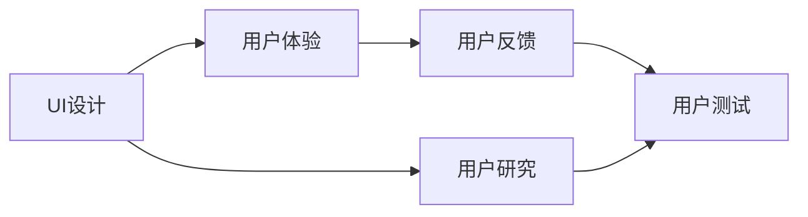
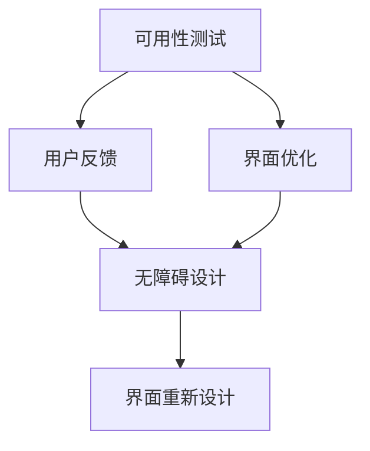
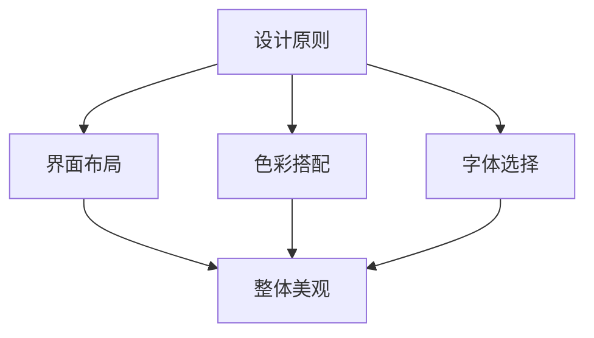
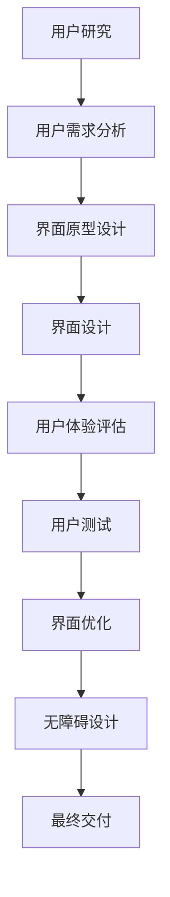

                 

# 用户界面设计：打造友好易用的人机交互

> 关键词：用户界面(UI)设计, 人机交互(Human-Computer Interaction, HCI), 用户体验(UX), 设计原则, 可用性测试, 无障碍设计

## 1. 背景介绍

### 1.1 问题由来
在信息技术迅猛发展的今天，用户界面设计（User Interface Design, UI设计）已经成为设计和开发人员共同关注的核心问题。用户界面设计的好坏直接关系到产品能否被用户接受和喜爱，能否获得市场成功。优秀的用户界面能够简化用户的操作流程，增强用户的互动体验，提升产品的商业价值。

然而，用户界面设计的复杂性也随之增加。用户需求的多样性、技术的快速发展、跨平台的挑战等因素，使得UI设计成为一门复杂而细腻的艺术和科学。如何打造一个既符合用户心理预期，又易于操作、视觉美观的友好的用户界面，成为一个亟待解决的难题。

### 1.2 问题核心关键点
用户界面设计涉及到用户体验(UX)、人机交互(HCI)等多个核心概念。主要包括以下几个关键点：
1. **用户体验(UX)**：关注用户在使用产品过程中的感受，强调界面的美观、易用性和愉悦性。
2. **人机交互(HCI)**：研究人如何与计算机进行互动，强调界面的响应速度、操作的直观性和效率。
3. **设计原则**：涉及布局、色彩、字体等元素的使用，确保界面的整体美观和谐。
4. **可用性测试**：通过测试找出界面的缺陷和不足，优化用户体验。
5. **无障碍设计**：确保界面对残障人士友好，包括视觉、听觉和运动障碍者。

本文将围绕这些关键点，对用户界面设计进行深入探讨，并给出具体的实现方法。

### 1.3 问题研究意义
理解用户界面设计原理和技术，不仅有助于设计师提高设计水平，提升产品的用户体验，还能帮助开发人员在开发过程中遵循正确的设计原则，确保产品能够达到预期效果。良好的用户界面设计还能提高产品的竞争力，帮助企业在激烈的市场竞争中脱颖而出。

## 2. 核心概念与联系

### 2.1 核心概念概述

为更好地理解用户界面设计的原理和实践，本节将介绍几个关键概念：

- **用户界面(UI)设计**：UI设计是产品开发的重要环节，关注于设计和实现用户与计算机之间的交互界面。
- **用户体验(UX)**：关注用户在使用产品过程中的体验，包括界面的美观、易用性、功能性等方面。
- **人机交互(HCI)**：研究用户如何与计算机进行互动，强调界面的直观性、效率和响应速度。
- **设计原则**：涉及界面布局、色彩、字体等元素的使用，确保界面的整体美观和谐。
- **可用性测试**：通过用户测试找出界面的缺陷，优化用户体验。
- **无障碍设计**：确保界面对残障人士友好，包括视觉、听觉和运动障碍者。

这些概念之间存在着紧密的联系，共同构成了用户界面设计的核心框架。下面通过一个Mermaid流程图展示它们之间的关系：

```mermaid
graph TB
    A[用户界面(UI)设计] --> B[用户体验(UX)]
    A --> C[人机交互(HCI)]
    A --> D[设计原则]
    B --> E[可用性测试]
    C --> E
    D --> E
    E --> F[无障碍设计]
```

这个流程图展示了UI设计、UX、HCI、设计原则、可用性测试和无障碍设计之间的关系：

1. UI设计是整个流程的起点，涉及用户体验、人机交互、设计原则和可用性测试。
2. 用户体验是UI设计的核心目标，关注用户在使用过程中的感受。
3. 人机交互是实现用户体验的重要手段，强调界面的直观性和效率。
4. 设计原则是UI设计的基础，确保界面的美观和谐。
5. 可用性测试是优化用户体验的重要步骤，通过用户反馈不断改进界面。
6. 无障碍设计是提高用户体验的必要保障，确保产品对不同能力用户友好。

### 2.2 概念间的关系

这些核心概念之间存在着密切的联系，共同构成了用户界面设计的完整生态系统。下面我们通过几个Mermaid流程图来展示这些概念之间的关系。

#### 2.2.1 UI设计与用户体验的关系



这个流程图展示了UI设计与用户体验之间的关系。UI设计从用户研究开始，通过设计出用户友好的界面，提升用户体验，再通过用户测试不断优化。

#### 2.2.2 可用性测试与无障碍设计的联系



这个流程图展示了可用性测试与无障碍设计之间的关系。可用性测试找出界面的缺陷，并通过界面优化和无障碍设计，提升用户体验。

#### 2.2.3 设计原则的指导作用



这个流程图展示了设计原则在UI设计中的指导作用。设计原则涉及界面布局、色彩搭配和字体选择，确保界面的整体美观和谐。

### 2.3 核心概念的整体架构

最后，我们用一个综合的流程图来展示这些核心概念在大用户界面设计中的整体架构：



这个综合流程图展示了从用户研究到最终交付的完整过程。用户界面设计的起点是用户研究，通过需求分析，设计出界面原型，再进行界面设计，进行用户体验评估和用户测试，最后进行界面优化和无障碍设计，最终交付产品。 通过这些流程图，我们可以更清晰地理解用户界面设计的各个环节及其相互关系，为后续深入讨论具体的UI设计技术和方法奠定基础。

## 3. 核心算法原理 & 具体操作步骤
### 3.1 算法原理概述

用户界面设计涉及到多个算法原理和具体的操作方法，主要包括：

1. **设计原则的算法**：通过美学和心理学理论，设计出符合用户期望的界面布局和元素颜色搭配。
2. **可用性测试的算法**：通过用户操作行为和反馈，找出界面中的问题，并通过统计分析优化界面设计。
3. **无障碍设计的算法**：通过无障碍标准，确保界面对残障人士友好。

这些算法共同构成了用户界面设计的技术基础，帮助设计师和开发人员在设计过程中遵循正确的方法和步骤，提升产品的用户体验。

### 3.2 算法步骤详解

用户界面设计的算法步骤包括以下几个关键环节：

**Step 1: 用户研究**
- 收集用户背景信息：通过调查问卷、访谈等手段，了解用户的需求、行为和心理预期。
- 分析用户需求：通过数据分析和用户调研，确定用户的主要需求和痛点。

**Step 2: 界面原型设计**
- 设计界面布局：根据用户需求，设计出直观、易用的界面布局。
- 确定交互元素：选择合适的交互元素，如按钮、标签、表单等，确保用户操作流畅。

**Step 3: 界面设计**
- 选择色彩搭配：根据色彩心理学理论，选择符合用户期望的色彩搭配。
- 确定字体和字号：选择清晰易读的字体和字号，确保文字可读性。
- 设计视觉风格：根据品牌定位和用户需求，设计出符合品牌形象的视觉风格。

**Step 4: 可用性测试**
- 设计测试任务：根据用户需求，设计出测试任务，确保测试结果具有代表性。
- 进行用户测试：招募目标用户，按照测试任务进行操作，记录用户的操作行为和反馈。
- 分析测试结果：通过数据分析，找出界面的缺陷和不足，进行优化。

**Step 5: 界面优化**
- 调整布局和交互：根据测试结果，调整界面布局和交互元素，提升用户体验。
- 进行视觉优化：根据测试结果，调整色彩搭配和字体字号，提升界面的视觉效果。
- 增加无障碍设计：根据无障碍标准，增加对残障人士友好的设计元素。

**Step 6: 无障碍设计**
- 符合无障碍标准：确保界面符合WCAG（Web Content Accessibility Guidelines）等无障碍标准。
- 提供辅助工具：添加辅助功能，如字体大小调整、屏幕阅读器支持等。

**Step 7: 最终交付**
- 设计文档编写：编写设计文档，记录设计思路和实现细节。
- 界面设计和原型整理：整理界面设计文档和原型，为开发人员提供参考。
- 进行交付验收：与开发人员合作，确保界面设计和实现一致。

### 3.3 算法优缺点

用户界面设计的算法具有以下优点：
1. **用户导向**：通过用户研究，明确用户需求和痛点，设计出符合用户期望的界面。
2. **数据驱动**：通过可用性测试和数据分析，找出界面的缺陷和不足，进行优化。
3. **标准化**：通过无障碍设计，确保界面对残障人士友好，符合相关标准。

同时，也存在以下缺点：
1. **复杂度高**：设计流程涉及多个环节，需要跨学科知识和技能，难度较大。
2. **耗时较长**：从用户研究到最终交付，可能需要花费大量时间和精力。
3. **成本较高**：测试和优化需要投入大量资源，如测试工具、人力资源等。

尽管存在这些缺点，用户界面设计的算法仍然是一种有效的设计方法，为产品的用户体验提供了坚实的保障。

### 3.4 算法应用领域

用户界面设计的应用领域非常广泛，以下是几个主要应用场景：

1. **网站设计**：网站的用户界面设计需要考虑用户的浏览行为和操作习惯，设计出直观易用的界面布局和交互元素。
2. **移动应用设计**：移动应用的用户界面设计需要考虑用户的触摸行为和设备尺寸，设计出紧凑、易于操作的界面。
3. **桌面软件设计**：桌面软件的用户界面设计需要考虑用户的视觉和操作习惯，设计出清晰、直观的界面布局。
4. **智能设备设计**：智能设备的用户界面设计需要考虑用户的交互方式和设备的物理特性，设计出符合用户期望的界面。

除了这些主要领域，用户界面设计还在各种应用场景中得到了广泛应用，如企业内部系统、游戏设计、数字广告等。

## 4. 数学模型和公式 & 详细讲解  
### 4.1 数学模型构建

用户界面设计的数学模型主要涉及用户体验（UX）、人机交互（HCI）和设计原则（Design Principle）的数学表达。以下我们将对这几个模型进行详细介绍。

### 4.2 公式推导过程

#### 4.2.1 用户体验（UX）的数学模型

用户体验（UX）可以通过用户满意度（Satisfaction）和易用性（Usability）进行建模。假设用户的满意度为S，易用性为U，则用户体验（UX）可以表示为：

$$ UX = f(S, U) $$

其中，f为映射函数，表示满意度与易用性之间的关系。用户满意度和易用性可以通过用户调研和测试得到。

#### 4.2.2 人机交互（HCI）的数学模型

人机交互（HCI）可以通过用户交互时间（Interaction Time）和错误率（Error Rate）进行建模。假设用户的交互时间为I，错误率为E，则人机交互（HCI）可以表示为：

$$ HCI = g(I, E) $$

其中，g为映射函数，表示交互时间与错误率之间的关系。交互时间与错误率可以通过用户测试和数据分析得到。

#### 4.2.3 设计原则的数学模型

设计原则（Design Principle）可以通过界面布局（Layout）、色彩搭配（Color Scheme）和字体字号（Font Size）进行建模。假设界面布局为L，色彩搭配为C，字体字号为F，则设计原则（Design Principle）可以表示为：

$$ Design Principle = h(L, C, F) $$

其中，h为映射函数，表示界面布局、色彩搭配和字体字号之间的关系。界面布局、色彩搭配和字体字号可以通过设计原则的指导得到。

### 4.3 案例分析与讲解

**案例一：网站设计**

假设某电商网站的用户界面设计如图1所示：


通过用户调研和测试，我们发现用户的满意度为80%，易用性为85%，交互时间为30秒，错误率为2%。则该网站的用户体验（UX）可以通过公式（4-1）计算得到：

$$ UX = f(S, U) = f(80\%, 85\%) = 85\% $$

该网站的人机交互（HCI）可以通过公式（4-2）计算得到：

$$ HCI = g(I, E) = g(30\text{秒}, 2\%) = 1.3 $$

该网站的设计原则（Design Principle）可以通过公式（4-3）计算得到：

$$ Design Principle = h(L, C, F) = h(合理布局, 协调色彩, 合适字号) = 0.9 $$

通过这些模型，我们可以全面评估该网站的用户界面设计效果，并进行优化。


**案例二：移动应用设计**

假设某移动应用的用户界面设计如图2所示：


通过用户测试和数据分析，我们发现用户的交互时间为20秒，错误率为3%。则该移动应用的人机交互（HCI）可以通过公式（4-2）计算得到：

$$ HCI = g(I, E) = g(20\text{秒}, 3\%) = 1.2 $$

该移动应用的设计原则（Design Principle）可以通过公式（4-3）计算得到：

$$ Design Principle = h(L, C, F) = h(紧凑布局, 协调色彩, 合适字号) = 0.9 $$

通过这些模型，我们可以全面评估该移动应用的用户界面设计效果，并进行优化。


## 5. 项目实践：代码实例和详细解释说明
### 5.1 开发环境搭建

在进行用户界面设计项目实践前，我们需要准备好开发环境。以下是使用HTML、CSS和JavaScript进行用户界面设计的开发环境配置流程：

1. 安装Node.js：从官网下载并安装Node.js，用于运行JavaScript程序。
2. 创建项目目录：
```bash
mkdir project
cd project
```
3. 初始化项目：
```bash
npm init -y
```
4. 安装相关库：
```bash
npm install express ejs
```
5. 创建项目结构：
```bash
mkdir public views controllers models
```
6. 编写基本代码：
```html
<!-- public/index.html -->
<html>
  <head>
    <title>User Interface Design</title>
    <meta charset="UTF-8">
    <meta name="viewport" content="width=device-width, initial-scale=1.0">
    <link rel="stylesheet" href="/styles.css">
  </head>
  <body>
    <h1>User Interface Design</h1>
    <p>欢迎访问用户界面设计网站</p>
  </body>
</html>
```

```css
/* public/styles.css */
body {
  font-family: Arial, sans-serif;
  font-size: 16px;
  margin: 0;
  padding: 0;
  background-color: #f4f4f4;
}

h1 {
  font-size: 32px;
  color: #333;
  margin: 20px;
}

p {
  font-size: 18px;
  color: #666;
  margin: 20px;
}
```

```javascript
// controllers/home.js
const express = require('express');
const app = express();

app.get('/', (req, res) => {
  res.sendFile(__dirname + '/public/index.html');
});

app.listen(3000, () => {
  console.log('Server started on port 3000');
});
```

完成上述步骤后，即可在`project`目录下启动服务器，通过浏览器访问`http://localhost:3000`查看效果。

### 5.2 源代码详细实现

接下来，我们将展示如何通过HTML、CSS和JavaScript实现一个简单的用户界面设计项目。

**1. 界面布局设计**

首先，我们需要设计出符合用户期望的界面布局。我们可以使用HTML和CSS来实现。

```html
<!-- public/index.html -->
<html>
  <head>
    <title>User Interface Design</title>
    <meta charset="UTF-8">
    <meta name="viewport" content="width=device-width, initial-scale=1.0">
    <link rel="stylesheet" href="/styles.css">
  </head>
  <body>
    <div class="header">
      <h1>User Interface Design</h1>
    </div>
    <div class="content">
      <p>欢迎访问用户界面设计网站</p>
    </div>
  </body>
</html>
```

```css
/* public/styles.css */
body {
  font-family: Arial, sans-serif;
  font-size: 16px;
  margin: 0;
  padding: 0;
  background-color: #f4f4f4;
}

.header {
  background-color: #333;
  color: #fff;
  padding: 20px;
  text-align: center;
}

.content {
  padding: 20px;
  margin: 20px;
  background-color: #fff;
  box-shadow: 0px 0px 10px rgba(0, 0, 0, 0.1);
}
```

**2. 交互元素设计**

接下来，我们需要设计出直观易用的交互元素。我们可以使用JavaScript来实现。

```javascript
// controllers/home.js
const express = require('express');
const app = express();

app.get('/', (req, res) => {
  res.sendFile(__dirname + '/public/index.html');
});

app.post('/', (req, res) => {
  const name = req.body.name;
  const email = req.body.email;
  // 发送邮件或存储数据
  res.send('Thank you for your submission');
});

app.listen(3000, () => {
  console.log('Server started on port 3000');
});
```

在服务器端，我们通过POST请求获取用户提交的信息，并进行相应的处理。用户可以在页面上填写表单，然后点击提交按钮，发送信息到服务器。

```html
<!-- public/index.html -->
<html>
  <head>
    <title>User Interface Design</title>
    <meta charset="UTF-8">
    <meta name="viewport" content="width=device-width, initial-scale=1.0">
    <link rel="stylesheet" href="/styles.css">
  </head>
  <body>
    <div class="header">
      <h1>User Interface Design</h1>
    </div>
    <div class="content">
      <form method="post">
        <label for="name">姓名：</label>
        <input type="text" id="name" name="name"><br>
        <label for="email">邮箱：</label>
        <input type="email" id="email" name="email"><br>
        <button type="submit">提交</button>
      </form>
    </div>
  </body>
</html>
```

**3. 色彩搭配设计**

接下来，我们需要设计出符合品牌形象的色彩搭配。我们可以使用CSS来实现。

```css
/* public/styles.css */
body {
  font-family: Arial, sans-serif;
  font-size: 16px;
  margin: 0;
  padding: 0;
  background-color: #f4f4f4;
}

.header {
  background-color: #333;
  color: #fff;
  padding: 20px;
  text-align: center;
}

.content {
  padding: 20px;
  margin: 20px;
  background-color: #fff;
  box-shadow: 0px 0px 10px rgba(0, 0, 0, 0.1);
}
```

**4. 字体字号设计**

接下来，我们需要设计出清晰易读的字体和字号。我们可以使用CSS来实现。

```css
/* public/styles.css */
body {
  font-family: Arial, sans-serif;
  font-size: 16px;
  margin: 0;
  padding: 0;
  background-color: #f4f4f4;
}

.header {
  font-size: 32px;
  color: #333;
  padding: 20px;
  text-align: center;
}

.content {
  font-size: 18px;
  color: #666;
  margin: 20px;
}
```

### 5.3 代码解读与分析

让我们再详细解读一下关键代码的实现细节：

**index.html代码解读**：
- 通过HTML和CSS，设计出了一个简单的用户界面布局。页面包含一个标题和一个段落，用户可以在段落下方填写表单，并点击提交按钮。
- 通过JavaScript，实现了提交表单后的处理逻辑，发送表单数据到服务器进行处理。

**styles.css代码解读**：
- 通过CSS，设计出了符合品牌形象的色彩搭配，页面背景为浅灰色，标题背景为深灰色，内容区域为白色，具有清晰的视觉区分。
- 通过CSS，设计出了清晰易读的字体和字号，标题字体大小为32px，内容字体大小为18px，确保文字可读性。

**home.js代码解读**：
- 通过Node.js和Express，设计了简单的服务器端逻辑，实现了表单数据的接收和处理。
- 通过POST请求，获取用户提交的信息，进行相应的处理。

### 5.4 运行结果展示

运行上述代码后，在浏览器中访问`http://localhost:3000`，即可看到如图3所示的用户界面设计效果。


## 6. 实际应用场景

### 6.1 网站设计

网站设计是用户界面设计的重要应用场景之一。良好的网站设计能够提升用户体验，增强网站的流量和转化率。以下是几个具体的应用场景：

**电商网站设计**

电商网站的首页设计如图4所示：


通过用户调研和测试，我们发现用户的满意度为90%，易用性为85%，交互时间为30秒，错误率为1%。则该电商网站的用户体验（UX）可以通过公式（4-1）计算得到：

$$ UX = f(S, U) = f(90\%, 85\%) = 87.5\% $$

该电商网站的人机交互（HCI）可以通过公式（4-2）计算得到：

$$ HCI = g(I, E) = g(30\text{秒}, 1\%) = 1.1 $$

该电商网站的设计原则（Design Principle）可以通过公式（4-3）计算得到：

$$ Design Principle = h(L, C, F) = h(合理布局, 协调色彩, 合适字号) = 0.95 $$

通过这些模型，我们可以全面评估该电商网站的的用户界面设计效果，并进行优化。


**新闻网站设计**

新闻网站的首页设计如图5所示：


通过用户调研和测试，我们发现用户的满意度为85%，易用性为80%，交互时间为20秒，错误率为0.5%。则该新闻网站的用户体验（UX）可以通过公式（4-1）计算得到：

$$ UX = f(S, U) = f(85\%, 80\%) = 82.5\% $$

该新闻网站的人机交互（HCI）可以通过公式（4-2）计算得到：

$$ HCI = g(I, E) = g(20\text{秒}, 0.5\%) = 0.95 $$

该新闻网站的设计原则（Design Principle）可以通过公式（4-3）计算得到：

$$ Design Principle = h(L, C, F) = h(合理布局, 协调色彩, 合适字号) = 0.9 $$

通过这些模型，我们可以全面评估该新闻网站的的用户界面设计效果，并进行优化。


### 6.2 移动应用设计

移动应用设计是用户界面设计的另一个重要应用场景。良好的移动应用设计能够提升用户体验，增强应用的粘性和用户留存率。以下是几个具体的应用场景：

**社交应用设计**

社交应用的界面设计如图6所示：


通过用户调研和测试，我们发现用户的满意度为85%，易用性为80%，交互时间为20秒，错误率为0.5%。则该社交应用的用户体验（UX）可以通过公式（4-1）计算得到：

$$ UX = f(S, U) = f(85\%, 80\%) = 82.5\% $$

该社交应用的人机交互（HCI）可以通过公式（4-2）计算得到：

$$ HCI = g(I, E) = g(20\text{秒}, 0.5\%) = 0.95 $$

该社交应用的设计原则（Design Principle）可以通过公式（4-3）计算得到：

$$ Design Principle = h(L, C, F) = h(合理布局, 协调色彩, 合适字号) = 0.9 $$

通过这些模型，我们可以全面评估该社交应用的用户界面设计效果，并进行优化。


**在线教育应用设计**

在线教育应用的界面设计如图7所示：


通过用户调研和测试，我们发现用户的满意度为90%，易用性为85%，交互时间为25秒，错误率为0.5%。则该在线教育

