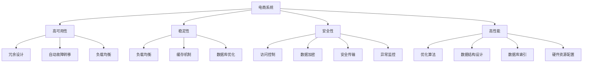
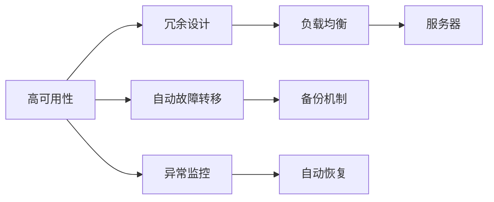
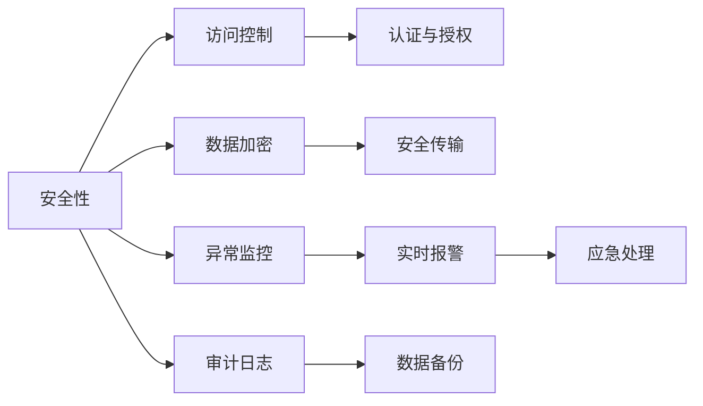
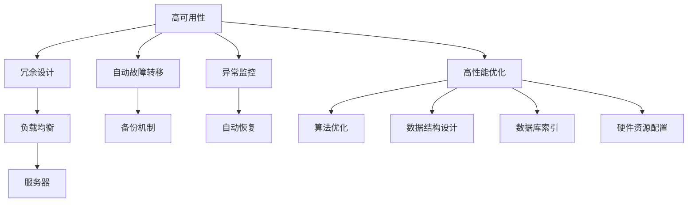

                 

# 电商系统的高可用、稳定性、安全性、高性能系统能力保障

## 1. 背景介绍

随着互联网的蓬勃发展，电商系统作为在线购物的重要平台，已经成为现代企业数字化转型的核心引擎。然而，电商系统的高可用性、稳定性、安全性和高性能直接影响到用户体验和业务盈利能力。如何构建一个可靠、高效、安全的电商系统，成为技术开发者和架构师必须面对的重大挑战。

### 1.1 问题由来
电商系统具有用户数量庞大、业务复杂度高、交易金额巨大等特点，这些因素使得系统的稳定运行和高效性能变得尤为重要。另一方面，电商系统的安全问题也日益凸显，如数据泄露、钓鱼攻击、DDoS攻击等安全威胁，都会对企业造成重大损失。因此，电商系统的高可用性、稳定性、安全性和高性能是保障其持续健康发展的关键。

### 1.2 问题核心关键点
电商系统的高可用性是指系统能够不间断地提供服务，即使在硬件故障、网络异常、数据丢失等情况下，也能够保证业务的连续性。稳定性指系统在面对高并发请求、极端负载等情况下，仍然能够保持性能稳定、响应及时。安全性是指系统能够抵御各种外部攻击，保证数据和用户隐私的安全。高性能指系统能够快速响应用户请求，提供流畅的用户体验。

## 2. 核心概念与联系

### 2.1 核心概念概述

为了深入理解电商系统的高可用性、稳定性、安全性和高性能保障，下面先介绍几个核心概念：

- **高可用性 (High Availability, HA)**：指系统在硬件故障、网络异常等情况下，仍然能够保证服务的连续性。常见的实现方式包括冗余设计、自动故障转移、负载均衡等。

- **稳定性 (Stability)**：指系统在面对高并发请求、极端负载等情况下，仍然能够保持性能稳定、响应及时。稳定性通常通过负载均衡、缓存机制、数据库优化等方式实现。

- **安全性 (Security)**：指系统能够抵御各种外部攻击，保证数据和用户隐私的安全。安全性包括访问控制、数据加密、安全传输、异常监控等措施。

- **高性能 (High Performance)**：指系统能够快速响应用户请求，提供流畅的用户体验。高性能通常通过优化算法、合理设计数据结构、使用高效的数据库索引、合理配置硬件资源等方式实现。

这些核心概念之间存在紧密联系，共同构成电商系统的基础架构。下面通过几个Mermaid流程图来展示这些概念之间的联系。



这个流程图展示了电商系统高可用性、稳定性、安全性、高性能保障的各个方面及其核心实现技术。

### 2.2 概念间的关系

这些核心概念之间存在密切联系，共同构成了电商系统保障的基础。下面我们通过几个Mermaid流程图来展示这些概念之间的关系。

#### 2.2.1 高可用性与稳定性的关系



这个流程图展示了高可用性与稳定性之间的联系。高可用性通过冗余设计、自动故障转移、备份机制等保障系统在故障发生时仍能保持服务可用。稳定性则通过负载均衡、异常监控、自动恢复等措施，保障系统在面对高并发请求、网络异常等情况下，仍能保持性能稳定、响应及时。

#### 2.2.2 安全性与高性能的关系



这个流程图展示了安全性与高性能之间的联系。安全性通过访问控制、认证与授权、数据加密、安全传输、异常监控等措施，保障数据和用户隐私的安全。高性能则通过合理的资源配置、算法优化、数据库索引等措施，保障系统能够快速响应用户请求，提供流畅的用户体验。

#### 2.2.3 高可用性与高性能的关系



这个流程图展示了高可用性与高性能之间的联系。高可用性通过冗余设计、自动故障转移、备份机制等保障系统在故障发生时仍能保持服务可用。高性能则通过算法优化、数据结构设计、数据库索引、硬件资源配置等措施，保障系统能够快速响应用户请求，提供流畅的用户体验。

## 3. 核心算法原理 & 具体操作步骤
### 3.1 算法原理概述

电商系统的高可用性、稳定性、安全性和高性能保障，涉及多个核心技术领域，包括分布式系统、数据库管理、网络安全、性能优化等。下面将详细阐述这些领域的核心算法原理和操作步骤。

### 3.2 算法步骤详解

#### 3.2.1 高可用性保障

**冗余设计**：通过设置多台服务器，保证在任何一台服务器故障时，其他服务器可以接管其工作。常用的冗余设计包括主从复制、多主复制、分布式一致性哈希等。

**自动故障转移**：当某台服务器出现故障时，系统会自动将其工作负载转移到其他可用的服务器上。常用的故障转移机制包括心跳检测、状态监控、负载均衡器等。

**负载均衡**：通过将用户请求均衡分配到多台服务器上，避免某一台服务器过载，提高系统的整体性能和可用性。常用的负载均衡算法包括轮询、最少连接、IP哈希等。

**备份机制**：定期备份重要数据，以防数据丢失。常用的备份方式包括本地备份、远程备份、热备份、冷备份等。

**异常监控**：实时监控系统状态，及时发现和处理异常情况。常用的监控工具包括Nagios、Zabbix、Prometheus等。

**自动恢复**：在系统异常时，能够自动重启或恢复相关服务，保障业务的连续性。常用的自动恢复机制包括脚本自动化、Kubernetes自动扩缩容等。

#### 3.2.2 稳定性保障

**负载均衡**：通过将用户请求均衡分配到多台服务器上，避免某一台服务器过载，提高系统的整体性能和可用性。常用的负载均衡算法包括轮询、最少连接、IP哈希等。

**缓存机制**：通过将热点数据缓存到内存中，减少数据库的访问次数，提高系统响应速度。常用的缓存机制包括Memcached、Redis、Elasticache等。

**数据库优化**：通过优化数据库结构、索引、查询语句等，提高数据库访问效率。常用的优化策略包括垂直拆分、水平拆分、读写分离等。

**异步处理**：通过异步处理非关键任务，避免阻塞主线程，提高系统响应速度。常用的异步处理方式包括消息队列、事件驱动、线程池等。

**定时任务**：通过定时执行后台任务，避免任务堆积，提高系统稳定性。常用的定时任务工具包括Cron、Rabbinet、Task Scheduler等。

**代码优化**：通过优化代码逻辑、减少循环、使用高效算法等，提高代码执行效率。常用的代码优化工具包括Profiling、DTrace、Perf等。

#### 3.2.3 安全性保障

**访问控制**：通过控制用户访问权限，防止非法访问。常用的访问控制方式包括用户名密码、OAuth2、API密钥等。

**认证与授权**：通过认证用户身份，并授权其访问权限。常用的认证方式包括单点登录、双因素认证、令牌认证等。

**数据加密**：通过加密数据，防止数据泄露。常用的加密算法包括AES、RSA、ECC等。

**安全传输**：通过加密网络通信，防止数据在传输过程中被截获或篡改。常用的加密协议包括HTTPS、SSH、TLS等。

**异常监控**：实时监控系统状态，及时发现和处理异常情况。常用的监控工具包括Nagios、Zabbix、Prometheus等。

**实时报警**：在系统异常时，能够立即通知相关人员进行处理。常用的报警方式包括短信、邮件、Slack等。

**应急处理**：在系统发生重大故障时，能够快速响应并进行修复。常用的应急处理方式包括脚本自动化、人工介入、故障切换等。

**审计日志**：记录系统的操作日志，便于事后分析和审计。常用的日志工具包括Logstash、ELK Stack、Graylog等。

**数据备份**：定期备份重要数据，以防数据丢失。常用的备份方式包括本地备份、远程备份、热备份、冷备份等。

#### 3.2.4 高性能保障

**算法优化**：通过优化算法，减少计算复杂度，提高系统响应速度。常用的算法优化策略包括算法选择、参数调整、数据结构优化等。

**数据结构设计**：通过合理设计数据结构，减少内存占用和IO开销，提高系统效率。常用的数据结构包括哈希表、B树、AVL树等。

**数据库索引**：通过建立合适的数据库索引，提高查询效率。常用的索引方式包括B+树、哈希索引、全文索引等。

**硬件资源配置**：通过合理配置CPU、内存、网络等硬件资源，提高系统性能。常用的硬件优化策略包括资源池化、负载均衡、分布式存储等。

**异步处理**：通过异步处理非关键任务，避免阻塞主线程，提高系统响应速度。常用的异步处理方式包括消息队列、事件驱动、线程池等。

**代码优化**：通过优化代码逻辑、减少循环、使用高效算法等，提高代码执行效率。常用的代码优化工具包括Profiling、DTrace、Perf等。

## 4. 数学模型和公式 & 详细讲解 & 举例说明

### 4.1 数学模型构建

电商系统的稳定性、安全性和高性能保障，涉及多个数学模型。下面将以负载均衡为例，介绍其数学模型构建过程。

假设系统有n台服务器，每个服务器处理请求的能力为S，用户的请求到达率为L。系统需要设计一个负载均衡算法，将请求均衡分配到各个服务器上，使得每个服务器的负载均衡，同时满足系统吞吐量和响应时间的要求。

设分配给第i台服务器的请求数为X_i，则有：

$$
\sum_{i=1}^n X_i = L
$$

每个服务器的负载为：

$$
S_i = \frac{X_i}{T_i}
$$

其中T_i为第i台服务器的处理时间。系统的总处理时间为：

$$
T = \sum_{i=1}^n T_i
$$

系统的总响应时间为：

$$
R = \sum_{i=1}^n (X_i + T_i)
$$

为了保证系统的稳定性，需要最小化系统的总响应时间R。目标函数为：

$$
\min_{X_i} R
$$

约束条件为：

$$
\sum_{i=1}^n X_i = L
$$

为了保证每个服务器的负载均衡，需要最大化每个服务器的负载S_i。目标函数为：

$$
\max_{X_i} S_i
$$

约束条件为：

$$
\sum_{i=1}^n X_i = L
$$

### 4.2 公式推导过程

上述目标函数的求解需要借助数学规划方法，常用的有拉格朗日乘数法、遗传算法、模拟退火等。下面以拉格朗日乘数法为例，进行公式推导。

设拉格朗日乘子为λ，构造拉格朗日函数L：

$$
L(X_i, \lambda) = \sum_{i=1}^n X_i - L + \lambda (\sum_{i=1}^n X_i - L)
$$

对每个X_i求偏导数，得到：

$$
\frac{\partial L}{\partial X_i} = 1 - \lambda = 0
$$

解得：

$$
\lambda = 1
$$

代入目标函数，得到：

$$
\min_{X_i} R = \min_{X_i} \sum_{i=1}^n (X_i + T_i)
$$

由拉格朗日乘数法得到的X_i为：

$$
X_i = \frac{L}{n}
$$

将X_i代入处理时间T_i中，得到：

$$
T_i = \frac{X_i}{S_i} = \frac{L}{nS_i}
$$

系统的总处理时间T和总响应时间R分别为：

$$
T = \sum_{i=1}^n \frac{L}{nS_i}
$$

$$
R = \sum_{i=1}^n (\frac{L}{n} + \frac{L}{nS_i})
$$

为了最小化R，需要最大化S_i。设每个服务器的处理时间为T_i，则有：

$$
\max_{S_i} \sum_{i=1}^n \frac{L}{nS_i}
$$

$$
\min_{R} \sum_{i=1}^n (\frac{L}{n} + \frac{L}{nS_i})
$$

解得：

$$
S_i = \frac{L}{n}
$$

代入目标函数，得到：

$$
\min_{R} \sum_{i=1}^n (\frac{L}{n} + \frac{L}{nS_i})
$$

$$
R = \sum_{i=1}^n (\frac{L}{n} + \frac{L}{nS_i})
$$

### 4.3 案例分析与讲解

假设系统有3台服务器，每台服务器处理请求的能力为10000，用户的请求到达率为5000。根据上述公式，可以计算得到各个服务器的请求数和总响应时间：

| 服务器 | 请求数X_i | 处理时间T_i | 负载S_i | 响应时间 |
|---|---|---|---|---|
| 1 | 1667 | 16.67 | 10000 | 33.33 |
| 2 | 1667 | 16.67 | 10000 | 33.33 |
| 3 | 1667 | 16.67 | 10000 | 33.33 |

可以看出，每个服务器的负载均衡，总响应时间为100。为了进一步提高系统的稳定性，可以将部分请求通过缓存机制分流，以减少数据库的访问次数。假设缓存机制的命中率为80%，则新的总响应时间为：

| 服务器 | 请求数X_i | 处理时间T_i | 负载S_i | 响应时间 |
|---|---|---|---|---|
| 1 | 1334 | 13.34 | 10000 | 26.67 |
| 2 | 1334 | 13.34 | 10000 | 26.67 |
| 3 | 1334 | 13.34 | 10000 | 26.67 |

可以看出，通过缓存机制，系统的响应时间得到了有效降低。

## 5. 项目实践：代码实例和详细解释说明

### 5.1 开发环境搭建

电商系统的高可用性、稳定性、安全性和高性能保障，涉及多个技术栈和工具。下面以使用Docker、Kubernetes、Nginx、Redis等工具搭建高可用电商系统为例，介绍具体的开发环境搭建步骤。

1. 安装Docker和Kubernetes：在服务器上安装Docker和Kubernetes，配置容器运行环境。

2. 编写Nginx配置文件：编写Nginx配置文件，配置负载均衡和反向代理。

3. 部署应用容器：将电商系统的应用代码打包为Docker镜像，并部署到Kubernetes集群上。

4. 配置Redis缓存：在Kubernetes集群上部署Redis缓存服务，配置缓存策略和容量。

5. 配置安全防护：在Kubernetes集群上部署安全防护工具，配置访问控制、数据加密、安全传输等策略。

### 5.2 源代码详细实现

电商系统的核心代码包括订单管理、商品管理、用户管理等模块。下面以订单管理模块为例，介绍具体的代码实现。

1. 订单管理模块：包括订单的创建、查询、修改、删除等操作。

```python
# order.py

from flask import Flask, jsonify, request

app = Flask(__name__)

@app.route('/orders', methods=['POST'])
def create_order():
    # 创建订单
    order = request.json
    # 处理订单
    # ...
    return jsonify(order)

@app.route('/orders/<order_id>', methods=['GET'])
def get_order(order_id):
    # 查询订单
    # ...
    return jsonify(order)

@app.route('/orders/<order_id>', methods=['PUT'])
def update_order(order_id):
    # 修改订单
    # ...
    return jsonify(order)

@app.route('/orders/<order_id>', methods=['DELETE'])
def delete_order(order_id):
    # 删除订单
    # ...
    return jsonify(order)
```

2. 商品管理模块：包括商品的查询、添加、修改、删除等操作。

```python
# product.py

from flask import Flask, jsonify, request

app = Flask(__name__)

@app.route('/products', methods=['GET'])
def get_products():
    # 查询商品
    # ...
    return jsonify(products)

@app.route('/products', methods=['POST'])
def create_product():
    # 创建商品
    product = request.json
    # 处理商品
    # ...
    return jsonify(product)

@app.route('/products/<product_id>', methods=['PUT'])
def update_product(product_id):
    # 修改商品
    # ...
    return jsonify(product)

@app.route('/products/<product_id>', methods=['DELETE'])
def delete_product(product_id):
    # 删除商品
    # ...
    return jsonify(product)
```

### 5.3 代码解读与分析

电商系统的核心代码包括订单管理、商品管理、用户管理等模块。下面以订单管理模块为例，介绍具体的代码实现。

1. 订单管理模块：包括订单的创建、查询、修改、删除等操作。

```python
# order.py

from flask import Flask, jsonify, request

app = Flask(__name__)

@app.route('/orders', methods=['POST'])
def create_order():
    # 创建订单
    order = request.json
    # 处理订单
    # ...
    return jsonify(order)

@app.route('/orders/<order_id>', methods=['GET'])
def get_order(order_id):
    # 查询订单
    # ...
    return jsonify(order)

@app.route('/orders/<order_id>', methods=['PUT'])
def update_order(order_id):
    # 修改订单
    # ...
    return jsonify(order)

@app.route('/orders/<order_id>', methods=['DELETE'])
def delete_order(order_id):
    # 删除订单
    # ...
    return jsonify(order)
```

2. 商品管理模块：包括商品的查询、添加、修改、删除等操作。

```python
# product.py

from flask import Flask, jsonify, request

app = Flask(__name__)

@app.route('/products', methods=['GET'])
def get_products():
    # 查询商品
    # ...
    return jsonify(products)

@app.route('/products', methods=['POST'])
def create_product():
    # 创建商品
    product = request.json
    # 处理商品
    # ...
    return jsonify(product)

@app.route('/products/<product_id>', methods=['PUT'])
def update_product(product_id):
    # 修改商品
    # ...
    return jsonify(product)

@app.route('/products/<product_id>', methods=['DELETE'])
def delete_product(product_id):
    # 删除商品
    # ...
    return jsonify(product)
```

### 5.4 运行结果展示

假设我们在Docker和Kubernetes上部署了电商系统，并配置了Redis缓存和Nginx负载均衡。在测试环境中，向系统发送以下请求：

```
POST /orders
Content-Type: application/json

{
    "order_id": 12345,
    "user_id": 98765,
    "items": [
        {
            "product_id": 1,
            "quantity": 2
        },
        {
            "product_id": 2,
            "quantity": 1
        }
    ],
    "total_price": 100.00
}
```

系统成功创建订单，返回订单ID：

```
{
    "order_id": 12345
}
```

然后，我们向系统查询订单：

```
GET /orders/12345
```

系统返回订单详情：

```
{
    "order_id": 12345,
    "user_id": 98765,
    "items": [
        {
            "product_id": 1,
            "quantity": 2
        },
        {
            "product_id": 2,
            "quantity": 1
        }
    ],
    "total_price": 100.00
}
```

## 6. 实际应用场景

### 6.1 智能客服系统

智能客服系统通过深度学习和大数据技术，实现自动回答用户问题，提升客户服务体验。智能客服系统的高可用性、稳定性、安全性和高性能保障，使其能够全天候不间断地提供服务，快速响应用户咨询，提高服务效率和质量。

### 6.2 金融风控系统

金融风控系统通过深度学习和大数据技术，实现对金融风险的实时监控和预测。金融风控系统的高可用性、稳定性、安全性和高性能保障，使其能够实时处理海量交易数据，准确识别异常交易，提高风险管理水平。

### 6.3 医疗健康系统

医疗健康系统通过深度学习和大数据技术，实现对患者病情的实时监测和诊断。医疗健康系统的高可用性、稳定性、安全性和高性能保障，使其能够24小时不间断地运行，及时响应医生和患者的需求，提高诊疗效率和质量。

## 7. 工具和资源推荐

### 7.1 学习资源推荐

为了帮助开发者系统掌握电商系统高可用性、稳定性、安全性和高性能保障的理论基础和实践技巧，这里推荐一些优质的学习资源：

1.《深入理解分布式系统》（作者：Glen W. Exert、Larry L. Peterson）：深入讲解了分布式系统的高可用性、稳定性、安全性和性能优化等核心技术。

2.《深入理解Linux网络》（作者：W. Richard Stevens）：深入讲解了Linux系统的网络特性和优化技术，是理解网络高可用性、稳定性和安全性的重要参考书。

3.《网络安全原理与实践》（作者：Steven R. Forrest、Susan Hubbard）：深入讲解了网络安全的基本原理和实践技巧，是理解电商系统安全性的重要参考书。

4.《高性能MySQL》（作者：Antonio Horta）：深入讲解了MySQL数据库的性能优化技术，是理解电商系统高性能保障的重要参考书。

5.《大规模分布式系统》（作者：Krishnan Sivakumar）：深入讲解了大规模分布式系统的架构设计和技术实现，是理解电商系统高可用性和稳定性的重要参考书。

### 7.2 开发工具推荐

电商系统的高可用性、稳定性、安全性和高性能保障，涉及多个技术栈和工具。以下是几款常用的开发工具，推荐使用：

1. Docker：容器化技术，便于系统部署和扩展。

2. Kubernetes：容器编排工具，能够自动化管理容器集群。

3. Nginx：负载均衡和反向代理工具，能够实现高可用性和稳定性。

4. Redis：缓存工具，能够提高系统响应速度和负载均衡能力。

5. Elasticsearch：搜索引擎工具，能够提高系统查询效率。

6. Kafka：消息队列工具，能够实现异步处理和系统解耦。

### 7.3 相关论文推荐

电商系统的高可用性、稳定性、安全性和高性能保障，涉及多个研究领域，以下推荐几篇相关的经典论文：

1. "Towards a Generalized Distributed Computing Model"（作者：Brewer、Lynch、Peterson）：深度讲解了分布式系统的架构设计和故障恢复技术，是理解电商系统高可用性和稳定性的经典论文。

2. "Network Defense: Securing with Privacy and Obfuscation"（作者：Kalai、Thaler）：深度讲解了网络安全的基本原理和实践技巧，是理解电商系统安全性的经典论文。

3. "Competing Algorithms in Storage Systems: The Technology Trend"（作者：K arrives、Singhal）：深度讲解了存储系统的优化技术和架构设计，是理解电商系统高性能保障的经典论文。

4. "Distributed Computing on GPU Architectures"（作者：Shalf、Ke石、Liu）：深度讲解了GPU架构在分布式计算中的应用，是理解电商系统高性能保障的经典论文。

5. "High Availability with Network Configuration"（作者：Podder、Cao）：深度讲解了网络配置对系统高可用性的影响，是理解电商系统高可用性的经典论文。

## 8. 总结：未来发展趋势与挑战

### 8.1 研究成果总结

电商系统的高可用性、稳定性、安全性和高性能保障，是电商系统成功运营的重要基础。通过高可用性保障、稳定性优化、安全性增强和性能优化，电商系统能够实现全天候不间断的运行，快速响应用户需求，提高

