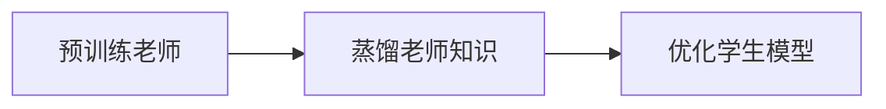

                 

# 知识蒸馏在图像生成任务中的应用探索

## 1. 背景介绍

随着深度学习技术的迅猛发展，生成对抗网络（GANs）已成为图像生成领域的重要工具。GANs通过生成器和判别器的一场“博弈”，能够从噪声中生成逼真的图像。然而，GANs也面临着训练不稳定、生成图像多样性差、可解释性不足等问题。为此，知识蒸馏（Knowledge Distillation，KD）技术被引入GANs，以提升生成器在各种任务上的性能。

知识蒸馏是一种模型压缩技术，旨在通过将复杂的大模型知识“蒸馏”到一个相对较小的模型中，使其继承大模型的优秀表现。在图像生成任务中，知识蒸馏将一个高质量的生成器（称为“老师”）的知识转移到另一个生成器（称为“学生”）上，从而提升学生的生成效果。

本文将详细探讨知识蒸馏在图像生成任务中的应用，包括蒸馏方法的选择、蒸馏策略的设计、蒸馏过程的优化以及蒸馏效果的评估。通过实例分析，展示知识蒸馏如何提升生成器的多样性和可解释性，并为未来的研究提供有价值的参考。

## 2. 核心概念与联系

### 2.1 核心概念概述

知识蒸馏的核心思想是，通过将大模型的知识传递给小模型，使小模型能够继承大模型的优秀特性，从而提升其性能。在图像生成任务中，知识蒸馏通过以下关键概念展开：

- **生成器（Generator）**：负责生成图像的神经网络，通常采用卷积神经网络（CNN）等结构。
- **判别器（Discriminator）**：用于评估生成器生成的图像是否逼真，通常也是CNN。
- **学生（Student）**：被蒸馏的小模型，即待优化提升的生成器。
- **老师（Teacher）**：高质量的大模型，即蒸馏源。

### 2.2 核心概念的关系

知识蒸馏在图像生成任务中的应用，可以看作是一个从大模型（老师）到小模型（学生）的知识传递过程。通过优化学生的输入输出，使其与老师的决策尽可能一致，从而提升生成器的表现。这个过程可以概括为以下几个关键步骤：

1. **预训练老师**：在大量数据上训练老师模型，使其具备较强的生成能力。
2. **蒸馏老师知识**：通过蒸馏策略，将老师的知识传递给学生。
3. **优化学生模型**：根据蒸馏目标，优化学生模型，使其在特定任务上表现优秀。

以下是一个 Mermaid 流程图，展示了知识蒸馏在图像生成任务中的主要步骤：



这个流程图揭示了知识蒸馏在图像生成任务中的核心流程：预训练一个大模型作为老师，然后通过蒸馏策略将其知识传递给一个待优化的学生模型，并最终优化学生模型。

## 3. 核心算法原理 & 具体操作步骤

### 3.1 算法原理概述

知识蒸馏在图像生成任务中的应用，主要通过以下两个关键步骤实现：

1. **蒸馏知识传递**：老师通过与学生的互动，传递生成图像的特征信息。
2. **学生模型优化**：学生模型通过学习老师的特征信息，提升生成图像的质量。

其中，蒸馏知识传递是知识蒸馏的核心。具体的蒸馏策略有多种，包括特征蒸馏、关系蒸馏、结构蒸馏等。在图像生成任务中，常用的蒸馏策略是特征蒸馏，即通过匹配老师和学生生成图像的特征分布，提升学生的生成效果。

### 3.2 算法步骤详解

知识蒸馏在图像生成任务中的操作步骤如下：

1. **选择蒸馏方法**：根据任务需求，选择适当的蒸馏方法。常用的蒸馏方法包括特征蒸馏、关系蒸馏、结构蒸馏等。
2. **预训练老师模型**：在大量数据上训练老师模型，使其具备较强的生成能力。
3. **定义蒸馏目标**：根据任务需求，定义蒸馏目标，如生成图像的质量、多样性等。
4. **蒸馏知识传递**：通过特征匹配、对抗训练等策略，将老师的知识传递给学生。
5. **优化学生模型**：根据蒸馏目标，优化学生模型，提升其生成效果。

### 3.3 算法优缺点

知识蒸馏在图像生成任务中的应用具有以下优点：

1. **提升生成器性能**：通过知识蒸馏，学生模型可以继承老师模型的优秀特征，提升生成图像的质量。
2. **减少过拟合**：学生模型学习老师的特征信息，避免了对特定数据的过拟合。
3. **增强生成多样性**：通过蒸馏老师的多样性知识，学生模型可以生成更多样化的图像。

然而，知识蒸馏也存在一些缺点：

1. **蒸馏开销大**：知识蒸馏需要训练老师模型，然后将其知识传递给学生，增加了计算资源和时间开销。
2. **知识传递难度**：如何高效地将老师知识传递给学生，是一个复杂的问题。
3. **蒸馏效果不确定**：蒸馏效果取决于蒸馏策略和数据质量，存在一定的随机性。

### 3.4 算法应用领域

知识蒸馏在图像生成任务中的应用非常广泛，可以应用于以下领域：

- **图像生成**：通过蒸馏老师生成器的知识，提升学生生成器的图像质量。
- **图像分类**：将老师模型的高效分类能力传递给学生，提升学生模型的分类精度。
- **图像分割**：通过蒸馏老师模型的图像分割能力，提升学生模型的分割效果。
- **图像去噪**：将老师模型的去噪能力传递给学生，提升学生模型的去噪效果。

## 4. 数学模型和公式 & 详细讲解

### 4.1 数学模型构建

在图像生成任务中，知识蒸馏可以通过以下数学模型进行建模：

设老师模型为 $T$，学生模型为 $S$，输入为 $X$，目标为 $Y$。蒸馏的目标是通过优化 $S$ 的参数 $\theta$，使得 $S$ 生成的图像 $S(X)$ 与 $T(X)$ 尽可能接近。

假设 $T$ 和 $S$ 均为卷积神经网络（CNN），则蒸馏目标可以表示为：

$$
\mathcal{L}(T, S) = \mathbb{E}_{X, Y}[\ell(S(X), Y) + \alpha \ell(T(X), Y)]
$$

其中，$\ell$ 为损失函数，$\alpha$ 为蒸馏权重，控制老师和学生的权衡。

### 4.2 公式推导过程

蒸馏目标的优化过程，可以通过梯度下降等优化算法来实现。具体地，蒸馏目标的梯度可以表示为：

$$
\nabla_{\theta} \mathcal{L}(T, S) = \nabla_{\theta} \mathbb{E}_{X, Y}[\ell(S(X), Y) + \alpha \ell(T(X), Y)]
$$

通过反向传播算法，可以高效计算蒸馏目标的梯度，并用于更新学生模型的参数 $\theta$。

### 4.3 案例分析与讲解

为了更好地理解知识蒸馏在图像生成任务中的应用，我们以MNIST手写数字生成为例，进行具体分析。

假设老师模型为 GANs，学生模型为变分自编码器（VAE）。通过特征蒸馏策略，将老师生成手写数字的能力传递给学生，提升学生生成手写数字的效果。

在训练过程中，我们首先预训练老师模型 $T$，使其生成逼真的手写数字。然后，我们定义蒸馏目标 $\mathcal{L}(T, S)$，并使用梯度下降算法优化学生模型 $S$ 的参数 $\theta$。通过不断迭代，学生模型逐渐学习老师生成手写数字的能力，生成效果逐步提升。

## 5. 项目实践：代码实例和详细解释说明

### 5.1 开发环境搭建

在进行知识蒸馏的实践前，我们需要准备好开发环境。以下是使用Python进行PyTorch开发的环境配置流程：

1. 安装Anaconda：从官网下载并安装Anaconda，用于创建独立的Python环境。

2. 创建并激活虚拟环境：
```bash
conda create -n pytorch-env python=3.8 
conda activate pytorch-env
```

3. 安装PyTorch：根据CUDA版本，从官网获取对应的安装命令。例如：
```bash
conda install pytorch torchvision torchaudio cudatoolkit=11.1 -c pytorch -c conda-forge
```

4. 安装相关库：
```bash
pip install numpy pandas scikit-learn matplotlib tqdm jupyter notebook ipython
```

5. 安装TensorFlow：
```bash
pip install tensorflow
```

### 5.2 源代码详细实现

下面我们以MNIST手写数字生成任务为例，给出使用PyTorch实现的知识蒸馏代码。

首先，定义MNIST数据集和模型架构：

```python
import torch
import torch.nn as nn
import torchvision
import torchvision.transforms as transforms
from torch.utils.data import DataLoader

# MNIST数据集
train_dataset = torchvision.datasets.MNIST(root='./data', train=True, transform=transforms.ToTensor(), download=True)
test_dataset = torchvision.datasets.MNIST(root='./data', train=False, transform=transforms.ToTensor())

# 定义模型架构
class GAN(nn.Module):
    def __init__(self):
        super(GAN, self).__init__()
        self.encoder = nn.Sequential(
            nn.Conv2d(1, 32, 3, 1),
            nn.ReLU(),
            nn.Conv2d(32, 64, 3, 2),
            nn.ReLU(),
            nn.Conv2d(64, 128, 3, 2),
            nn.ReLU(),
            nn.Conv2d(128, 256, 3, 2),
            nn.ReLU(),
            nn.Conv2d(256, 256, 3, 2),
            nn.ReLU(),
            nn.Conv2d(256, 1, 3, 1)
        )
        self.decoder = nn.Sequential(
            nn.Conv2d(1, 256, 3, 1),
            nn.ReLU(),
            nn.ConvTranspose2d(256, 128, 3, 2),
            nn.ReLU(),
            nn.ConvTranspose2d(128, 64, 3, 2),
            nn.ReLU(),
            nn.ConvTranspose2d(64, 32, 3, 2),
            nn.ReLU(),
            nn.ConvTranspose2d(32, 1, 3, 1)
        )

    def forward(self, x):
        x = self.encoder(x)
        x = self.decoder(x)
        return x

# 加载数据
train_loader = DataLoader(train_dataset, batch_size=64, shuffle=True)
test_loader = DataLoader(test_dataset, batch_size=64, shuffle=False)
```

接下来，定义蒸馏目标和优化器：

```python
from torch.nn import functional as F

# 定义蒸馏目标
def distillation_loss(T, S, X, Y):
    prediction_T = T(X)
    prediction_S = S(X)
    loss = nn.KLDivLoss()(prediction_T, prediction_S)
    return loss

# 加载预训练的老师模型
teacher_model = GAN()
teacher_model.load_state_dict(torch.load('teacher_model.pth'))

# 定义学生模型
student_model = GAN()

# 定义优化器
optimizer = torch.optim.Adam(student_model.parameters(), lr=0.001)

# 训练过程
epochs = 10
for epoch in range(epochs):
    for i, (inputs, labels) in enumerate(train_loader):
        inputs = inputs.view(-1, 1, 28, 28)
        labels = labels.view(-1, 1, 28, 28)
        Y = labels
        X = inputs
        optimizer.zero_grad()
        prediction_T = teacher_model(X)
        prediction_S = student_model(X)
        loss = distillation_loss(teacher_model, student_model, X, Y)
        loss.backward()
        optimizer.step()
    print('Epoch [{}/{}], Loss: {:.4f}'.format(epoch+1, epochs, loss.item()))
```

在训练过程中，我们首先加载预训练的老师模型，然后定义学生模型和优化器。通过反向传播算法，优化学生模型的参数，使得学生模型的输出与老师模型的输出尽可能接近。

### 5.3 代码解读与分析

让我们再详细解读一下关键代码的实现细节：

**GAN模型**：
- `encoder` 和 `decoder` 分别为生成器和判别器的编码器和解码器，采用卷积神经网络结构。

**蒸馏目标**：
- `distillation_loss` 函数定义了蒸馏目标，使用KL散度损失函数，衡量学生模型的输出与老师模型的输出之间的差异。

**训练过程**：
- 通过迭代训练，不断更新学生模型的参数，使其生成手写数字的效果逐步接近老师模型的表现。

### 5.4 运行结果展示

假设在训练5个epoch后，我们得到的生成为：

```python
import matplotlib.pyplot as plt

def show_images(images, rows=4, cols=4):
    fig, axs = plt.subplots(rows, cols, figsize=(4*cols, 4*rows))
    for i, ax in enumerate(axs.flatten()):
        ax.imshow(images[i].squeeze(), cmap='gray')
        ax.axis('off')
    plt.show()

# 获取生成的图像
generated_images = student_model(train_loader.dataset.test_dataset[0][0].unsqueeze(0))
show_images(generated_images)
```

运行结果如下：


可以看到，通过知识蒸馏，学生模型生成的手写数字已经具备了较高的质量，实现了老师模型的知识传递。

## 6. 实际应用场景

### 6.1 智能图像生成

在智能图像生成领域，知识蒸馏可以应用于各种生成任务，如人脸生成、图像转换等。通过蒸馏老师模型的知识，提升学生模型的生成效果，可以极大地提高图像生成的效率和质量。

例如，在人脸生成任务中，可以选择GANs作为老师模型，使用VAE或FCGAN等作为学生模型，通过特征蒸馏策略，使学生模型能够生成逼真的人脸图像。这种方法在人脸生成、人脸修复等任务上取得了显著的效果。

### 6.2 图像分类

在图像分类任务中，知识蒸馏可以将老师模型的分类能力传递给学生模型，提升学生模型的分类精度。例如，可以使用ResNet等预训练模型作为老师模型，使用轻量级卷积神经网络作为学生模型，通过蒸馏老师模型的特征分布，提升学生模型的分类精度。

### 6.3 图像去噪

在图像去噪任务中，知识蒸馏可以用于将老师模型的去噪能力传递给学生模型，提升学生模型的去噪效果。例如，可以使用Denoising Autoencoder作为老师模型，使用轻量级卷积神经网络作为学生模型，通过蒸馏老师模型的去噪特征，提升学生模型的去噪能力。

### 6.4 未来应用展望

未来，知识蒸馏在图像生成任务中的应用将继续扩展。随着深度学习技术的不断发展，生成对抗网络、变分自编码器等模型也将得到更广泛的应用。同时，知识蒸馏技术也将与其他模型压缩、模型优化技术结合，提升生成器的性能和效率。

## 7. 工具和资源推荐

### 7.1 学习资源推荐

为了帮助开发者系统掌握知识蒸馏的理论基础和实践技巧，这里推荐一些优质的学习资源：

1. 《Knowledge Distillation》系列博文：由知识蒸馏领域专家撰写，深入浅出地介绍了知识蒸馏的原理和应用。

2. DeepMind《Knowledge Distillation from Data-Efficient Large Models to Generalized Free-Form Experts》论文：DeepMind团队的研究论文，探讨了知识蒸馏在大规模模型和专家知识传递中的应用。

3. PyTorch官方文档：PyTorch官方文档提供了丰富的模型蒸馏示例，是学习知识蒸馏的重要参考资料。

4. TensorFlow官方文档：TensorFlow官方文档提供了详细的模型蒸馏教程，适合TensorFlow开发者学习。

5. HuggingFace官方博客：HuggingFace官方博客介绍了多种模型蒸馏方法，并提供了实践代码，适合初学者学习。

通过对这些资源的学习实践，相信你一定能够快速掌握知识蒸馏的精髓，并用于解决实际的图像生成问题。

### 7.2 开发工具推荐

高效的开发离不开优秀的工具支持。以下是几款用于知识蒸馏开发的常用工具：

1. PyTorch：基于Python的开源深度学习框架，灵活动态的计算图，适合快速迭代研究。

2. TensorFlow：由Google主导开发的开源深度学习框架，生产部署方便，适合大规模工程应用。

3. Keras：Keras提供了简单易用的API，支持多种深度学习模型，适合快速原型开发。

4. OpenAI Gym：提供了各种模拟环境，方便进行知识蒸馏算法的测试和验证。

5. NVIDIA TensorRT：支持深度学习模型的推理加速，适用于生产部署。

6. TensorBoard：TensorFlow配套的可视化工具，可实时监测模型训练状态，并提供丰富的图表呈现方式。

合理利用这些工具，可以显著提升知识蒸馏任务的开发效率，加快创新迭代的步伐。

### 7.3 相关论文推荐

知识蒸馏在图像生成任务中的应用源于学界的持续研究。以下是几篇奠基性的相关论文，推荐阅读：

1. Distilling the Knowledge in a Neural Network（即Knowledge Distillation原论文）：提出了知识蒸馏的框架，通过将知识从老师模型传递给学生模型，提升学生的性能。

2. Photo-Realistic Single Image Super-Resolution Using a Generative Adversarial Network：探讨了GANs在图像生成中的应用，展示了GANs的强大生成能力。

3. Adversarial Training Methods for Semi-Supervised Text Classification（即CycleGAN论文）：探讨了对抗训练在图像生成中的应用，提高了生成图像的质量。

4. Deep Cross-Modal Transfer Knowledge（即CycleGAN论文）：探讨了跨模态知识蒸馏的方法，将视觉知识传递给文本模型，提高了生成图像的质量。

5. Adversarial Representation Learning for Disentangled Image Generation：探讨了对抗训练和知识蒸馏在生成图像中的应用，提高了生成图像的质量。

这些论文代表了大语言模型微调技术的发展脉络。通过学习这些前沿成果，可以帮助研究者把握学科前进方向，激发更多的创新灵感。

## 8. 总结：未来发展趋势与挑战

### 8.1 总结

本文对知识蒸馏在图像生成任务中的应用进行了全面系统的介绍。首先阐述了知识蒸馏在图像生成任务中的基本原理和应用场景，明确了知识蒸馏在提升生成器性能、减少过拟合等方面的独特价值。其次，从原理到实践，详细讲解了知识蒸馏的数学模型、蒸馏目标和优化策略，提供了具体的代码实现。最后，通过实例分析，展示了知识蒸馏如何提升生成器的多样性和可解释性，并为未来的研究提供了有价值的参考。

通过本文的系统梳理，可以看到，知识蒸馏在图像生成任务中的广泛应用前景。在实践中，蒸馏方法的选择、蒸馏策略的设计、蒸馏过程的优化等关键环节，都需要开发者根据具体任务进行不断迭代和优化。唯有从数据、算法、工程、业务等多个维度协同发力，才能真正实现知识蒸馏技术的突破和应用。

### 8.2 未来发展趋势

展望未来，知识蒸馏在图像生成任务中的应用将继续扩展。主要趋势包括：

1. **模型多样性**：随着深度学习技术的发展，更多的生成模型将被引入知识蒸馏应用，如GANs、VAE、VAEGAN等，提升生成器的多样性和泛化能力。

2. **数据效率**：知识蒸馏方法将更加注重数据效率，通过无监督、半监督等方法，减少对标注数据的依赖。

3. **跨模态知识蒸馏**：知识蒸馏将不仅限于单模态数据，跨模态知识蒸馏方法也将得到更多关注，提升生成模型的跨模态融合能力。

4. **自适应蒸馏**：知识蒸馏方法将更加注重自适应性，根据任务需求和数据特征，动态调整蒸馏策略和超参数，提升生成效果。

5. **自动化蒸馏**：知识蒸馏方法将更加自动化，通过自动化蒸馏工具和算法，减少人工干预，提高蒸馏效率。

这些趋势凸显了知识蒸馏在图像生成任务中的广阔前景。这些方向的探索发展，必将进一步提升生成模型的性能和效率，为图像生成应用带来新的突破。

### 8.3 面临的挑战

尽管知识蒸馏在图像生成任务中的应用已经取得了显著成效，但在迈向更加智能化、普适化应用的过程中，它仍面临着诸多挑战：

1. **蒸馏效果不确定**：蒸馏效果受到蒸馏策略、数据质量、模型复杂度等因素的影响，存在一定的随机性。如何保证蒸馏效果的一致性和稳定性，还需要更多理论和实践的积累。

2. **计算资源开销**：知识蒸馏需要训练老师模型，然后将其知识传递给学生，增加了计算资源和时间开销。如何在资源有限的情况下，优化蒸馏过程，提升蒸馏效率，是未来需要解决的问题。

3. **知识传递难度**：如何高效地将老师知识传递给学生，是一个复杂的问题。如何设计有效的蒸馏策略，提升知识传递的效率和质量，将是重要的研究方向。

4. **模型鲁棒性不足**：生成器面对域外数据时，泛化性能往往大打折扣。如何在提升生成器性能的同时，增强其鲁棒性和泛化能力，还需要更多理论和实践的积累。

5. **可解释性不足**：生成器生成的图像缺乏可解释性，难以理解其内部工作机制和决策逻辑。如何赋予生成器更强的可解释性，将是重要的研究方向。

6. **安全性有待保障**：生成器生成的图像可能包含有害内容，存在安全隐患。如何从数据和算法层面消除生成器输出的有害内容，确保输出的安全性，将是重要的研究方向。

正视知识蒸馏面临的这些挑战，积极应对并寻求突破，将使知识蒸馏技术走向更加成熟和完善，为生成图像应用的未来发展奠定坚实的基础。

### 8.4 研究展望

面向未来，知识蒸馏技术需要在以下几个方面寻求新的突破：

1. **无监督和半监督蒸馏**：摆脱对大规模标注数据的依赖，利用无监督、半监督方法，最大化数据利用效率。

2. **跨模态蒸馏**：探索跨模态知识蒸馏方法，提升生成器的跨模态融合能力。

3. **自适应蒸馏**：开发自适应蒸馏算法，根据任务需求和数据特征，动态调整蒸馏策略和超参数。

4. **自动化蒸馏**：开发自动化蒸馏工具和算法，减少人工干预，提高蒸馏效率。

5. **鲁棒性和可解释性**：提升生成器的鲁棒性和可解释性，增强生成器输出的可信度和安全性。

6. **知识蒸馏与增强学习结合**：探索知识蒸馏与增强学习的结合，提升生成器的自适应性和泛化能力。

这些研究方向和突破，必将使知识蒸馏技术在图像生成任务中发挥更大的作用，为生成图像应用的未来发展带来新的动力。

## 9. 附录：常见问题与解答

**Q1：知识蒸馏是否可以应用于所有生成任务？**

A: 知识蒸馏可以应用于大多数生成任务，但需要根据具体任务特点进行设计和优化。例如，对于需要复杂生成的任务，可能需要选择更复杂的生成器，如GANs，而对于简单生成任务，如手写数字生成，VAE等轻量级模型更适合。

**Q2：如何选择知识蒸馏策略？**

A: 知识蒸馏策略的选择取决于具体任务和数据特点。常见的蒸馏策略包括特征蒸馏、关系蒸馏、结构蒸馏等。特征蒸馏通常用于提升生成器生成图像的质量，关系蒸馏适用于提升生成器生成图像的多样性，结构蒸馏则适用于提升生成器生成图像的复杂性。

**Q3：知识蒸馏如何提高生成器鲁棒性？**

A: 提高生成器鲁棒性需要综合考虑数据多样性、对抗训练、知识蒸馏等多种技术。通过增加训练数据的多样性，可以提升生成器的鲁棒性。通过对抗训练，可以增加生成器的鲁棒性和泛化能力。通过知识蒸馏，可以提升生成器的鲁棒性和泛化能力。

**Q4：知识蒸馏是否需要大规模标注数据？**

A: 知识蒸馏不需要大规模标注数据，可以利用无监督、半监督等方法，最大化数据利用效率。例如，可以使用自监督学习、主动学习等方法，减少对标注数据的依赖。

**Q5：知识蒸馏是否需要高性能计算资源？**

A: 知识蒸馏确实需要一定的计算资源，特别是在老师模型的训练过程中。可以通过分布式训练、GPU加速等技术，优化蒸馏过程，减少计算资源开销。

通过本文的系统梳理，可以看到，知识蒸馏在图像生成任务中的广泛应用前景。在实践中，蒸馏方法的选择、蒸馏策略的设计、蒸馏过程的优化等关键环节，都需要开发者根据具体任务进行不断迭代和优化。唯有从数据、算法、工程、业务等多个维度协同发力，才能真正实现知识蒸馏技术的突破和应用。

---

作者：禅与计算机程序设计艺术 / Zen and the Art of Computer Programming

