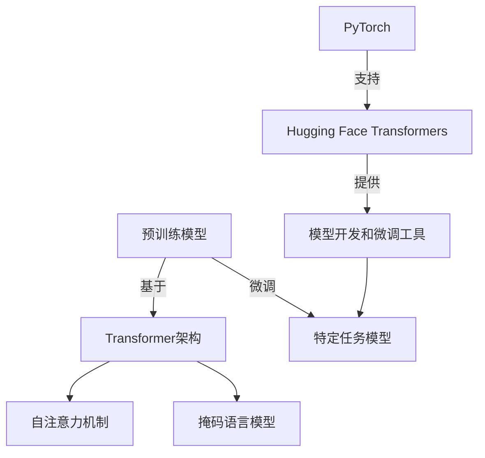

# 从零开始大模型开发与微调：PyTorch 2.0深度学习环境搭建

## 1. 背景介绍

### 1.1 问题的由来

在当前的人工智能领域,大型语言模型(Large Language Models, LLMs)已经成为了一个备受关注的热门话题。这些模型通过在海量文本数据上进行预训练,展现出了令人惊叹的自然语言理解和生成能力。然而,训练这样的大型模型需要耗费大量的计算资源,这对于普通开发者和研究人员来说是一个巨大的挑战。

为了解决这个问题,研究人员们提出了模型微调(Model Fine-tuning)的方法。模型微调的思路是:首先利用开源的大型预训练模型作为初始模型,然后在特定的任务数据集上进行进一步的训练,从而让模型适应特定的任务。这种方法可以大大节省计算资源,同时也能获得接近从头训练的性能。

### 1.2 研究现状

目前,模型微调已经成为了大型语言模型的主流方法。许多知名的开源模型,如GPT-3、BERT、T5等,都提供了预训练的模型权重供开发者下载和微调。同时,也有一些优秀的开源框架,如Hugging Face的Transformers库,专门为模型微调提供了便利的工具和接口。

然而,对于初学者来说,如何从零开始搭建一个完整的深度学习环境,并利用这些工具进行大模型的开发和微调,仍然是一个值得探讨的课题。许多初学者可能会在环境配置、代码实现等方面遇到各种困难和障碍。

### 1.3 研究意义

本文旨在为初学者提供一个全面的指南,详细介绍如何从零开始搭建一个完整的深度学习环境,并基于PyTorch 2.0和Hugging Face的Transformers库,进行大型语言模型的开发和微调。通过本文,读者将能够掌握以下技能:

1. 了解大型语言模型的基本概念和原理
2. 学习如何配置PyTorch 2.0深度学习环境
3. 熟练使用Hugging Face的Transformers库进行模型微调
4. 掌握模型评估和部署的方法
5. 获取相关的学习资源和工具推荐

### 1.4 本文结构

本文将按照以下结构进行阐述:

1. 背景介绍
2. 核心概念与联系
3. 核心算法原理与具体操作步骤
4. 数学模型和公式详细讲解与举例说明
5. 项目实践:代码实例和详细解释说明
6. 实际应用场景
7. 工具和资源推荐
8. 总结:未来发展趋势与挑战
9. 附录:常见问题与解答

## 2. 核心概念与联系

在深入探讨大模型开发与微调之前,我们需要先了解一些核心概念和它们之间的联系。

### 2.1 预训练模型(Pre-trained Model)

预训练模型是指在大规模无标注数据(如网页、书籍等)上进行预训练的模型。这种预训练过程旨在让模型学习到通用的语言表示能力,而不是针对特定的任务。常见的预训练模型包括BERT、GPT、T5等。

### 2.2 微调(Fine-tuning)

微调是指在预训练模型的基础上,利用标注的任务数据进行进一步的训练,以使模型适应特定的任务。微调过程通常只需要调整模型的部分参数,而不需要从头开始训练整个模型,因此可以大大节省计算资源。

### 2.3 Transformer

Transformer是一种革命性的神经网络架构,它完全依赖于注意力机制(Attention Mechanism)来捕捉输入序列中的长程依赖关系。Transformer架构在机器翻译、文本生成等任务中表现出色,并被广泛应用于现代大型语言模型中。

### 2.4 自注意力机制(Self-Attention)

自注意力机制是Transformer架构的核心部分。它允许模型在计算目标输出时,同时关注输入序列中的所有位置,从而捕捉长程依赖关系。与传统的循环神经网络(RNN)相比,自注意力机制具有更好的并行计算能力和更长的依赖捕捉范围。

### 2.5 掩码语言模型(Masked Language Model)

掩码语言模型是一种常见的预训练任务,它通过随机掩码输入序列中的某些词,并要求模型预测这些被掩码的词。这种任务可以促使模型学习到更好的语言理解能力。BERT等模型就是基于掩码语言模型进行预训练的。

### 2.6 PyTorch

PyTorch是一个流行的深度学习框架,它提供了强大的GPU加速支持和动态计算图功能。PyTorch具有Python风格的编程接口,易于上手和调试,因此在研究和开发领域广受欢迎。

### 2.7 Hugging Face Transformers

Hugging Face Transformers是一个面向Transformer模型的开源库,它提供了大量预训练模型的权重和相关工具。该库支持PyTorch和TensorFlow两种框架,并提供了便捷的模型微调接口,极大地简化了模型开发和部署的流程。

### 2.8 核心概念关系图

为了更好地理解这些核心概念之间的关系,我们可以绘制一个Mermaid流程图:

在这个流程图中,我们可以清晚地看到:预训练模型是基于Transformer架构构建的,其中自注意力机制和掩码语言模型是两个关键组件。通过微调,我们可以将预训练模型调整为适应特定任务的模型。而PyTorch和Hugging Face Transformers则为模型开发和微调提供了强有力的支持和工具。

## 3. 核心算法原理与具体操作步骤

### 3.1 算法原理概述

大模型开发与微调的核心算法原理可以概括为以下几个关键步骤:

1. **预训练(Pre-training)**: 在大规模无标注数据上训练模型,让模型学习到通用的语言表示能力。这个过程通常采用自监督学习(Self-Supervised Learning)的方式,例如掩码语言模型等任务。

2. **微调(Fine-tuning)**: 在特定任务的标注数据集上,对预训练模型进行进一步的训练。这个过程通常只需要调整模型的部分参数,而不需要从头开始训练整个模型。

3. **评估(Evaluation)**: 在验证集上评估微调后模型的性能,并根据评估结果进行模型调优。

4. **部署(Deployment)**: 将最终的模型部署到生产环境中,用于实际的应用场景。

在这个过程中,Transformer架构和自注意力机制扮演着至关重要的角色。它们赋予了模型强大的语言理解和生成能力,并使得模型能够有效地捕捉长程依赖关系。

### 3.2 算法步骤详解

接下来,我们将详细介绍大模型开发与微调的具体操作步骤。

#### 3.2.1 环境搭建

首先,我们需要搭建一个适合的深度学习环境。这通常包括以下步骤:

1. 安装Python和PyTorch
2. 配置GPU支持(可选)
3. 安装Hugging Face Transformers库

#### 3.2.2 数据准备

接下来,我们需要准备好用于微调的任务数据集。这个数据集应该是标注好的,并且与我们的目标任务相关。常见的任务包括文本分类、序列标注、问答系统等。

#### 3.2.3 选择预训练模型

根据任务的性质,我们需要选择一个合适的预训练模型作为基础。Hugging Face Transformers库提供了多种预训练模型的支持,例如BERT、GPT、T5等。我们可以根据模型的特点和任务的要求进行选择。

#### 3.2.4 数据预处理

在进行模型微调之前,我们需要对数据进行适当的预处理。这通常包括标记化(Tokenization)、填充(Padding)、掩码(Masking)等操作,以将数据转换为模型可以接受的格式。

#### 3.2.5 模型微调

利用Hugging Face Transformers库提供的接口,我们可以方便地对预训练模型进行微调。这个过程包括以下步骤:

1. 加载预训练模型权重
2. 设置微调超参数(如学习率、批大小等)
3. 定义损失函数和优化器
4. 进行训练迭代
5. 在验证集上评估模型性能

#### 3.2.6 模型评估和调优

在微调过程中,我们需要持续监控模型在验证集上的性能表现。根据评估结果,我们可以调整超参数或采取其他策略(如早停、模型集成等)来提高模型性能。

#### 3.2.7 模型部署

当模型性能满足要求后,我们就可以将其部署到实际的应用场景中。这可能涉及模型导出、服务化、API接口等步骤,具体取决于应用的需求。

### 3.3 算法优缺点

大模型开发与微调算法具有以下优缺点:

**优点**:

1. 节省计算资源:通过利用预训练模型,我们可以避免从头开始训练整个大型模型,从而大大节省计算资源。
2. 性能优异:经过微调后的模型通常可以达到接近从头训练的性能水平,甚至在某些任务上表现更好。
3. 易于迁移:预训练模型具有通用的语言表示能力,因此可以方便地迁移到各种不同的任务上。
4. 简化开发流程:Hugging Face Transformers等开源库极大地简化了模型开发和微调的流程,降低了门槛。

**缺点**:

1. 数据依赖:微调的效果在很大程度上依赖于任务数据集的质量和数量。如果数据集不足或质量不佳,可能会导致模型性能下降。
2. 计算资源需求:尽管比从头训练节省了资源,但微调过程仍然需要一定的计算能力,尤其是对于大型模型。
3. 可解释性差:大型语言模型通常被视为"黑盒"模型,其内部工作机制并不透明,缺乏可解释性。
4. 潜在偏见:预训练模型可能会从训练数据中学习到一些潜在的偏见和不当内容,需要进行审查和处理。

### 3.4 算法应用领域

大模型开发与微调算法可以应用于各种自然语言处理任务,包括但不限于:

- 文本分类
- 序列标注
- 机器翻译
- 文本生成
- 问答系统
- 情感分析
- 文本摘要

此外,随着大型语言模型在多模态任务(如视觉-语言任务)中的应用不断扩展,该算法的应用范围也在不断拓宽。

## 4. 数学模型和公式详细讲解与举例说明

### 4.1 数学模型构建

在深入探讨大模型开发与微调的数学模型之前,我们先回顾一下Transformer架构的基本原理。

Transformer是一种全新的基于注意力机制(Attention Mechanism)的神经网络架构,它完全摒弃了传统的循环神经网络(RNN)和卷积神经网络(CNN)结构。Transformer的核心思想是通过自注意力机制(Self-Attention)来捕捉输入序列中的长程依赖关系,从而更好地建模序列数据。

下面,我们将构建一个简化版的Transformer模型,并推导出其中涉及的关键数学公式。

#### 4.1.1 输入表示

假设我们有一个长度为 $n$ 的输入序列 $X = (x_1, x_2, \dots, x_n)$,其中每个 $x_i$ 是一个 $d$ 维的词向量。我们首先需要为每个输入词添加位置信息,以保留序列的顺序信息。这可以通过位置编码(Positional Encoding)来实现,