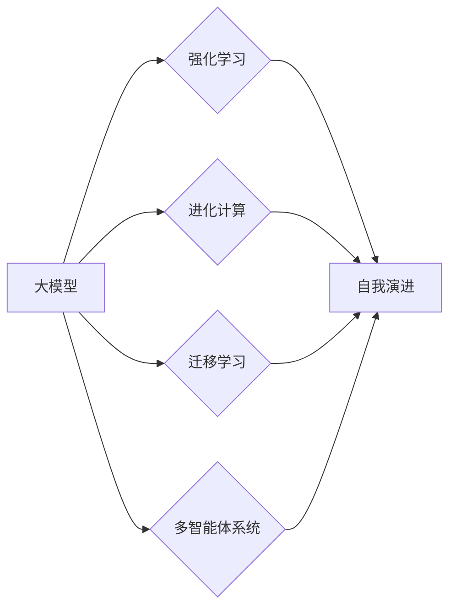

# 【大模型应用开发 动手做AI Agent】自我演进的AI

作者：禅与计算机程序设计艺术 / Zen and the Art of Computer Programming

## 1. 背景介绍
### 1.1 问题的由来

随着人工智能技术的不断发展，大模型在各个领域的应用越来越广泛。从语言处理、图像识别到自动驾驶、医疗诊断，大模型为解决问题提供了强大的工具。然而，现有的AI应用往往局限于特定场景，缺乏自我学习和自适应能力。如何构建能够自我演进的AI Agent，成为当前AI研究的一个重要方向。

### 1.2 研究现状

近年来，研究者们提出了许多基于大模型的自我演进AI Agent方法，主要包括以下几类：

- **强化学习（Reinforcement Learning，RL）**：通过让Agent在环境中不断尝试和犯错，学习最优策略，实现自我演进。
- **进化计算（Evolutionary Computation，EC）**：借鉴生物进化原理，通过模拟自然选择和遗传变异，优化Agent的行为。
- **迁移学习（Transfer Learning，TL）**：将预训练的大模型应用于新任务，通过微调和调整，提升Agent在特定领域的性能。
- **多智能体系统（Multi-Agent System，MAS）**：构建多个Agent协同工作，通过交互和协作，实现更复杂的任务。

### 1.3 研究意义

构建能够自我演进的AI Agent，具有重要的理论和实际意义：

- **提高AI应用的通用性和适应性**：通过自我学习，AI Agent可以适应不同的环境和任务，降低对人类干预的依赖。
- **推动人工智能技术的发展**：自我演进AI Agent的构建，将推动强化学习、进化计算、迁移学习等领域的技术进步。
- **拓展AI应用场景**：自我演进AI Agent可以应用于更广泛的领域，如智能交通、智能医疗、智能家居等。

### 1.4 本文结构

本文将围绕大模型应用开发，详细介绍如何构建自我演进的AI Agent。文章将分为以下几个部分：

- 第2部分，介绍构建自我演进AI Agent所需的核心概念和联系。
- 第3部分，阐述强化学习、进化计算、迁移学习、多智能体系统等核心算法原理和具体操作步骤。
- 第4部分，以实例讲解如何利用大模型进行自我演进AI Agent的开发。
- 第5部分，分析自我演进AI Agent在实际应用场景中的应用效果。
- 第6部分，展望未来大模型应用开发和自我演进AI Agent的发展趋势与挑战。
- 第7部分，推荐相关学习资源、开发工具和参考文献。
- 第8部分，总结全文，并对未来研究方向进行展望。

## 2. 核心概念与联系

为了更好地理解自我演进AI Agent的构建，本节将介绍几个核心概念及其相互关系：

- **大模型**：具有强大语言处理、图像识别等能力的人工智能模型，如BERT、GPT等。
- **强化学习（RL）**：通过让Agent在环境中不断尝试和犯错，学习最优策略的方法。
- **进化计算（EC）**：借鉴生物进化原理，通过模拟自然选择和遗传变异，优化Agent的行为的方法。
- **迁移学习（TL）**：将预训练的大模型应用于新任务，通过微调和调整，提升Agent在特定领域的性能的方法。
- **多智能体系统（MAS）**：构建多个Agent协同工作，通过交互和协作，实现更复杂的任务的方法。
- **自我演进**：AI Agent通过自我学习和自适应，不断提升自身能力的过程。

它们之间的逻辑关系如下图所示：



可以看出，大模型是构建自我演进AI Agent的基础，强化学习、进化计算、迁移学习、多智能体系统等方法可以应用于自我演进过程，实现Agent的自主学习和自适应。

## 3. 核心算法原理 & 具体操作步骤
### 3.1 算法原理概述

本节将介绍几种常见的构建自我演进AI Agent的算法原理：

#### 3.1.1 强化学习（RL）

强化学习是一种通过让Agent在环境中不断尝试和犯错，学习最优策略的方法。其核心思想是：Agent根据当前状态和动作，通过奖励信号更新策略，最终找到最优策略。

#### 3.1.2 进化计算（EC）

进化计算借鉴生物进化原理，通过模拟自然选择和遗传变异，优化Agent的行为。其核心思想是：在种群中不断选择适应度高的个体，并通过交叉、变异等操作产生新的个体，逐渐优化整个种群的性能。

#### 3.1.3 迁移学习（TL）

迁移学习将预训练的大模型应用于新任务，通过微调和调整，提升Agent在特定领域的性能。其核心思想是：利用预训练模型的知识，减少对新任务数据的依赖，提高学习效率。

#### 3.1.4 多智能体系统（MAS）

多智能体系统由多个Agent组成，通过交互和协作，实现更复杂的任务。其核心思想是：每个Agent具有独立的行为决策能力，并通过与其他Agent的交互，共同完成任务。

### 3.2 算法步骤详解

#### 3.2.1 强化学习（RL）

1. 初始化环境、Agent和策略。
2. Agent在环境中执行动作，观察状态和奖励。
3. 使用奖励信号更新策略。
4. 重复步骤2和3，直到策略收敛。

#### 3.2.2 进化计算（EC）

1. 初始化种群，每个个体代表一个Agent。
2. 计算每个个体的适应度。
3. 选择适应度高的个体进行交叉、变异操作，产生新的个体。
4. 重复步骤2和3，直到满足终止条件。

#### 3.2.3 迁移学习（TL）

1. 选择预训练的大模型作为初始模型。
2. 在新任务上收集数据，用于微调预训练模型。
3. 评估微调后的模型在特定任务上的性能。
4. 重复步骤2和3，直到性能满足要求。

#### 3.2.4 多智能体系统（MAS）

1. 初始化多个Agent，并分配任务。
2. Agent根据自身状态和任务需求，独立决策。
3. Agent之间通过通信进行交互。
4. 评估整个系统的性能，包括单个Agent和系统的整体表现。

### 3.3 算法优缺点

#### 3.3.1 强化学习（RL）

优点：能够学习到复杂、动态的环境中的最优策略。

缺点：需要大量的数据和时间进行训练，且容易陷入局部最优。

#### 3.3.2 进化计算（EC）

优点：能够有效优化种群性能，发现新的解决方案。

缺点：搜索空间大，计算复杂度高。

#### 3.3.3 迁移学习（TL）

优点：能够快速适应新任务，提高学习效率。

缺点：依赖于预训练模型的质量和适用性。

#### 3.3.4 多智能体系统（MAS）

优点：能够实现复杂任务的高效协作。

缺点：需要设计合理的通信机制和协调策略。

### 3.4 算法应用领域

强化学习、进化计算、迁移学习、多智能体系统等方法在各个领域都有广泛的应用，例如：

- **强化学习**：自动驾驶、游戏AI、机器人控制。
- **进化计算**：工程设计、优化问题、药物设计。
- **迁移学习**：图像识别、语音识别、自然语言处理。
- **多智能体系统**：智能交通、智能家居、协同机器人。

## 4. 数学模型和公式 & 详细讲解 & 举例说明
### 4.1 数学模型构建

本节将以强化学习为例，介绍构建自我演进AI Agent的数学模型和公式。

#### 4.1.1 强化学习模型

强化学习模型主要包括以下要素：

- **状态空间 $S$**：Agent所在的环境状态。
- **动作空间 $A$**：Agent可以采取的动作。
- **奖励函数 $R(s, a)$**：描述Agent在状态 $s$ 下采取动作 $a$ 所获得的奖励。
- **策略函数 $\pi(a|s)$**：描述Agent在状态 $s$ 下采取动作 $a$ 的概率。
- **价值函数 $V(s)$**：描述Agent在状态 $s$ 下的期望回报。

#### 4.1.2 Q学习算法

Q学习算法是一种基于值函数的强化学习方法，其目标是学习状态-动作值函数 $Q(s, a)$，表示在状态 $s$ 下采取动作 $a$ 后的期望回报。

1. 初始化 $Q(s, a)$ 和策略 $\pi(a|s)$。
2. 对于每个时间步 $t$：
   - 选择动作 $a_t \sim \pi(a|s_t)$。
   - 执行动作 $a_t$，观察下一个状态 $s_{t+1}$ 和奖励 $r_t$。
   - 更新 $Q(s_t, a_t)$：
     $$Q(s_t, a_t) \leftarrow Q(s_t, a_t) + \alpha \left[ r_t + \gamma \max_{a' \in A} Q(s_{t+1}, a') - Q(s_t, a_t) \right]$$
   - 更新策略 $\pi(a|s)$。
3. 重复步骤2，直到策略收敛。

其中，$\alpha$ 为学习率，$\gamma$ 为折扣因子。

### 4.2 公式推导过程

#### 4.2.1 Q学习算法的收敛性分析

Q学习算法收敛到最优状态-动作值函数 $Q^*(s, a)$ 的充分必要条件是：

$$
\lim_{t \rightarrow \infty} Q(s_t, a_t) = Q^*(s_t, a_t)
$$

#### 4.2.2 改进Q学习算法

为了提高Q学习算法的性能，可以采用以下改进方法：

- **目标网络（Target Network）**：使用一个独立的网络来近似最优状态-动作值函数 $Q^*(s, a)$，并使用软更新策略更新目标网络参数。
- **双重Q学习（Double Q-learning）**：使用两个Q网络，分别用于预测当前状态和下一个状态的值函数，避免过估计问题。

### 4.3 案例分析与讲解

以下是一个简单的Q学习案例，演示如何利用Python实现：

```python
import numpy as np

# 状态空间和动作空间
S = 4
A = 3
R = np.random.randn(S, A)

# 初始化Q值和策略
Q = np.zeros((S, A))
pi = np.ones(A) / A

# 学习率、折扣因子和迭代次数
alpha = 0.1
gamma = 0.99
epochs = 1000

# Q学习算法
for epoch in range(epochs):
    for s in range(S):
        a = np.random.choice(A, p=pi)
        next_s = np.random.randint(S)
        next_a = np.random.choice(A, p=pi)
        Q[s, a] = Q[s, a] + alpha * (R[s, a] + gamma * Q[next_s, next_a] - Q[s, a])

# 输出最优策略
optimal_policy = np.argmax(Q, axis=1)
print("Optimal Policy:", optimal_policy)
```

### 4.4 常见问题解答

**Q1：Q学习算法的收敛性如何保证？**

A：Q学习算法的收敛性依赖于学习率和折扣因子等参数的选择。通过选择合适的参数，并确保折扣因子的值在0到1之间，可以保证Q学习算法收敛到最优状态-动作值函数。

**Q2：如何解决Q学习算法的过估计问题？**

A：可以使用双重Q学习等方法解决Q学习算法的过估计问题。双重Q学习使用两个Q网络，分别用于预测当前状态和下一个状态的值函数，避免了过估计问题。

## 5. 项目实践：代码实例和详细解释说明
### 5.1 开发环境搭建

在进行自我演进AI Agent的开发前，我们需要准备好开发环境。以下是使用Python进行强化学习开发的环境配置流程：

1. 安装Anaconda：从官网下载并安装Anaconda，用于创建独立的Python环境。
2. 创建并激活虚拟环境：
```bash
conda create -n rl-env python=3.8
conda activate rl-env
```
3. 安装TensorFlow和Gym库：
```bash
conda install tensorflow-gpu gym
```
4. 安装其他工具包：
```bash
pip install numpy pandas matplotlib
```

完成上述步骤后，即可在`rl-env`环境中开始自我演进AI Agent的开发。

### 5.2 源代码详细实现

以下是一个使用TensorFlow和Gym库实现的简单Q学习示例，演示如何利用强化学习构建自我演进AI Agent：

```python
import gym
import tensorflow as tf
import numpy as np

# 创建环境
env = gym.make('CartPole-v1')

# 定义Q网络
class QNetwork(tf.keras.Model):
    def __init__(self, state_dim, action_dim):
        super(QNetwork, self).__init__()
        self.fc1 = tf.keras.layers.Dense(24, activation='relu')
        self.fc2 = tf.keras.layers.Dense(24, activation='relu')
        self.fc3 = tf.keras.layers.Dense(action_dim, activation='linear')

    def call(self, x):
        x = self.fc1(x)
        x = self.fc2(x)
        return self.fc3(x)

# 初始化Q网络和优化器
state_dim = env.observation_space.shape[0]
action_dim = env.action_space.n
q_network = QNetwork(state_dim, action_dim)
optimizer = tf.keras.optimizers.Adam(learning_rate=0.01)

# Q学习算法
for episode in range(1000):
    state = env.reset()
    done = False
    while not done:
        action = np.argmax(q_network(tf.convert_to_tensor(state, dtype=tf.float32)).numpy())
        next_state, reward, done, _ = env.step(action)
        target = reward + 0.99 * np.max(q_network(tf.convert_to_tensor(next_state, dtype=tf.float32)).numpy())
        with tf.GradientTape() as tape:
            q_value = q_network(tf.convert_to_tensor(state, dtype=tf.float32))
            target_f = tf.reduce_sum(target * q_value)
            loss = tf.reduce_mean(tf.square(q_value - target_f))
        gradients = tape.gradient(loss, q_network.trainable_variables)
        optimizer.apply_gradients(zip(gradients, q_network.trainable_variables))
        state = next_state
```

### 5.3 代码解读与分析

以上代码展示了使用TensorFlow和Gym库实现Q学习算法的过程：

- 定义环境：`gym.make('CartPole-v1')`创建了一个CartPole-v1游戏环境。
- 定义Q网络：`QNetwork`类定义了一个简单的全连接神经网络，用于计算状态-动作值函数。
- 初始化Q网络和优化器：创建Q网络实例和优化器，用于更新Q网络参数。
- Q学习算法：模拟CartPole-v1游戏，利用Q网络和优化器进行学习。

通过以上步骤，我们可以使用强化学习构建一个能够自我演进AI Agent，使其在CartPole-v1游戏中取得更好的成绩。

### 5.4 运行结果展示

运行以上代码，可以在训练过程中观察到Q网络参数的变化。经过足够多的训练，AI Agent可以在CartPole-v1游戏中稳定地保持平衡。

## 6. 实际应用场景
### 6.1 自动驾驶

自动驾驶领域需要AI Agent具备高度的自适应能力，以应对复杂多变的交通环境。基于大模型的自我演进AI Agent可以应用于以下方面：

- **环境感知**：利用图像识别、激光雷达等技术，实时感知周围环境，包括道路、车辆、行人等。
- **决策规划**：根据感知到的环境信息，规划行驶轨迹，包括速度、转向等。
- **紧急处理**：在遇到突发状况时，进行紧急制动、避让等操作。

### 6.2 智能客服

智能客服领域需要AI Agent具备良好的自然语言处理能力，以实现与用户的自然交互。基于大模型的自我演进AI Agent可以应用于以下方面：

- **语义理解**：理解用户的问题和意图，提供针对性的答复。
- **情感分析**：分析用户的情感倾向，进行个性化推荐和关怀。
- **知识库问答**：从知识库中检索信息，回答用户提出的问题。

### 6.3 智能金融

智能金融领域需要AI Agent具备丰富的金融知识和风险管理能力。基于大模型的自我演进AI Agent可以应用于以下方面：

- **风险评估**：分析客户的信用风险、市场风险等。
- **投资策略**：根据市场趋势和客户需求，制定投资策略。
- **欺诈检测**：识别可疑交易，防范金融欺诈。

### 6.4 未来应用展望

随着大模型和自我演进AI Agent技术的不断发展，未来将在更多领域得到应用，如：

- **医疗健康**：辅助医生进行诊断、治疗、药物研发等。
- **教育**：个性化学习、智能辅导、在线教育平台等。
- **智慧城市**：城市管理、交通优化、能源管理等。

## 7. 工具和资源推荐
### 7.1 学习资源推荐

为了帮助开发者系统地掌握自我演进AI Agent的理论和实践技能，以下是一些优质的学习资源：

1. **《深度学习》系列书籍**：Goodfellow等著，系统介绍了深度学习的基本概念、算法和应用。
2. **《深度强化学习》系列书籍**：Silver等著，深入讲解了强化学习的基本原理和应用。
3. **TensorFlow官方文档**：提供了TensorFlow库的详细使用说明和教程。
4. **Gym库官方文档**：提供了Gym库的详细使用说明和教程。
5. **arXiv论文预印本**：包含大量最新研究成果的免费学术期刊。

### 7.2 开发工具推荐

以下是一些用于开发自我演进AI Agent的常用工具：

1. **TensorFlow**：开源的深度学习框架，支持多种深度学习算法。
2. **PyTorch**：开源的深度学习框架，具有灵活的动态计算图。
3. **OpenAI Gym**：开源的强化学习环境库，提供了多种预定义环境和自定义环境的能力。
4. **Keras**：基于TensorFlow和Theano的开源深度学习库，易于使用和扩展。
5. **Gymnasium**：Gym的Python 3兼容版本，支持更多Python 3特性。

### 7.3 相关论文推荐

以下是一些关于自我演进AI Agent的经典论文：

1. **Deep Reinforcement Learning：An Overview**：介绍深度强化学习的基本概念和应用。
2. **Asynchronous Advantage Actor-Critic (A3C)**：提出了一种异步优势Actor-Critic算法，提高了强化学习的效率。
3. **Proximal Policy Optimization (PPO)**：提出了一种近端策略优化算法，提高了强化学习的稳定性。
4. **DQN**：提出了一种基于深度Q网络的强化学习算法，在Atari游戏上取得了显著的成果。
5. **Evolution Strategies (ES)**：提出了一种基于进化策略的强化学习算法，具有更好的收敛性和泛化能力。

### 7.4 其他资源推荐

以下是一些其他有助于学习自我演进AI Agent的资源：

1. **Kaggle竞赛**：提供丰富的数据集和竞赛，可以锻炼AI Agent的开发能力。
2. **GitHub开源项目**：包含大量开源的AI Agent项目，可以学习借鉴。
3. **人工智能社区**：如CSDN、知乎等，可以交流学习心得和经验。

## 8. 总结：未来发展趋势与挑战
### 8.1 研究成果总结

本文对基于大模型的自我演进AI Agent进行了全面的介绍，包括核心概念、算法原理、实践案例和实际应用场景。通过本文的学习，读者可以了解到如何利用大模型和强化学习、进化计算、迁移学习等方法构建自我演进AI Agent，并将其应用于实际场景。

### 8.2 未来发展趋势

随着大模型和自我演进AI Agent技术的不断发展，未来将在以下方面取得突破：

1. **模型规模和性能的提升**：随着算力的提升和数据规模的扩大，大模型将更加庞大，性能将得到进一步提升。
2. **多模态信息融合**：将图像、语音、文本等多模态信息融合到AI Agent中，使其具备更强的感知和认知能力。
3. **跨领域迁移能力**：通过迁移学习等方法，使AI Agent能够快速适应新领域，降低对标注数据的依赖。
4. **可解释性和安全性**：提高AI Agent的可解释性和安全性，使其更加可靠和可信。

### 8.3 面临的挑战

尽管大模型应用开发和自我演进AI Agent取得了显著进展，但仍面临着以下挑战：

1. **计算资源瓶颈**：大模型的训练和推理需要大量的计算资源，如何高效利用计算资源是一个重要问题。
2. **数据标注成本**：标注高质量数据需要大量人力和时间，如何降低数据标注成本是一个关键问题。
3. **算法可解释性**：如何提高AI Agent的可解释性，使其决策过程更加透明和可信。
4. **伦理和道德问题**：如何避免AI Agent的偏见和歧视，确保其符合伦理和道德规范。

### 8.4 研究展望

面对未来发展趋势和挑战，以下是一些研究方向：

1. **高效训练和推理算法**：研究更加高效的训练和推理算法，降低计算资源消耗。
2. **数据增强和自监督学习**：研究更加有效的数据增强和自监督学习方法，降低数据标注成本。
3. **可解释AI和可信AI**：研究可解释AI和可信AI技术，提高AI Agent的可解释性和安全性。
4. **多模态信息融合**：研究多模态信息融合技术，使AI Agent具备更强的感知和认知能力。

通过不断探索和创新，相信大模型应用开发和自我演进AI Agent将在未来取得更大的突破，为人类社会创造更多价值。