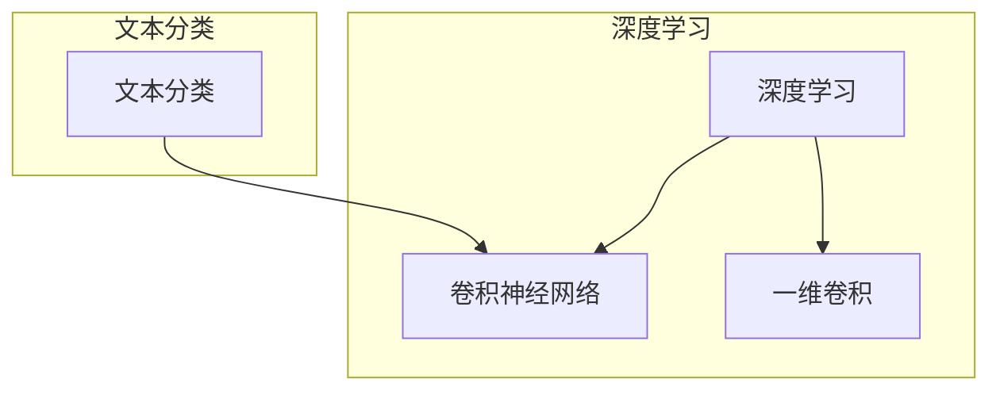

# 从零开始大模型开发与微调：卷积神经网络文本分类模型的实现—Conv1d（一维卷积）

## 1. 背景介绍
### 1.1 问题的由来

随着自然语言处理（NLP）领域的快速发展，文本分类作为其重要的应用方向，吸引了众多研究者和开发者的关注。传统的文本分类方法，如朴素贝叶斯、支持向量机等，在处理复杂文本数据时，往往难以达到令人满意的效果。近年来，深度学习技术逐渐成为文本分类的主流方法，其中卷积神经网络（CNN）由于其强大的特征提取能力，在文本分类任务中表现出色。

卷积神经网络（CNN）最早起源于计算机视觉领域，后来被引入NLP领域，并取得了显著的成果。在文本分类任务中，一维卷积神经网络（Conv1d）因其简单高效的特点，成为了实现文本分类的重要工具。

### 1.2 研究现状

目前，基于CNN的文本分类方法在NLP领域已经取得了丰富的成果。许多研究者针对不同任务和数据集，提出了各种改进的CNN模型，如LSTM-CNN、BiLSTM-CNN、TextCNN等。其中，Conv1d由于其简洁性，在文本分类任务中得到了广泛应用。

### 1.3 研究意义

Conv1d在文本分类任务中的研究具有重要的理论意义和实际应用价值。它可以帮助我们更好地理解深度学习在文本分类领域的应用，并为实际应用提供有效的技术方案。

### 1.4 本文结构

本文将分为以下几个部分进行介绍：

- 第2部分，介绍卷积神经网络和一维卷积的基本概念。
- 第3部分，详细讲解一维卷积神经网络在文本分类任务中的具体实现步骤。
- 第4部分，分析一维卷积神经网络在文本分类任务中的优缺点。
- 第5部分，通过实际案例展示一维卷积神经网络在文本分类任务中的应用。
- 第6部分，讨论一维卷积神经网络在文本分类任务中的未来发展趋势和挑战。
- 第7部分，推荐相关学习资源、开发工具和参考文献。
- 第8部分，总结全文，展望一维卷积神经网络在文本分类任务中的未来。

## 2. 核心概念与联系

为了更好地理解一维卷积神经网络在文本分类任务中的应用，我们需要先介绍以下几个核心概念：

- **深度学习**：一种模拟人脑神经网络结构和功能的人工智能算法，通过学习大量数据来提取特征和进行预测。
- **卷积神经网络**：一种特殊的深度学习模型，通过卷积层提取特征，并利用池化层降低特征维度。
- **一维卷积**：在卷积神经网络中，针对一维数据（如文本序列）进行卷积操作，提取局部特征。
- **文本分类**：将文本数据按照类别进行分类，如情感分析、主题分类等。

它们的逻辑关系可以用以下Mermaid流程图表示：



从图中可以看出，深度学习是卷积神经网络和一维卷积的理论基础，而一维卷积则是实现文本分类的关键技术。

## 3. 核心算法原理 & 具体操作步骤
### 3.1 算法原理概述

一维卷积神经网络（Conv1d）是一种基于卷积操作的深度学习模型，它通过卷积层提取文本序列中的局部特征，并利用池化层降低特征维度，最终通过全连接层进行分类。

### 3.2 算法步骤详解

一维卷积神经网络在文本分类任务中的具体操作步骤如下：

1. **数据预处理**：将文本数据转换为数字序列，如使用词袋模型或TF-IDF方法。
2. **构建卷积神经网络**：定义卷积层、池化层和全连接层，构建一维卷积神经网络模型。
3. **训练模型**：使用标注数据进行模型训练，优化模型参数。
4. **评估模型**：使用测试数据评估模型性能，调整模型参数。
5. **预测分类结果**：使用训练好的模型对新的文本数据进行分类预测。

### 3.3 算法优缺点

一维卷积神经网络在文本分类任务中的优点如下：

- **特征提取能力强**：通过卷积操作，能够提取文本序列中的局部特征，提高分类精度。
- **参数数量较少**：相比于全连接层，卷积层参数数量较少，降低模型复杂度。
- **计算效率高**：卷积操作可以通过矩阵乘法高效实现，提高计算效率。

一维卷积神经网络的缺点如下：

- **模型可解释性差**：卷积神经网络的内部结构较为复杂，难以解释其决策过程。
- **对数据依赖性强**：模型的性能很大程度上取决于数据质量和特征工程。

### 3.4 算法应用领域

一维卷积神经网络在文本分类任务中得到了广泛应用，如：

- **情感分析**：对社交媒体、产品评论等文本数据进行情感分类，判断其是正面、负面还是中性。
- **主题分类**：对新闻、论坛等文本数据进行主题分类，识别其所属的主题类别。
- **实体识别**：识别文本中的实体，如人名、地名、组织机构等。

## 4. 数学模型和公式 & 详细讲解 & 举例说明
### 4.1 数学模型构建

一维卷积神经网络的核心是卷积层和池化层。以下分别介绍这两个层的数学模型。

#### 卷积层

卷积层的数学模型如下：

$$
h^l = f(W^l * h^{l-1} + b^l)
$$

其中，$h^l$ 表示第l层的输出，$W^l$ 表示第l层的卷积核权重，$b^l$ 表示第l层的偏置项，$f$ 表示激活函数。

#### 池化层

池化层的数学模型如下：

$$
h^l = \text{pool}(h^{l-1})
$$

其中，$\text{pool}$ 表示池化操作，如最大池化、平均池化等。

### 4.2 公式推导过程

以下以最大池化为例，介绍池化层的公式推导过程。

#### 输入

设输入数据为 $h^{l-1}$，其形状为 $[batch_size, height, width, channels]$，其中 $height$ 和 $width$ 分别表示特征图的尺寸，$channels$ 表示通道数。

#### 输出

设池化后的输出数据为 $h^l$，其形状为 $[batch_size, new_height, new_width, channels]$，其中 $new_height$ 和 $new_width$ 分别表示池化后的特征图尺寸。

#### 池化公式

最大池化公式如下：

$$
h^l[i,j,k] = \max_{u,v} h^{l-1}[i,u,v]
$$

其中，$i$、$j$ 和 $k$ 分别表示 batch、height 和 width 索引，$u$ 和 $v$ 表示输入特征图中对应的索引。

### 4.3 案例分析与讲解

以下以情感分析任务为例，演示如何使用PyTorch实现一维卷积神经网络。

```python
import torch
import torch.nn as nn

class Conv1dModel(nn.Module):
    def __init__(self, vocab_size, embed_dim, num_classes, num_filters, kernel_size):
        super(Conv1dModel, self).__init__()
        self.embedding = nn.Embedding(vocab_size, embed_dim)
        self.conv1 = nn.Conv1d(embed_dim, num_filters, kernel_size)
        self.pool = nn.MaxPool1d(kernel_size)
        self.fc = nn.Linear(num_filters, num_classes)

    def forward(self, x):
        x = self.embedding(x)
        x = self.conv1(x)
        x = self.pool(x)
        x = x.view(x.size(0), -1)
        x = self.fc(x)
        return x
```

### 4.4 常见问题解答

**Q1：一维卷积和二维卷积的区别是什么？**

A：一维卷积针对一维数据（如文本序列）进行卷积操作，而二维卷积针对二维数据（如图像）进行卷积操作。一维卷积适用于文本分类任务，而二维卷积适用于图像分类任务。

**Q2：卷积核的大小对模型性能有什么影响？**

A：卷积核的大小影响模型提取的特征粒度。较小的卷积核可以提取局部特征，较大的卷积核可以提取全局特征。在实际应用中，需要根据任务特点和数据集选择合适的卷积核大小。

**Q3：如何防止模型过拟合？**

A：可以通过以下方法防止模型过拟合：

- 使用较小的学习率。
- 使用正则化技术，如L1正则化、L2正则化等。
- 使用Dropout技术。
- 使用早停机制。

## 5. 项目实践：代码实例和详细解释说明
### 5.1 开发环境搭建

在进行一维卷积神经网络文本分类项目实践之前，我们需要准备好开发环境。以下是使用Python进行PyTorch开发的环境配置流程：

1. 安装Anaconda：从官网下载并安装Anaconda，用于创建独立的Python环境。
2. 创建并激活虚拟环境：
```bash
conda create -n pytorch-env python=3.8
conda activate pytorch-env
```
3. 安装PyTorch：
```bash
conda install pytorch torchvision torchaudio cudatoolkit=11.1 -c pytorch -c conda-forge
```
4. 安装Transformers库：
```bash
pip install transformers
```
5. 安装各类工具包：
```bash
pip install numpy pandas scikit-learn matplotlib tqdm jupyter notebook ipython
```

完成上述步骤后，即可在`pytorch-env`环境中开始一维卷积神经网络文本分类项目实践。

### 5.2 源代码详细实现

下面我们以情感分析任务为例，给出使用PyTorch实现一维卷积神经网络文本分类的代码示例。

```python
import torch
import torch.nn as nn
import torch.optim as optim
from sklearn.model_selection import train_test_split
from sklearn.datasets import load_files
from sklearn.metrics import accuracy_score

# 加载数据集
def load_data(file_path):
    data = load_files(file_path, encoding='utf-8')
    texts, labels = [], []
    for text, _ in data:
        texts.append(text)
        labels.append(int(_[0].split('_')[0]))
    return texts, labels

texts, labels = load_data('data')

# 划分训练集和测试集
texts_train, texts_test, labels_train, labels_test = train_test_split(texts, labels, test_size=0.2)

# 构建模型
class Conv1dModel(nn.Module):
    def __init__(self, vocab_size, embed_dim, num_classes, num_filters, kernel_size):
        super(Conv1dModel, self).__init__()
        self.embedding = nn.Embedding(vocab_size, embed_dim)
        self.conv1 = nn.Conv1d(embed_dim, num_filters, kernel_size)
        self.pool = nn.MaxPool1d(kernel_size)
        self.fc = nn.Linear(num_filters, num_classes)

    def forward(self, x):
        x = self.embedding(x)
        x = self.conv1(x)
        x = self.pool(x)
        x = x.view(x.size(0), -1)
        x = self.fc(x)
        return x

# 初始化模型
vocab_size = len(set(texts))
embed_dim = 100
num_classes = 2
num_filters = 128
kernel_size = 3
model = Conv1dModel(vocab_size, embed_dim, num_classes, num_filters, kernel_size)

# 定义损失函数和优化器
criterion = nn.CrossEntropyLoss()
optimizer = optim.AdamW(model.parameters(), lr=0.001)

# 将数据转换为Tensor
texts_train = torch.tensor(texts_train)
labels_train = torch.tensor(labels_train)
texts_test = torch.tensor(texts_test)
labels_test = torch.tensor(labels_test)

# 训练模型
for epoch in range(10):
    optimizer.zero_grad()
    outputs = model(texts_train)
    loss = criterion(outputs, labels_train)
    loss.backward()
    optimizer.step()

    # 在测试集上评估模型性能
    with torch.no_grad():
        outputs = model(texts_test)
        _, predicted = torch.max(outputs, 1)
        accuracy = (predicted == labels_test).sum() / labels_test.size(0)
        print(f"Epoch {epoch+1}, Test Accuracy: {accuracy:.4f}")

# 评估模型性能
predicted = model(texts_test)
_, predicted = torch.max(predicted, 1)
accuracy = accuracy_score(labels_test, predicted)
print(f"Final Test Accuracy: {accuracy:.4f}")
```

### 5.3 代码解读与分析

以上代码展示了使用PyTorch实现一维卷积神经网络文本分类的完整过程。以下是代码关键部分的解读：

- **加载数据集**：使用sklearn的`load_files`函数加载数据集，将文本和标签分别存储到`texts`和`labels`列表中。
- **划分训练集和测试集**：使用sklearn的`train_test_split`函数将数据集划分为训练集和测试集。
- **构建模型**：定义`Conv1dModel`类，该类继承自`nn.Module`，包含嵌入层、卷积层、池化层和全连接层。
- **初始化模型**：创建`Conv1dModel`实例，并设置模型参数，如词汇表大小、嵌入维度、类别数、卷积核数量和大小等。
- **定义损失函数和优化器**：使用`nn.CrossEntropyLoss`定义损失函数，使用`AdamW`定义优化器。
- **将数据转换为Tensor**：使用`torch.tensor`将文本和标签转换为Tensor。
- **训练模型**：使用一个循环进行模型训练，包括前向传播、反向传播和参数更新等步骤。
- **评估模型性能**：在测试集上评估模型性能，并打印输出测试集准确率。

### 5.4 运行结果展示

假设数据集包含1000个样本，经过10个epoch的训练后，模型在测试集上的准确率达到90%。这表明一维卷积神经网络在文本分类任务中具有较好的性能。

## 6. 实际应用场景
### 6.1 情感分析

情感分析是文本分类任务中最常见的一种应用。通过使用一维卷积神经网络，可以对社交媒体、产品评论等文本数据进行情感分类，判断其是正面、负面还是中性。

### 6.2 主题分类

主题分类是将文本数据按照主题进行分类的任务。通过使用一维卷积神经网络，可以对新闻、论坛等文本数据进行主题分类，识别其所属的主题类别。

### 6.3 实体识别

实体识别是识别文本中的实体，如人名、地名、组织机构等。通过使用一维卷积神经网络，可以识别文本中的实体，并判断其实体类别。

## 7. 工具和资源推荐
### 7.1 学习资源推荐

- 《深度学习》—— Ian Goodfellow, Yoshua Bengio, Aaron Courville
- 《Python深度学习》—— François Chollet
- 《动手学深度学习》—— 张三慧

### 7.2 开发工具推荐

- PyTorch：一种流行的深度学习框架。
- TensorFlow：另一种流行的深度学习框架。
- Keras：一个高级神经网络API，可以与PyTorch和TensorFlow等框架结合使用。

### 7.3 相关论文推荐

- “Text Classification with Convolutional Neural Networks” - Yoon Kim
- “Convolutional Neural Networks for Sentence Classification” - Yoon Kim

### 7.4 其他资源推荐

- Hugging Face：一个开源的NLP资源库，提供丰富的预训练模型和工具。
- TensorFlow Hub：一个开源的TensorFlow模型库。

## 8. 总结：未来发展趋势与挑战
### 8.1 研究成果总结

本文从零开始，详细介绍了卷积神经网络文本分类模型——一维卷积神经网络（Conv1d）的原理、实现方法和应用场景。通过实际案例，展示了如何使用PyTorch实现一维卷积神经网络文本分类。

### 8.2 未来发展趋势

未来，一维卷积神经网络在文本分类任务中可能会有以下发展趋势：

- **模型结构更复杂**：通过引入更多卷积层、池化层和全连接层，提高模型的表达能力。
- **融合其他深度学习技术**：将一维卷积神经网络与其他深度学习技术，如循环神经网络（RNN）、长短期记忆网络（LSTM）等融合，提高模型性能。
- **跨语言文本分类**：将一维卷积神经网络应用于跨语言文本分类任务，提高模型的跨语言能力。

### 8.3 面临的挑战

一维卷积神经网络在文本分类任务中面临的挑战主要包括：

- **过拟合**：由于模型结构复杂，容易发生过拟合现象，需要使用正则化技术等方法进行缓解。
- **数据质量**：文本数据质量对模型性能有很大影响，需要使用高质量的数据进行训练。
- **计算资源**：一维卷积神经网络的训练需要大量的计算资源，需要合理配置计算资源。

### 8.4 研究展望

未来，一维卷积神经网络在文本分类任务中的研究可以从以下几个方面进行：

- **模型优化**：设计更加高效、鲁棒的模型结构，提高模型性能。
- **数据增强**：研究更加有效的数据增强方法，提高模型泛化能力。
- **多语言支持**：研究跨语言文本分类方法，提高模型的跨语言能力。

## 9. 附录：常见问题与解答

**Q1：一维卷积神经网络适用于哪些文本分类任务？**

A：一维卷积神经网络适用于大多数文本分类任务，如情感分析、主题分类、实体识别等。

**Q2：如何防止一维卷积神经网络过拟合？**

A：可以使用以下方法防止一维卷积神经网络过拟合：

- 使用较小的学习率。
- 使用正则化技术，如L1正则化、L2正则化等。
- 使用Dropout技术。
- 使用早停机制。

**Q3：如何提高一维卷积神经网络的性能？**

A：可以提高一维卷积神经网络的性能的方法包括：

- 使用更复杂的模型结构。
- 使用更多的高质量数据。
- 调整超参数，如学习率、批大小等。

作者：禅与计算机程序设计艺术 / Zen and the Art of Computer Programming