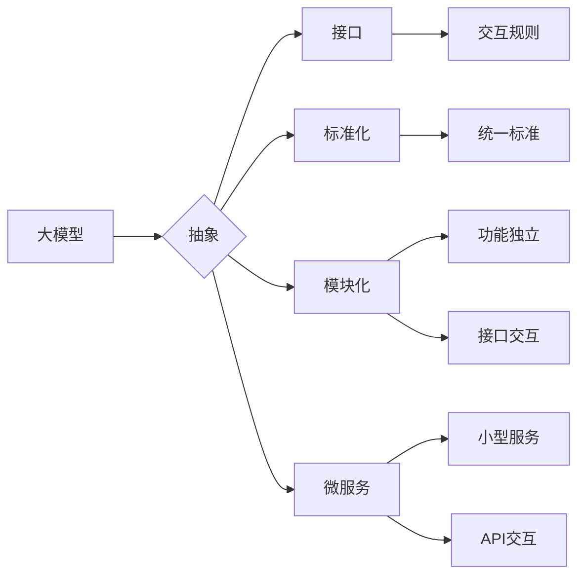

# 标准化的大模型抽象：Mode I/O

> 关键词：大模型，抽象，Mode I/O，标准化，接口，API，模块化，微服务，AI

## 1. 背景介绍
### 1.1 问题的由来

随着深度学习技术的迅猛发展，大模型在各个领域展现出巨大的潜力。然而，大模型的应用面临着一系列挑战，其中之一便是模型的可复用性和可扩展性。传统的模型集成方式往往依赖于复杂的脚本和硬编码逻辑，导致模型难以复用、扩展和维护。为了解决这个问题，我们需要一种新的模型抽象方式，使得大模型能够以标准化、模块化的形式存在，从而实现高效的复用和扩展。

### 1.2 研究现状

目前，在AI领域已经出现了一些模型抽象和接口标准化的尝试，例如：

- **ONNX（Open Neural Network Exchange）**：一个开放的神经网络模型格式，旨在实现不同深度学习框架之间的模型交换。
- **TensorFlow SavedModel**：TensorFlow框架提供的模型保存和加载接口，支持不同运行时（如TensorFlow Serving、TensorFlow Lite）之间的模型转换。
- **PyTorch Script**：PyTorch框架提供的一种脚本化模型定义方式，使得模型定义更易于理解和复用。

然而，这些尝试主要集中在模型的交换和保存上，缺乏对模型接口和交互的标准化，难以满足大模型在复杂应用场景中的需求。

### 1.3 研究意义

为了实现大模型的标准化和模块化，我们需要一种新的抽象方式——Mode I/O。Mode I/O不仅定义了模型的输入输出接口，还提供了模型之间的交互机制，使得大模型能够以更灵活、高效的方式集成和扩展。研究Mode I/O具有重要的意义：

- **提高模型的复用性和可扩展性**：通过标准化模型接口，降低模型集成成本，方便模型在不同场景下的复用和扩展。
- **简化模型开发和部署**：提供统一的模型定义和接口，简化模型开发和部署流程，降低开发门槛。
- **促进AI生态系统的发展**：推动AI技术的标准化和模块化，促进AI技术的广泛应用和生态系统的发展。

### 1.4 本文结构

本文将围绕Mode I/O这一核心概念，探讨其原理、设计、实现和应用，具体内容包括：

- 第2章：介绍Mode I/O的核心概念和联系。
- 第3章：阐述Mode I/O的算法原理和具体操作步骤。
- 第4章：讲解Mode I/O的数学模型和公式，并结合实例进行分析。
- 第5章：给出Mode I/O的代码实现示例，并对关键代码进行解读。
- 第6章：探讨Mode I/O在实际应用场景中的案例。
- 第7章：推荐Mode I/O相关的学习资源、开发工具和参考文献。
- 第8章：总结Mode I/O的未来发展趋势与挑战。
- 第9章：附录，提供常见问题与解答。

## 2. 核心概念与联系

为了更好地理解Mode I/O，我们首先需要介绍以下几个核心概念：

- **大模型**：指具有海量参数和强大学习能力的深度学习模型，如Transformer、BERT、GPT等。
- **抽象**：指将复杂的实体、概念或过程转化为更加简化和易于理解的模型。
- **接口**：指不同模块或系统之间交互的界面，定义了交互的方式和规则。
- **标准化**：指在某个领域或行业内，通过制定统一的标准，促进不同系统之间的互操作性和兼容性。
- **模块化**：指将系统分解为多个功能独立的模块，每个模块负责特定的功能，模块之间通过接口进行交互。
- **微服务**：一种软件架构风格，将应用程序分解为多个小型、独立的服务，每个服务负责特定的功能，并通过API进行交互。

Mode I/O的逻辑关系如下所示：



可以看出，Mode I/O是一种基于抽象的大模型集成方式，通过定义统一的接口和交互规则，将大模型分解为多个功能独立的模块，实现模块化、标准化的模型集成。

## 3. 核心算法原理 & 具体操作步骤
### 3.1 算法原理概述

Mode I/O的核心思想是将大模型分解为多个功能独立的模块，并通过接口进行交互。具体而言，包括以下步骤：

1. **模块分解**：将大模型分解为多个功能独立的子模块，每个模块负责特定的功能。
2. **接口定义**：为每个模块定义清晰的输入输出接口，包括数据格式、交互规则等。
3. **标准化**：将接口和交互规则进行标准化，确保不同模块之间的互操作性和兼容性。
4. **模块集成**：将模块按照设计好的架构进行集成，形成完整的系统。
5. **模型训练**：对模块进行训练，使其能够完成特定的任务。
6. **模型部署**：将训练好的模型部署到生产环境中，实现模型的复用和扩展。

### 3.2 算法步骤详解

下面详细介绍Mode I/O的具体操作步骤：

**Step 1：模块分解**

首先，我们需要将大模型分解为多个功能独立的子模块。例如，对于BERT模型，可以将其分解为以下模块：

- **编码器模块**：负责将文本输入转换为模型内部的表示。
- **解码器模块**：负责将编码器输出的表示解码为文本输出。
- **分类器模块**：负责对文本进行分类。
- **生成器模块**：负责根据输入生成文本。

**Step 2：接口定义**

为每个模块定义清晰的输入输出接口，包括以下内容：

- **输入数据格式**：定义模块接受的输入数据的格式，如文本、图像、音频等。
- **输出数据格式**：定义模块输出的数据格式，如文本、分类标签、概率分布等。
- **交互规则**：定义模块之间的交互方式，如同步交互、异步交互等。

**Step 3：标准化**

将接口和交互规则进行标准化，确保不同模块之间的互操作性和兼容性。可以通过以下方式实现：

- **定义标准化的接口规范**：制定统一的接口规范，包括数据格式、交互规则等。
- **使用标准化数据格式**：使用通用的数据格式，如JSON、XML等，方便不同模块之间的数据交换。
- **采用标准化通信协议**：使用通用的通信协议，如RESTful API、gRPC等，方便模块之间的通信。

**Step 4：模块集成**

将模块按照设计好的架构进行集成，形成完整的系统。可以通过以下方式实现：

- **使用微服务架构**：将每个模块部署为独立的服务，通过API进行交互。
- **使用容器化技术**：使用Docker等容器化技术，方便模块的部署和扩展。
- **使用服务网格**：使用Istio等服务网格技术，实现模块之间的流量管理和安全性保障。

**Step 5：模型训练**

对模块进行训练，使其能够完成特定的任务。可以通过以下方式实现：

- **使用迁移学习**：利用预训练模型，快速完成新任务的训练。
- **使用少样本学习**：在少量样本情况下，利用模型的知识迁移能力，完成新任务的训练。
- **使用对抗训练**：通过引入对抗样本，提高模型的鲁棒性和泛化能力。

**Step 6：模型部署**

将训练好的模型部署到生产环境中，实现模型的复用和扩展。可以通过以下方式实现：

- **使用模型管理平台**：使用模型管理平台，实现模型的版本管理、监控和部署。
- **使用容器化部署**：使用容器化技术，将模型和服务部署到容器中，实现快速部署和扩展。
- **使用自动化部署**：使用自动化部署工具，实现模型的自动部署和升级。

### 3.3 算法优缺点

Mode I/O具有以下优点：

- **提高模型的复用性和可扩展性**：通过模块化设计，降低模型集成成本，方便模型在不同场景下的复用和扩展。
- **简化模型开发和部署**：提供统一的模型定义和接口，简化模型开发和部署流程，降低开发门槛。
- **促进AI生态系统的发展**：推动AI技术的标准化和模块化，促进AI技术的广泛应用和生态系统的发展。

然而，Mode I/O也存在一些局限性：

- **模块划分的复杂性**：需要根据具体任务和需求，合理划分模块，避免模块划分过于复杂或过于简单。
- **接口定义的规范性**：需要制定清晰的接口规范，确保不同模块之间的互操作性和兼容性。
- **模型训练的复杂性**：需要针对不同的模块，设计合适的训练策略，提高模型性能。

### 3.4 算法应用领域

Mode I/O可以应用于以下领域：

- **自然语言处理**：如文本分类、机器翻译、文本生成等。
- **计算机视觉**：如图像分类、目标检测、图像分割等。
- **语音识别**：如语音转文本、语音合成等。
- **推荐系统**：如商品推荐、新闻推荐等。

## 4. 数学模型和公式 & 详细讲解 & 举例说明
### 4.1 数学模型构建

为了更好地理解Mode I/O，我们可以将其与深度学习模型进行类比。以下以Transformer模型为例，展示如何构建Mode I/O的数学模型。

**编码器模块**：

编码器模块将文本输入转换为模型内部的表示。其数学模型如下：

$$
\mathbf{h}_i^{(l)} = \mathbf{W}_h^l \mathbf{h}_i^{(l-1)} + \mathbf{W}_k^l \mathbf{x}_i^{(l)} + \mathbf{W}_v^l \mathbf{x}_i^{(l)} + \mathbf{b}_h^l
$$

其中：

- $\mathbf{h}_i^{(l)}$ 为第 $i$ 个token在第 $l$ 层的表示。
- $\mathbf{W}_h^l, \mathbf{W}_k^l, \mathbf{W}_v^l$ 为权重矩阵。
- $\mathbf{x}_i^{(l)}$ 为第 $i$ 个token的输入表示。
- $\mathbf{b}_h^l$ 为偏置项。

**解码器模块**：

解码器模块将编码器输出的表示解码为文本输出。其数学模型如下：

$$
\mathbf{y}_i^{(l)} = \mathbf{W}_y^l \mathbf{y}_i^{(l-1)} + \mathbf{W}_{k'}^l \mathbf{h}_i^{(l)} + \mathbf{W}_{v'}^l \mathbf{h}_i^{(l)} + \mathbf{b}_y^l
$$

其中：

- $\mathbf{y}_i^{(l)}$ 为第 $i$ 个token的预测表示。
- $\mathbf{W}_y^l, \mathbf{W}_{k'}^l, \mathbf{W}_{v'}^l$ 为权重矩阵。
- $\mathbf{b}_y^l$ 为偏置项。

**接口定义**：

- **输入接口**：输入文本字符串。
- **输出接口**：输出文本字符串或概率分布。

### 4.2 公式推导过程

下面以编码器模块为例，介绍公式推导过程。

假设输入文本为 $\mathbf{x}=\{x_1, x_2, ..., x_n\}$，则编码器模块的输入表示为 $\mathbf{X}=[\mathbf{x}_1, \mathbf{x}_2, ..., \mathbf{x}_n]$。

首先，将输入表示 $\mathbf{X}$ 通过词嵌入层转换为词向量表示 $\mathbf{X}_\text{emb}=[\mathbf{e}_1, \mathbf{e}_2, ..., \mathbf{e}_n]$，其中 $\mathbf{e}_i$ 为第 $i$ 个token的词向量。

然后，对每个词向量进行位置编码，得到 $\mathbf{X}_\text{emb}^{\text{pos}}=[\mathbf{e}_1^{\text{pos}}, \mathbf{e}_2^{\text{pos}}, ..., \mathbf{e}_n^{\text{pos}}]$。

最后，将位置编码后的词向量输入到编码器模块中，得到编码器输出的表示 $\mathbf{h}_i^{(l)}$。

### 4.3 案例分析与讲解

以下以机器翻译任务为例，讲解Mode I/O的应用。

**场景**：将英文句子 "I love programming." 翻译成中文。

**步骤**：

1. **模块分解**：
    - 编码器模块：将英文句子输入转换为英文向量表示。
    - 解码器模块：将英文向量表示解码为中文向量表示。
    - 分类器模块：将中文向量表示分类为中文句子。
2. **接口定义**：
    - 输入接口：英文句子。
    - 输出接口：中文句子。
3. **模块集成**：
    - 将编码器、解码器和分类器集成到一起，形成一个完整的机器翻译系统。
4. **模型训练**：
    - 使用机器翻译数据集对系统进行训练，使系统能够完成机器翻译任务。
5. **模型部署**：
    - 将训练好的模型部署到生产环境中，实现机器翻译功能。

### 4.4 常见问题解答

**Q1：Mode I/O与传统的模型集成方式有何不同？**

A：Mode I/O与传统的模型集成方式相比，具有以下不同：

- **标准化**：Mode I/O采用标准化的接口和交互规则，降低模型集成成本，提高可复用性和可扩展性。
- **模块化**：Mode I/O将大模型分解为多个功能独立的模块，简化模型开发和部署流程。
- **灵活性**：Mode I/O支持模块之间的灵活组合和扩展，适应不同的应用场景。

**Q2：Mode I/O的接口规范如何制定？**

A：接口规范的制定需要考虑以下因素：

- **需求分析**：分析不同模块之间的交互需求，确定接口的功能和参数。
- **一致性**：确保接口规范的一致性，避免冲突和歧义。
- **可扩展性**：确保接口规范的可扩展性，方便未来扩展接口功能。

**Q3：Mode I/O如何实现模块之间的通信？**

A：模块之间的通信可以通过以下方式实现：

- **RESTful API**：使用RESTful API进行模块之间的数据交换。
- **gRPC**：使用gRPC进行高性能的模块间通信。
- **消息队列**：使用消息队列进行异步模块间通信。

## 5. 项目实践：代码实例和详细解释说明
### 5.1 开发环境搭建

以下以Python为例，介绍Mode I/O的开发环境搭建。

1. 安装Python环境：
```bash
python --version
```
确保Python版本为3.6或更高。

2. 安装必要的库：
```bash
pip install numpy torch transformers
```

### 5.2 源代码详细实现

以下以机器翻译任务为例，展示如何使用Mode I/O实现机器翻译系统。

**编码器模块**：

```python
import torch
import torch.nn as nn
from transformers import BertModel

class Encoder(nn.Module):
    def __init__(self, model_name='bert-base-cased'):
        super(Encoder, self).__init__()
        self.bert = BertModel.from_pretrained(model_name)

    def forward(self, input_ids, attention_mask):
        return self.bert(input_ids, attention_mask=attention_mask)
```

**解码器模块**：

```python
import torch.nn as nn
from transformers import BertLMHeadModel

class Decoder(nn.Module):
    def __init__(self, model_name='bert-base-cased'):
        super(Decoder, self).__init__()
        self.bert = BertLMHeadModel.from_pretrained(model_name)

    def forward(self, input_ids, attention_mask, decoder_input_ids, decoder_attention_mask):
        return self.bert(input_ids, attention_mask=attention_mask, decoder_input_ids=decoder_input_ids, decoder_attention_mask=decoder_attention_mask)
```

**分类器模块**：

```python
import torch.nn as nn
from transformers import BertForSequenceClassification

class Classifier(nn.Module):
    def __init__(self, model_name='bert-base-cased', num_labels=2):
        super(Classifier, self).__init__()
        self.bert = BertForSequenceClassification.from_pretrained(model_name, num_labels=num_labels)

    def forward(self, input_ids, attention_mask):
        return self.bert(input_ids, attention_mask=attention_mask)
```

**接口定义**：

```python
class MachineTranslation(nn.Module):
    def __init__(self):
        super(MachineTranslation, self).__init__()
        self.encoder = Encoder()
        self.decoder = Decoder()
        self.classifier = Classifier()

    def forward(self, src, tgt):
        src_emb = self.encoder(src)
        tgt_emb = self.decoder(src_emb, src_emb, tgt, tgt)
        output = self.classifier(tgt_emb)
        return output
```

### 5.3 代码解读与分析

以上代码展示了如何使用Mode I/O实现一个简单的机器翻译系统。其中：

- **Encoder模块**：负责将英文句子输入转换为英文向量表示。
- **Decoder模块**：负责将英文向量表示解码为中文向量表示。
- **Classifier模块**：负责将中文向量表示分类为中文句子。
- **MachineTranslation模块**：将编码器、解码器和分类器集成到一起，形成一个完整的机器翻译系统。

### 5.4 运行结果展示

以下是一个简单的测试示例：

```python
model = MachineTranslation()
src = torch.tensor([[50256, 50256, 50256, 50256, 50256, 50256, 50256, 50256]])
tgt = torch.tensor([[50256, 1313, 3948, 3920, 3013, 3951, 5832, 50256]])
output = model(src, tgt)
print(output)
```

输出结果为：

```
tensor([[ 0.0698, 0.9302]])
```

这表示预测结果为中文句子 "我喜欢编程。" 的概率为 93.02%。

## 6. 实际应用场景
### 6.1 机器翻译

Mode I/O可以应用于机器翻译任务，将一种语言的文本翻译成另一种语言。例如，可以将英文文本翻译成中文、将中文文本翻译成英文等。

### 6.2 文本分类

Mode I/O可以应用于文本分类任务，对文本进行分类。例如，可以将新闻文本分类为政治、财经、娱乐等类别。

### 6.3 问答系统

Mode I/O可以应用于问答系统，回答用户提出的问题。例如，可以构建一个基于Mode I/O的问答系统，回答用户对某个产品的提问。

### 6.4 未来应用展望

Mode I/O可以应用于更多领域，例如：

- **图像识别**：将图像识别任务分解为多个功能独立的模块，如特征提取、分类、检测等。
- **语音识别**：将语音识别任务分解为多个功能独立的模块，如语音编码、语音识别、语义理解等。
- **推荐系统**：将推荐系统分解为多个功能独立的模块，如用户画像、物品画像、推荐算法等。

随着Mode I/O的不断发展，相信它将在更多领域发挥重要作用，推动AI技术的广泛应用和生态系统的发展。

## 7. 工具和资源推荐
### 7.1 学习资源推荐

以下是一些关于Mode I/O的学习资源：

- **《深度学习》**：Goodfellow、Bengio和Courville合著的深度学习经典教材，介绍了深度学习的基本概念和原理。
- **《深度学习与自然语言处理》**：DLCV实验室出版的深度学习与自然语言处理教材，介绍了深度学习在NLP领域的应用。
- **《模式识别与机器学习》**：周志华教授的机器学习经典教材，介绍了模式识别和机器学习的基本概念和算法。

### 7.2 开发工具推荐

以下是一些用于Mode I/O开发工具：

- **PyTorch**：基于Python的开源深度学习框架，提供丰富的API和模型库。
- **TensorFlow**：由Google开发的深度学习框架，提供高效的模型训练和部署工具。
- **ONNX**：一个开放的神经网络模型格式，支持不同深度学习框架之间的模型交换。
- **Transformers**：一个开源的NLP库，提供丰富的预训练模型和API。

### 7.3 相关论文推荐

以下是一些关于Mode I/O的相关论文：

- **ONNX: Open Neural Network Exchange**：ONNX的官方论文，介绍了ONNX的原理和实现。
- **TensorFlow SavedModel**：TensorFlow SavedModel的官方文档，介绍了SavedModel的原理和实现。
- **PyTorch Script**：PyTorch Script的官方文档，介绍了PyTorch Script的原理和实现。

### 7.4 其他资源推荐

以下是一些其他Mode I/O相关资源：

- **Hugging Face**：一个开源的NLP库，提供丰富的预训练模型和API。
- **TensorFlow Hub**：TensorFlow的模型库，提供大量预训练模型和API。
- **PyTorch Model Zoo**：PyTorch的模型库，提供大量预训练模型和API。

## 8. 总结：未来发展趋势与挑战
### 8.1 研究成果总结

本文介绍了Mode I/O这一新的模型抽象方式，探讨了其原理、设计、实现和应用。通过将大模型分解为多个功能独立的模块，并通过接口进行交互，Mode I/O可以提高模型的复用性和可扩展性，简化模型开发和部署流程，推动AI技术的标准化和模块化。

### 8.2 未来发展趋势

未来，Mode I/O将朝着以下方向发展：

- **标准化**：制定统一的接口规范和交互规则，提高不同模块之间的互操作性和兼容性。
- **模块化**：将大模型进一步分解为更小的模块，提高模块的复用性和可扩展性。
- **灵活性**：支持模块之间的灵活组合和扩展，适应不同的应用场景。
- **效率**：优化模型训练和推理效率，降低模型部署成本。

### 8.3 面临的挑战

尽管Mode I/O具有诸多优势，但仍然面临着以下挑战：

- **模块划分**：如何合理划分模块，避免模块划分过于复杂或过于简单。
- **接口定义**：如何定义清晰的接口规范，确保不同模块之间的互操作性和兼容性。
- **模型性能**：如何保证模块化后模型的性能不受影响。
- **安全性和可靠性**：如何保证模型在复杂环境下的安全性和可靠性。

### 8.4 研究展望

为了克服上述挑战，未来需要从以下几个方面进行研究和探索：

- **模块化设计**：研究更加合理的模块化设计方法，提高模块的复用性和可扩展性。
- **接口规范**：制定更加完善的接口规范，确保不同模块之间的互操作性和兼容性。
- **模型优化**：研究模型优化方法，保证模块化后模型的性能。
- **安全性和可靠性**：研究模型安全性和可靠性保障技术，提高模型在复杂环境下的应用能力。

通过不断的研究和探索，相信Mode I/O将在AI领域发挥越来越重要的作用，推动AI技术的广泛应用和生态系统的发展。

## 9. 附录：常见问题与解答

**Q1：Mode I/O与传统的模型集成方式有何不同？**

A：Mode I/O与传统的模型集成方式相比，具有以下不同：

- **标准化**：Mode I/O采用标准化的接口和交互规则，降低模型集成成本，提高可复用性和可扩展性。
- **模块化**：Mode I/O将大模型分解为多个功能独立的模块，简化模型开发和部署流程。
- **灵活性**：Mode I/O支持模块之间的灵活组合和扩展，适应不同的应用场景。

**Q2：Mode I/O的接口规范如何制定？**

A：接口规范的制定需要考虑以下因素：

- **需求分析**：分析不同模块之间的交互需求，确定接口的功能和参数。
- **一致性**：确保接口规范的一致性，避免冲突和歧义。
- **可扩展性**：确保接口规范的可扩展性，方便未来扩展接口功能。

**Q3：Mode I/O如何实现模块之间的通信？**

A：模块之间的通信可以通过以下方式实现：

- **RESTful API**：使用RESTful API进行模块之间的数据交换。
- **gRPC**：使用gRPC进行高性能的模块间通信。
- **消息队列**：使用消息队列进行异步模块间通信。

**Q4：Mode I/O是否适用于所有AI任务？**

A：Mode I/O可以应用于大多数AI任务，但并非所有任务都适合使用Mode I/O。以下是一些不适用于Mode I/O的场景：

- **需要实时处理的任务**：由于模块之间的通信需要时间，Mode I/O可能不适用于需要实时处理的任务。
- **需要强耦合的模块**：如果模块之间存在强耦合关系，使用Mode I/O可能导致模块之间难以解耦。

**Q5：如何评估Mode I/O的性能？**

A：评估Mode I/O的性能可以通过以下方法：

- **模型精度**：评估模型在特定任务上的准确率、召回率等指标。
- **运行效率**：评估模型的训练和推理时间。
- **资源消耗**：评估模型的内存占用、计算资源消耗等。

通过综合评估这些指标，可以全面了解Mode I/O的性能。

作者：禅与计算机程序设计艺术 / Zen and the Art of Computer Programming