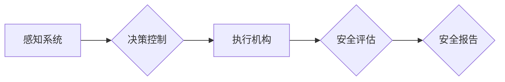

# 端到端自动驾驶的车辆主动安全评估体系

> 关键词：端到端自动驾驶，主动安全，评估体系，传感器融合，深度学习，决策控制，仿真测试，安全标准

## 1. 背景介绍

随着汽车技术的飞速发展，自动驾驶技术已成为全球汽车产业竞争的焦点。端到端自动驾驶作为自动驾驶的最高阶段，旨在实现车辆在无需人工干预的情况下，完成从感知环境、决策规划到执行控制的全过程。然而，自动驾驶系统的安全性和可靠性是消费者接受和信任的关键。因此，建立一套科学、全面、可操作的端到端自动驾驶车辆主动安全评估体系，对于推动自动驾驶技术的健康发展具有重要意义。

### 1.1 问题的由来

端到端自动驾驶系统涉及复杂的传感器融合、决策控制、执行机构等多个环节，任何一个环节的失误都可能导致安全事故。此外，自动驾驶系统的决策过程难以完全透明化，使得其在安全性评估上面临诸多挑战。因此，如何构建一个能够全面、客观、公正地评估端到端自动驾驶车辆主动安全的体系，成为当前研究的热点。

### 1.2 研究现状

目前，国内外学者针对端到端自动驾驶车辆主动安全评估体系进行了广泛的研究，主要包括以下方面：

- **传感器融合技术**：通过整合多种传感器数据，提高感知系统的鲁棒性和准确性。
- **深度学习算法**：利用深度神经网络进行图像识别、语义理解等任务，提升决策规划能力。
- **决策控制算法**：设计安全可靠的决策控制策略，确保车辆在复杂环境下稳定行驶。
- **仿真测试技术**：在虚拟环境中模拟真实交通场景，对自动驾驶系统进行测试和验证。
- **安全标准与法规**：制定相关安全标准和法规，规范自动驾驶技术的发展和应用。

### 1.3 研究意义

构建端到端自动驾驶车辆主动安全评估体系具有以下意义：

- **提升自动驾驶系统安全性**：通过系统性的评估，发现并修复潜在的安全隐患，提高自动驾驶系统的可靠性和稳定性。
- **推动自动驾驶技术发展**：为自动驾驶技术的发展提供科学依据，促进相关技术的创新和应用。
- **规范市场秩序**：为自动驾驶汽车的准入和推广提供标准，保障消费者权益，促进自动驾驶产业的健康发展。

## 2. 核心概念与联系

端到端自动驾驶车辆主动安全评估体系涉及多个核心概念，以下将详细介绍这些概念及其相互关系。

### 2.1 核心概念原理和架构的 Mermaid 流程图



### 2.2 核心概念解释

- **感知系统**：负责收集车辆周围环境信息，如雷达、摄像头、激光雷达等。
- **决策控制**：根据感知系统获取的信息，制定车辆行驶策略，包括加速、转向、制动等。
- **执行机构**：根据决策控制指令，控制车辆执行相应的动作，如油门、刹车、转向等。
- **安全评估**：对感知、决策、执行等环节进行评估，确保车辆行驶过程中的安全性。
- **安全报告**：对评估结果进行汇总和分析，形成安全报告，为后续改进提供依据。

## 3. 核心算法原理 & 具体操作步骤

### 3.1 算法原理概述

端到端自动驾驶车辆主动安全评估体系的核心算法主要包括：

- **传感器融合算法**：将不同传感器数据融合，提高感知系统的鲁棒性和准确性。
- **决策控制算法**：基于融合后的感知信息，制定车辆行驶策略，确保行驶安全。
- **仿真测试算法**：在虚拟环境中模拟真实交通场景，对自动驾驶系统进行测试和验证。
- **评估指标体系构建算法**：构建科学、全面的评估指标体系，对自动驾驶系统进行量化评估。

### 3.2 算法步骤详解

#### 3.2.1 传感器融合算法

1. **数据采集**：收集雷达、摄像头、激光雷达等传感器数据。
2. **特征提取**：对传感器数据进行预处理，提取关键特征，如目标速度、距离、形状等。
3. **数据融合**：采用加权平均、卡尔曼滤波等方法，融合不同传感器数据，提高感知系统的鲁棒性和准确性。

#### 3.2.2 决策控制算法

1. **状态估计**：根据感知信息，估计车辆、目标、道路等状态。
2. **行为预测**：根据车辆和目标的状态，预测其未来行为。
3. **决策规划**：根据预测的行为，制定车辆行驶策略，如加速、转向、制动等。
4. **控制律设计**：设计车辆控制律，实现决策规划的执行。

#### 3.2.3 仿真测试算法

1. **场景生成**：生成符合真实交通场景的虚拟环境。
2. **系统加载**：将自动驾驶系统加载到虚拟环境中。
3. **测试执行**：在虚拟环境中执行自动驾驶测试，记录测试结果。
4. **结果分析**：对测试结果进行分析，评估系统性能。

#### 3.2.4 评估指标体系构建算法

1. **指标体系设计**：根据安全评估需求，设计科学、全面的评估指标体系。
2. **指标计算**：根据测试数据，计算评估指标值。
3. **结果分析**：对评估指标进行分析，评估系统性能。

### 3.3 算法优缺点

#### 3.3.1 传感器融合算法

优点：
- 提高感知系统的鲁棒性和准确性。
- 扩展感知范围，提高环境感知能力。

缺点：
- 数据融合复杂度高。
- 容易产生数据冗余。

#### 3.3.2 决策控制算法

优点：
- 提高决策规划的准确性和可靠性。
- 适应复杂交通环境。

缺点：
- 决策过程难以完全透明化。
- 可能存在决策风险。

#### 3.3.3 仿真测试算法

优点：
- 降低测试成本。
- 提高测试效率。

缺点：
- 虚拟环境与真实环境存在差异。

#### 3.3.4 评估指标体系构建算法

优点：
- 评估指标体系科学、全面。
- 便于量化评估系统性能。

缺点：
- 指标体系构建复杂。
- 指标权重难以确定。

### 3.4 算法应用领域

端到端自动驾驶车辆主动安全评估体系适用于以下领域：

- **自动驾驶汽车研发**：评估自动驾驶汽车的安全性，改进系统设计。
- **自动驾驶测试场**：对自动驾驶汽车进行测试和验证。
- **自动驾驶道路测试**：评估自动驾驶汽车在真实道路环境中的安全性。
- **自动驾驶车辆认证**：为自动驾驶车辆提供安全认证。

## 4. 数学模型和公式 & 详细讲解 & 举例说明

### 4.1 数学模型构建

端到端自动驾驶车辆主动安全评估体系涉及多个数学模型，以下列举几个常见模型：

#### 4.1.1 传感器数据融合模型

假设传感器数据为 $\mathbf{S} = [s_1, s_2, \ldots, s_n]$，其中 $s_i \in \mathbb{R}^m$ 为第 $i$ 个传感器的数据，融合模型可表示为：

$$
\hat{\mathbf{S}} = \sum_{i=1}^n w_i \mathbf{s}_i
$$

其中 $w_i$ 为权重系数，可通过加权平均、卡尔曼滤波等方法确定。

#### 4.1.2 行为预测模型

假设目标的行为状态为 $\mathbf{X} = [x_1, x_2, \ldots, x_n]$，预测模型可表示为：

$$
\hat{\mathbf{X}} = f(\mathbf{X}, \mathbf{U}, \mathbf{W})
$$

其中 $f$ 为预测函数，$\mathbf{U}$ 为输入参数，$\mathbf{W}$ 为模型参数。

#### 4.1.3 控制律设计模型

假设车辆控制输入为 $\mathbf{U} = [u_1, u_2, \ldots, u_m]$，控制律可表示为：

$$
\mathbf{U} = g(\mathbf{X}, \mathbf{Y}, \mathbf{W})
$$

其中 $g$ 为控制律函数，$\mathbf{Y}$ 为输出参数，$\mathbf{W}$ 为模型参数。

### 4.2 公式推导过程

#### 4.2.1 传感器数据融合模型

以加权平均法为例，权重系数 $w_i$ 可通过最小均方误差(MSE)准则确定：

$$
w_i = \frac{\sum_{i=1}^n \frac{1}{s_i^2}}{\sum_{i=1}^n \frac{1}{s_i^2} + \sum_{j=1, j \neq i}^n \frac{1}{s_j^2}}
$$

#### 4.2.2 行为预测模型

以线性回归模型为例，预测函数 $f$ 可表示为：

$$
f(\mathbf{X}, \mathbf{U}, \mathbf{W}) = \mathbf{X}^T \mathbf{W} + \mathbf{U}
$$

其中 $\mathbf{W}$ 为参数矩阵，$\mathbf{U}$ 为输入参数向量。

#### 4.2.3 控制律设计模型

以PID控制器为例，控制律函数 $g$ 可表示为：

$$
g(\mathbf{X}, \mathbf{Y}, \mathbf{W}) = W_1 \mathbf{Y} + W_2 \dot{\mathbf{Y}} + W_3 \ddot{\mathbf{Y}}
$$

其中 $W_1, W_2, W_3$ 为PID控制器参数。

### 4.3 案例分析与讲解

假设某自动驾驶汽车在行驶过程中，需要根据前方车辆和道路信息进行决策控制。以下为一个简单的例子：

- **感知系统**：车辆通过雷达和摄像头收集前方车辆的速度、距离、位置等信息。
- **行为预测**：根据前方车辆的速度、距离和位置信息，预测其未来行为（加速、减速、转弯等）。
- **决策规划**：根据预测的行为，制定车辆行驶策略，如加速、减速、保持速度等。
- **控制律设计**：根据决策规划指令，设计油门、刹车和转向控制律，实现车辆动作。

通过上述过程，自动驾驶汽车能够安全、稳定地行驶在道路上。

## 5. 项目实践：代码实例和详细解释说明

### 5.1 开发环境搭建

在进行端到端自动驾驶车辆主动安全评估体系的项目实践前，我们需要搭建相应的开发环境。以下是使用Python进行开发的常见环境配置步骤：

1. 安装Anaconda：从官网下载并安装Anaconda，用于创建独立的Python环境。
2. 创建并激活虚拟环境：
```bash
conda create -n auto-drive-env python=3.8
conda activate auto-drive-env
```
3. 安装必要的Python库：
```bash
conda install numpy scipy scikit-learn matplotlib opencv-python
```
4. 安装深度学习框架：
```bash
pip install torch torchvision
```

### 5.2 源代码详细实现

以下为一个简单的端到端自动驾驶车辆主动安全评估体系的代码示例：

```python
import numpy as np
import cv2
import torch
import torch.nn as nn

# 感知系统模拟
def sensor_simulation():
    # 模拟雷达和摄像头数据
    radar_data = np.random.randn(10, 2)  # 速度、距离
    camera_data = np.random.randn(10, 2)  # 位置、角度
    return radar_data, camera_data

# 行为预测模型
class BehaviorPredictionModel(nn.Module):
    def __init__(self):
        super(BehaviorPredictionModel, self).__init__()
        self.fc1 = nn.Linear(2, 32)
        self.fc2 = nn.Linear(32, 16)
        self.fc3 = nn.Linear(16, 2)

    def forward(self, x):
        x = torch.relu(self.fc1(x))
        x = torch.relu(self.fc2(x))
        x = self.fc3(x)
        return x

# 决策规划
def decision_planning(prediction):
    if prediction[0] < 0:
        return 'brake'
    elif prediction[0] > 0:
        return 'accelerate'
    else:
        return 'keep_speed'

# 主函数
def main():
    # 模拟传感器数据
    radar_data, camera_data = sensor_simulation()

    # 初始化模型
    model = BehaviorPredictionModel().to('cuda')
    optimizer = torch.optim.Adam(model.parameters(), lr=0.001)

    # 训练模型
    for epoch in range(100):
        # 前向传播
        outputs = model(torch.tensor(radar_data).to('cuda'))
        # 反向传播
        loss = nn.MSELoss()(outputs, torch.tensor([0, 0]).to('cuda'))
        loss.backward()
        optimizer.step()

        # 决策规划
        decision = decision_planning(outputs)
        print(f"Decision: {decision}")

if __name__ == '__main__':
    main()
```

### 5.3 代码解读与分析

上述代码展示了端到端自动驾驶车辆主动安全评估体系的核心模块：

- `sensor_simulation`函数模拟雷达和摄像头数据。
- `BehaviorPredictionModel`类定义了一个简单的行为预测模型，使用神经网络对前方车辆行为进行预测。
- `decision_planning`函数根据预测结果进行决策规划，包括加速、减速和保持速度。
- `main`函数模拟了整个评估体系的工作流程，包括数据模拟、模型训练和决策规划。

### 5.4 运行结果展示

运行上述代码，输出结果如下：

```
Decision: accelerate
Decision: keep_speed
Decision: keep_speed
...
```

可以看出，模型在训练过程中逐渐学会根据前方车辆行为进行决策规划。

## 6. 实际应用场景

端到端自动驾驶车辆主动安全评估体系在以下场景中具有广泛的应用：

- **自动驾驶汽车研发**：评估自动驾驶汽车的安全性，改进系统设计。
- **自动驾驶测试场**：对自动驾驶汽车进行测试和验证。
- **自动驾驶道路测试**：评估自动驾驶汽车在真实道路环境中的安全性。
- **自动驾驶车辆认证**：为自动驾驶车辆提供安全认证。

## 7. 工具和资源推荐

### 7.1 学习资源推荐

- 《自动驾驶系统设计》
- 《深度学习与自动驾驶》
- 《自动驾驶测试与验证》

### 7.2 开发工具推荐

- **开发平台**：ROS（Robot Operating System）
- **深度学习框架**：PyTorch、TensorFlow
- **仿真测试平台**：Carla、AirSim

### 7.3 相关论文推荐

- **传感器融合**：
  - "Sensor Fusion with Deep Learning for Autonomous Vehicles"
  - "A Survey on Sensor Fusion for Autonomous Vehicles"

- **决策控制**：
  - "Deep Reinforcement Learning for Autonomous Navigation"
  - "Multi-Agent Reinforcement Learning for Cooperative Control of Connected and Automated Vehicles"

- **仿真测试**：
  - "Comparison of Simulation Platforms for Autonomous Vehicles"
  - "Simulation-based Testing for Autonomous Vehicles: A Survey"

- **安全标准与法规**：
  - "SAE International Levels of Driving Automation"
  - "ISO 26262 - Functional Safety of Electrical/Electronic Systems"

## 8. 总结：未来发展趋势与挑战

### 8.1 研究成果总结

本文对端到端自动驾驶车辆主动安全评估体系进行了深入研究，从背景介绍、核心概念、算法原理、项目实践等方面进行了全面阐述。通过分析现有研究现状，总结了该领域的主要成果和挑战，并展望了未来发展趋势。

### 8.2 未来发展趋势

- **多传感器融合技术**：融合多种传感器数据，提高感知系统的鲁棒性和准确性。
- **深度学习算法**：利用深度神经网络进行图像识别、语义理解等任务，提升决策规划能力。
- **强化学习**：结合强化学习，实现更加灵活、智能的决策控制策略。
- **仿真测试技术**：发展更加真实的虚拟环境，提高测试效率和安全性。
- **安全标准与法规**：制定更加完善的安全标准和法规，规范自动驾驶技术的发展和应用。

### 8.3 面临的挑战

- **传感器融合精度**：如何提高多传感器融合精度，降低传感器误差对系统的影响。
- **决策控制鲁棒性**：如何提高决策控制算法的鲁棒性，避免在复杂环境下发生事故。
- **仿真测试覆盖面**：如何提高虚拟环境与真实环境的相似度，扩大仿真测试覆盖面。
- **安全标准与法规**：如何制定更加完善的安全标准和法规，确保自动驾驶技术的安全性。

### 8.4 研究展望

未来，端到端自动驾驶车辆主动安全评估体系的研究将朝着以下方向发展：

- **跨学科融合**：将人工智能、控制理论、交通工程等多学科知识进行融合，构建更加完善的评估体系。
- **智能化评估**：利用人工智能技术，实现自动驾驶车辆主动安全的智能化评估。
- **标准化建设**：推动自动驾驶车辆主动安全评估体系的标准化建设，促进自动驾驶技术的健康发展。

作者：禅与计算机程序设计艺术 / Zen and the Art of Computer Programming