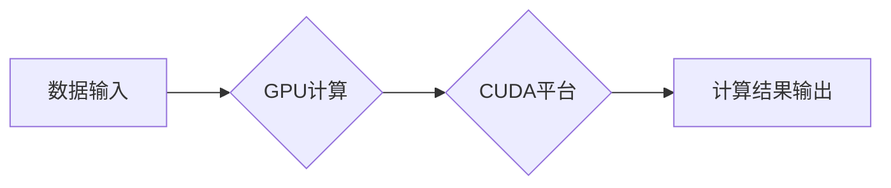

# 算力：NVIDIA推动AI大规模运算

> 关键词：NVIDIA, AI算力, GPU, CUDA, CUDA Compute Cluster, AI运算加速, 人工智能, 深度学习

## 1. 背景介绍

随着人工智能（AI）技术的飞速发展，算力已经成为推动AI研究、开发和部署的关键因素。在众多AI硬件提供商中，NVIDIA以其高性能GPU和CUDA平台成为了AI算力的代名词。本文将深入探讨NVIDIA如何通过其技术推动AI大规模运算，并分析其在AI领域的应用和未来发展趋势。

### 1.1 AI算力需求的爆发

近年来，随着深度学习、计算机视觉、自然语言处理等AI技术的迅猛发展，对算力的需求呈现出爆炸式增长。AI模型变得越来越复杂，需要处理的数据量也越来越大，这对计算资源提出了前所未有的挑战。

### 1.2 NVIDIA在AI算力领域的领先地位

NVIDIA凭借其高性能GPU和CUDA平台，在AI算力领域占据领先地位。NVIDIA的GPU拥有强大的并行计算能力，能够高效地执行深度学习模型中的矩阵运算，极大地提高了AI运算的效率。

## 2. 核心概念与联系

### 2.1 NVIDIA GPU架构

NVIDIA的GPU架构是其AI算力强大的基础。GPU（图形处理单元）与传统CPU相比，具有更高的并行处理能力和更低的功耗。NVIDIA的GPU架构包括以下几个关键特性：

- **多核架构**：每个GPU包含成百上千个核心，能够并行处理多个计算任务。
- **CUDA技术**：NVIDIA开发的CUDA平台允许开发者在GPU上运行通用计算任务，将CPU和GPU的优势结合。
- **高带宽内存**：NVIDIA GPU配备了高带宽内存，能够快速传输大量数据。

### 2.2 CUDA Compute Cluster

NVIDIA的CUDA Compute Cluster是由多个GPU组成的集群，能够提供超大规模的AI算力。这种集群可以用于训练大规模AI模型、处理海量数据以及进行复杂的AI分析。

### 2.3 Mermaid流程图

以下为NVIDIA GPU和CUDA Compute Cluster的基本流程图：



### 2.4 核心概念联系

NVIDIA GPU的并行计算能力和CUDA平台为AI运算提供了强大的基础。CUDA Compute Cluster则将多个GPU组合成强大的计算集群，进一步提升了AI运算的规模和效率。

## 3. 核心算法原理 & 具体操作步骤

### 3.1 算法原理概述

NVIDIA的GPU和CUDA平台通过以下原理实现AI运算加速：

- **并行计算**：GPU的并行计算能力使得AI模型中的矩阵运算可以同时进行，大大提高了计算效率。
- **内存管理**：NVIDIA的GPU配备了高带宽内存，能够快速传输数据，减少数据传输瓶颈。
- **CUDA API**：CUDA API为开发者提供了丰富的编程接口，使得GPU能够高效地执行通用计算任务。

### 3.2 算法步骤详解

以下为使用NVIDIA GPU和CUDA平台进行AI运算的基本步骤：

1. **数据准备**：准备训练数据集，并进行预处理。
2. **模型选择**：选择合适的AI模型，如卷积神经网络（CNN）、循环神经网络（RNN）等。
3. **代码编写**：使用CUDA API编写代码，将AI模型部署到GPU上。
4. **训练与优化**：在GPU上训练AI模型，并优化模型参数。
5. **模型评估**：在测试数据集上评估模型性能，并进行调整。

### 3.3 算法优缺点

#### 优点

- **高性能**：GPU的并行计算能力和CUDA平台的优化使得AI运算速度极快。
- **灵活性**：CUDA API提供了丰富的编程接口，支持多种AI模型。
- **易用性**：NVIDIA提供了大量的文档和示例代码，方便开发者上手。

#### 缺点

- **成本较高**：高性能GPU的价格相对较高，可能不适合所有用户。
- **编程复杂**：CUDA编程相对复杂，需要一定的编程基础。

### 3.4 算法应用领域

NVIDIA的GPU和CUDA平台在以下AI应用领域取得了显著成果：

- **深度学习**：用于训练和部署深度学习模型，如图像识别、语音识别等。
- **计算机视觉**：用于图像和视频处理，如图像分类、目标检测、人脸识别等。
- **自然语言处理**：用于文本分析、机器翻译、情感分析等。
- **科学计算**：用于物理模拟、生物信息学、金融分析等。

## 4. 数学模型和公式 & 详细讲解 & 举例说明

### 4.1 数学模型构建

在AI运算中，常见的数学模型包括：

- **卷积神经网络（CNN）**：用于图像识别、图像分类等。
- **循环神经网络（RNN）**：用于序列数据，如时间序列分析、机器翻译等。
- **自编码器（AE）**：用于特征提取、降维、数据去噪等。

### 4.2 公式推导过程

以CNN为例，其基本公式如下：

$$
\hat{y} = f(W^{[l]} \cdot \sigma(W^{[l-1]} \cdot \sigma(W^{[l-2]} \cdot x) + b^{[l-1]}))
$$

其中，$W^{[l]}$ 为第 $l$ 层权重，$\sigma$ 为非线性激活函数，$x$ 为输入数据，$\hat{y}$ 为输出结果。

### 4.3 案例分析与讲解

以下为一个简单的CNN模型案例：

```python
import torch
import torch.nn as nn

class SimpleCNN(nn.Module):
    def __init__(self):
        super(SimpleCNN, self).__init__()
        self.conv1 = nn.Conv2d(1, 32, kernel_size=3, padding=1)
        self.conv2 = nn.Conv2d(32, 64, kernel_size=3, padding=1)
        self.fc1 = nn.Linear(64, 10)

    def forward(self, x):
        x = torch.relu(self.conv1(x))
        x = torch.max_pool2d(x, 2)
        x = torch.relu(self.conv2(x))
        x = torch.max_pool2d(x, 2)
        x = x.view(-1, 64 * 6 * 6)
        x = torch.relu(self.fc1(x))
        return x
```

该模型包含两个卷积层和全连接层，用于识别图像中的手写数字。

## 5. 项目实践：代码实例和详细解释说明

### 5.1 开发环境搭建

要使用NVIDIA GPU进行AI运算，需要以下环境：

- NVIDIA GPU和CUDA驱动程序
- Python和PyTorch库
- 其他必要的依赖库，如NumPy、SciPy等

### 5.2 源代码详细实现

以下为使用PyTorch在NVIDIA GPU上训练CNN模型的示例代码：

```python
import torch
import torch.nn as nn
from torch.optim import Adam

# 模型定义
class SimpleCNN(nn.Module):
    # ...

# 数据加载
# ...

# 模型训练
def train(model, train_loader, optimizer, criterion):
    model.train()
    for data, target in train_loader:
        data, target = data.to(device), target.to(device)
        optimizer.zero_grad()
        output = model(data)
        loss = criterion(output, target)
        loss.backward()
        optimizer.step()

# ...

# 运行代码
device = torch.device("cuda" if torch.cuda.is_available() else "cpu")
model = SimpleCNN().to(device)
optimizer = Adam(model.parameters(), lr=0.001)
criterion = nn.CrossEntropyLoss()

train_loader = DataLoader(dataset, batch_size=64, shuffle=True)

for epoch in range(10):
    train(model, train_loader, optimizer, criterion)
```

### 5.3 代码解读与分析

上述代码定义了一个简单的CNN模型，并在NVIDIA GPU上进行了训练。代码中包含了数据加载、模型定义、模型训练等基本步骤。

### 5.4 运行结果展示

在训练过程中，可以通过打印损失函数值和准确率来观察模型的训练效果。

## 6. 实际应用场景

### 6.1 机器视觉

NVIDIA GPU在机器视觉领域有着广泛的应用，如：

- **图像识别**：用于自动识别和分类图像中的对象。
- **目标检测**：用于检测图像中的目标位置和类别。
- **人脸识别**：用于身份验证和识别。

### 6.2 自然语言处理

NVIDIA GPU在自然语言处理领域也有着重要的应用，如：

- **机器翻译**：用于将一种语言翻译成另一种语言。
- **情感分析**：用于分析文本的情感倾向。
- **文本摘要**：用于生成文本的摘要。

### 6.3 科学计算

NVIDIA GPU在科学计算领域也有着重要的应用，如：

- **分子模拟**：用于模拟分子的结构和性质。
- **气候模拟**：用于模拟地球气候系统。
- **金融分析**：用于预测金融市场走势。

## 7. 工具和资源推荐

### 7.1 学习资源推荐

- NVIDIA官方文档：提供CUDA和NVIDIA GPU的相关文档。
- PyTorch官方文档：提供PyTorch库的文档和教程。
- TensorFlow官方文档：提供TensorFlow库的文档和教程。

### 7.2 开发工具推荐

- CUDA Toolkit：NVIDIA提供的CUDA开发工具包。
- PyTorch：一个开源的深度学习框架。
- TensorFlow：一个开源的深度学习框架。

### 7.3 相关论文推荐

- "GPGPU Programming Guide"：NVIDIA提供的GPU编程指南。
- "Automatic Differentiation in GPU Computation"：关于GPU上的自动微分技术。
- "Deep Learning with PyTorch"：关于PyTorch的深度学习教程。

## 8. 总结：未来发展趋势与挑战

### 8.1 研究成果总结

本文深入探讨了NVIDIA如何通过其GPU和CUDA平台推动AI大规模运算。我们分析了NVIDIA GPU的架构、CUDA Compute Cluster的原理，以及其在AI领域的应用。同时，我们还介绍了使用NVIDIA GPU进行AI运算的基本步骤和代码示例。

### 8.2 未来发展趋势

未来，AI算力将继续向更高性能、更低功耗、更易用性的方向发展。以下是几个可能的发展趋势：

- **GPU架构的演进**：NVIDIA将继续优化GPU架构，提高并行计算能力和能效比。
- **软件生态的完善**：开发者和研究机构将不断丰富CUDA和深度学习框架的生态，提供更多工具和资源。
- **AI算力的民主化**：随着技术的普及和成本的降低，更多的企业和个人将能够访问和利用AI算力。

### 8.3 面临的挑战

尽管NVIDIA在AI算力领域取得了巨大成功，但仍然面临着一些挑战：

- **成本问题**：高性能GPU的价格仍然较高，限制了其在某些领域的应用。
- **编程难度**：CUDA编程相对复杂，需要一定的编程基础。
- **能效比**：随着GPU性能的提高，其功耗也相应增加，如何平衡性能和功耗将是一个挑战。

### 8.4 研究展望

为了应对未来的挑战，NVIDIA和整个AI社区需要共同努力：

- **降低成本**：通过技术创新和产业合作，降低高性能GPU的价格。
- **简化编程**：开发更加易用的编程工具和框架，降低CUDA编程的门槛。
- **提高能效比**：设计更加节能的GPU架构，降低功耗。

相信在社区的努力下，NVIDIA将继续推动AI算力的快速发展，为AI技术的普及和应用做出更大的贡献。

## 9. 附录：常见问题与解答

**Q1：什么是CUDA？**

A：CUDA是NVIDIA开发的并行计算平台和编程模型，允许开发者使用GPU进行通用计算任务。

**Q2：如何选择合适的GPU进行AI运算？**

A：选择GPU时需要考虑以下几个因素：

- **计算能力**：GPU的Tensor Core数量和时钟频率。
- **内存容量**：GPU的内存容量和带宽。
- **功耗**：GPU的功耗和散热能力。

**Q3：如何将代码迁移到GPU上？**

A：可以使用PyTorch、TensorFlow等深度学习框架，通过简单的修改代码，将CPU计算迁移到GPU上。

**Q4：GPU算力是否适合所有AI任务？**

A：GPU算力适合需要大规模并行计算的任务，如深度学习、计算机视觉、自然语言处理等。对于一些简单的计算任务，使用CPU可能更加高效。

**Q5：NVIDIA GPU在AI领域有哪些竞争对手？**

A：NVIDIA的主要竞争对手包括英伟达、英特尔、AMD等。

---

作者：禅与计算机程序设计艺术 / Zen and the Art of Computer Programming