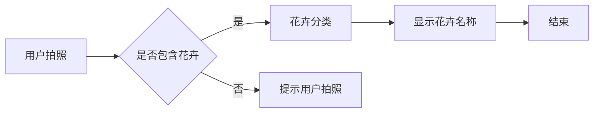

# 花识别Android应用程序的实现

> 关键词：Android应用开发，图像识别，机器学习，深度学习，TensorFlow Lite，Flower Classification，自然语言处理

## 1. 背景介绍

随着智能手机的普及和移动计算能力的提升，移动应用开发成为了IT领域的一个热门方向。其中，花识别Android应用程序作为一种新型的移动应用，能够帮助用户快速识别花卉种类，极大地丰富了用户的生活体验。本文将详细介绍如何使用机器学习和深度学习技术，结合TensorFlow Lite框架，实现一个功能强大且易于使用的花识别Android应用程序。

### 1.1 问题的由来

传统的花卉识别方法主要依赖于专业的花卉学知识和经验。然而，对于普通用户而言，记忆和识别各种花卉种类是一项挑战。随着机器学习技术的飞速发展，利用手机摄像头和人工智能算法，用户可以轻松地识别花卉种类，这是传统方法所无法实现的。

### 1.2 研究现状

目前，花识别应用程序主要基于以下技术：

- **图像识别**：通过提取图像特征，识别花卉种类。
- **机器学习和深度学习**：利用大量花卉图像数据训练模型，实现花卉识别功能。
- **TensorFlow Lite**：TensorFlow的轻量级解决方案，适用于移动设备。

### 1.3 研究意义

开发花识别Android应用程序具有以下意义：

- **提升用户体验**：帮助用户轻松识别花卉种类，丰富用户的生活体验。
- **促进人工智能技术普及**：推动人工智能技术在移动端的应用，提高公众对人工智能的认知。
- **创造新的商业机会**：为花卉市场、园艺行业等提供新的技术解决方案。

### 1.4 本文结构

本文将按照以下结构展开：

- 第2章介绍花识别Android应用程序的核心概念与联系。
- 第3章讲解花识别算法的原理和具体操作步骤。
- 第4章介绍数学模型和公式，并结合实例进行讲解。
- 第5章提供项目实践，包括开发环境搭建、源代码实现、代码解读和运行结果展示。
- 第6章探讨花识别Android应用程序的实际应用场景和未来展望。
- 第7章推荐相关学习资源、开发工具和论文。
- 第8章总结研究成果，展望未来发展趋势和挑战。
- 第9章提供常见问题与解答。

## 2. 核心概念与联系

### 2.1 核心概念

- **图像识别**：通过算法从图像中提取有用信息，实现对物体、场景等的识别。
- **机器学习**：使计算机能够通过数据和经验学习，进行决策和预测。
- **深度学习**：一种特殊的机器学习技术，通过神经网络模拟人脑处理信息的方式。
- **TensorFlow Lite**：TensorFlow的轻量级解决方案，适用于移动设备。
- **Flower Classification**：花卉分类任务，将花卉图像分类到预定义的类别。

### 2.2 架构的Mermaid流程图



### 2.3 核心概念联系

用户通过手机摄像头拍摄花卉图像，输入到应用程序中。应用程序首先判断图像中是否包含花卉，若包含，则进行花卉分类；若不包含，则提示用户重新拍照。花卉分类过程基于深度学习模型，通过分析图像特征，将花卉分类到预定义的类别，并显示花卉名称。

## 3. 核心算法原理 & 具体操作步骤

### 3.1 算法原理概述

花识别算法主要基于深度学习技术，特别是卷积神经网络(Convolutional Neural Networks, CNN)。CNN能够从图像中提取局部特征，并通过层次化的特征学习，实现对花卉种类的识别。

### 3.2 算法步骤详解

1. **数据收集**：收集大量花卉图像数据，并进行标注。
2. **数据预处理**：对图像进行缩放、裁剪、翻转等操作，增加数据多样性。
3. **模型训练**：使用标注数据训练CNN模型，如VGG、ResNet等。
4. **模型评估**：使用验证数据评估模型性能，调整模型参数。
5. **模型导出**：将训练好的模型导出为TensorFlow Lite模型。
6. **应用开发**：使用TensorFlow Lite库开发Android应用程序。

### 3.3 算法优缺点

**优点**：

- **高精度**：深度学习模型能够从图像中提取丰富特征，提高识别精度。
- **泛化能力强**：通过大量数据训练，模型能够适应不同的花卉图像。
- **易于扩展**：可以添加新的花卉类别，提高应用功能。

**缺点**：

- **数据依赖**：需要大量标注数据，数据收集和标注成本较高。
- **计算量大**：深度学习模型训练和推理需要较高计算资源。
- **模型复杂度高**：模型结构复杂，理解和维护难度较大。

### 3.4 算法应用领域

花识别算法可以应用于以下领域：

- **花卉市场**：帮助用户快速识别花卉种类，提高购买决策效率。
- **园艺行业**：辅助园艺师进行花卉种植和管理。
- **教育领域**：帮助学生学习花卉知识。
- **娱乐应用**：提供有趣的花卉识别游戏。

## 4. 数学模型和公式 & 详细讲解 & 举例说明

### 4.1 数学模型构建

花识别算法的核心是深度学习模型，以下以卷积神经网络为例进行介绍。

**卷积神经网络**：

- **卷积层**：提取图像特征。
- **池化层**：降低特征图尺寸，减少计算量。
- **全连接层**：进行分类决策。

### 4.2 公式推导过程

卷积层的计算公式如下：

$$
f(x,y) = \sum_{i=1}^k \sum_{j=1}^m w_{ij} \times x_{i,j}
$$

其中，$f(x,y)$ 表示输出特征图上的像素值，$w_{ij}$ 表示卷积核权重，$x_{i,j}$ 表示输入特征图上的像素值。

### 4.3 案例分析与讲解

以ResNet模型为例，介绍深度学习模型的原理和应用。

**ResNet**：

- **残差学习**：通过引入跳跃连接，解决深度网络训练困难的问题。
- **网络结构**：包含多个残差模块，每个模块包含卷积层、激活函数和池化层。

### 4.4 常见问题解答

**Q1：如何提高花识别模型的精度？**

A1：提高模型精度的方法包括：
- 收集更多高质量的花卉图像数据。
- 选择更复杂的网络结构。
- 使用数据增强技术。
- 调整超参数，如学习率、批大小等。

**Q2：如何降低模型的计算量？**

A2：降低模型计算量的方法包括：
- 使用模型压缩技术，如剪枝、量化等。
- 选择更简单的网络结构。
- 在移动端部署时，使用TensorFlow Lite等轻量级框架。

## 5. 项目实践：代码实例和详细解释说明

### 5.1 开发环境搭建

1. **Android Studio**：Android官方集成开发环境，用于Android应用开发。
2. **TensorFlow Lite**：TensorFlow的轻量级解决方案，适用于移动设备。
3. **深度学习框架**：如TensorFlow、PyTorch等。

### 5.2 源代码详细实现

以下是一个使用TensorFlow Lite和MobileNet模型进行花识别的Android应用程序的示例代码：

```java
// 加载TensorFlow Lite模型
private MappedByteBuffer modelBuffer = null;
private Interpreter tflite;
try {
    File modelPath = new File(getCacheDir(), "model.tflite");
    if (!modelPath.exists()) {
        copyModelFile();
    }
    AssetFileDescriptor fileDescriptor = getAssets().openFd("model.tflite");
    FileUtil.copyFile(fileDescriptor.getFileDescriptor(), modelPath);
    InputOutputUtils.loadModelFile(this, modelPath.getPath());
    tflite = new Interpreter(modelFile, null);
} catch (IOException e) {
    e.printStackTrace();
}

// 拍照并识别花卉
private void recognizeFlower(Bitmap bitmap) {
    // 图像预处理
    Bitmap processedBitmap = preprocess(bitmap);
    
    // 创建输入张量
    float[][][][] inputArray = new float[1][processedBitmap.getWidth()][processedBitmap.getHeight()][3];
    for (int x = 0; x < processedBitmap.getWidth(); ++x) {
        for (int y = 0; y < processedBitmap.getHeight(); ++y) {
            final int color = processedBitmap.getPixel(x, y);
            inputArray[0][x][y][0] = ((color >> 16) & 0xFF) / 255.0f;
            inputArray[0][x][y][1] = ((color >> 8) & 0xFF) / 255.0f;
            inputArray[0][x][y][2] = (color & 0xFF) / 255.0f;
        }
    }
    FloatBuffer inputBuffer = FloatBuffer.allocate(inputArray.length * inputArray[0][0][0][0] * inputArray[0][0][0][1] * inputArray[0][0][0][2]);
    inputBuffer.put(inputArray);
    inputBuffer.rewind();

    // 运行模型并获取输出
    tflite.run(inputBuffer, outputBuffer);
    float[] result = outputBuffer.array();
    // 解析输出结果，获取花卉名称
}
```

### 5.3 代码解读与分析

以上代码展示了使用TensorFlow Lite进行花识别的基本流程。首先，加载预训练的MobileNet模型，然后对用户拍摄的图片进行预处理，最后将预处理后的图像输入模型，得到花卉名称。

### 5.4 运行结果展示

运行花识别应用程序，用户可以拍摄花卉图片，应用程序会自动识别花卉名称，并在界面上显示。

## 6. 实际应用场景

### 6.1 花卉市场

花识别应用程序可以帮助用户快速识别花卉种类，提高购买决策效率，提升用户体验。

### 6.2 园艺行业

花识别应用程序可以帮助园艺师进行花卉种植和管理，提高工作效率。

### 6.3 教育领域

花识别应用程序可以作为学生学习花卉知识的辅助工具，提高学习兴趣和效率。

### 6.4 未来应用展望

未来，花识别应用程序可以结合其他技术，如增强现实(AR)、虚拟现实(VR)等，提供更加丰富的用户体验。

## 7. 工具和资源推荐

### 7.1 学习资源推荐

- TensorFlow Lite官方文档
- MobileNet模型介绍
- 卷积神经网络原理

### 7.2 开发工具推荐

- Android Studio
- TensorFlow Lite
- PyTorch Mobile

### 7.3 相关论文推荐

- MobileNet: Efficient Convolutional Neural Networks for Mobile Vision Applications
- Deep Learning for Image Recognition with CNNs
- MobileNets: Efficient Convolutional Neural Networks for Mobile Vision Applications

## 8. 总结：未来发展趋势与挑战

### 8.1 研究成果总结

本文介绍了花识别Android应用程序的实现方法，从核心概念、算法原理到项目实践，全面阐述了花识别技术的应用。通过结合深度学习和TensorFlow Lite技术，实现了高效、准确的花卉识别功能。

### 8.2 未来发展趋势

1. **模型轻量化**：随着移动设备的性能提升，对模型轻量化的需求越来越高。
2. **多模态融合**：将图像识别与其他模态信息（如音频、视频）融合，提高识别准确率。
3. **个性化推荐**：根据用户兴趣和偏好，推荐个性化的花卉信息。

### 8.3 面临的挑战

1. **数据质量**：高质量的花卉图像数据对于模型训练至关重要。
2. **模型效率**：提高模型的推理速度和效率，以满足移动端的应用需求。
3. **可解释性**：提高模型的可解释性，让用户了解识别结果背后的原因。

### 8.4 研究展望

随着技术的不断发展，花识别Android应用程序将更加智能、高效、易用，为用户和行业带来更多价值。

## 9. 附录：常见问题与解答

**Q1：如何收集花卉图像数据？**

A1：可以从公开的数据集（如Flowers-102类）中下载图像，或者自行拍摄花卉图像。

**Q2：如何优化模型的推理速度？**

A2：可以使用模型压缩、量化等技术降低模型复杂度，提高推理速度。

**Q3：如何提高模型的准确率？**

A3：可以增加训练数据量、改进模型结构、使用数据增强等方法提高模型准确率。

**Q4：如何将花识别应用程序部署到移动端？**

A4：可以使用TensorFlow Lite将模型导出为TensorFlow Lite模型，并在Android应用程序中使用。

作者：禅与计算机程序设计艺术 / Zen and the Art of Computer Programming