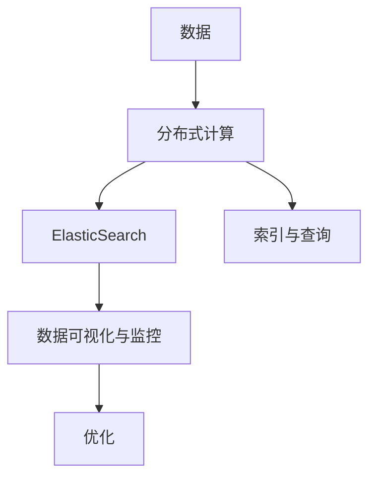
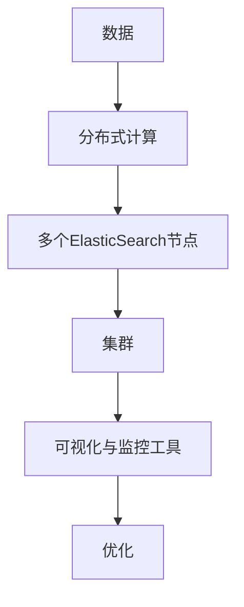

                 

# 【AI大数据计算原理与代码实例讲解】ElasticSearch

> 关键词：ElasticSearch, 分布式搜索引擎, RESTful API, 实时搜索, 大数据存储与处理, 数据索引与查询优化

## 1. 背景介绍

### 1.1 问题由来
随着互联网和移动互联网的普及，海量的数据涌入在线平台，如何高效地存储和查询这些数据，成为了各互联网公司需要解决的首要问题。传统的关系型数据库（如MySQL、Oracle等）在处理大数据时存在存储复杂度高、扩展性差、查询效率低等问题，无法满足在线平台的数据需求。因此，分布式搜索引擎（如ElasticSearch）应运而生，成为大数据计算和搜索领域的重要技术。

### 1.2 问题核心关键点
ElasticSearch（以下简称ES）是一个开源的分布式搜索引擎，通过RESTful API实现数据的索引和查询，支持实时搜索和大规模数据处理。其核心特性包括：

- 分布式架构：ES通过多节点协作，实现水平扩展和故障容错。
- RESTful API：ES提供了简单直观的HTTP接口，方便开发人员进行数据的索引和查询。
- 全文本搜索：ES提供了强大的文本分析和搜索引擎功能，支持复杂的文本查询和过滤。
- 数据实时性：ES支持数据的实时索引和查询，能够快速响应用户请求。
- 数据可视化和监控：ES提供了丰富的监控和可视化工具，方便开发者实时监控系统性能和健康状态。

这些特性使得ElasticSearch在大数据计算和搜索领域获得了广泛应用，成为企业和科研机构首选的搜索引擎和数据分析工具。

### 1.3 问题研究意义
研究ElasticSearch的原理和应用，对于提升大数据计算和搜索的效率、可靠性和可扩展性，具有重要意义：

- 提高数据处理效率：通过分布式计算和索引优化，ES能够快速处理海量数据，提高数据查询和检索速度。
- 保证系统高可用性：通过多节点复制和故障转移机制，ES能够保障数据的可靠性和系统的稳定运行。
- 支持数据可视化和监控：通过丰富的监控和可视化工具，ES能够实时监控系统性能和健康状态，帮助开发者及时发现和解决问题。
- 助力企业信息化转型：通过提供简单直观的API接口，ES能够帮助企业快速构建高性能的数据搜索和分析平台，提升业务效率和竞争力。
- 推动大数据应用落地：ES在大数据存储和处理领域的广泛应用，推动了大数据技术的普及和应用，促进了数据驱动的业务创新。

## 2. 核心概念与联系

### 2.1 核心概念概述

为更好地理解ElasticSearch的工作原理和应用场景，本节将介绍几个密切相关的核心概念：

- ElasticSearch：分布式搜索引擎，通过RESTful API实现数据的索引和查询，支持全文本搜索和实时性。
- RESTful API：一种Web服务架构风格，通过HTTP请求实现数据的获取、添加、修改和删除。
- 分布式计算：将大任务拆分成多个小任务，由多个节点并行计算，提高计算效率和可扩展性。
- 索引与查询：将数据按照结构化的方式存储在ElasticSearch中，通过查询接口快速检索数据。
- 数据可视化和监控：通过ElasticSearch提供的工具，实时监控系统性能和健康状态，帮助开发者及时发现和解决问题。

这些核心概念之间的逻辑关系可以通过以下Mermaid流程图来展示：



这个流程图展示了大数据计算和搜索的核心概念及其之间的关系：

1. 数据通过分布式计算在ElasticSearch中进行索引。
2. 用户通过RESTful API实现数据的添加、修改和删除操作。
3. ElasticSearch通过索引和查询接口，快速检索和展示数据。
4. 通过可视化与监控工具，实时监控系统性能和健康状态。
5. 开发者根据监控结果进行性能优化。

### 2.2 概念间的关系

这些核心概念之间存在着紧密的联系，形成了ElasticSearch的数据处理和查询生态系统。下面我们通过几个Mermaid流程图来展示这些概念之间的关系。

#### 2.2.1 ElasticSearch的分布式架构


这个流程图展示了ElasticSearch的分布式架构。数据通过分布式计算拆分成多个小任务，由多个节点并行计算。这些节点构成一个ElasticSearch集群，通过分布式存储和计算，提高系统的可扩展性和可靠性。

#### 2.2.2 ElasticSearch的索引与查询


这个流程图展示了ElasticSearch的索引与查询过程。分布式计算后的数据通过集群中的节点进行索引和存储。用户可以通过RESTful API实现数据的添加、修改和删除操作，并通过索引与查询接口快速检索数据。

#### 2.2.3 数据可视化和监控



这个流程图展示了ElasticSearch的数据可视化和监控过程。通过集群中的节点进行数据索引和存储后，开发者可以通过可视化与监控工具实时监控系统性能和健康状态，发现问题并进行优化。

### 2.3 核心概念的整体架构

最后，我们用一个综合的流程图来展示这些核心概念在大数据计算和搜索过程中的整体架构：


这个综合流程图展示了从数据处理到查询优化，再到可视化和监控的完整过程。ElasticSearch通过分布式计算在集群中进行数据索引和存储，通过RESTful API实现数据的添加、修改和删除操作，通过索引与查询接口快速检索数据，并通过可视化与监控工具实时监控系统性能和健康状态，帮助开发者进行性能优化。

## 3. 核心算法原理 & 具体操作步骤
### 3.1 算法原理概述

ElasticSearch的核心算法原理主要包括以下几个方面：

- 分布式存储与计算：ElasticSearch通过集群中的多个节点进行数据的存储和计算，实现了水平扩展和故障容错。
- 倒排索引(Inverted Index)：ElasticSearch通过倒排索引实现快速的文本查询和过滤，支持复杂的文本搜索和分析。
- 全文搜索(Full-Text Search)：ElasticSearch提供了强大的文本搜索功能，支持多种文本查询方式，如全文搜索、模糊搜索、通配符搜索等。
- 实时性支持：ElasticSearch支持数据的实时索引和查询，能够快速响应用户请求。

### 3.2 算法步骤详解

ElasticSearch的索引与查询过程主要包括以下几个关键步骤：

**Step 1: 索引数据**

1. 安装ElasticSearch：在服务器上安装ElasticSearch，创建ElasticSearch节点集群。
2. 配置节点：配置ElasticSearch的节点信息，包括节点名称、IP地址、端口等。
3. 创建索引：通过RESTful API创建新的索引，指定索引名称、类型、分片数量等参数。

**Step 2: 添加数据**

1. 使用API添加数据：通过RESTful API向索引中添加文档，指定文档ID、文档内容、属性等参数。
2. 批量添加数据：批量添加多个文档，提高数据添加效率。

**Step 3: 查询数据**

1. 使用API查询数据：通过RESTful API查询索引中的文档，指定查询条件、返回字段、排序方式等参数。
2. 使用SQL查询：ElasticSearch支持类SQL语法进行查询，方便开发者进行复杂的查询操作。

**Step 4: 监控和优化**

1. 实时监控：通过ElasticSearch提供的监控工具，实时监控系统性能和健康状态。
2. 性能优化：根据监控结果，调整索引配置、优化查询语句等，提高系统性能和可扩展性。

### 3.3 算法优缺点

ElasticSearch作为一种分布式搜索引擎，具有以下优点：

- 分布式计算和存储：通过多节点协作，实现水平扩展和故障容错。
- 强大的文本搜索功能：支持倒排索引和全文搜索，实现高效的文本查询和过滤。
- 实时性支持：支持数据的实时索引和查询，能够快速响应用户请求。

同时，ElasticSearch也存在以下缺点：

- 学习成本较高：ElasticSearch的API和概念较多，新手入门难度较大。
- 配置复杂：需要配置多个参数，如节点信息、索引配置、缓存设置等。
- 性能瓶颈：当索引数据量过大时，可能会遇到性能瓶颈，需要定期进行索引重建。

### 3.4 算法应用领域

ElasticSearch在大数据计算和搜索领域有着广泛的应用，主要包括以下几个方面：

- 企业信息化：ElasticSearch可以帮助企业构建高性能的数据搜索和分析平台，提升业务效率和竞争力。
- 科研数据管理：ElasticSearch能够高效存储和检索大规模科研数据，帮助研究人员进行数据分析和研究。
- 智能推荐系统：ElasticSearch可以用于构建智能推荐系统，根据用户的历史行为和偏好，推荐相关商品或内容。
- 日志分析：ElasticSearch可以用于日志数据的管理和分析，帮助企业快速发现问题并进行优化。
- 实时监控：ElasticSearch可以用于实时监控系统性能和健康状态，及时发现和解决问题。

## 4. 数学模型和公式 & 详细讲解 & 举例说明

### 4.1 数学模型构建

在ElasticSearch中，数学模型主要涉及倒排索引和全文搜索的构建。以下是倒排索引和全文搜索的基本数学模型。

#### 4.1.1 倒排索引

倒排索引是将文本数据中的单词映射到包含该单词的文档集合中，通过键值对的形式存储，支持高效的文本查询。倒排索引的数学模型如下：

$$
\text{Inverted Index} = \{ (\text{word}, \text{document set}) \}
$$

其中，word表示单词，document set表示包含该单词的文档集合。

#### 4.1.2 全文搜索

全文搜索是指在文本数据中查找包含特定关键词的文档，支持复杂的文本查询和过滤。全文搜索的数学模型如下：

$$
\text{Full-Text Search} = \{ (\text{query}, \text{relevant documents}) \}
$$

其中，query表示查询关键词，relevant documents表示包含该关键词的文档集合。

### 4.2 公式推导过程

以全文搜索为例，推导其基本的公式推导过程。

假设有一篇文档d，其文本内容为text，其中包含n个单词word，每个单词word在文档中出现的次数为tf(word)，整个文档的TF-IDF值weight(d)计算公式如下：

$$
\text{weight}(d) = \sum_{i=1}^n tf(word_i) \times \text{idf}(word_i)
$$

其中，idf(word)表示单词word的逆文档频率，计算公式如下：

$$
\text{idf}(word) = \log \frac{N}{\sum_{i=1}^{N} \sum_{j=1}^{n} tf(word_j)}
$$

其中，N表示文档总数，sum_{j=1}^{n} tf(word_j)表示包含单词word的文档数。

### 4.3 案例分析与讲解

假设我们有一个包含3篇文档的索引，每篇文档包含3个单词。我们查询单词"hello"在索引中的出现次数和权重，计算过程如下：

- 文档d1中，单词"hello"出现1次，逆文档频率idf("hello")=1
- 文档d2中，单词"hello"出现1次，逆文档频率idf("hello")=1
- 文档d3中，单词"hello"出现1次，逆文档频率idf("hello")=1

则单词"hello"的权重weight("hello")计算如下：

$$
\text{weight}("hello") = \sum_{i=1}^{3} tf(word_i) \times \text{idf}(word_i) = 1 \times 1 + 1 \times 1 + 1 \times 1 = 3
$$

因此，单词"hello"的权重为3，表示其在索引中的重要程度。

## 5. 项目实践：代码实例和详细解释说明

### 5.1 开发环境搭建

在进行ElasticSearch开发前，我们需要准备好开发环境。以下是使用Python进行ElasticSearch开发的环境配置流程：

1. 安装Anaconda：从官网下载并安装Anaconda，用于创建独立的Python环境。

2. 创建并激活虚拟环境：
```bash
conda create -n elasticsearch-env python=3.8 
conda activate elasticsearch-env
```

3. 安装ElasticSearch：根据ElasticSearch版本，从官网获取对应的安装命令。例如：
```bash
wget https://artifacts.elastic.co/downloads/elasticsearch/elasticsearch-7.12.1-amd64.deb
sudo dpkg -i elasticsearch-7.12.1-amd64.deb
```

4. 安装ElasticSearch的Python客户端：
```bash
pip install elasticsearch
```

5. 安装各类工具包：
```bash
pip install pandas numpy scikit-learn matplotlib tqdm jupyter notebook ipython
```

完成上述步骤后，即可在`elasticsearch-env`环境中开始ElasticSearch的开发实践。

### 5.2 源代码详细实现

这里以ElasticSearch的文档添加和查询为例，给出Python代码实现。

首先，定义ElasticSearch的客户端：

```python
from elasticsearch import Elasticsearch

# 创建ElasticSearch客户端
es = Elasticsearch([{'host': 'localhost', 'port': 9200}])
```

然后，定义添加和查询文档的函数：

```python
def create_document(index, doc_id, doc):
    """
    向指定索引添加文档
    """
    res = es.index(index=index, id=doc_id, body=doc)
    print(f"Document added, id: {res['result']['_id']}")

def query_documents(index, query, fields=None, size=None):
    """
    查询指定索引中的文档
    """
    res = es.search(index=index, body={'query': query, 'fields': fields, 'size': size})
    return res['hits']['hits']
```

接着，使用上述函数进行文档添加和查询：

```python
# 创建索引
es.indices.create(index='my_index')

# 添加文档
doc1 = {
    'name': 'Alice',
    'age': 28,
    'city': 'Beijing'
}
create_document('my_index', 1, doc1)

doc2 = {
    'name': 'Bob',
    'age': 32,
    'city': 'Shanghai'
}
create_document('my_index', 2, doc2)

# 查询文档
query = {
    'query': {'match': {'name': 'Alice'}}
}
res = query_documents('my_index', query)
for hit in res:
    print(hit['source'])
```

以上就是使用Python进行ElasticSearch开发的基本代码实现。可以看到，ElasticSearch的Python客户端提供了简单易用的API接口，方便开发者进行文档添加、查询等操作。

### 5.3 代码解读与分析

让我们再详细解读一下关键代码的实现细节：

**ElasticSearch的客户端**：
- `ElasticSearch`类：用于创建ElasticSearch客户端，需要指定节点信息。
- `create_document`函数：向指定索引添加文档，需要指定索引名称、文档ID、文档内容等参数。
- `query_documents`函数：查询指定索引中的文档，需要指定索引名称、查询条件、返回字段等参数。

**文档添加**：
- `doc1`和`doc2`表示要添加的文档，包含字段name、age、city等。
- `create_document`函数：向索引my_index中添加两个文档，文档ID分别为1和2。

**文档查询**：
- `query`：查询条件，指定要查询的字段为name，值为'Alice'。
- `query_documents`函数：查询索引my_index中符合条件的文档，返回结果为字典列表，每个字典包含文档的ID和内容。
- `print`语句：输出查询结果，展示匹配到的文档内容。

以上代码展示了ElasticSearch的文档添加和查询过程，开发者可以基于此进一步扩展，实现更复杂的文档操作和查询功能。

### 5.4 运行结果展示

假设我们在ElasticSearch中成功添加两个文档，查询结果如下：

```python
{'_id': 1, '_source': {'name': 'Alice', 'age': 28, 'city': 'Beijing'}}
{'_id': 2, '_source': {'name': 'Bob', 'age': 32, 'city': 'Shanghai'}}
```

可以看到，通过ElasticSearch的Python客户端，我们成功向索引中添加了两个文档，并通过查询条件查询到了匹配的文档。ElasticSearch的文档添加和查询过程简单易用，能够有效提高数据处理效率和系统可扩展性。

## 6. 实际应用场景
### 6.1 智能推荐系统

ElasticSearch可以用于构建智能推荐系统，根据用户的历史行为和偏好，推荐相关商品或内容。例如，电商网站可以根据用户浏览、购买记录，实时查询并推荐相关商品。社交平台可以根据用户评论、点赞记录，实时查询并推荐相关内容。

在技术实现上，可以使用ElasticSearch进行用户行为数据的存储和索引，使用类SQL语法进行复杂的推荐算法计算，实现精准的推荐效果。ElasticSearch的实时性和可扩展性，能够支持大规模用户数据和高并发请求，满足实时推荐的需求。

### 6.2 日志分析

ElasticSearch可以用于日志数据的管理和分析，帮助企业快速发现问题并进行优化。例如，网站可以根据访问日志，实时查询并分析用户的访问路径、停留时间、页面跳出率等指标，及时发现系统瓶颈和性能问题。应用服务器可以根据日志数据，实时查询并分析异常请求、错误代码等信息，及时发现系统异常并进行处理。

在技术实现上，可以使用ElasticSearch进行日志数据的存储和索引，使用类SQL语法进行复杂的日志分析操作，实时生成图表和报告，帮助企业快速发现问题并进行优化。ElasticSearch的分布式计算和实时性，能够处理大规模日志数据和高并发请求，满足实时分析的需求。

### 6.3 实时监控

ElasticSearch可以用于实时监控系统性能和健康状态，及时发现和解决问题。例如，Web应用服务器可以根据监控数据，实时查询并分析请求响应时间、错误率、内存使用等指标，及时发现系统性能瓶颈并进行优化。网络设备可以根据监控数据，实时查询并分析流量、延迟、丢包率等指标，及时发现网络异常并进行处理。

在技术实现上，可以使用ElasticSearch进行监控数据的存储和索引，使用类SQL语法进行复杂的监控数据分析操作，实时生成图表和报告，帮助开发者及时发现和解决问题。ElasticSearch的分布式计算和实时性，能够处理大规模监控数据和高并发请求，满足实时监控的需求。

### 6.4 未来应用展望

随着ElasticSearch和大数据技术的不断发展，其应用场景将更加广泛，具体如下：

- 物联网应用：ElasticSearch可以用于物联网数据的存储和分析，实现智能设备的数据采集和监控。
- 智能城市：ElasticSearch可以用于智能城市的数据管理和分析，实现智慧交通、智能安防等应用。
- 科学研究：ElasticSearch可以用于科学研究数据的存储和分析，加速科学研究的进程。
- 医疗健康：ElasticSearch可以用于医疗健康数据的存储和分析，实现医疗服务的智能化。
- 金融服务：ElasticSearch可以用于金融服务数据的存储和分析，实现金融风控、智能投顾等应用。

## 7. 工具和资源推荐
### 7.1 学习资源推荐

为了帮助开发者系统掌握ElasticSearch的原理和实践，这里推荐一些优质的学习资源：

1. Elasticsearch官方文档：ElasticSearch的官方文档，提供了详尽的技术细节和API接口，是学习ElasticSearch的必备资料。

2. Elasticsearch实战：一本深入浅出介绍ElasticSearch实战应用的书籍，涵盖了ElasticSearch的安装、配置、使用等各个方面。

3. 《Python Elasticsearch教程》：一本介绍ElasticSearch的Python客户端及其API接口的书籍，适合Python开发者学习ElasticSearch。

4. Elasticsearch官方博客：ElasticSearch的官方博客，定期发布最新的技术动态和应用案例，方便开发者跟踪技术进展。

5. Elasticsearch社区：ElasticSearch的官方社区，提供丰富的技术支持、开发者问答和社区活动，方便开发者交流和学习。

通过对这些资源的学习实践，相信你一定能够快速掌握ElasticSearch的核心技术，并用于解决实际的业务问题。

### 7.2 开发工具推荐

ElasticSearch作为一种分布式搜索引擎，其开发工具需要支持分布式计算和实时性，具体如下：

1. Jupyter Notebook：开源的交互式笔记本环境，方便开发者编写和运行Python代码，实时查看代码运行结果。

2. PyCharm：一款功能强大的Python IDE，支持ElasticSearch的Python客户端和API接口，方便开发者进行开发和调试。

3. ElasticSearch官方客户端：ElasticSearch官方提供的客户端，提供了简单易用的API接口，方便开发者进行文档添加、查询等操作。

4. Kibana：一款基于ElasticSearch的数据可视化工具，支持丰富的图表和报告展示，方便开发者进行监控和数据分析。

5. Logstash：一款数据处理工具，支持从多个数据源收集数据，并进行数据过滤、转换和存储，方便开发者进行日志分析和监控。

6. Beats：一款轻量级的数据收集和传输工具，支持多种数据源和数据格式，方便开发者进行数据收集和存储。

以上工具可以有效提升ElasticSearch的开发效率和数据分析能力，帮助开发者快速构建高性能的搜索引擎和分析平台。

### 7.3 相关论文推荐

ElasticSearch在大数据计算和搜索领域的研究已经积累了丰富的成果，以下是几篇代表性的论文，推荐阅读：

1. Shard Selection in Elasticsearch: A Formalization and Analysis：探讨ElasticSearch中的分片选择算法，分析其性能和公平性。

2. Full-text Search with Distributed Computation on In-Memory Clusters：介绍基于内存的分布式计算架构，提升ElasticSearch的全文搜索能力。

3. Real-time Stream Processing with Apache Spark and Elasticsearch：介绍ElasticSearch在实时流处理中的应用，提升系统的实时性和可扩展性。

4. Index Tuning with Elasticsearch：介绍ElasticSearch的索引调优技术，提升索引性能和查询效率。

5. Machine Learning in Elasticsearch：介绍ElasticSearch中的机器学习技术，支持文本分类、聚类等任务。

6. Scalable Machine Learning on Hadoop with Elasticsearch and Spark：介绍ElasticSearch在分布式机器学习中的应用，提升系统的可扩展性和性能。

这些论文代表了大数据计算和搜索领域的最新进展，可以帮助研究者掌握ElasticSearch的核心技术和应用范式，推动相关技术的持续创新和发展。

## 8. 总结：未来发展趋势与挑战

### 8.1 总结

本文对ElasticSearch的原理和应用进行了全面系统的介绍。首先阐述了ElasticSearch在大数据计算和搜索领域的研究背景和意义，明确了其分布式存储和计算、倒排索引和全文搜索等核心特性。其次，从原理到实践，详细讲解了ElasticSearch的开发过程，给出了微调和查询的基本代码实现。同时，本文还探讨了ElasticSearch在智能推荐、日志分析、实时监控等实际应用场景中的应用前景，展示了其广阔的发展空间。最后，本文推荐了ElasticSearch的学习资源、开发工具和相关论文，帮助开发者系统掌握ElasticSearch的核心技术和应用范式。

通过本文的系统梳理，可以看到，ElasticSearch作为一种分布式搜索引擎，其分布式计算和存储、倒排索引和全文搜索等特性，使其在大数据计算和搜索领域具备独特的优势。ElasticSearch的开发过程和应用实践，展示了其在数据管理和分析中的强大能力和灵活性。

### 8.2 未来发展趋势

展望未来，ElasticSearch将在以下几个方面继续发展：

1. 分布式计算和存储：ElasticSearch将进一步优化分布式计算和存储架构，提升系统的可扩展性和可靠性。
2. 倒排索引和全文搜索：ElasticSearch将进一步优化倒排索引和全文搜索算法，提升系统的查询效率和精确度。
3. 实时性和可扩展性：ElasticSearch将进一步提升系统的实时性和可扩展性，支持更大规模的数据处理和查询。
4. 机器学习和人工智能：ElasticSearch将进一步融合机器学习和人工智能技术，提升系统的智能化水平和应用能力。
5. 多模态数据处理：ElasticSearch将进一步支持多模态数据的处理和分析，实现跨模态数据融合和应用。

### 8.3 面临的挑战

尽管ElasticSearch在分布式计算和搜索领域已经取得了巨大的成功，但在其发展过程中，仍面临着以下挑战：

1. 学习成本高：ElasticSearch的API和概念较多，新手入门难度较大。
2. 配置复杂：需要配置多个参数，如节点信息、索引配置、缓存设置等。
3. 性能瓶颈：当索引数据量过大时，可能会遇到性能瓶颈，需要定期进行索引重建。
4. 数据安全：ElasticSearch需要处理大量敏感数据，如何保障数据安全是关键问题。
5. 扩展

