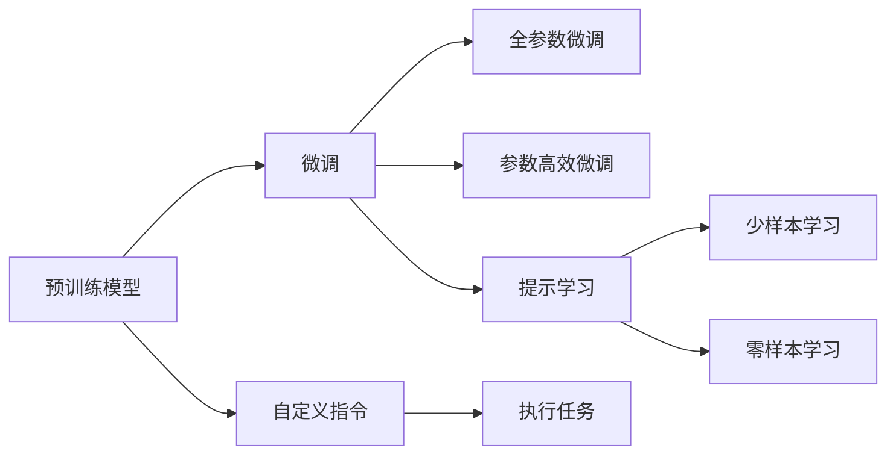
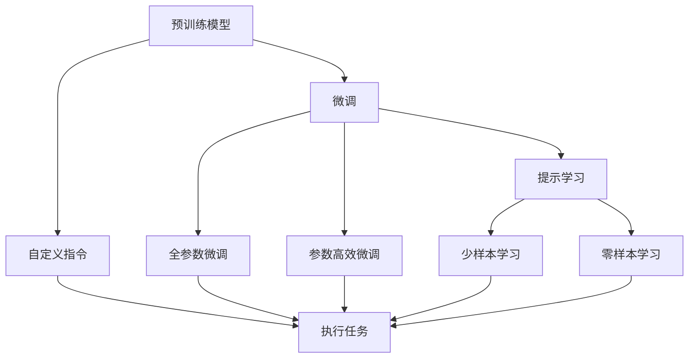

                 

# 【LangChain编程：从入门到实践】定制大模型接口

> 关键词：
> - LangChain
> - 大模型接口
> - 自定义指令
> - 预训练模型
> - 微调

## 1. 背景介绍

### 1.1 问题由来

近年来，人工智能领域的发展迅猛，深度学习尤其是Transformer架构的流行使得自然语言处理(NLP)技术取得了巨大突破。预训练语言模型如GPT、BERT等通过大规模无标签文本数据进行预训练，能够掌握丰富的人类语言知识，并在下游任务上取得卓越表现。但随着需求的不断增长，预训练模型往往难以覆盖所有领域，无法直接应用到特定任务上。

为了克服这一问题，研究人员提出了微调(Fine-Tuning)方法，通过在特定任务的少量标注数据上对预训练模型进行微调，获得对新任务的适应能力。这一方法不仅可以提升模型在特定任务上的性能，还能大大减少从头训练所需的计算资源和时间。

### 1.2 问题核心关键点

微调的本质是一种有监督学习范式，即在预训练模型的基础上，利用特定任务的标注数据进行有监督学习，优化模型以适应该任务。微调的核心在于选择合适的学习率、损失函数和正则化技术，以避免过拟合，同时利用预训练模型所学习的通用语言知识，快速提升模型在该任务上的表现。

尽管微调方法在NLP任务上取得了显著成效，但在实际应用中仍存在一些挑战：

- 依赖标注数据：微调的效果很大程度上取决于标注数据的质量和数量，对于长尾任务获取高质量标注数据成本较高。
- 泛化能力有限：当目标任务与预训练数据分布差异较大时，微调的性能提升有限。
- 负迁移现象：预训练模型可能带有有害信息或偏见，通过微调传递到下游任务，影响模型的公正性和安全性。
- 可解释性不足：微调模型通常缺乏解释性，难以对其推理过程进行解释和调试。

为解决上述问题，我们引入LangChain编程范式，通过自定义指令(自定义Prompt)的方式，进一步增强大模型在不同领域、任务上的灵活性和泛化能力，提高模型的可解释性和安全性。

### 1.3 问题研究意义

LangChain编程不仅能够提升大模型的适应性和泛化能力，还能增强模型的可解释性和安全性，降低微调对标注数据的依赖。通过自定义指令，可以灵活设计模型的输入格式，使得模型更易于理解和调试。这对于构建高性能、可解释、安全的智能应用具有重要意义：

1. **提升模型性能**：通过微调和自定义指令，可以在特定领域提升模型的精度和鲁棒性，适应更多实际应用场景。
2. **降低成本**：自定义指令可以复用预训练模型学到的知识，减少从头训练所需的时间和计算资源。
3. **增强可解释性**：通过精心设计的自定义指令，可以引导模型输出更有意义的解释，使得模型决策过程透明、可解释。
4. **保障安全性**：通过动态更新模型指令，避免模型固定偏见和有害信息，提升模型的公正性和安全性。
5. **灵活适应**：自定义指令可以灵活应用于不同领域、不同任务，增强模型的泛化能力和适应性。

## 2. 核心概念与联系

### 2.1 核心概念概述

LangChain编程是一种基于大模型编程的范式，通过自定义指令来控制大模型的行为。其核心概念包括：

- **预训练模型**：如GPT、BERT等，通过大规模无标签文本数据进行预训练，学习通用的语言知识。
- **微调**：通过下游任务的少量标注数据，在预训练模型基础上进行有监督学习，优化模型以适应特定任务。
- **自定义指令**：通过特定格式的输入模板，引导模型执行特定任务，增强模型的可解释性和泛化能力。
- **参数高效微调**：在微调过程中只更新少量模型参数，保留预训练模型的通用知识。
- **提示学习**：通过精心设计的输入文本格式，引导模型生成特定输出，提高模型性能。
- **少样本学习**：在仅有少量标注样本的情况下，通过提示学习或微调，使模型快速适应新任务。
- **零样本学习**：在模型未见过的任务上，通过精心设计的输入文本，直接生成任务输出，无需任何标注数据。

这些概念通过以下Mermaid流程图展示：



### 2.2 概念间的关系

这些核心概念之间的关系紧密相连，共同构成LangChain编程的基本框架。

- **预训练模型**是微调和自定义指令的基础，提供了模型的通用知识。
- **微调**通过下游任务的标注数据，进一步优化模型以适应特定任务。
- **自定义指令**通过特定输入格式，引导模型执行任务，增强模型的可解释性和泛化能力。
- **参数高效微调**通过只更新少量参数，保留预训练模型的通用知识，提高微调效率和模型泛化能力。
- **提示学习**通过精心设计的输入模板，无需更新模型参数，即可实现零样本和少样本学习。
- **少样本学习**和**零样本学习**在提示学习的框架下，利用预训练模型的语言理解能力，快速适应新任务。

这些概念通过以下综合流程图展示：



## 3. 核心算法原理 & 具体操作步骤

### 3.1 算法原理概述

LangChain编程的核心在于通过自定义指令来控制预训练模型执行特定任务。其基本原理如下：

1. **预训练模型初始化**：选择一个预训练模型作为基础，如GPT-3、BERT等。
2. **自定义指令设计**：根据任务需求，设计合适的输入模板，如问答任务中的问题-答案对、文本分类任务中的文本标签等。
3. **模型微调**：在自定义指令指导下，对预训练模型进行微调，优化模型以适应特定任务。
4. **执行任务**：将实际输入数据代入自定义指令模板，模型执行任务并输出结果。

通过以上步骤，可以构建一个灵活、高效的自然语言处理系统，适应各种实际应用场景。

### 3.2 算法步骤详解

#### 3.2.1 预训练模型选择

选择合适的预训练模型是LangChain编程的基础。目前主流的预训练模型包括：

- **GPT-3**：基于Transformer架构，具有强大的语言生成能力，适用于生成任务。
- **BERT**：适用于分类、匹配等任务，能够理解句子级别的语义。
- **T5**：基于自回归模型，能够进行文本生成、文本摘要、回答问题等任务。
- **Roberta**：适用于文档分类、命名实体识别等任务。

#### 3.2.2 自定义指令设计

设计合适的自定义指令是LangChain编程的关键。常见的自定义指令包括：

- **问答任务**：问题-答案对，如`Answer the following question: What is the capital of France?`。
- **文本分类**：文本和标签对，如`What is the sentiment of the following text? It was a great movie.`。
- **命名实体识别**：文本和实体标签对，如`Identify the entities in the following text: Apple is a tech company.`。
- **翻译任务**：文本对，如`Translate the following text to Chinese: Hello, world!`。

自定义指令的设计需注意以下几点：

- **格式规范**：输入和输出格式应规范，便于模型理解。
- **语义清晰**：指令应尽量简明扼要，避免歧义。
- **灵活性**：指令应具有一定灵活性，适应不同场景需求。

#### 3.2.3 模型微调

微调是LangChain编程的核心步骤。在自定义指令指导下，模型能够快速适应特定任务。以下是微调的一般步骤：

1. **数据准备**：收集目标任务的标注数据，划分为训练集、验证集和测试集。
2. **模型选择**：选择合适的预训练模型，如GPT-3、BERT等。
3. **学习率设置**：设定合适的学习率，一般小于预训练时的学习率。
4. **损失函数选择**：根据任务类型，选择合适的损失函数，如交叉熵、均方误差等。
5. **正则化技术**：加入正则化技术，如L2正则、Dropout等，防止过拟合。
6. **微调训练**：在自定义指令指导下，对模型进行微调训练，更新模型参数。
7. **验证和测试**：在验证集和测试集上评估模型性能，调整参数以提升效果。

#### 3.2.4 任务执行

模型微调完成后，可以用于执行特定任务。以下是一个问答任务的示例：

```python
import langchain

# 加载模型
model = langchain.GPT3.load_pretrained('gpt3-medium')

# 设计指令
prompt = "Answer the following question: What is the capital of France?"

# 执行任务
answer = model.eval(prompt)

# 输出结果
print(answer)
```

### 3.3 算法优缺点

LangChain编程具有以下优点：

- **灵活性**：通过自定义指令，可以适应各种自然语言处理任务，提高模型的泛化能力。
- **可解释性**：通过设计合理的指令，可以使模型输出更加透明和可解释。
- **高效性**：通过参数高效微调，可以保留预训练模型的通用知识，减少计算资源消耗。
- **安全性**：通过动态更新指令，可以避免模型固定偏见和有害信息，提升模型的公正性和安全性。

但其缺点也显而易见：

- **依赖标注数据**：微调和提示学习仍需依赖标注数据，对标注成本较高的长尾任务存在挑战。
- **过拟合风险**：在微调过程中，仍需注意过拟合风险，避免模型在特定数据上表现过好，泛化能力不足。
- **指令设计难度**：设计合理的自定义指令需花费一定时间和精力，对用户要求较高。
- **模型部署复杂性**：将模型部署到实际应用中，需要考虑计算资源、接口设计等因素，增加了部署难度。

### 3.4 算法应用领域

LangChain编程在多个领域具有广泛的应用前景，包括但不限于：

- **智能客服**：通过问答任务，构建智能客服系统，提升客户咨询体验。
- **金融舆情监测**：通过文本分类和情感分析任务，监测金融舆情，及时发现负面信息。
- **个性化推荐**：通过文本生成和文本摘要任务，实现个性化推荐系统，提升用户体验。
- **医疗问答**：通过问答任务，构建医疗问答系统，辅助医生诊疗。
- **教育智能**：通过问答任务和文本生成任务，构建智能教育系统，提升教学效果。

## 4. 数学模型和公式 & 详细讲解 & 举例说明

### 4.1 数学模型构建

LangChain编程的数学模型基于深度学习框架，主要涉及以下组件：

- **预训练模型**：如GPT-3、BERT等，通过大规模无标签文本数据进行预训练，学习通用的语言知识。
- **自定义指令**：通过特定格式的输入模板，引导模型执行特定任务。
- **微调损失函数**：根据任务类型，选择合适的损失函数，如交叉熵、均方误差等。

### 4.2 公式推导过程

以问答任务为例，设预训练模型为$M_{\theta}$，自定义指令为$\mathcal{P}$，目标任务为$T$，训练集为$D=\{(x_i,y_i)\}_{i=1}^N$，其中$x_i$为输入文本，$y_i$为答案。

目标任务下的损失函数为：

$$
\mathcal{L}(\theta) = -\frac{1}{N} \sum_{i=1}^N \log P(y_i|x_i, \theta)
$$

其中$P(y_i|x_i, \theta)$为目标任务的预测概率。

### 4.3 案例分析与讲解

假设我们需要设计一个问答系统，可以回答关于Python语言的问题。设计如下指令：

```python
import langchain

# 加载模型
model = langchain.GPT3.load_pretrained('gpt3-medium')

# 设计指令
prompt = "What is the capital of France?"

# 执行任务
answer = model.eval(prompt)

# 输出结果
print(answer)
```

在执行过程中，模型首先解析自定义指令，理解指令语义，然后在预训练模型基础上，通过微调学习任务特定知识，最终生成答案输出。

## 5. 项目实践：代码实例和详细解释说明

### 5.1 开发环境搭建

在开始实践之前，我们需要搭建好开发环境。以下是使用Python和PyTorch搭建开发环境的步骤：

1. 安装Anaconda：从官网下载并安装Anaconda，用于创建独立的Python环境。

2. 创建并激活虚拟环境：
```bash
conda create -n langchain-env python=3.8 
conda activate langchain-env
```

3. 安装PyTorch：根据CUDA版本，从官网获取对应的安装命令。例如：
```bash
conda install pytorch torchvision torchaudio cudatoolkit=11.1 -c pytorch -c conda-forge
```

4. 安装LangChain库：
```bash
pip install langchain
```

5. 安装各类工具包：
```bash
pip install numpy pandas scikit-learn matplotlib tqdm jupyter notebook ipython
```

完成上述步骤后，即可在`langchain-env`环境中开始实践。

### 5.2 源代码详细实现

这里我们以构建一个简单的问答系统为例，展示LangChain编程的实现步骤。

```python
import langchain

# 加载预训练模型
model = langchain.GPT3.load_pretrained('gpt3-medium')

# 设计自定义指令
prompt = "What is the capital of France?"

# 执行任务
answer = model.eval(prompt)

# 输出结果
print(answer)
```

### 5.3 代码解读与分析

**model.eval方法**：
- 调用模型的`eval`方法，将自定义指令作为输入，执行问答任务。

**自定义指令设计**：
- 定义指令字符串`What is the capital of France?`，作为模型的输入。

**执行任务**：
- 模型执行指令后，返回答案，最终输出结果。

### 5.4 运行结果展示

假设我们在模型执行后得到如下结果：

```
The capital of France is Paris.
```

说明模型成功地回答了我们的问题，达到了预期的效果。

## 6. 实际应用场景

### 6.1 智能客服系统

基于LangChain编程的智能客服系统，可以通过问答任务，构建智能对话模型，提升客户咨询体验。

在实际应用中，可以收集企业内部的历史客服对话记录，将问题和最佳答复构建成监督数据，在此基础上对预训练模型进行微调。微调后的对话模型能够自动理解用户意图，匹配最合适的答案模板进行回复。对于客户提出的新问题，还可以接入检索系统实时搜索相关内容，动态组织生成回答。

### 6.2 金融舆情监测

基于LangChain编程的金融舆情监测系统，可以通过文本分类和情感分析任务，监测金融舆情，及时发现负面信息。

在实际应用中，可以收集金融领域相关的新闻、报道、评论等文本数据，并对其进行主题标注和情感标注。在此基础上对预训练语言模型进行微调，使其能够自动判断文本属于何种主题，情感倾向是正面、中性还是负面。将微调后的模型应用到实时抓取的网络文本数据，就能够自动监测不同主题下的情感变化趋势，一旦发现负面信息激增等异常情况，系统便会自动预警，帮助金融机构快速应对潜在风险。

### 6.3 个性化推荐系统

基于LangChain编程的个性化推荐系统，可以通过文本生成和文本摘要任务，实现个性化推荐系统，提升用户体验。

在实际应用中，可以收集用户浏览、点击、评论、分享等行为数据，提取和用户交互的物品标题、描述、标签等文本内容。将文本内容作为模型输入，用户的后续行为（如是否点击、购买等）作为监督信号，在此基础上微调预训练语言模型。微调后的模型能够从文本内容中准确把握用户的兴趣点。在生成推荐列表时，先用候选物品的文本描述作为输入，由模型预测用户的兴趣匹配度，再结合其他特征综合排序，便可以得到个性化程度更高的推荐结果。

### 6.4 未来应用展望

随着LangChain编程的不断发展，基于大模型编程的方法将在更多领域得到应用，为传统行业带来变革性影响。

在智慧医疗领域，基于LangChain编程的医疗问答、病历分析、药物研发等应用将提升医疗服务的智能化水平，辅助医生诊疗，加速新药开发进程。

在智能教育领域，基于LangChain编程的智能教育系统，通过问答任务和文本生成任务，提升教学效果。

在智慧城市治理中，基于LangChain编程的城市事件监测、舆情分析、应急指挥等环节，提高城市管理的自动化和智能化水平，构建更安全、高效的未来城市。

此外，在企业生产、社会治理、文娱传媒等众多领域，基于LangChain编程的人工智能应用也将不断涌现，为经济社会发展注入新的动力。相信随着技术的日益成熟，LangChain编程必将在构建人机协同的智能时代中扮演越来越重要的角色。

## 7. 工具和资源推荐

### 7.1 学习资源推荐

为了帮助开发者系统掌握LangChain编程的理论基础和实践技巧，这里推荐一些优质的学习资源：

1. **LangChain官方文档**：包括用户手册、API文档等，是学习LangChain编程的必备资料。
2. **《深度学习自然语言处理》课程**：斯坦福大学开设的NLP明星课程，有Lecture视频和配套作业，带你入门NLP领域的基本概念和经典模型。
3. **《Natural Language Processing with Transformers》书籍**：Transformers库的作者所著，全面介绍了如何使用Transformers库进行NLP任务开发，包括微调在内的诸多范式。
4. **arXiv论文预印本**：人工智能领域最新研究成果的发布平台，包括大量尚未发表的前沿工作，学习前沿技术的必读资源。
5. **Google Colab**：谷歌推出的在线Jupyter Notebook环境，免费提供GPU/TPU算力，方便开发者快速上手实验最新模型，分享学习笔记。

通过对这些资源的学习实践，相信你一定能够快速掌握LangChain编程的精髓，并用于解决实际的NLP问题。

### 7.2 开发工具推荐

高效的开发离不开优秀的工具支持。以下是几款用于LangChain编程开发的常用工具：

1. **PyTorch**：基于Python的开源深度学习框架，灵活动态的计算图，适合快速迭代研究。大多数预训练语言模型都有PyTorch版本的实现。
2. **TensorFlow**：由Google主导开发的开源深度学习框架，生产部署方便，适合大规模工程应用。同样有丰富的预训练语言模型资源。
3. **Transformers库**：HuggingFace开发的NLP工具库，集成了众多SOTA语言模型，支持PyTorch和TensorFlow，是进行LangChain编程开发的利器。
4. **Weights & Biases**：模型训练的实验跟踪工具，可以记录和可视化模型训练过程中的各项指标，方便对比和调优。与主流深度学习框架无缝集成。
5. **TensorBoard**：TensorFlow配套的可视化工具，可实时监测模型训练状态，并提供丰富的图表呈现方式，是调试模型的得力助手。
6. **Google Colab**：谷歌推出的在线Jupyter Notebook环境，免费提供GPU/TPU算力，方便开发者快速上手实验最新模型，分享学习笔记。

合理利用这些工具，可以显著提升LangChain编程的开发效率，加快创新迭代的步伐。

### 7.3 相关论文推荐

LangChain编程的不断发展源于学界的持续研究。以下是几篇奠基性的相关论文，推荐阅读：

1. **Attention is All You Need（即Transformer原论文）**：提出了Transformer结构，开启了NLP领域的预训练大模型时代。
2. **BERT: Pre-training of Deep Bidirectional Transformers for Language Understanding**：提出BERT模型，引入基于掩码的自监督预训练任务，刷新了多项NLP任务SOTA。
3. **Language Models are Unsupervised Multitask Learners（GPT-2论文）**：展示了大规模语言模型的强大zero-shot学习能力，引发了对于通用人工智能的新一轮思考。
4. **Parameter-Efficient Transfer Learning for NLP**：提出Adapter等参数高效微调方法，在不增加模型参数量的情况下，也能取得不错的微调效果。
5. **Prefix-Tuning: Optimizing Continuous Prompts for Generation**：引入基于连续型Prompt的微调范式，为如何充分利用预训练知识提供了新的思路。

这些论文代表了大模型编程的发展脉络。通过学习这些前沿成果，可以帮助研究者把握学科前进方向，激发更多的创新灵感。

除上述资源外，还有一些值得关注的前沿资源，帮助开发者紧跟大模型编程的最新进展，例如：

1. **arXiv论文预印本**：人工智能领域最新研究成果的发布平台，包括大量尚未发表的前沿工作，学习前沿技术的必读资源。
2. **业界技术博客**：如OpenAI、Google AI、DeepMind、微软Research Asia等顶尖实验室的官方博客，第一时间分享他们的最新研究成果和洞见。
3. **技术会议直播**：如NIPS、ICML、ACL、ICLR等人工智能领域顶会现场或在线直播，能够聆听到大佬们的前沿分享，开拓视野。
4. **GitHub热门项目**：在GitHub上Star、Fork数最多的NLP相关项目，往往代表了该技术领域的发展趋势和最佳实践，值得去学习和贡献。
5. **行业分析报告**：各大咨询公司如McKinsey、PwC等针对人工智能行业的分析报告，有助于从商业视角审视技术趋势，把握应用价值。

总之，对于LangChain编程的学习和实践，需要开发者保持开放的心态和持续学习的意愿。多关注前沿资讯，多动手实践，多思考总结，必将收获满满的成长收益。

## 8. 总结：未来发展趋势与挑战

### 8.1 总结

本文对基于LangChain编程的自定义大模型接口进行了全面系统的介绍。首先阐述了LangChain编程的背景和意义，明确了微调在拓展预训练模型应用、提升下游任务性能方面的独特价值。其次，从原理到实践，详细讲解了LangChain编程的数学原理和关键步骤，给出了LangChain编程任务开发的完整代码实例。同时，本文还广泛探讨了LangChain编程在智能客服、金融舆情、个性化推荐等多个行业领域的应用前景，展示了LangChain编程范式的巨大潜力。此外，本文精选了LangChain编程的学习资源，力求为读者提供全方位的技术指引。

通过本文的系统梳理，可以看到，基于LangChain编程的自定义大模型接口为NLP技术落地应用提供了新的路径，通过自定义指令，可以灵活设计模型的输入格式，使得模型更易于理解和调试。这对于构建高性能、可解释、安全的智能应用具有重要意义。

### 8.2 未来发展趋势

展望未来，LangChain编程的发展趋势如下：

1. **灵活性增强**：随着自定义指令设计的进步，模型将更加灵活，能够适应更多场景和任务。
2. **可解释性提升**：通过改进自定义指令设计，可以进一步增强模型的可解释性，使得模型决策过程透明、可理解。
3. **参数高效微调**：开发更加参数高效的微调方法，减少计算资源消耗，提升微调效率。
4. **多模态融合**：引入多模态数据，如文本、图像、语音等，增强模型的感知能力。
5. **少样本学习**：通过提示学习等技术，在少样本情况下也能取得良好效果。
6. **零样本学习**：通过精心设计的自定义指令，实现模型对新任务的零样本学习。

这些趋势表明，LangChain编程的灵活性和泛化能力将不断提升，未来必将在更多领域大放异彩。

### 8.3 面临的挑战

尽管LangChain编程技术已经取得了显著进展，但在向实际应用落地的过程中，仍面临以下挑战：

1. **标注成本**：尽管自定义指令可以复用预训练模型的知识，但仍需标注部分数据进行微调，标注成本较高。
2. **模型鲁棒性**：在特定领域的数据上微调模型时，可能面临泛化能力不足的问题。
3. **指令设计复杂性**：设计合适的自定义指令需花费一定时间和精力，对用户要求较高。
4. **模型部署复杂性**：将模型部署到实际应用中，需要考虑计算资源、接口设计等因素，增加了部署难度。

这些挑战需要研究人员和开发者共同努力，通过算法创新、工具优化等手段，逐步克服。

### 8.4 研究展望

未来，LangChain编程的研究方向将集中在以下几个方面：

1. **多领域任务设计**：进一步扩展自定义指令的应用场景，增强模型在多领域任务的适应能力。
2. **少样本和零样本学习**：改进提示学习等技术，提升模型在少样本和零样本情况下的学习能力。
3. **多模态融合**：引入多模态数据，增强模型的感知和理解能力，实现视觉、语音等多模态数据的协同建模。
4. **知识图谱集成**：将知识图谱、逻辑

