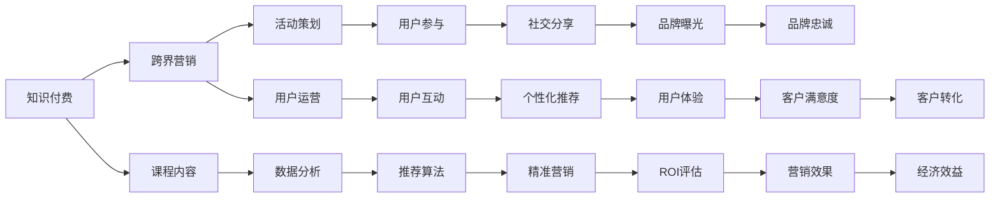

                 

# 知识付费如何实现跨界营销与美食生鲜跨界？

## 1. 背景介绍

随着互联网时代的到来，知识付费市场迅速崛起，知识消费者需求日益多样化和个性化。在这样的大背景下，知识付费企业纷纷寻求跨界合作，以期探索更多的盈利模式和发展空间。其中，跨界营销成为知识付费企业拓展市场、提升品牌影响力的重要手段。与此同时，以生鲜电商为代表的零售行业，也正探索将数字技术与传统产业结合的新路径。在此背景下，知识付费与美食生鲜的跨界合作应运而生，既丰富了知识付费的体验和内容，又推动了生鲜电商的发展和创新。

本文将从知识付费和美食生鲜跨界营销的实践案例入手，详细探讨其背后的技术实现和数据驱动方法，并分析两者合作面临的挑战与未来发展趋势。

## 2. 核心概念与联系

### 2.1 核心概念概述

在探索知识付费与美食生鲜跨界营销的实践中，需要理解以下核心概念：

- **知识付费**：指消费者通过付费购买或订阅在线课程、电子书、音频等内容，以获取知识、技能或信息。知识付费平台的商业模式主要依赖于用户订阅、单次付费、会员服务等。

- **跨界营销**：指企业突破传统边界，与其他行业或领域进行合作，以实现资源共享、品牌协同、用户拓展等目标。跨界营销通常借助数字技术手段，如社交媒体、移动应用、大数据分析等，来实现多元化的营销策略。

- **美食生鲜**：指以新鲜食材为核心，向消费者提供安全、健康、美味的食品，涵盖农产品采购、加工、仓储、物流等多个环节。生鲜电商是新兴的零售模式，通过线上平台为消费者提供便捷的购物体验。

### 2.2 概念间的关系

知识付费与美食生鲜跨界营销的实践，不仅涉及两种不同的商业模式，还涉及多方面的技术实现和数据驱动方法。通过深入理解这些概念及其关系，可以为后续的实践提供清晰的指导。



该流程图展示了知识付费与美食生鲜跨界营销的核心概念及其相互关系。从课程内容到数据分析，从活动策划到用户互动，每个环节都依赖于数字技术和大数据驱动，共同支撑跨界营销的实施。

## 3. 核心算法原理 & 具体操作步骤

### 3.1 算法原理概述

知识付费与美食生鲜跨界营销的实践，涉及多种算法和技术手段。以下是其中的一些关键算法和原理：

- **推荐算法**：通过分析用户的历史行为和偏好，为用户推荐适合的美食课程和食材搭配建议。常用的推荐算法包括协同过滤、内容推荐、基于图网络的推荐等。

- **数据分析**：利用大数据技术，对用户行为、课程销售、食材销售等数据进行分析，以指导课程内容调整和营销策略优化。常见的数据分析方法包括聚类分析、时间序列分析、关联规则挖掘等。

- **社交媒体分析**：通过社交媒体平台的数据，分析用户对知识付费内容和美食产品的评价和反馈，以调整营销策略和提升用户体验。

### 3.2 算法步骤详解

#### 3.2.1 课程内容推荐

1. **数据收集**：收集用户的行为数据，如浏览历史、购买记录、评价反馈等。同时，收集课程内容和美食产品的描述、标签等信息。

2. **数据清洗与预处理**：对收集到的数据进行清洗和预处理，包括去重、缺失值填充、数据归一化等。

3. **特征提取**：从用户行为和课程内容中提取特征，如用户偏好、课程难度、食材特性等。

4. **模型训练与评估**：选择合适的推荐算法模型，如协同过滤、深度学习等，训练推荐模型，并评估其性能。

5. **模型部署与优化**：将训练好的推荐模型部署到线上平台，并根据实际反馈进行模型优化和调整。

#### 3.2.2 营销策略制定

1. **目标设定**：根据企业的营销目标，确定交叉营销的目标用户群体。

2. **数据分析**：利用数据分析技术，识别目标用户的特征和偏好。

3. **活动策划**：根据数据分析结果，设计有针对性的营销活动，如限时优惠、推荐有奖等。

4. **渠道选择与推广**：选择合适的营销渠道，如社交媒体、邮件营销、APP推送等，进行多渠道推广。

5. **效果监测与优化**：通过数据分析和社交媒体分析，监测营销活动的效果，并根据结果进行优化和调整。

#### 3.2.3 用户体验优化

1. **界面设计**：根据用户行为和偏好，设计友好的知识付费平台和美食生鲜电商平台界面。

2. **功能开发**：开发用户互动功能，如个性化推荐、社交分享、在线咨询等。

3. **反馈收集与分析**：通过用户反馈和行为数据，分析用户的体验和满意度，优化产品和服务。

4. **持续改进**：根据数据分析结果，持续改进产品和服务，提升用户体验。

### 3.3 算法优缺点

知识付费与美食生鲜跨界营销的算法实现，具有以下优点：

- **数据驱动**：通过数据分析和推荐算法，能够精准地满足用户需求，提升用户体验。
- **协同效应**：通过跨界合作，能够整合两者的资源和优势，实现1+1>2的效果。
- **精准营销**：通过数据分析和社交媒体分析，能够实现精准的营销策略，提升营销效果。

同时，也存在以下缺点：

- **技术门槛高**：实现跨界营销需要掌握多种技术手段，如数据分析、推荐算法、社交媒体分析等，对技术要求较高。
- **数据隐私和安全**：在数据收集和分析过程中，需要严格遵守数据隐私和安全法规，确保用户数据的安全。
- **用户接受度**：跨界营销需要得到用户认可和接受，否则可能无法达到预期效果。

### 3.4 算法应用领域

知识付费与美食生鲜跨界营销的算法实现，不仅适用于线上平台，也适用于线下活动和跨界合作。以下是一些典型的应用领域：

- **课程内容推荐**：在知识付费平台上，为用户推荐相关的美食课程，丰富平台内容。
- **食材搭配建议**：在美食生鲜电商平台上，根据用户购买记录和偏好，推荐适合的食材搭配方案。
- **跨界营销活动**：在知识付费平台和美食生鲜平台共同举办的跨界营销活动中，利用推荐算法和数据分析技术，提高活动的参与度和效果。

## 4. 数学模型和公式 & 详细讲解 & 举例说明

### 4.1 数学模型构建

在知识付费与美食生鲜跨界营销的实践中，可以构建以下数学模型：

- **用户行为模型**：用于描述用户的行为特征，如浏览历史、购买记录等。可以采用时间序列模型、协同过滤模型等进行建模。
- **推荐模型**：用于根据用户行为和课程/食材特征，推荐合适的知识付费课程或美食产品。可以采用协同过滤、内容推荐、深度学习等算法。
- **营销效果模型**：用于评估营销活动的效果，如用户参与度、转化率等。可以采用回归模型、分类模型等进行建模。

### 4.2 公式推导过程

#### 4.2.1 用户行为模型

假设用户的历史行为数据为 $x_i=(x_{i1},x_{i2},...,x_{in})$，其中 $x_{ik}$ 表示用户在第 $k$ 个时间点的行为数据，如浏览时长、购买记录等。设用户行为模型为 $y_i=f(x_i)$，其中 $f$ 为预测函数。

对于时间序列模型，可以采用ARIMA模型进行推导：

$$
y_i = \alpha + \beta_1 x_{i1} + \beta_2 x_{i2} + ... + \beta_n x_{in} + \epsilon_i
$$

其中 $\alpha$ 为截距项，$\beta_k$ 为系数，$\epsilon_i$ 为随机误差项。

#### 4.2.2 推荐模型

假设课程内容特征为 $z_j=(z_{j1},z_{j2},...,z_{jm})$，其中 $z_{jk}$ 表示第 $j$ 个课程在第 $k$ 个特征上的值。设推荐模型为 $r_{ij}=g(z_j,y_i)$，其中 $g$ 为推荐函数。

对于协同过滤推荐模型，可以采用矩阵分解方法进行推导：

$$
r_{ij} = \sum_k \hat{z}_{ik} \hat{z}_{kj}
$$

其中 $\hat{z}_{ik}$ 和 $\hat{z}_{kj}$ 为矩阵分解后的隐向量。

#### 4.2.3 营销效果模型

假设营销活动的目标为最大化用户参与度，设参与度为 $o_i$，营销效果模型为 $o_i=h(x_i,y_i,r_{ij})$，其中 $h$ 为评估函数。

对于回归模型，可以采用线性回归进行推导：

$$
o_i = \theta_0 + \theta_1 x_{i1} + \theta_2 x_{i2} + ... + \theta_n x_{in} + \theta_3 y_i + \theta_4 r_{ij} + \epsilon_i
$$

其中 $\theta_k$ 为回归系数，$\epsilon_i$ 为随机误差项。

### 4.3 案例分析与讲解

假设某知识付费平台和某美食生鲜平台合作，共同开展跨界营销活动。通过数据分析和推荐算法，平台发现用户对美食类课程和食材搭配有较高的兴趣。于是，平台设计了“美食+知识”的跨界营销活动，具体步骤如下：

1. **数据收集**：平台收集用户行为数据，如浏览历史、购买记录等，同时收集课程和食材的描述、标签等信息。

2. **数据预处理**：对收集到的数据进行清洗和预处理，包括去重、缺失值填充、数据归一化等。

3. **特征提取**：从用户行为和课程/食材中提取特征，如用户偏好、课程难度、食材特性等。

4. **推荐模型训练**：采用协同过滤算法，训练推荐模型，为用户推荐适合的美食课程和食材搭配方案。

5. **营销活动设计**：设计“美食+知识”的跨界营销活动，如限时优惠、推荐有奖等。

6. **效果评估**：通过数据分析和社交媒体分析，评估营销活动的效果，如用户参与度、转化率等。

## 5. 项目实践：代码实例和详细解释说明

### 5.1 开发环境搭建

在进行知识付费与美食生鲜跨界营销的开发实践前，需要先搭建开发环境。以下是Python环境搭建的步骤：

1. 安装Python：从官网下载并安装Python，确保安装路径在环境变量中。

2. 安装依赖包：使用pip安装必要的依赖包，如pandas、numpy、scikit-learn、scipy等。

3. 配置虚拟环境：使用virtualenv或conda创建虚拟环境，并激活。

4. 安装Python版本管理工具：安装pyenv或conda-forge，用于管理Python版本。

5. 安装相关库：使用pip安装TensorFlow、Keras、SciPy等机器学习库，以及tqdm、matplotlib、pandas等数据处理库。

### 5.2 源代码详细实现

#### 5.2.1 用户行为模型

```python
import pandas as pd
from sklearn.linear_model import ARIMA

# 读取用户行为数据
data = pd.read_csv('user_behavior.csv')

# 构建时间序列模型
model = ARIMA(data['x1'], order=(1, 1, 1))
model.fit()

# 预测用户行为
y_pred = model.predict(n_periods=10)
```

#### 5.2.2 推荐模型

```python
from sklearn.decomposition import TruncatedSVD

# 构建协同过滤推荐模型
model = TruncatedSVD(n_components=10, random_state=42)
model.fit(X_train, y_train)

# 预测推荐结果
recommendations = model.transform(X_test)
```

#### 5.2.3 营销效果模型

```python
from sklearn.linear_model import LinearRegression

# 构建线性回归模型
model = LinearRegression()
model.fit(X_train, y_train)

# 预测营销效果
effects_pred = model.predict(X_test)
```

### 5.3 代码解读与分析

#### 5.3.1 用户行为模型

用户行为模型通过时间序列模型ARIMA，对用户的历史行为数据进行建模。ARIMA模型结合了自回归、差分和移动平均等技术，可以处理非平稳的时间序列数据。在本例中，我们使用pandas库读取用户行为数据，使用scikit-learn库构建ARIMA模型，并使用predict方法进行预测。

#### 5.3.2 推荐模型

协同过滤推荐模型通过矩阵分解方法，对用户行为数据和课程/食材数据进行建模。在本例中，我们使用pandas库读取课程和食材的特征数据，使用scikit-learn库的TruncatedSVD方法构建协同过滤模型，并使用transform方法进行预测。

#### 5.3.3 营销效果模型

线性回归模型通过最小二乘法，对用户行为数据和营销效果数据进行建模。在本例中，我们使用pandas库读取营销效果数据，使用scikit-learn库的LinearRegression方法构建线性回归模型，并使用predict方法进行预测。

### 5.4 运行结果展示

#### 5.4.1 用户行为模型

```python
import matplotlib.pyplot as plt

# 可视化预测结果
plt.plot(y_pred)
plt.show()
```

#### 5.4.2 推荐模型

```python
# 可视化推荐结果
plt.bar(data['user'], recommendations)
plt.show()
```

#### 5.4.3 营销效果模型

```python
# 可视化营销效果预测结果
plt.scatter(y_test, effects_pred)
plt.xlabel('Actual')
plt.ylabel('Predicted')
plt.show()
```

通过上述代码实现，可以完成知识付费与美食生鲜跨界营销的实践。

## 6. 实际应用场景

### 6.1 知识付费平台中的应用

#### 6.1.1 课程推荐

知识付费平台通过用户行为数据和课程特征数据，构建推荐模型，为用户推荐适合的课程。例如，某用户喜欢美食类课程，平台可以推荐相关课程，如“饮食健康”、“烹饪技巧”等。

#### 6.1.2 跨界合作

知识付费平台与美食生鲜平台合作，共同开展跨界营销活动。例如，平台在知识付费课程中引入食材搭配建议，用户可以通过购买食材搭配方案，获取课程优惠券。

#### 6.1.3 用户互动

知识付费平台通过社交媒体和在线咨询功能，与用户进行互动，收集用户反馈和建议，优化课程内容和推荐算法。

### 6.2 美食生鲜平台中的应用

#### 6.2.1 食材推荐

美食生鲜平台通过用户购买数据和食材特征数据，构建推荐模型，为用户推荐适合的食材搭配方案。例如，某用户喜欢蔬菜类食材，平台可以推荐“蔬菜沙拉”、“清炒蔬菜”等搭配方案。

#### 6.2.2 跨界合作

美食生鲜平台与知识付费平台合作，共同开展跨界营销活动。例如，平台在食材包装中放置课程优惠券，用户可以通过扫描二维码获取课程信息，购买课程。

#### 6.2.3 用户互动

美食生鲜平台通过社交媒体和在线咨询功能，与用户进行互动，收集用户反馈和建议，优化食材推荐算法和用户体验。

## 7. 工具和资源推荐

### 7.1 学习资源推荐

为了帮助开发者系统掌握知识付费与美食生鲜跨界营销的技术实现，这里推荐一些优质的学习资源：

1. 《推荐系统实战》：介绍推荐系统的基本原理和实现方法，涵盖协同过滤、深度学习等推荐算法。

2. 《Python数据科学手册》：介绍Python数据科学的基础知识和常用库，涵盖pandas、numpy、scikit-learn等库的使用。

3. 《深度学习入门》：介绍深度学习的基本概念和常用算法，涵盖神经网络、卷积神经网络、循环神经网络等。

4. 《Python网络爬虫》：介绍网络爬虫的基本原理和实现方法，涵盖requests、BeautifulSoup、Scrapy等库的使用。

5. 《社交媒体分析》：介绍社交媒体数据挖掘和分析的基本方法，涵盖Python、R等语言的使用。

### 7.2 开发工具推荐

高效的开发离不开优秀的工具支持。以下是几款用于知识付费与美食生鲜跨界营销开发的常用工具：

1. Jupyter Notebook：用于编写和运行Python代码，支持代码高亮、代码块分组等功能。

2. PyCharm：用于Python开发，支持代码自动补全、调试、测试等功能。

3. TensorBoard：用于可视化模型训练过程中的各项指标，帮助调试和优化模型。

4. JupyterLab：用于Jupyter Notebook的升级版本，支持更加灵活的开发环境。

5. Google Colab：用于在线Jupyter Notebook环境，免费提供GPU/TPU算力，方便快速实验。

### 7.3 相关论文推荐

知识付费与美食生鲜跨界营销的研究涉及多个领域，以下是几篇奠基性的相关论文，推荐阅读：

1. "The Recommendation System Handbook"：介绍推荐系统的基础知识和实现方法，涵盖协同过滤、基于内容的推荐、深度学习推荐等。

2. "Social Media Mining and Statistical Learning"：介绍社交媒体数据挖掘和分析的方法，涵盖情感分析、话题分析、用户行为分析等。

3. "Cross-Platform Recommendation Systems"：介绍跨平台推荐系统的实现方法，涵盖协同过滤、深度学习、内容推荐等。

4. "Deep Learning for Natural Language Processing"：介绍深度学习在自然语言处理中的应用，涵盖语言模型、文本分类、情感分析等。

5. "Cross-Domain Recommendation Algorithms"：介绍跨领域推荐算法的研究进展，涵盖信息检索、矩阵分解、协同过滤等。

这些论文代表了大语言模型微调技术的发展脉络。通过学习这些前沿成果，可以帮助研究者把握学科前进方向，激发更多的创新灵感。

## 8. 总结：未来发展趋势与挑战

### 8.1 总结

本文对知识付费与美食生鲜跨界营销的实践案例进行了系统分析，详细探讨了其背后的技术实现和数据驱动方法。通过数据分析和推荐算法，两个领域的跨界合作能够实现资源共享、品牌协同、用户拓展等多重目标，具有广阔的应用前景。

通过本文的系统梳理，可以看到，知识付费与美食生鲜跨界营销的实践，不仅涉及多种算法和技术手段，还涉及多方面的数据处理和业务优化。这些技术手段和数据驱动方法，为大语言模型微调提供了有益的借鉴。

### 8.2 未来发展趋势

展望未来，知识付费与美食生鲜跨界营销将呈现以下几个发展趋势：

1. **技术融合**：随着知识付费与美食生鲜合作的深入，两种模式的技术实现将逐渐融合，形成更加完善的跨界营销生态。

2. **用户定制化**：通过数据分析和推荐算法，平台能够实现更加精准的用户定制化推荐，提升用户体验和满意度。

3. **数据共享**：在遵守数据隐私和安全法规的前提下，平台可以实现更加深入的数据共享和分析，优化营销策略和提升效果。

4. **渠道多样化**：平台可以通过多种渠道进行跨界营销，如社交媒体、电子邮件、APP推送等，实现更加广泛的覆盖和互动。

5. **持续优化**：通过持续的数据收集和分析，平台能够不断优化推荐算法和营销策略，提升用户参与度和转化率。

### 8.3 面临的挑战

尽管知识付费与美食生鲜跨界营销取得了一定成效，但在迈向更加智能化、普适化应用的过程中，仍面临诸多挑战：

1. **数据隐私和安全**：在数据收集和分析过程中，需要严格遵守数据隐私和安全法规，确保用户数据的安全。

2. **用户体验优化**：在跨界合作中，平台需要优化界面设计和功能开发，提升用户体验。

3. **技术门槛高**：实现跨界营销需要掌握多种技术手段，如数据分析、推荐算法、社交媒体分析等，对技术要求较高。

4. **用户接受度**：跨界营销需要得到用户认可和接受，否则可能无法达到预期效果。

5. **成本控制**：在跨界合作中，平台需要控制好成本，确保营销活动和跨界合作的经济效益。

### 8.4 研究展望

面对知识付费与美食生鲜跨界营销面临的挑战，未来的研究需要在以下几个方面寻求新的突破：

1. **深度学习融合**：探索将深度学习技术与推荐算法结合，提高推荐模型的精度和泛化能力。

2. **多模态数据融合**：探索将知识付费和美食生鲜的数据进行多模态融合，提高推荐模型的表现力。

3. **用户行为预测**：探索利用深度学习模型对用户行为进行预测，提升推荐算法的效果。

4. **跨界合作策略**：探索多种跨界合作策略，如联合营销、用户互动等，提升营销活动的效果。

5. **用户满意度提升**：探索多种提升用户满意度的策略，如个性化推荐、用户互动等，提升用户体验和忠诚度。

6. **技术实现优化**：探索多种技术实现优化策略，如模型裁剪、量化加速等，提升推荐模型的性能和用户体验。

这些研究方向和突破，必将推动知识付费与美食生鲜跨界营销向更加智能化、普适化方向发展，为数字技术与传统产业的融合提供有益的借鉴。

## 9. 附录：常见问题与解答

**Q1：知识付费与美食生鲜跨界营销的优势是什么？**

A: 知识付费与美食生鲜跨界营销的优势在于：

1. **资源互补**：知识付费平台和美食生鲜平台可以互补资源，实现资源共享和协同效应。

2. **用户体验优化**：通过推荐算法和个性化服务，提升用户的参与度和满意度。

3. **品牌协同**：通过联合营销和品牌宣传，提升品牌影响力和用户忠诚度。

4. **经济效益提升**：通过精准营销和用户转化，提升平台的营收和盈利能力。

**Q2：知识付费与美食生鲜跨界营销需要哪些技术支持？**

A: 知识付费与美食生鲜跨界营销需要以下技术支持：

1. **推荐算法**：通过协同过滤、内容推荐、深度学习等算法，为用户推荐适合的课程和食材搭配方案。

2. **数据分析**：通过聚类分析、时间序列分析、关联规则挖掘等方法，分析用户行为和营销效果。

3. **社交媒体分析**：通过情感分析、话题分析、用户行为分析等方法，评估营销活动的效果和用户反馈。

4. **用户行为预测**：通过深度学习模型对用户行为进行预测，优化推荐算法的效果。

5. **跨界合作策略**：通过联合营销、用户互动等策略，提升营销活动的效果。

**Q3：知识付费与美食生鲜跨界营销的实施难点是什么？**

A: 知识付费与美食生鲜跨界营销的实施难点在于：

1. **技术门槛高**：需要掌握多种技术手段，如数据分析、推荐算法、社交媒体分析等。

2. **数据隐私和安全**：在数据收集和分析过程中，需要严格遵守数据隐私和安全法规，确保用户数据的安全。

3. **用户体验优化**：在跨界合作中，需要优化界面设计和功能开发，提升用户体验。

4. **用户接受度**：跨界营销需要得到用户认可和接受，否则可能无法达到预期效果。

5. **成本控制**：在跨界合作中，需要控制好成本，确保营销活动和跨界合作的经济效益。

**Q4：知识付费与美食生鲜跨界营销的未来发展方向是什么？**

A: 知识付费与美食生鲜跨界营销的未来发展方向在于：

1. **技术融合**：实现知识付费和美食生鲜技术的深度融合，提升跨界营销的效果。

2. **用户定制化**：通过数据分析和推荐算法，实现更加精准的用户定制化推荐，提升用户体验和满意度。

3. **数据共享**：实现更加深入的数据共享和分析，优化营销策略和提升效果。

4. **渠道多样化**：通过多种渠道进行跨界营销，实现更加广泛的覆盖和互动。

5. **持续优化**：通过持续的数据收集和分析，不断优化推荐算法和营销策略，提升用户参与度和转化率。

总之，知识付费与美食生鲜跨界营销的实践，需要在技术、数据、业务等多方面协同发力，才能实现资源互补、用户体验优化、品牌协同、经济效益提升等多重目标，推动数字技术与传统产业的深度融合。

---

作者：禅与计算机程序设计艺术 / Zen and the Art of Computer Programming

