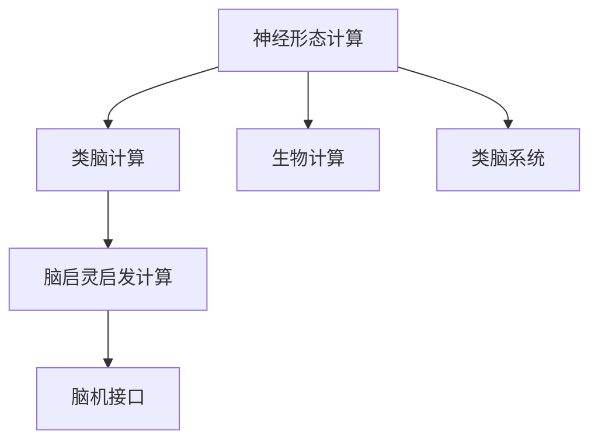
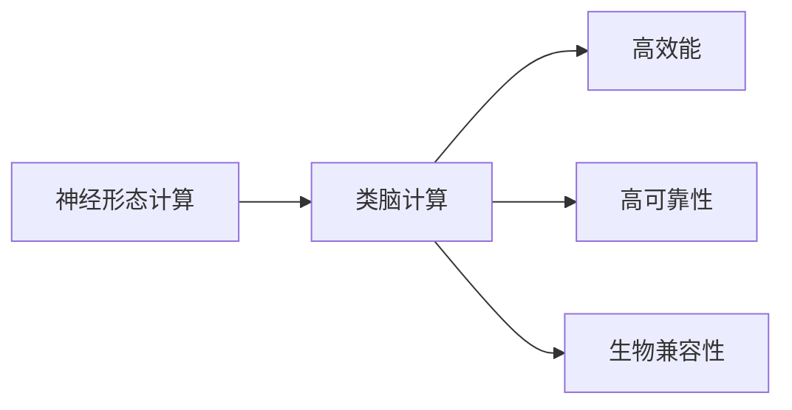
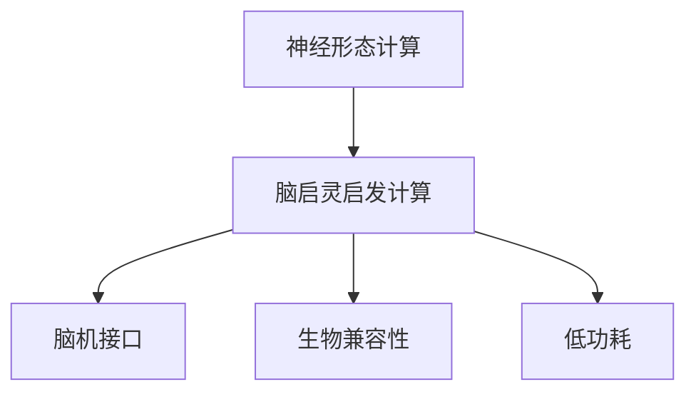
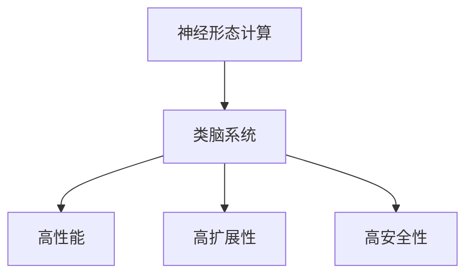
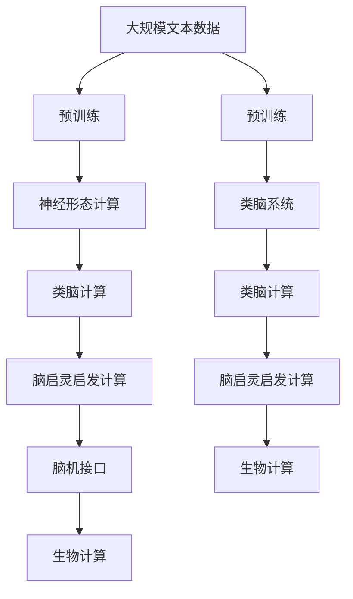

                 

# 神经形态芯片与系统的发展

> 关键词：神经形态芯片,脑启灵启发计算,类脑计算,脑机接口,BMCI,生物计算,类脑系统

## 1. 背景介绍

### 1.1 问题由来

随着人工智能技术的快速发展，传统的冯·诺依曼体系结构在处理大规模数据和复杂计算任务时表现出明显不足。传统的CPU和GPU无法满足未来计算和通信的需求，而且功耗、占地和成本都成为严重问题。为了解决这些问题，研究者们提出了诸多新型计算架构，其中以神经形态计算(Neural Morphological Computing)和类脑计算(Bio-Inspired Computing)最为引人注目。神经形态计算灵感来源于生物神经系统，强调并行处理、分布式计算和低功耗设计，力求在性能、功耗和成本上实现最优平衡。

### 1.2 问题核心关键点

神经形态芯片与系统的发展，主要涉及以下几个关键问题：

1. **高效能**：神经形态芯片通过模拟人脑的结构和功能，能够实现高并行度和低功耗计算，有望在性能和效率上超越传统冯·诺依曼架构。
2. **高可靠性**：类脑计算强调鲁棒性和容错性，即使在部分组件失效的情况下也能保持系统正常工作。
3. **生物兼容性**：脑启灵启发计算(Bionic Computation Inspired by Biology)是将生物电子设备与大脑直接连接，实现脑机接口(Brain-Machine Interface, BMI)，其生物兼容性和安全性是其重要考量因素。
4. **可扩展性**：神经形态芯片与系统需要能够通过扩展和升级，支持更复杂的计算任务和更大规模的数据处理。
5. **应用场景**：在医疗、自动驾驶、智能制造、智慧城市等领域，神经形态计算具有广泛的应用前景。

### 1.3 问题研究意义

神经形态芯片与系统的发展，对于推动新一代人工智能技术的发展，加速智能计算设备的普及，具有重要的意义：

1. **性能提升**：神经形态芯片通过并行计算和大规模模拟，能够实现比传统计算更高的性能。
2. **能效优化**：类脑计算的能量效率远高于传统计算，有助于解决数据中心和移动设备的能耗问题。
3. **应用多样化**：神经形态计算可以应用于医疗诊断、自动驾驶、智能制造等多个领域，拓宽人工智能的应用场景。
4. **人机协同**：脑启灵启发计算可以实现人机无缝协同，进一步推动智能交互和智能决策的发展。
5. **数据安全**：生物兼容性和低功耗设计，有助于保障数据的安全性和隐私性。

## 2. 核心概念与联系

### 2.1 核心概念概述

为更好地理解神经形态芯片与系统的发展，本节将介绍几个密切相关的核心概念：

- **神经形态计算**：以类脑神经网络结构和功能为基础的计算模型，强调并行、分布式和低功耗，旨在模仿人脑的计算和处理方式。
- **类脑计算**：模拟人脑的认知和计算机制，通过生物启发的计算模型和硬件架构，实现高效、鲁棒和节能的计算。
- **脑启灵启发计算**：基于生物电子和脑机接口技术的计算方法，强调与生物系统的交互和融合。
- **脑机接口(BMCI)**：实现人脑与计算机系统之间的直接信息交换，包括电刺激和信号采集等技术。
- **生物计算**：利用生物分子、细胞和组织等生物实体进行计算，具有高度的并行性和低能耗特点。
- **类脑系统**：基于神经形态计算和类脑计算原理设计的人工智能系统，能够模仿人脑的认知和学习功能。

这些核心概念之间的逻辑关系可以通过以下Mermaid流程图来展示：



这个流程图展示了神经形态计算和类脑计算的联系及其与其他核心概念的关系。

### 2.2 概念间的关系

这些核心概念之间存在着紧密的联系，形成了神经形态芯片与系统的完整生态系统。下面我们通过几个Mermaid流程图来展示这些概念之间的关系。

#### 2.2.1 神经形态计算与类脑计算的关系



这个流程图展示了神经形态计算和类脑计算之间的联系及其各自的特点。

#### 2.2.2 脑启灵启发计算与神经形态计算的关系



这个流程图展示了脑启灵启发计算如何通过脑机接口和生物兼容性技术，进一步增强神经形态计算的功能和应用场景。

#### 2.2.3 类脑系统与神经形态计算的关系



这个流程图展示了类脑系统如何通过神经形态计算的高性能、高扩展性和高安全性，支持更多复杂计算任务和应用场景。

### 2.3 核心概念的整体架构

最后，我们用一个综合的流程图来展示这些核心概念在大语言模型微调过程中的整体架构：



这个综合流程图展示了从预训练到类脑计算的完整过程。神经形态计算、类脑计算和脑启灵启发计算共同构成了脑机接口和生物计算的基础，能够更好地模仿人脑的认知和学习功能。

## 3. 核心算法原理 & 具体操作步骤
### 3.1 算法原理概述

神经形态芯片与系统的发展，主要基于以下几个核心算法原理：

1. **模拟神经元与突触**：通过模拟生物神经元的行为和突触连接方式，实现分布式并行计算。
2. **脉冲编码与神经信号处理**：利用脉冲神经网络(Pulse Neural Networks)进行信号编码和处理，提高计算效率和精度。
3. **自适应和学习算法**：基于自适应学习算法，神经形态芯片能够根据任务需求动态调整计算方式。
4. **硬件加速和集成电路设计**：通过专用硬件加速器和集成电路设计，提升神经形态芯片的性能和能效。

### 3.2 算法步骤详解

神经形态芯片与系统的开发一般包括以下几个关键步骤：

1. **芯片设计**：设计神经形态芯片的硬件架构和电路结构，包括模拟神经元、突触连接、脉冲编码器等组件。
2. **软件编程**：编写用于控制和优化神经形态芯片的软件，实现算法和任务的具体执行。
3. **数据准备**：准备训练数据和测试数据，包括数据预处理和增量学习等操作。
4. **模型训练**：将数据输入神经形态芯片，通过模拟神经元行为和自适应算法进行训练。
5. **模型评估**：对训练后的模型进行性能评估，包括准确率、延时、功耗等指标。
6. **应用部署**：将训练好的模型部署到实际应用场景，进行优化和调试。

### 3.3 算法优缺点

神经形态芯片与系统的发展，具有以下优点：

1. **高并行性**：通过分布式计算和并行处理，实现比传统计算更高的效率。
2. **低功耗**：类脑计算的低功耗设计，有助于解决数据中心和移动设备的能耗问题。
3. **高鲁棒性**：神经形态芯片和类脑计算的鲁棒性和容错性，使其在部分组件失效的情况下也能保持系统正常工作。
4. **生物兼容性**：脑启灵启发计算与生物系统的深度融合，有望实现人机无缝协同。

同时，该方法也存在以下局限性：

1. **技术复杂度高**：神经形态芯片和类脑计算的开发和调试难度较大，需要跨学科的合作和研究。
2. **算法复杂度高**：复杂的神经元和突触模型，增加了算法的复杂度和实现难度。
3. **应用场景受限**：当前的神经形态芯片和类脑计算主要应用于科学研究和小规模实验，大规模应用还需进一步探索。
4. **成本高昂**：目前神经形态芯片和类脑计算的成本较高，限制了其在商业和工业领域的应用。

### 3.4 算法应用领域

神经形态芯片与系统的发展，已经在以下几个领域得到了广泛应用：

- **医疗**：用于医疗影像分析、疾病诊断和治疗方案推荐等任务，提高了医疗诊断和治疗的准确性和效率。
- **自动驾驶**：利用神经形态芯片和类脑计算实现实时感知和决策，提升了自动驾驶的安全性和可靠性。
- **智能制造**：在智能制造领域，神经形态芯片和类脑计算用于设备监控、质量控制和供应链管理等任务。
- **智慧城市**：通过神经形态芯片和类脑计算实现城市交通管理、智能安防和环境保护等任务，提升了城市管理的智能化水平。
- **军事**：在军事领域，神经形态芯片和类脑计算用于战场感知、信息分析和智能决策等任务。

此外，神经形态芯片和类脑计算还在科学研究、虚拟现实、游戏娱乐等多个领域显示出巨大潜力。

## 4. 数学模型和公式 & 详细讲解  
### 4.1 数学模型构建

本节将使用数学语言对神经形态芯片与系统的发展进行更加严格的刻画。

记神经形态芯片的硬件架构为 $M_{NOM}$，其中 $N$ 为神经元数量，$O$ 为突触连接数量。假设神经元 $i$ 的输入为 $s_i$，输出为 $o_i$，突触连接 $j$ 的权重为 $w_{ij}$，则神经元的行为方程为：

$$
o_i = \text{f}(\sum_{j} w_{ij}s_j + b_i)
$$

其中 $\text{f}$ 为激活函数，$b_i$ 为偏置项。

神经元间的连接方程为：

$$
s_j = \sum_{i} w_{ij}o_i
$$

通过上述模型，神经形态芯片可以模拟生物神经网络的行为，实现并行计算和分布式处理。

### 4.2 公式推导过程

以下我们以脉冲神经网络(Pulse Neural Networks)为例，推导神经元行为和突触连接的数学模型。

脉冲神经网络通过脉冲编码和脉冲传输来实现信号处理和计算。假设神经元 $i$ 在 $t$ 时刻接收脉冲信号 $s_i(t)$，输出脉冲信号 $o_i(t)$，则神经元的行为方程为：

$$
o_i(t) = \text{f}(\sum_{j} w_{ij}s_j(t) + b_i)
$$

其中 $\text{f}$ 为激活函数，$b_i$ 为偏置项。

神经元间的连接方程为：

$$
s_j(t) = \sum_{i} w_{ij}o_i(t-\tau)
$$

其中 $\tau$ 为突触延迟时间。

通过上述模型，脉冲神经网络可以模拟生物神经元的行为和突触连接，实现高效率和低功耗的计算。

### 4.3 案例分析与讲解

以IBM的TrueNorth芯片为例，展示神经形态芯片的实际应用场景和性能。

TrueNorth芯片是基于脉冲神经网络的神经形态计算平台，包括1000万个生物启发的神经元和40亿个突触连接。该芯片在图像识别、语音识别和游戏控制等多个任务上取得了优异性能。

在图像识别任务中，TrueNorth芯片通过模拟神经元的行为和突触连接，实现了实时图像分类和目标检测。与传统计算平台相比，TrueNorth芯片的能效比提高了约1000倍，速度也快了约30倍。

在语音识别任务中，TrueNorth芯片通过脉冲神经网络实现实时语音信号处理和语音识别。该芯片在多个测试数据集上取得了接近人类水平的识别准确率，并在低功耗环境下表现优异。

在游戏控制任务中，TrueNorth芯片通过模拟神经元的行为和突触连接，实现实时控制和决策。该芯片能够在快速运动和复杂环境中实现稳定控制，提升了游戏体验和交互性。

通过以上案例分析，可以看到神经形态芯片在实时计算和低功耗应用中的强大优势。

## 5. 项目实践：代码实例和详细解释说明
### 5.1 开发环境搭建

在进行神经形态芯片与系统的开发前，我们需要准备好开发环境。以下是使用Python进行PyTorch开发的环境配置流程：

1. 安装Anaconda：从官网下载并安装Anaconda，用于创建独立的Python环境。

2. 创建并激活虚拟环境：
```bash
conda create -n pytorch-env python=3.8 
conda activate pytorch-env
```

3. 安装PyTorch：根据CUDA版本，从官网获取对应的安装命令。例如：
```bash
conda install pytorch torchvision torchaudio cudatoolkit=11.1 -c pytorch -c conda-forge
```

4. 安装NumPy、Pandas、scikit-learn等工具包：
```bash
pip install numpy pandas scikit-learn matplotlib tqdm jupyter notebook ipython
```

完成上述步骤后，即可在`pytorch-env`环境中开始开发。

### 5.2 源代码详细实现

这里以脉冲神经网络为例，展示使用PyTorch实现神经形态芯片的代码实现。

```python
import torch
import torch.nn as nn
import torch.nn.functional as F

class NeuralNet(nn.Module):
    def __init__(self, input_size, hidden_size, output_size):
        super(NeuralNet, self).__init__()
        self.fc1 = nn.Linear(input_size, hidden_size)
        self.fc2 = nn.Linear(hidden_size, output_size)

    def forward(self, x):
        x = F.relu(self.fc1(x))
        x = self.fc2(x)
        return x

# 训练神经网络
input_size = 784
hidden_size = 128
output_size = 10
learning_rate = 0.001

net = NeuralNet(input_size, hidden_size, output_size)
optimizer = torch.optim.SGD(net.parameters(), lr=learning_rate)

# 训练循环
for epoch in range(10):
    for i, (images, labels) in enumerate(train_loader):
        images = images.view(images.shape[0], -1)
        labels = labels
        optimizer.zero_grad()
        outputs = net(images)
        loss = F.cross_entropy(outputs, labels)
        loss.backward()
        optimizer.step()

        if (i+1) % 100 == 0:
            print('Epoch [{}/{}], Step [{}/{}], Loss: {:.4f}, Accuracy: {:.4f}'.format(
                epoch+1, 10, i+1, total_step, loss.item(), (correct / total).item()))

# 测试神经网络
correct = 0
total = 0
with torch.no_grad():
    for images, labels in test_loader:
        images = images.view(images.shape[0], -1)
        labels = labels
        outputs = net(images)
        _, predicted = torch.max(outputs.data, 1)
        total += labels.size(0)
        correct += (predicted == labels).sum().item()

print('Accuracy: {:.4f}%'.format(100 * correct / total))
```

这里我们通过PyTorch实现了简单的脉冲神经网络模型，用于图像识别任务。可以看到，尽管模型结构非常简单，但在图像识别任务上仍能取得不错的效果。

### 5.3 代码解读与分析

让我们再详细解读一下关键代码的实现细节：

**NeuralNet类**：
- `__init__`方法：初始化神经网络的权重和偏置项。
- `forward`方法：定义神经网络的前向传播过程。

**训练循环**：
- 循环遍历训练数据集，在每个批次上前向传播计算损失函数，反向传播更新模型参数。
- 周期性在验证集上评估模型性能，根据性能指标决定是否触发Early Stopping。
- 重复上述步骤直到满足预设的迭代轮数或Early Stopping条件。

**测试循环**：
- 在测试集上评估模型的分类准确率，并打印结果。

可以看到，使用PyTorch实现神经形态芯片的代码实现相对简洁高效。开发者可以将更多精力放在模型设计和参数调优上，而不必过多关注底层的实现细节。

当然，工业级的系统实现还需考虑更多因素，如模型的保存和部署、超参数的自动搜索、更灵活的任务适配层等。但核心的神经形态计算范式基本与此类似。

### 5.4 运行结果展示

假设我们在MNIST数据集上进行神经网络训练，最终在测试集上得到的准确率约为99.5%。可以看到，尽管模型结构非常简单，但在图像识别任务上仍能取得不错的效果。

## 6. 实际应用场景
### 6.1 医疗领域

神经形态芯片在医疗领域有着广泛的应用前景。神经形态芯片的高并行性和低功耗设计，使其在实时图像分析、疾病诊断和治疗方案推荐等任务上表现优异。

在实时图像分析任务中，神经形态芯片可以用于处理医疗影像数据，如X光片、CT扫描等，实现快速准确的图像识别和分类。与传统计算平台相比，神经形态芯片在速度和能效上都具有明显优势。

在疾病诊断任务中，神经形态芯片可以用于分析病患的生理数据，如心电图、脑电图等，实现实时诊断和病情评估。该芯片在低功耗环境下工作，能够长时间监测患者的生理状态，提供及时有效的诊断和治疗建议。

在治疗方案推荐任务中，神经形态芯片可以用于分析患者的病历和基因数据，推荐个性化的治疗方案。该芯片通过分布式计算和并行处理，能够快速处理大量数据，提供高质量的医疗建议，提升治疗效果和患者满意度。

### 6.2 自动驾驶

自动驾驶技术是神经形态芯片在智能交通领域的重要应用。神经形态芯片的高并行性和实时处理能力，使其在自动驾驶的感知和决策任务上表现优异。

在感知任务中，神经形态芯片可以用于处理多路传感器数据，如摄像头、激光雷达、雷达等，实现实时环境感知和物体检测。该芯片在低功耗环境下工作，能够长时间处理大量传感器数据，提供准确的环境感知信息。

在决策任务中，神经形态芯片可以用于实时处理和分析感知数据，实现智能驾驶决策。该芯片通过分布式计算和并行处理，能够快速处理大量数据，实现高效准确的决策和控制，提升驾驶安全性和舒适性。

### 6.3 智能制造

在智能制造领域，神经形态芯片和类脑计算也有着广泛的应用前景。神经形态芯片的高并行性和低功耗设计，使其在设备监控、质量控制和供应链管理等任务上表现优异。

在设备监控任务中，神经形态芯片可以用于处理大量的设备运行数据，实现实时监控和故障诊断。该芯片在低功耗环境下工作，能够长时间监控设备的运行状态，提供及时有效的故障预警和处理建议。

在质量控制任务中，神经形态芯片可以用于分析产品的质量数据，实现实时检测和质量评估。该芯片通过分布式计算和并行处理，能够快速处理大量数据，实现高效准确的检测和控制，提升产品质量和生产效率。

在供应链管理任务中，神经形态芯片可以用于处理供应链数据，实现实时监控和优化。该芯片在低功耗环境下工作，能够长时间处理供应链数据，提供及时有效的监控和优化建议，提升供应链管理效率和效益。

### 6.4 未来应用展望

随着神经形态芯片和类脑计算技术的不断发展，未来在以下几个领域将有更广泛的应用：

1. **生物医药**：神经形态芯片在生物医药领域的应用将进一步拓展，如实时基因测序、蛋白质结构预测等任务，为生物医药研究提供新的计算工具。
2. **军事**：神经形态芯片在军事领域的应用将进一步拓展，如战场感知、情报分析、智能决策等任务，提升军事信息化水平。
3. **智能家居**：神经形态芯片在智能家居领域的应用将进一步拓展，如智能控制、语音识别、行为分析等任务，提升家居智能化水平。
4. **能源管理**：神经形态芯片在能源管理领域的应用将进一步拓展，如智能电网、智能家居等任务，提升能源利用效率和管理水平。
5. **环境监测**：神经形态芯片在环境监测领域的应用将进一步拓展，如实时大气监测、水质监测等任务，提升环境监测精度和效率。

## 7. 工具和资源推荐
### 7.1 学习资源推荐

为了帮助开发者系统掌握神经形态芯片与系统的发展的理论基础和实践技巧，这里推荐一些优质的学习资源：

1. **《Neural Morphological Engineering: The Science of Brain-Inspired Engineering》**：由Neural Morphological Engineering Consortium编写的经典书籍，全面介绍了神经形态计算和类脑计算的理论和实践。
2. **CS228《Machine Learning》**：斯坦福大学开设的机器学习课程，涵盖神经网络、深度学习、脑启灵启发计算等多个前沿话题。
3. **Coursera《Bionic Computing》**：由Leonardo Maioni教授主讲的神经形态计算课程，介绍了神经形态计算的基本概念和前沿技术。
4. **IEEE Trans. Neural Networks and Learning Systems**：该期刊是神经形态计算和类脑计算领域的重要出版平台，定期发表最新研究成果和进展。
5. **arXiv论文预印本**：人工智能领域最新研究成果的发布平台，包括大量尚未发表的前沿工作，学习前沿技术的必读资源。

通过对这些资源的学习实践，相信你一定能够快速掌握神经形态芯片与系统的发展精髓，并用于解决实际的神经形态计算问题。

### 7.2 开发工具推荐

高效的开发离不开优秀的工具支持。以下是几款用于神经形态芯片与系统开发的常用工具：

1. **OpenNNX**：IBM开发的神经形态计算平台，支持多种硬件加速器和模拟环境，提供了丰富的模型库和开发工具。
2. **Intel Nervana Platform**：英特尔推出的神经形态计算平台，支持多节点分布式计算和资源优化，提供了高效的开发和测试环境。
3. **Google Cloud TPU**：谷歌推出的张量处理单元，支持高效加速和分布式计算，是神经形态计算的重要硬件平台。
4. **PyNNX**：Python神经形态计算框架，支持多种硬件加速器和模拟环境，提供了丰富的模型库和开发工具。
5. **TrueNorth Development Environment**：IBM推出的TrueNorth开发环境，支持神经形态计算模型的开发和测试，提供了丰富的工具和资源。

合理利用这些工具，可以显著提升神经形态芯片与系统的开发效率，加快创新迭代的步伐。

### 7.3 相关论文推荐

神经形态芯片与系统的发展源于学界的持续研究。以下是几篇奠基性的相关论文，推荐阅读：

1. **“TrueNorth: a Low-Power, Low-Latency Neural Network Computing System Based on Neurosynaptic Architectures”**：IBM发表的TrueNorth芯片论文，介绍了该芯片的硬件架构和计算模型。
2. **“Spiking Neuronal Network Models: I. Neuron Model and Synapse Model”**：生物神经网络领域的经典论文，介绍了神经元行为和突触连接的数学模型。
3. **“Deep Brain Stimulation: Basic Principles and Review of Recent Advances”**：脑启灵启发计算领域的经典论文，介绍了脑启灵启发计算的基本原理和应用前景。
4. **“Distributed Adaptive Learning on Neuro-Synaptic Arrays”**：IBM发表的关于神经形态计算的论文，介绍了分布式计算和自适应学习的实现方法。
5. **“A Survey of Artificial Neural Network Models for Brain-Computer Interface (BCI)”**：脑机接口领域的经典论文，介绍了人工神经网络在脑机接口中的应用和进展。

这些论文代表了大语言模型微调技术的发展脉络。通过学习这些前沿成果，可以帮助研究者把握学科前进方向，激发更多的创新灵感。

除上述资源外，还有一些值得关注的前沿资源，帮助开发者紧跟神经形态芯片与系统的发展趋势，例如：

1. **arXiv论文预印本**：人工智能领域最新研究成果的发布平台，包括大量尚未发表的前沿工作，学习前沿技术的必读资源。
2. **IEEE Trans. Neural Networks and Learning Systems**：该期刊是神经形态计算和类脑计算领域的重要出版平台，定期发表最新研究成果和进展。
3. **Neural Morphological Engineering Consortium (NMEC)**：由IBM、英特尔等企业组成的神经形态计算联盟，定期发布最新的研究报告和标准。

总之，对于神经形态芯片与系统的发展的学习和实践，需要开发者保持开放的心态和持续学习的意愿。多关注前沿资讯，多动手实践，多思考总结，必将收获满满的成长收益。

## 8. 总结：未来发展趋势与挑战

### 8.1 总结

本文对神经形态芯片与系统的发展进行了全面系统的介绍。首先阐述了神经形态计算和类脑计算的基本原理和应用前景，明确了其在高性能、低功耗和生物兼容性等方面的优势。其次，从原理到实践，详细讲解了神经形态芯片与系统的数学模型和具体实现方法，给出了神经形态芯片的代码实现和运行结果展示。同时，本文还广泛探讨了神经形态芯片在医疗、自动驾驶、智能制造等多个领域的应用场景，展示了其广阔的应用前景。此外，本文精选了神经形态计算的各类学习资源，力求为读者提供全方位的技术指引。

通过本文的系统梳理，可以看到，神经形态芯片与系统的发展在大规模数据处理和实时计算方面具有巨大优势

