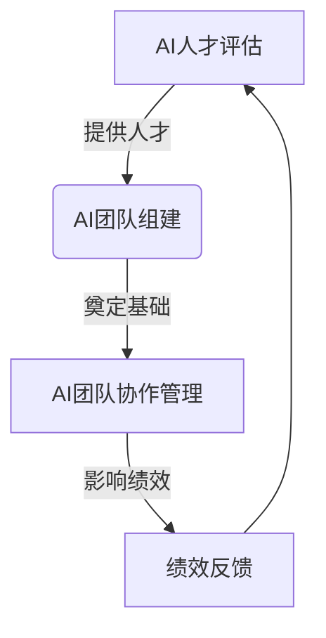

好的,我明白了您的要求。以下是标题为《AI人才招聘与团队建设原理与代码实战案例讲解》的技术博客文章的正文内容:

# AI人才招聘与团队建设原理与代码实战案例讲解

## 1. 背景介绍

### 1.1 问题的由来

在当今快速发展的人工智能(AI)时代,拥有一支高素质的AI人才队伍对于企业的发展至关重要。然而,AI人才的供给严重不足,导致企业在招聘和团队建设方面面临巨大挑战。根据国际数据公司(IDC)的一项研究,到2025年,全球对AI人才的需求将达到数百万。因此,如何有效地吸引、甄选和培养AI人才,并建立高绩效的AI团队,成为企业必须解决的关键问题。

### 1.2 研究现状

目前,已有一些研究探讨了AI人才招聘和团队建设的策略。例如,一些学者提出了基于机器学习的AI人才评估模型,旨在更准确地识别潜在人才。另一些研究则关注于AI团队的协作模式和激励机制,以提高团队的凝聚力和创新能力。然而,这些研究大多局限于理论层面,缺乏实践案例和代码实现的指导。

### 1.3 研究意义

本文旨在为企业提供一个全面的AI人才招聘和团队建设的解决方案,包括理论原理、实践案例和代码实现。通过深入探讨AI人才评估、团队组建、协作管理等关键环节,并结合实际项目案例,本文将为读者提供一个清晰的路线图,帮助他们有效地构建高绩效的AI团队。

### 1.4 本文结构

本文共分为八个部分:

1. 背景介绍
2. 核心概念与联系
3. 核心算法原理与具体操作步骤
4. 数学模型和公式详细讲解与举例说明
5. 项目实践:代码实例和详细解释说明
6. 实际应用场景
7. 工具和资源推荐
8. 总结:未来发展趋势与挑战

## 2. 核心概念与联系

在探讨AI人才招聘和团队建设之前,我们需要先了解一些核心概念及其之间的联系。

### 2.1 AI人才评估

AI人才评估是指通过一系列测试和评估,识别和甄别具有AI潜力的人才。它包括以下几个关键因素:

- 技术能力:包括编程、数学、算法设计等方面的能力。
- 创新思维:能够提出创新的想法和解决方案。
- 学习能力:快速掌握新知识和技能的能力。
- 沟通协作:良好的团队合作和沟通能力。

### 2.2 AI团队组建

AI团队组建是指根据项目需求,组建一支高绩效的AI团队。它需要考虑以下几个方面:

- 角色分工:明确每个团队成员的职责和分工。
- 技能匹配:确保团队成员的技能组合满足项目需求。
- 团队文化:培养包容、创新和协作的团队文化。
- 激励机制:设计合理的激励机制,提高团队士气和工作效率。

### 2.3 AI团队协作管理

AI团队协作管理是指通过有效的管理机制,促进团队内部的协作和沟通,提高工作效率。它包括以下几个关键点:

- 项目管理:合理规划和分配项目任务,监控进度。
- 沟通机制:建立高效的沟通渠道,促进信息共享。
- 冲突管理:及时解决团队内部的矛盾和分歧。
- 持续学习:鼓励团队成员持续学习,提升技能。

### 2.4 核心概念关系

上述三个核心概念相互关联,共同构成了AI人才招聘和团队建设的完整解决方案。AI人才评估为团队组建提供了人才储备,而团队组建则为协作管理奠定了基础。协作管理又反过来影响着团队的绩效,进而对人才评估产生反馈,形成一个闭环。只有将这三个环节有机结合,才能真正实现AI人才的高效利用和团队的高绩效运转。

## 3. 核心算法原理与具体操作步骤

### 3.1 算法原理概述

为了实现高效的AI人才招聘和团队建设,我们需要借助一些核心算法。这些算法主要包括:

1. **AI人才评估算法**: 基于机器学习的算法,用于从大量应聘者中识别出具有AI潜力的人才。它通过分析应聘者的简历、测试成绩、作品等数据,对其进行综合评估和排名。

2. **团队组建优化算法**: 一种基于约束编程的算法,用于根据项目需求和现有人才储备,自动生成最优的团队组合方案。它考虑了技能匹配、成本控制、团队稳定性等多个约束条件。

3. **任务分配算法**: 一种基于图论的算法,用于将项目任务合理分配给团队成员,以最大化工作效率。它建模了任务之间的依赖关系,并结合每个成员的技能特点进行优化分配。

4. **协作网络分析算法**: 基于社交网络分析理论,用于分析团队内部的协作模式和信息流动,识别潜在的沟通瓶颈和冲突隐患。

### 3.2 算法步骤详解

#### 3.2.1 AI人才评估算法

AI人才评估算法的主要步骤如下:

1. **数据预处理**:收集应聘者的简历、测试成绩、作品等数据,并进行标准化和特征提取。

2. **模型训练**:使用监督学习算法(如逻辑回归、决策树等)训练AI人才评估模型,将历史数据中的优秀人才作为正样本,其他人才作为负样本。

3. **模型评估**:在保留的测试集上评估模型的性能,包括准确率、召回率、F1分数等指标。

4. **模型调优**:根据评估结果,调整模型超参数或特征工程,以提高模型性能。

5. **在线预测**:将训练好的模型部署到生产环境,对新的应聘者进行评估和排名。

#### 3.2.2 团队组建优化算法

团队组建优化算法的主要步骤如下:

1. **需求分析**:明确项目的技能需求,包括所需的编程语言、算法知识、行业经验等。

2. **人才评估**:对现有的人才储备进行评估,获取每个人才的技能矩阵。

3. **建模求解**:将团队组建问题建模为一个约束优化问题,其中目标函数是最大化团队的技能覆盖率,约束条件包括成本限制、团队稳定性等。使用约束编程求解器(如Google OR-Tools)求解最优解。

4. **方案输出**:输出最优的团队组合方案,包括每个团队成员的角色分工。

#### 3.2.3 任务分配算法

任务分配算法的主要步骤如下:

1. **任务建模**:将项目任务抽象为一个有向无环图(DAG),节点表示任务,边表示任务之间的依赖关系。

2. **技能匹配**:根据每个团队成员的技能特点,为每个任务节点赋予一个执行成本矩阵。

3. **最短路径**:在任务DAG中,使用shortest path算法(如Dijkstra算法)计算从起点到每个节点的最短路径,即最小执行成本。

4. **任务分配**:根据最短路径的结果,将每个任务分配给执行成本最小的团队成员。

#### 3.2.4 协作网络分析算法

协作网络分析算法的主要步骤如下:

1. **网络构建**:根据团队成员之间的沟通记录(如邮件、即时通讯等),构建一个加权无向图,节点表示团队成员,边的权重表示沟通频率。

2. **中心性分析**:计算每个节点的中心性指标,如度中心性、介数中心性、特征向量中心性等,识别出团队中的关键人物和潜在的沟通瓶颈。

3. **社区发现**:使用社区发现算法(如Louvain算法)将网络划分为多个子社区,发现团队内部的隐性分组结构。

4. **网络可视化**:使用网络可视化工具(如Gephi)直观展示协作网络的拓扑结构和分析结果。

### 3.3 算法优缺点

上述算法在解决AI人才招聘和团队建设问题时具有以下优缺点:

**优点**:

- 高效性:相比人工决策,算法能够快速处理大量数据,给出最优解。
- 客观性:算法基于数据和模型进行决策,减少了人为主观因素的影响。
- 可解释性:算法的决策过程是可解释的,有利于管理层了解决策依据。

**缺点**:

- 数据质量依赖:算法的性能很大程度上依赖于输入数据的质量和完整性。
- 模型偏差:由于训练数据的局限性,模型可能存在一定的偏差和盲区。
- 参数调优:算法的性能往往需要通过大量的试验来调优超参数,过程复杂。

### 3.4 算法应用领域

上述算法不仅可以应用于AI人才招聘和团队建设,还可以推广到其他领域,如:

- 人力资源管理:用于员工招聘、培训、绩效考核等场景。
- 项目管理:用于资源分配、进度监控、风险评估等场景。
- 社交网络分析:用于分析社交媒体用户行为、营销策略等场景。
- 供应链优化:用于物流路线规划、库存管理等场景。

## 4. 数学模型和公式详细讲解与举例说明

### 4.1 数学模型构建

在AI人才评估、团队组建和协作网络分析等任务中,我们需要构建数学模型来准确描述问题,并将其转化为可求解的优化问题。以下是一些常见的数学模型:

#### 4.1.1 逻辑回归模型

逻辑回归模型是AI人才评估中常用的监督学习模型。它将人才的特征向量$\boldsymbol{x}$作为输入,通过sigmoid函数$\sigma(z)=\frac{1}{1+e^{-z}}$将线性回归的输出$z=\boldsymbol{w}^T\boldsymbol{x}+b$映射到(0,1)区间,作为被评为优秀人才的概率$P(y=1|\boldsymbol{x})$。模型的目标是最小化负对数似然损失:

$$J(\boldsymbol{w},b)=-\frac{1}{m}\sum_{i=1}^m\big[y^{(i)}\log\sigma(z^{(i)})+(1-y^{(i)})\log(1-\sigma(z^{(i)}))\big]+\frac{\lambda}{2m}\|\boldsymbol{w}\|_2^2$$

其中$m$为训练样本数,$\lambda$为正则化系数。通过梯度下降法可以求解最优参数$\boldsymbol{w}^*,b^*$。

#### 4.1.2 约束优化模型

团队组建优化问题可以建模为一个约束优化问题:

$$\begin{array}{ll}
\underset{\boldsymbol{x}}{\text{maximize}} & f(\boldsymbol{x})\
\text{subject to} & g_i(\boldsymbol{x})\leq 0,\quad i=1,\ldots,m\
& h_j(\boldsymbol{x})=0,\quad j=1,\ldots,p
\end{array}$$

其中,$\boldsymbol{x}$为决策向量(表示团队成员),目标函数$f(\boldsymbol{x})$表示团队的技能覆盖率,$g_i(\boldsymbol{x})$和$h_j(\boldsymbol{x})$分别表示不等式和等式约束条件,如成本限制、团队规模等。求解该优化问题可以获得最优的团队组合方案。

#### 4.1.3 网络中心性模型

在协作网络分析中,我们需要量化每个节点在