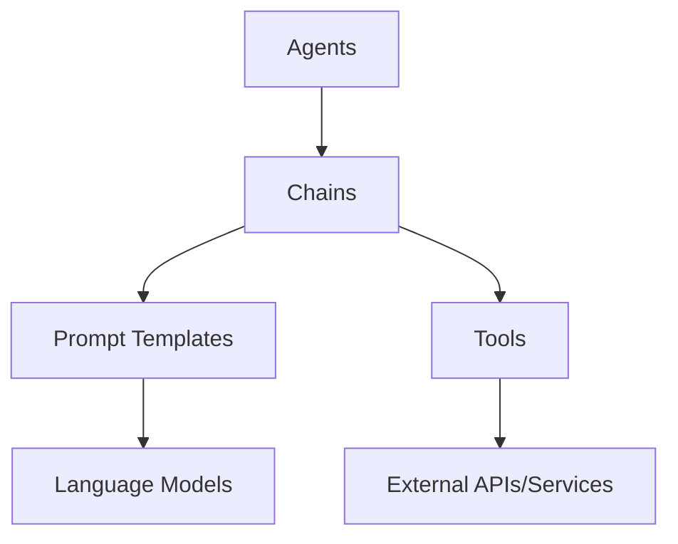
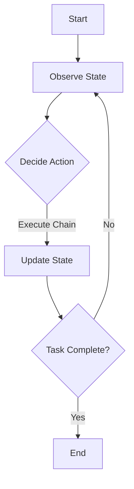

# 【LangChain编程：从入门到实践】LCEL高级特性

## 1. 背景介绍

### 1.1 问题的由来

在当今快速发展的人工智能领域中,构建智能应用程序变得越来越复杂。开发人员需要集成各种不同的语言模型、知识库和外部API,以实现强大的功能。然而,将这些不同的组件无缝集成在一起并非易事,常常需要大量的样板代码和复杂的逻辑。这就催生了对更高级别的抽象和框架的需求,以简化智能应用程序的开发过程。

### 1.2 研究现状

LangChain是一个新兴的Python库,旨在解决上述挑战。它提供了一种统一的方式来构建基于大语言模型的应用程序,并与各种外部数据源和服务进行集成。LangChain的核心思想是将复杂的任务分解为一系列较小的"链"(Chains),每个链负责处理特定的子任务。这种模块化设计使得开发人员可以轻松地组合和扩展不同的组件,从而构建出功能强大的智能应用程序。

### 1.3 研究意义

LangChain的出现为人工智能应用程序的开发带来了全新的范式。它提供了一种抽象层,使开发人员能够专注于应用程序的逻辑,而不必过多关注底层的实现细节。这不仅提高了开发效率,还促进了代码的可重用性和可维护性。此外,LangChain还支持多种语言模型和知识库,使得开发人员可以灵活地选择最适合他们需求的组件。

### 1.4 本文结构

本文将深入探讨LangChain的高级特性,包括其核心概念、算法原理、数学模型和公式推导、项目实践、实际应用场景、工具和资源推荐,以及未来发展趋势和挑战。我们将通过详细的代码示例和案例分析,帮助读者全面掌握LangChain的使用方法和最佳实践。

## 2. 核心概念与联系

LangChain的核心概念包括代理(Agents)、链(Chains)、提示模板(Prompt Templates)和工具(Tools)。这些概念相互关联,共同构建了LangChain的整体架构。

- **代理(Agents)**: 代理是LangChain中最高级别的抽象,负责协调和管理整个任务的执行。它可以根据当前的上下文和状态,决定调用哪些链来完成特定的子任务。
- **链(Chains)**: 链是LangChain的核心组件,用于封装特定的任务逻辑。每个链可以包含一个或多个提示模板和工具,并根据需要调用它们来完成任务。
- **提示模板(Prompt Templates)**: 提示模板定义了如何将输入数据格式化为语言模型可以理解的提示。它们可以包含静态文本和动态占位符,以便在运行时插入实际的数据。
- **工具(Tools)**: 工具是LangChain与外部数据源和服务进行交互的接口。它们可以是API调用、数据库查询或任何其他可执行的函数。

这些核心概念相互协作,使LangChain能够构建出复杂的智能应用程序。代理负责协调整个任务的执行,而链则封装了特定的任务逻辑。链可以利用提示模板将输入数据转换为语言模型可以理解的格式,并调用工具与外部服务进行交互。

## 3. 核心算法原理 & 具体操作步骤

### 3.1 算法原理概述

LangChain的核心算法原理是基于**序列决策过程**(**Sequential Decision Process**, SDP)。SDP是一种用于解决复杂任务的通用框架,它将任务分解为一系列较小的决策步骤。在每个决策步骤中,代理需要根据当前的状态和上下文,选择执行哪个操作(即调用哪个链)。

LangChain中的SDP算法可以概括为以下步骤:

1. **初始化**: 代理接收初始输入和任务描述。
2. **观察**: 代理观察当前的状态和上下文信息。
3. **决策**: 代理根据当前状态和上下文,决定调用哪个链来执行下一步操作。
4. **执行**: 代理执行选定的链,可能会产生新的输出和状态更新。
5. **终止条件检查**: 代理检查任务是否已经完成。如果任务完成,则算法终止;否则,返回步骤2,重复决策和执行过程。

这种序列决策过程使LangChain能够灵活地处理各种复杂的任务,并根据当前的状态和上下文做出最佳决策。

### 3.2 算法步骤详解

让我们更深入地探讨LangChain中SDP算法的具体实现步骤:

1. **初始化**:
   - 代理接收初始输入和任务描述,例如用户的查询或指令。
   - 代理可以选择性地初始化一些初始状态,如加载相关的知识库或上下文信息。

2. **观察**:
   - 代理观察当前的状态,包括输入数据、任务描述、已执行的操作序列以及任何其他相关上下文信息。
   - 代理可以利用提示模板将当前状态转换为语言模型可以理解的格式。

3. **决策**:
   - 代理根据当前状态和上下文,决定调用哪个链来执行下一步操作。
   - 这个决策过程可以利用语言模型的输出,或者使用其他决策策略,如规则引擎或启发式搜索。

4. **执行**:
   - 代理执行选定的链,该链可能包含多个步骤,如调用外部API、查询知识库或进行中间计算。
   - 链的执行可能会产生新的输出和状态更新,如查询结果或任务进度。

5. **终止条件检查**:
   - 代理检查任务是否已经完成,例如根据输出是否满足任务要求或达到预定义的终止条件。
   - 如果任务完成,则算法终止并返回最终结果。
   - 如果任务尚未完成,则返回步骤2,重复观察、决策和执行过程。

通过这种迭代的序列决策过程,LangChain能够逐步地完成复杂的任务,同时保持了良好的灵活性和可扩展性。

### 3.3 算法优缺点

LangChain的SDP算法具有以下优点:

- **模块化设计**: 将复杂任务分解为多个链,每个链负责特定的子任务,提高了代码的可重用性和可维护性。
- **灵活性**: 代理可以根据当前状态和上下文动态决定执行哪个链,使算法能够适应不同的场景和需求。
- **可扩展性**: 通过添加新的链、提示模板和工具,可以轻松扩展算法的功能,满足更复杂的需求。
- **与语言模型集成**: 算法可以利用语言模型的强大能力,如自然语言理解和生成,提高任务执行的准确性和质量。

然而,LangChain的SDP算法也存在一些缺点和挑战:

- **决策策略**: 决定执行哪个链的决策策略可能会影响算法的性能和准确性,需要根据具体场景进行优化和调整。
- **状态管理**: 在复杂的任务中,有效地管理和传递状态信息可能会变得困难,需要合理的状态表示和传递机制。
- **终止条件**: 确定任务何时完成并满足终止条件可能会很棘手,尤其是在开放式任务或无明确终止条件的情况下。
- **性能开销**: 序列决策过程可能会引入一定的性能开销,特别是在需要频繁观察和决策的情况下。

### 3.4 算法应用领域

LangChain的SDP算法可以应用于各种领域,包括但不限于:

- **自然语言处理**: 构建智能对话系统、问答系统、文本摘要和分析等应用程序。
- **知识管理**: 整合多个知识源,实现智能知识检索、推理和决策支持系统。
- **任务自动化**: 自动化复杂的工作流程,如数据处理、报告生成和业务流程管理。
- **个人助理**: 开发智能个人助理,帮助用户完成各种日常任务,如日程安排、信息查找和简单决策。
- **教育和学习**: 构建智能教育系统,提供个性化的学习路径、练习和反馈。

总的来说,LangChain的SDP算法为构建各种智能应用程序提供了一种通用的框架和抽象,使开发人员能够更加专注于应用程序的逻辑,而不必过多关注底层的实现细节。

## 4. 数学模型和公式 & 详细讲解 & 举例说明

虽然LangChain主要是一个基于规则和启发式的框架,但它也可以与基于数学模型的方法相结合,以提高决策的准确性和效率。在这一节中,我们将探讨一些常见的数学模型及其在LangChain中的应用。

### 4.1 数学模型构建

在LangChain中,我们可以将决策过程建模为一个**马尔可夫决策过程**(**Markov Decision Process**, MDP)。MDP是一种用于描述序列决策问题的数学框架,它由以下几个要素组成:

- **状态集合 $\mathcal{S}$**: 表示系统可能处于的所有状态。
- **动作集合 $\mathcal{A}$**: 表示代理可以执行的所有动作或操作。
- **转移概率 $P(s' | s, a)$**: 表示在当前状态 $s$ 下执行动作 $a$ 后,系统转移到新状态 $s'$ 的概率。
- **奖励函数 $R(s, a, s')$**: 表示在当前状态 $s$ 下执行动作 $a$ 并转移到新状态 $s'$ 时获得的即时奖励。
- **折扣因子 $\gamma \in [0, 1)$**: 用于平衡即时奖励和长期累积奖励的权重。

在LangChain的上下文中,我们可以将:

- **状态 $s$** 定义为当前的输入、上下文和任务进度信息。
- **动作 $a$** 定义为选择执行哪个链。
- **转移概率 $P(s' | s, a)$** 表示执行某个链后,任务状态转移到新状态的概率。
- **奖励函数 $R(s, a, s')$** 可以根据任务完成度或其他指标来设计,以鼓励代理做出正确的决策。

通过建立这种数学模型,我们可以应用各种强化学习或动态规划算法来求解最优策略,即在给定状态下选择哪个动作可以最大化预期的长期累积奖励。

### 4.2 公式推导过程

让我们来推导一下如何计算在给定策略 $\pi$ 下的预期长期累积奖励,也称为**价值函数**(**Value Function**)。

首先,我们定义状态 $s$ 在策略 $\pi$ 下的**状态价值函数**(**State Value Function**) $V^\pi(s)$ 为:

$$V^\pi(s) = \mathbb{E}_\pi \left[ \sum_{t=0}^\infty \gamma^t R(s_t, a_t, s_{t+1}) \mid s_0 = s \right]$$

其中 $\mathbb{E}_\pi$ 表示在策略 $\pi$ 下的期望,序列 $(s_0, a_0, s_1, a_1, \dots)$ 表示从初始状态 $s_0 = s$ 开始,按照策略 $\pi$ 进行决策和状态转移的轨迹。

我们可以将状态价值函数进一步分解为:

$$V^\pi(s) = \sum_{a \in \mathcal{A}} \pi(a | s) \left( R(s, a) + \gamma \sum_{s' \in \mathcal{S}} P(s' | s, a) V^\pi(s') \right)$$

其中:

- $\pi(a | s)$ 表示在状态 $s$ 下选