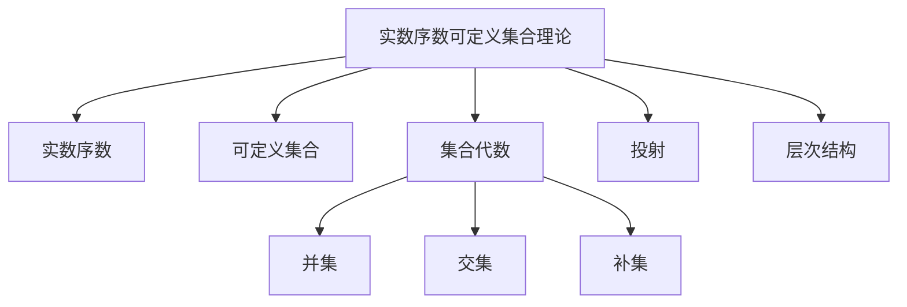

# 集合论导引：实数序数可定义集合

## 1. 背景介绍

### 1.1 问题的由来

集合论作为数学的一个基础分支,其研究对象是集合及其相关概念和运算。在现代数学中,集合论扮演着至关重要的角色,为各个数学分支提供了坚实的理论基础。然而,集合论本身也存在一些深层次的问题和悖论,其中最著名的就是"罗素悖论"。

罗素悖论暴露出了经典集合论的内在矛盾,这促使数学家们重新审视集合论的公理体系,并引发了对集合论公理化的探索。在这一背景下,实数序数可定义集合(Definable Sets of Real Numbers)的概念应运而生,旨在建立一种更加严谨和一致的集合论框架。

### 1.2 研究现状

实数序数可定义集合理论是20世纪初由波兰数学家陶夫斯基(Alfred Tarski)和库拉托夫斯基(Kazimierz Kuratowski)共同提出的。它基于实数序数的概念,将集合论的研究对象限制在可由实数序数定义的集合范围内。这种方法避免了经典集合论中的悖论,并为集合论的公理化奠定了基础。

近年来,实数序数可定义集合理论在数学逻辑、模型论和计算机科学等领域得到了广泛的应用和发展。它不仅为集合论提供了坚实的理论基础,而且在计算机程序验证、形式化方法和人工智能等领域也发挥着重要作用。

### 1.3 研究意义

实数序数可定义集合理论具有重要的理论意义和应用价值:

1. **理论意义**:它为集合论提供了一种更加严谨和一致的公理体系,解决了经典集合论中存在的悖论问题,从而为数学奠定了坚实的基础。

2. **应用价值**:实数序数可定义集合理论在计算机程序验证、形式化方法和人工智能等领域具有广泛的应用前景,有助于提高计算机系统的可靠性和智能化水平。

3. **interdisciplinary交叉学科**:实数序数可定义集合理论融合了数学逻辑、模型论和计算机科学等多个学科的理论和方法,体现了现代科学的交叉性和综合性。

### 1.4 本文结构

本文将全面介绍实数序数可定义集合理论的核心概念、数学模型、算法原理和应用实践。文章结构安排如下:

1. 背景介绍
2. 核心概念与联系
3. 核心算法原理与具体操作步骤
4. 数学模型和公式详细讲解与举例说明
5. 项目实践:代码实例和详细解释说明
6. 实际应用场景
7. 工具和资源推荐
8. 总结:未来发展趋势与挑战
9. 附录:常见问题与解答

## 2. 核心概念与联系

实数序数可定义集合理论包含了以下几个核心概念:

1. **实数序数(Real Number Ordinals)**:实数序数是一种特殊的序数,用于表示实数集中元素的"大小"关系。它们构成了一个良序集,即任何非空子集都有最小元素。

2. **可定义集合(Definable Sets)**:可定义集合是指可以通过一定的逻辑公式或算法在实数序数集合中定义和构造出来的集合。这些集合具有良好的闭包性质,并且避免了经典集合论中的悖论问题。

3. **集合代数(Set Algebra)**:集合代数定义了在可定义集合上进行的一系列代数运算,如并集、交集、补集等。这些运算保持了可定义集合的闭包性质。

4. **投射(Projection)**:投射是一种将高维可定义集合映射到低维空间的操作,它在实数序数可定义集合理论中扮演着重要角色。

5. **层次结构(Hierarchy)**:实数序数可定义集合理论建立了一种层次结构,将可定义集合按照其复杂程度分为不同的层级,从而形成了一个严格的包含关系。

这些核心概念相互关联、相互依赖,共同构成了实数序数可定义集合理论的理论框架。其中,实数序数和可定义集合是理论的基石,集合代数提供了操作可定义集合的工具,投射和层次结构则体现了理论的深度和严谨性。

## 3. 核心算法原理与具体操作步骤

### 3.1 算法原理概述

实数序数可定义集合理论的核心算法原理是基于实数序数和逻辑公式来定义和构造可定义集合。具体来说,算法的基本思路如下:

1. 首先,通过实数序数建立一个良序集作为基础集合。

2. 然后,使用一系列逻辑公式和集合运算,在基础集合上定义和构造出新的可定义集合。

3. 这些可定义集合具有良好的闭包性质,即通过一定的集合运算得到的新集合仍然是可定义集合。

4. 算法还引入了投射和层次结构等概念,以确保可定义集合的严谨性和一致性。

该算法的关键在于合理利用实数序数的良序性质,并通过逻辑公式和集合运算来定义和构造可定义集合。这种方法避免了经典集合论中的悖论问题,为集合论提供了一种更加严谨和一致的理论框架。

### 3.2 算法步骤详解

实数序数可定义集合构造算法的具体步骤如下:

1. **确定基础集合**:首先,选取实数序数集合作为基础集合,记为$\Omega$。实数序数集合是一个良序集,任何非空子集都有最小元素。

2. **定义原子公式**:使用一阶逻辑中的原子公式来描述实数序数集合中的元素及其关系。常用的原子公式包括:
   - $x \in A$:表示实数序数$x$属于集合$A$。
   - $x < y$:表示实数序数$x$小于$y$。

3. **构造复合公式**:通过使用逻辑连接词(如合取$\land$、析取$\lor$、否定$\neg$等)和量词(全称量词$\forall$、存在量词$\exists$),可以从原子公式构造出更复杂的复合公式。

4. **定义可定义集合**:利用构造出的复合公式,可以在基础集合$\Omega$上定义新的可定义集合。例如,公式$\varphi(x)$定义了集合$A = \{x \in \Omega | \varphi(x)\}$,即满足$\varphi(x)$的所有实数序数的集合。

5. **执行集合运算**:在已有的可定义集合上执行集合代数运算(如并集$\cup$、交集$\cap$、补集$\complement$等),可以得到新的可定义集合,这些新集合仍然具有可定义性质。

6. **投射操作**:将高维可定义集合投射到低维空间,得到新的低维可定义集合。投射操作保持了可定义集合的闭包性质。

7. **构建层次结构**:根据可定义集合的复杂程度,将它们分为不同的层级,形成一个严格的包含关系。较低层级的可定义集合包含在较高层级的可定义集合中。

8. **验证和优化**:对构造出的可定义集合进行验证,确保它们满足理论的要求;同时,也可以对算法进行优化,提高效率和可扩展性。

通过上述步骤,我们可以在实数序数集合的基础上,利用逻辑公式和集合运算,构造出各种可定义集合,并确保它们具有良好的闭包性质和一致性。

### 3.3 算法优缺点

实数序数可定义集合构造算法具有以下优缺点:

**优点**:

1. **避免悖论**:该算法避免了经典集合论中的悖论问题,为集合论提供了一种更加严谨和一致的理论框架。

2. **良好的闭包性质**:通过该算法构造出的可定义集合具有良好的闭包性质,即通过一定的集合运算得到的新集合仍然是可定义集合。

3. **严格的层次结构**:算法引入了层次结构的概念,将可定义集合按照复杂程度分为不同的层级,形成了一个严格的包含关系,确保了理论的严谨性和一致性。

4. **广泛的应用前景**:实数序数可定义集合理论在数学逻辑、模型论和计算机科学等领域具有广泛的应用前景,为相关领域的发展提供了坚实的理论基础。

**缺点**:

1. **复杂性**:该算法涉及到逻辑公式、集合运算和投射操作等多个步骤,算法的实现和理解相对复杂。

2. **局限性**:该算法只适用于实数序数集合,对于其他类型的集合(如复数集合、函数集合等),可能需要进行相应的扩展和修改。

3. **计算效率**:在处理大规模的可定义集合时,算法的计算效率可能会受到一定影响,需要进行优化和改进。

4. **理论深度**:实数序数可定义集合理论本身具有一定的理论深度,需要对数学逻辑、集合论和模型论等相关领域有较深入的理解。

总的来说,实数序数可定义集合构造算法为集合论提供了一种更加严谨和一致的理论框架,但同时也存在一定的复杂性和局限性。在实际应用中,需要根据具体情况权衡算法的优缺点,并进行必要的优化和扩展。

### 3.4 算法应用领域

实数序数可定义集合构造算法及其理论在以下领域具有广泛的应用前景:

1. **数学逻辑和模型论**:实数序数可定义集合理论为数学逻辑和模型论提供了坚实的理论基础,在这些领域中发挥着重要作用。

2. **计算机程序验证**:可定义集合理论可以用于形式化程序的语义,从而为程序的正确性验证提供理论支持。

3. **形式化方法**:实数序数可定义集合理论为形式化方法(如模型检验、定理证明等)提供了强有力的数学工具,有助于提高系统的可靠性和正确性。

4. **人工智能**:可定义集合理论在知识表示、推理和决策等人工智能领域具有潜在的应用价值。

5. **计算机algebra**:实数序数可定义集合理论为计算机代数提供了理论基础,可用于构建符号计算系统和代数系统。

6. **理论计算机科学**:可定义集合理论在计算复杂性理论、形式语言理论和自动机理论等理论计算机科学领域具有重要应用。

7. **数据挖掘和机器学习**:可定义集合理论可用于表示和处理复杂的数据集,为数据挖掘和机器学习算法提供理论支持。

8. **其他应用领域**:实数序数可定义集合理论还可能在拓扑学、几何学、物理学和经济学等其他学科领域发挥作用。

总的来说,实数序数可定义集合构造算法及其理论为多个学科领域提供了坚实的理论基础和有力的数学工具,具有广阔的应用前景和发展潜力。

## 4. 数学模型和公式详细讲解与举例说明

### 4.1 数学模型构建

实数序数可定义集合理论的数学模型建立在实数序数集合和一阶逻辑的基础之上。我们首先引入以下基本概念:

1. **实数序数集合**:设$\Omega$表示实数序数集合,它是一个良序集,即任何非空子集都有最小元素。

2. **一阶语言**:定义一阶语言$\mathcal{L} = \langle \Omega, <, \in \rangle$,其中$<$表示实数序数的strict小于关系,而$\in$