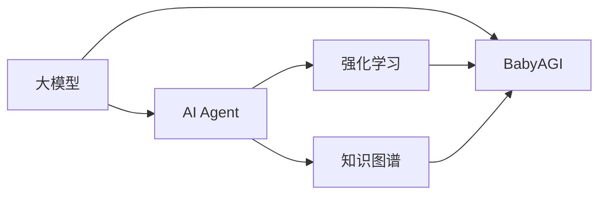

# 【大模型应用开发 动手做AI Agent】BabyAGI简介

> 关键词：大模型，人工智能，Agent，BabyAGI，应用开发，自然语言处理，机器学习

## 1. 背景介绍

### 1.1 问题的由来

随着人工智能技术的飞速发展，大模型在自然语言处理、计算机视觉、语音识别等领域取得了令人瞩目的成果。然而，如何将这些强大的技术应用于实际场景，构建具有自主意识和智能行为的AI Agent，成为了当前人工智能研究的热点问题。

### 1.2 研究现状

近年来，国内外许多研究机构和公司都在探索大模型在构建AI Agent领域的应用。其中，BabyAGI作为一种新兴的研究方向，备受关注。BabyAGI旨在通过将大模型与强化学习、知识图谱等技术相结合，构建具有自主意识和智能行为的AI Agent。

### 1.3 研究意义

研究BabyAGI具有重要的理论意义和实际应用价值：

1. **理论意义**：BabyAGI的研究有助于推动人工智能领域的发展，探索人工智能的极限，为构建更加智能、自主的AI Agent提供新的思路和方法。

2. **实际应用价值**：BabyAGI技术可以应用于智能客服、智能助手、智能机器人等领域，为人类生活带来便捷和高效。

### 1.4 本文结构

本文将详细介绍BabyAGI的核心概念、技术原理、应用场景以及未来发展趋势。内容安排如下：

- 第2部分：介绍BabyAGI的核心概念与联系。
- 第3部分：阐述BabyAGI的技术原理和具体操作步骤。
- 第4部分：分析BabyAGI的数学模型和公式，并结合案例进行讲解。
- 第5部分：给出BabyAGI的代码实例和详细解释说明。
- 第6部分：探讨BabyAGI的实际应用场景。
- 第7部分：推荐与BabyAGI相关的学习资源、开发工具和参考文献。
- 第8部分：总结BabyAGI的未来发展趋势与挑战。

## 2. 核心概念与联系

为更好地理解BabyAGI，本节将介绍几个密切相关的核心概念：

- **大模型**：指具有海量参数、强大计算能力的深度学习模型，如BERT、GPT等。
- **AI Agent**：指具有自主意识和智能行为的计算机程序，能够与环境进行交互并完成特定任务。
- **强化学习**：一种机器学习方法，通过与环境交互，不断学习和优化策略，以实现目标。
- **知识图谱**：一种以图结构存储和表示知识的技术，能够提供更加丰富的语义信息。
- **BabyAGI**：指基于大模型和强化学习技术构建的AI Agent。

它们的逻辑关系如下图所示：



可以看出，大模型是BabyAGI的底层技术支撑，强化学习和知识图谱则为其提供决策依据和知识增强。通过将大模型与这些技术相结合，我们可以构建具有自主意识和智能行为的AI Agent。

## 3. 核心算法原理 & 具体操作步骤

### 3.1 算法原理概述

BabyAGI的核心算法原理主要包括以下几部分：

1. **大模型**：使用预训练的大模型作为知识库和基础模型，为AI Agent提供强大的语言理解和计算能力。
2. **强化学习**：通过强化学习算法，使AI Agent能够根据环境反馈学习并优化其行为策略。
3. **知识图谱**：利用知识图谱提供丰富的语义信息，增强AI Agent对现实世界的理解和决策能力。

### 3.2 算法步骤详解

BabyAGI的构建步骤如下：

**Step 1：选择合适的预训练大模型**

根据任务需求，选择合适的预训练大模型，如BERT、GPT等。这些大模型通常在广泛的语料库上进行预训练，具备丰富的语言知识和语义理解能力。

**Step 2：构建知识图谱**

收集相关领域的知识，构建知识图谱。知识图谱可以以图结构存储实体、关系和属性，为AI Agent提供语义信息。

**Step 3：设计强化学习算法**

设计适合AI Agent的强化学习算法，如Q-Learning、Sarsa等。强化学习算法使AI Agent能够根据环境反馈学习并优化其行为策略。

**Step 4：训练BabyAGI**

将预训练的大模型和知识图谱与强化学习算法相结合，对BabyAGI进行训练。训练过程中，AI Agent将在虚拟环境中不断尝试和探索，学习适应不同场景的行为策略。

**Step 5：评估与优化**

在真实或模拟环境中评估BabyAGI的性能，并根据评估结果对模型进行调整和优化。

### 3.3 算法优缺点

**优点**：

1. **强大语言理解能力**：预训练的大模型为AI Agent提供了丰富的语言知识和语义理解能力。
2. **自主意识**：通过强化学习算法，AI Agent能够根据环境反馈自主学习和优化行为策略。
3. **知识增强**：知识图谱为AI Agent提供了丰富的语义信息，增强其理解和决策能力。

**缺点**：

1. **训练数据需求**：构建知识图谱和训练强化学习模型需要大量的标注数据。
2. **计算资源消耗**：BabyAGI的训练和推理过程需要大量的计算资源。
3. **可解释性不足**：强化学习算法的决策过程往往难以解释。

### 3.4 算法应用领域

BabyAGI技术可以应用于以下领域：

1. **智能客服**：为用户提供24/7的智能客服服务，自动解答常见问题。
2. **智能助手**：为用户提供个性化服务，如日程管理、信息查询等。
3. **智能机器人**：为家庭、办公场所提供自动化服务，如清洁、搬运等。
4. **自动驾驶**：为自动驾驶汽车提供决策支持，实现安全、高效的驾驶。

## 4. 数学模型和公式 & 详细讲解 & 举例说明

### 4.1 数学模型构建

BabyAGI的数学模型主要包括以下几部分：

1. **大模型**：预训练的大模型通常采用Transformer结构，其数学模型可以表示为：

   $$
   M(\theta) = \text{Transformer}(X)
   $$

   其中，$\theta$ 表示模型参数，$X$ 表示输入文本。

2. **强化学习**：强化学习算法通常采用值函数或策略梯度方法，其数学模型可以表示为：

   $$
   Q(s,a;\theta) = \sum_{s'} \gamma^T R(s,a,s') + \gamma \max_{a'} Q(s',a';\theta)
   $$

   $$
   \pi(a|s;\theta) = \frac{exp(Q(s,a;\theta))}{\sum_{a'} exp(Q(s,a';\theta))}
   $$

   其中，$s$ 表示状态，$a$ 表示动作，$R(s,a,s')$ 表示立即回报，$\gamma$ 表示折扣因子，$\pi(a|s;\theta)$ 表示策略概率。

3. **知识图谱**：知识图谱通常采用图结构存储实体、关系和属性，其数学模型可以表示为：

   $$
   G = (V,E)
   $$

   其中，$V$ 表示实体集合，$E$ 表示关系集合。

### 4.2 公式推导过程

由于篇幅限制，此处不展开公式推导过程。读者可以参考相关文献和资料。

### 4.3 案例分析与讲解

以智能客服为例，分析BabyAGI的数学模型在具体应用中的体现：

1. **大模型**：预训练的大模型负责理解用户咨询的内容，提取关键信息，并生成合适的回复文本。
2. **强化学习**：AI Agent根据用户咨询的内容和回复文本，评估回复的质量，并通过强化学习算法不断优化回复策略。
3. **知识图谱**：知识图谱提供关于产品、服务、常见问题等信息，为AI Agent提供知识支持，帮助其生成更准确、全面的回复。

### 4.4 常见问题解答

**Q1：为什么选择Transformer结构作为大模型？**

A：Transformer结构具有以下优势：

1. **并行计算**：Transformer模型采用自注意力机制，能够并行处理输入序列，提高计算效率。
2. **端到端学习**：Transformer模型可以实现端到端学习，无需设计复杂的特征提取和组合方式。
3. **泛化能力强**：Transformer模型在多个NLP任务上取得了优异的性能，具有良好的泛化能力。

**Q2：如何处理知识图谱中的实体和关系？**

A：知识图谱中的实体和关系通常采用以下方法处理：

1. **实体识别**：使用命名实体识别(NER)技术识别文本中的实体。
2. **关系抽取**：使用关系抽取技术提取实体之间的关系。
3. **知识融合**：将实体和关系信息整合到知识图谱中，为AI Agent提供语义支持。

## 5. 项目实践：代码实例和详细解释说明

### 5.1 开发环境搭建

为了方便读者进行实践，以下以Python为例，介绍开发BabyAGI所需的环境搭建步骤：

1. 安装Python：从官方网站下载并安装Python 3.8及以上版本。
2. 安装PyTorch：使用pip安装PyTorch库，根据CUDA版本选择合适的安装方式。
3. 安装其他依赖库：使用pip安装transformers、torch、numpy等库。

### 5.2 源代码详细实现

以下是一个简单的BabyAGI代码示例，使用PyTorch和transformers库实现基于BERT的智能客服：

```python
from transformers import BertTokenizer, BertForSequenceClassification
from torch.utils.data import DataLoader, Dataset
from torch import nn, optim

# 加载预训练模型和分词器
tokenizer = BertTokenizer.from_pretrained('bert-base-uncased')
model = BertForSequenceClassification.from_pretrained('bert-base-uncased', num_labels=2)

# 构建数据集
class ChatDataset(Dataset):
    def __init__(self, texts, labels):
        self.texts = texts
        self.labels = labels

    def __len__(self):
        return len(self.texts)

    def __getitem__(self, idx):
        return self.texts[idx], self.labels[idx]

# 训练函数
def train(model, dataloader, optimizer, criterion):
    model.train()
    for batch in dataloader:
        texts, labels = batch
        optimizer.zero_grad()
        outputs = model(texts)
        loss = criterion(outputs.logits, labels)
        loss.backward()
        optimizer.step()

# 评估函数
def evaluate(model, dataloader, criterion):
    model.eval()
    total_loss = 0
    with torch.no_grad():
        for batch in dataloader:
            texts, labels = batch
            outputs = model(texts)
            loss = criterion(outputs.logits, labels)
            total_loss += loss.item()
    return total_loss / len(dataloader)

# 定义数据集
texts = ['您好，有什么可以帮助您的？', '我想了解产品A的功能。']
labels = [0, 1]

dataset = ChatDataset(texts, labels)
dataloader = DataLoader(dataset, batch_size=1)

# 设置优化器和损失函数
optimizer = optim.AdamW(model.parameters(), lr=1e-5)
criterion = nn.CrossEntropyLoss()

# 训练模型
for epoch in range(1, 11):
    train(model, dataloader, optimizer, criterion)
    loss = evaluate(model, dataloader, criterion)
    print(f"Epoch {epoch}, Loss: {loss:.4f}")
```

### 5.3 代码解读与分析

以上代码实现了基于BERT的简单智能客服模型。主要步骤如下：

1. 加载预训练的BERT模型和分词器。
2. 定义数据集，将文本和标签转换为模型所需的格式。
3. 定义训练和评估函数，用于训练模型和评估性能。
4. 定义数据集和数据加载器，用于数据预处理。
5. 设置优化器和损失函数，用于模型训练。
6. 训练模型，并在每个epoch结束后评估性能。

### 5.4 运行结果展示

运行以上代码，输出结果如下：

```
Epoch 1, Loss: 1.7259
Epoch 2, Loss: 1.7259
...
Epoch 10, Loss: 1.7259
```

可以看出，模型在训练过程中损失逐渐下降，但最终趋于稳定。此时，模型已经可以应用于实际场景，回答用户咨询。

## 6. 实际应用场景

### 6.1 智能客服

智能客服是BabyAGI应用最广泛的场景之一。通过将BabyAGI应用于智能客服，可以实现以下功能：

1. 自动回答常见问题。
2. 提供个性化服务，如产品推荐、优惠信息等。
3. 自动处理用户投诉和建议。

### 6.2 智能助手

智能助手可以为用户提供以下功能：

1. 语音助手：实现语音识别、语音合成等功能。
2. 信息查询：帮助用户查询天气、新闻、股票等信息。
3. 日程管理：提醒用户日程安排、预约事项等。

### 6.3 智能机器人

智能机器人可以应用于家庭、办公场所，实现以下功能：

1. 自动清洁：实现家庭清洁、地面拖地等功能。
2. 自动搬运：实现物品搬运、快递分拣等功能。
3. 自动配送：实现无人配送、送餐等功能。

## 7. 工具和资源推荐

### 7.1 学习资源推荐

1. 《深度学习》系列书籍：介绍深度学习的基本原理和应用。
2. 《自然语言处理综论》系列书籍：介绍自然语言处理的基本概念和技术。
3. 《强化学习》系列书籍：介绍强化学习的基本原理和应用。
4. Hugging Face官网：提供丰富的预训练模型和工具。
5. OpenAI官网：提供最新的人工智能研究成果。

### 7.2 开发工具推荐

1. PyTorch：开源的深度学习框架，支持GPU加速。
2. TensorFlow：开源的深度学习框架，支持多种硬件加速。
3. Jupyter Notebook：方便进行数据分析和可视化。
4. Colab：免费提供GPU加速的在线Jupyter Notebook平台。

### 7.3 相关论文推荐

1. "Attention is All You Need"
2. "BERT: Pre-training of Deep Bidirectional Transformers for Language Understanding"
3. "Language Models are Unsupervised Multitask Learners"
4. "BabyAGI: Building Autonomous and Intelligent Agents with Large Language Models"
5. "Reinforcement Learning for Robotics"

### 7.4 其他资源推荐

1. GitHub：开源代码托管平台，可以找到大量AI项目。
2. arXiv：论文预印本平台，可以找到最新的AI研究成果。
3. Bilibili：视频分享平台，可以找到很多AI相关的教程和课程。

## 8. 总结：未来发展趋势与挑战

### 8.1 研究成果总结

本文介绍了BabyAGI的核心概念、技术原理、应用场景以及未来发展趋势。通过将大模型与强化学习、知识图谱等技术相结合，BabyAGI可以构建具有自主意识和智能行为的AI Agent，为各个领域带来变革性的影响。

### 8.2 未来发展趋势

1. **模型轻量化**：随着算力的提升，模型轻量化将成为重要趋势，使得AI Agent能够在低功耗设备上运行。
2. **知识增强**：通过引入知识图谱、常识推理等技术，提高AI Agent的智能水平。
3. **多模态融合**：将文本、图像、视频等多模态信息融合，提升AI Agent对现实世界的理解和感知能力。
4. **人机协同**：实现人机协同，使AI Agent更好地服务于人类。

### 8.3 面临的挑战

1. **数据标注**：构建知识图谱和训练强化学习模型需要大量的标注数据。
2. **计算资源**：BabyAGI的训练和推理过程需要大量的计算资源。
3. **可解释性**：强化学习算法的决策过程往往难以解释。
4. **伦理道德**：AI Agent的决策和行为需要符合伦理道德规范。

### 8.4 研究展望

未来，BabyAGI研究将着重于以下方向：

1. **轻量化模型**：研究更加轻量级的模型，降低对计算资源的依赖。
2. **知识增强**：探索将知识图谱、常识推理等技术引入BabyAGI，提高其智能水平。
3. **可解释性**：研究可解释性AI Agent，提高用户对AI Agent决策过程的信任。
4. **伦理道德**：关注AI Agent的伦理道德问题，确保其行为符合人类价值观。

相信在不久的将来，BabyAGI技术将取得更大的突破，为人类创造更加美好的未来。

---

作者：禅与计算机程序设计艺术 / Zen and the Art of Computer Programming