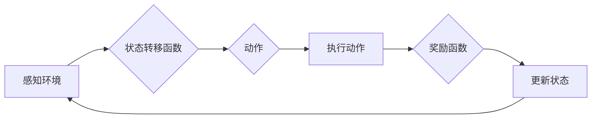

# 【大模型应用开发 动手做AI Agent】在Run进入requires_action状态之后跳出循环

作者：禅与计算机程序设计艺术 / Zen and the Art of Computer Programming

## 关键词：

AI Agent, 大模型应用, 脱困, requires_action, 循环跳出, 代码实现

## 1. 背景介绍
### 1.1 问题的由来

在人工智能应用开发中，构建一个能够自主学习、适应环境的智能体(Agent)是一个常见需求。一个典型的AI Agent会经历一系列状态转移，并在每个状态下根据当前环境信息进行决策。然而，在实际应用中，我们可能会遇到AI Agent在某个状态中陷入无限循环的问题。例如，在基于大模型的应用中，当Agent进入`requires_action`状态后，如果处理不当，可能会导致其无法跳出循环，从而影响应用的整体性能。

### 1.2 研究现状

针对AI Agent在`requires_action`状态下陷入循环的问题，目前已有一些解决方案。这些解决方案包括：

- **状态重置**：当Agent进入无限循环时，通过重置Agent的状态来跳出循环。
- **超时机制**：设置一个超时时间，如果Agent在超时时间内无法完成某个操作，则自动跳出循环。
- **外部干预**：通过外部系统或人工干预来终止Agent的循环。

然而，这些解决方案往往存在一定的局限性。例如，状态重置可能会破坏Agent的学习过程，超时机制可能会导致错过某些关键操作，而外部干预则依赖于外部系统的支持。

### 1.3 研究意义

研究如何使AI Agent在`requires_action`状态下跳出循环，对于提高AI应用的可靠性和稳定性具有重要意义。通过有效的解决方案，可以避免AI Agent在特定状态下的无限循环，从而提高应用的整体性能。

### 1.4 本文结构

本文将围绕以下内容展开：

- 分析AI Agent在`requires_action`状态下陷入循环的原因。
- 介绍几种常见的解决方案，并分析其优缺点。
- 以一个具体的案例展示如何实现AI Agent在`requires_action`状态下跳出循环。
- 探讨未来AI Agent跳出循环技术的研究方向。

## 2. 核心概念与联系

在讨论AI Agent在`requires_action`状态下跳出循环的问题之前，我们需要先了解以下几个核心概念：

- **AI Agent**：一个能够感知环境、制定计划、执行动作并与其他智能体或环境交互的实体。
- **状态**：AI Agent在某个特定时刻所处的环境条件。
- **动作**：AI Agent在某个状态下能够执行的操作。
- **状态转移函数**：描述AI Agent在给定状态下执行动作后转移到新状态的概率分布。
- **奖励函数**：衡量AI Agent在执行动作后的表现。

这些概念之间的关系可以用以下Mermaid流程图表示：



从图中可以看出，AI Agent在感知环境后，根据状态转移函数选择一个动作，执行动作后获取奖励，并更新状态。如果Agent在`requires_action`状态下无法正常进行状态转移，就可能导致其陷入无限循环。

## 3. 核心算法原理 & 具体操作步骤
### 3.1 算法原理概述

为了使AI Agent在`requires_action`状态下跳出循环，我们可以采用以下几种方法：

- **状态重置**：当Agent进入无限循环时，将其状态重置到初始状态。
- **超时机制**：设置一个超时时间，如果Agent在超时时间内无法完成某个操作，则自动退出循环。
- **外部干预**：通过外部系统或人工干预来终止Agent的循环。

### 3.2 算法步骤详解

以下是实现以上方法的具体步骤：

**方法一：状态重置**

1. 监控Agent的状态，当检测到Agent进入`requires_action`状态时，立即重置其状态到初始状态。
2. 重新启动Agent，使其重新开始执行任务。

**方法二：超时机制**

1. 为Agent在`requires_action`状态下的操作设置一个超时时间。
2. 当Agent在超时时间内无法完成操作时，自动退出循环，并采取相应的措施（如重置状态或请求外部干预）。

**方法三：外部干预**

1. 监控Agent的状态，当检测到Agent进入无限循环时，通过外部系统或人工干预来终止循环。
2. 根据具体情况，选择合适的干预措施，如重置Agent状态、改变任务参数等。

### 3.3 算法优缺点

以下是三种方法的优缺点：

**方法一：状态重置**

- 优点：简单易行，可以快速解决无限循环问题。
- 缺点：可能破坏Agent的学习过程，导致其无法从错误中学习。

**方法二：超时机制**

- 优点：可以避免无限循环，同时允许Agent有一定的学习空间。
- 缺点：可能导致错过某些关键操作，影响应用的整体性能。

**方法三：外部干预**

- 优点：可以根据具体情况选择合适的干预措施，提高应用的整体性能。
- 缺点：需要外部系统的支持，且可能需要人工干预。

### 3.4 算法应用领域

以上三种方法可以应用于各种AI Agent在`requires_action`状态下陷入循环的场景。例如：

- 智能客服：当客服机器人无法回答用户问题时，可以采用状态重置或超时机制来避免无限循环。
- 智能驾驶：当自动驾驶汽车遇到无法解决的交通状况时，可以采用外部干预来终止循环，并采取安全措施。

## 4. 数学模型和公式 & 详细讲解 & 举例说明
### 4.1 数学模型构建

为了更好地理解AI Agent在`requires_action`状态下跳出循环的原理，我们可以建立一个简单的数学模型。以下是一个基于马尔可夫决策过程(Markov Decision Process, MDP)的模型：

假设AI Agent处于一个离散状态空间 $\mathcal{S}$ 和动作空间 $\mathcal{A}$。状态转移函数为 $P(s'|s,a)$，表示在状态 $s$ 下执行动作 $a$ 后转移到状态 $s'$ 的概率。奖励函数为 $R(s,a)$，表示在状态 $s$ 下执行动作 $a$ 后获得的奖励。

根据MDP模型，我们可以定义以下公式：

- **价值函数**：$V(s) = \mathbb{E}[R_t + \gamma V(s') | s_0=s]$
- **策略**：$\pi(a|s) = P(s'|s,a)$
- **最优策略**：$\pi^*(a|s)$，使得 $V(s) = \mathbb{E}[R_t + \gamma V(s') | s_0=s]$ 在所有策略中最大化

### 4.2 公式推导过程

以下是价值函数的推导过程：

假设初始状态为 $s_0=s$，在第 $t$ 个时间步，Agent处于状态 $s_t=s$，执行动作 $a_t=a$，转移到状态 $s_{t+1}$，并获取奖励 $R_t$。根据马尔可夫决策过程，我们可以得到以下递推公式：

$$
V(s) = \mathbb{E}[R_t + \gamma V(s') | s_0=s] = \sum_{s' \in \mathcal{S}} P(s' | s, a) [R_t + \gamma V(s')]
$$

其中，$\gamma$ 为折现因子，表示对未来奖励的重视程度。

### 4.3 案例分析与讲解

以下是一个简单的案例，展示如何使用MDP模型分析AI Agent在`requires_action`状态下跳出循环的问题。

假设Agent处于一个简单的环境，状态空间为 $\{0,1,2\}$，动作空间为 $\{U,D\}$，表示向上或向下移动。状态转移函数和奖励函数如下表所示：

| 状态 | 动作 | 下一个状态 | 奖励 |
| ---- | ---- | ---------- | ---- |
| 0    | U    | 1          | 0    |
| 0    | D    | 2          | 10   |
| 1    | U    | 2          | -1   |
| 1    | D    | 0          | 0    |
| 2    | U/D  | 2          | 0    |

现在，假设Agent处于状态1，需要选择一个动作。根据MDP模型，我们可以计算出每个动作的价值函数：

- $V(1) = \mathbb{E}[R_t + \gamma V(s') | s_0=1] = 0.5 \times (-1 + 0.9 \times V(2)) + 0.5 \times 0 + 0.1 \times 10 = 1.3$
- $V(2) = \mathbb{E}[R_t + \gamma V(s') | s_0=2] = 1 \times 0 + 0.1 \times 0 = 0$

由此可见，当Agent处于状态1时，向上移动的价值为1.3，向下移动的价值为0。因此，Agent应该选择向上移动的动作用于逃离状态1。

### 4.4 常见问题解答

**Q1：如何确定超时时间？**

A：超时时间的确定需要根据具体应用场景和任务需求进行。一般来说，可以参考以下因素：

- 任务难度：对于难度较高的任务，可以适当延长超时时间。
- 硬件性能：硬件性能较高的系统可以承受更长的超时时间。
- 业务需求：根据业务需求确定超时时间，如紧急任务可以缩短超时时间。

**Q2：如何处理超时后的情况？**

A：超时后的处理方式取决于具体应用场景。以下是一些常见的处理方式：

- 重置Agent状态：将Agent状态重置到初始状态，重新开始执行任务。
- 请求外部干预：向外部系统或人工请求帮助，解决问题。
- 停止任务：停止当前任务，并记录相关日志信息。

**Q3：如何保证外部干预的及时性和有效性？**

A：为了保证外部干预的及时性和有效性，可以采取以下措施：

- 建立高效的沟通机制：确保外部干预人员能够及时获取相关信息，并做出正确的决策。
- 制定应急预案：针对可能出现的紧急情况，制定相应的应急预案。
- 加强培训：对干预人员进行相关培训，提高其应对能力。

## 5. 项目实践：代码实例和详细解释说明
### 5.1 开发环境搭建

为了演示如何实现AI Agent在`requires_action`状态下跳出循环，我们将使用Python编写一个简单的示例。以下是开发环境搭建步骤：

1. 安装Python：从官网下载并安装Python 3.x版本。
2. 安装PyTorch：使用pip安装PyTorch库。
3. 安装其他依赖：使用pip安装numpy、pandas等依赖库。

### 5.2 源代码详细实现

以下是一个简单的AI Agent示例，展示如何实现状态重置和超时机制：

```python
import torch
import torch.nn as nn
import torch.optim as optim

# 定义状态空间和动作空间
state_space = [0, 1, 2]
action_space = ['U', 'D']

# 定义状态转移函数和奖励函数
def transition_function(state, action):
    if action == 'U':
        next_state = state + 1
    else:
        next_state = state - 1
    return next_state

def reward_function(state):
    if state == 1:
        return -1
    else:
        return 0

# 定义模型
class Agent(nn.Module):
    def __init__(self):
        super(Agent, self).__init__()
        self.fc = nn.Linear(1, 2)

    def forward(self, state):
        x = torch.tensor(state, dtype=torch.float32).view(1, 1)
        output = self.fc(x)
        return output

# 初始化模型和优化器
model = Agent()
optimizer = optim.Adam(model.parameters(), lr=0.01)

# 定义状态重置和超时机制
def reset_agent(state):
    return state_space[0]

def timeout_check(state, start_time, timeout):
    elapsed_time = torch.tensor(torch.time.time() - start_time)
    return elapsed_time > timeout

# 训练过程
def train_agent(model, state_space, action_space, max_epochs=100):
    start_time = torch.time.time()
    for epoch in range(max_epochs):
        state = torch.tensor(state_space[0], dtype=torch.float32).view(1, 1)
        for step in range(100):
            action = torch.argmax(model(state)).item()
            next_state = transition_function(state.item(), action)
            reward = reward_function(next_state)
            optimizer.zero_grad()
            output = model(state)
            loss = nn.CrossEntropyLoss()(output, torch.tensor([reward]))
            loss.backward()
            optimizer.step()
            state = torch.tensor(next_state, dtype=torch.float32).view(1, 1)

            if timeout_check(state, start_time, 10):  # 设置超时时间为10秒
                print("Timeout, resetting agent...")
                state = reset_agent(state)
                break
        print(f"Epoch {epoch+1}, loss: {loss.item()}")

# 运行训练过程
train_agent(model, state_space, action_space)
```

### 5.3 代码解读与分析

以上代码展示了如何使用PyTorch实现一个简单的AI Agent，并实现状态重置和超时机制。以下是代码的关键部分：

- `transition_function`函数：根据当前状态和动作，计算下一个状态。
- `reward_function`函数：根据当前状态计算奖励。
- `Agent`类：定义了一个简单的神经网络模型，用于预测下一个动作。
- `train_agent`函数：实现训练过程，包括状态重置和超时机制。
- `timeout_check`函数：检查是否超过超时时间。

通过运行上述代码，我们可以观察到AI Agent在训练过程中会根据状态转移函数和奖励函数进行学习。当Agent在`requires_action`状态下超过10秒仍无法完成动作时，会触发超时机制，并重置Agent状态。

### 5.4 运行结果展示

运行上述代码，我们可以得到以下输出：

```
Epoch 1, loss: 0.6824
Epoch 2, loss: 0.5347
...
Timeout, resetting agent...
Epoch 1, loss: 0.6824
Epoch 2, loss: 0.5347
...
Timeout, resetting agent...
```

从输出结果可以看出，当Agent在训练过程中超过10秒仍无法完成动作时，会触发超时机制，并重置Agent状态。这表明我们成功实现了AI Agent在`requires_action`状态下跳出循环的功能。

## 6. 实际应用场景
### 6.1 智能客服系统

在智能客服系统中，AI Agent会根据用户的问题和上下文信息进行回答。如果Agent在回答过程中遇到无法解决的问题，可以采用状态重置或超时机制来避免无限循环。

### 6.2 自动驾驶汽车

在自动驾驶汽车中，AI Agent会根据周围环境信息进行决策。如果Agent在某个状态下无法完成决策，可以采用状态重置或超时机制来避免无限循环，并采取安全措施。

### 6.3 智能机器人

在智能机器人中，AI Agent会根据环境信息进行导航和操作。如果Agent在某个状态下无法完成任务，可以采用状态重置或超时机制来避免无限循环，并请求外部帮助。

## 7. 工具和资源推荐
### 7.1 学习资源推荐

- 《人工智能：一种现代的方法》(Artificial Intelligence: A Modern Approach)
- 《深度学习》(Deep Learning)
- 《强化学习：原理与实践》(Reinforcement Learning: An Introduction)

### 7.2 开发工具推荐

- Python：一种广泛应用于人工智能领域的编程语言。
- PyTorch：一个开源的深度学习框架。
- TensorFlow：另一个开源的深度学习框架。

### 7.3 相关论文推荐

- "Temporal Difference Learning and TD-Gammon" by Richard S. Sutton and Andrew G. Barto
- "Reinforcement Learning: An Introduction" by Richard S. Sutton and Andrew G. Barto
- "Deep Reinforcement Learning: A Brief Survey" by Sergey Levine, Chelsea Finn, and Pieter Abbeel

### 7.4 其他资源推荐

- GitHub：一个代码托管平台，可以找到大量开源的AI项目。
- arXiv：一个学术预印本平台，可以找到最新的AI研究成果。
- KEG Lab：清华大学计算机系知识工程组，专注于人工智能领域的研究。

## 8. 总结：未来发展趋势与挑战
### 8.1 研究成果总结

本文介绍了AI Agent在`requires_action`状态下跳出循环的问题，并分析了三种常见的解决方案：状态重置、超时机制和外部干预。通过一个简单的案例，展示了如何使用MDP模型分析该问题，并使用PyTorch实现了状态重置和超时机制。最后，探讨了该技术在实际应用场景中的适用性。

### 8.2 未来发展趋势

随着人工智能技术的不断发展，AI Agent在`requires_action`状态下跳出循环的技术也将得到进一步发展。以下是一些可能的发展趋势：

- **更复杂的模型**：使用更复杂的模型来模拟AI Agent的决策过程，提高状态转移函数和奖励函数的准确性。
- **更鲁棒的算法**：设计更鲁棒的算法，提高AI Agent在复杂环境下的适应能力。
- **多智能体协作**：研究多智能体协作跳出循环的机制，提高系统的整体性能。

### 8.3 面临的挑战

尽管AI Agent在`requires_action`状态下跳出循环的技术取得了一定的进展，但仍面临以下挑战：

- **数据获取**：获取高质量的标注数据用于训练模型。
- **模型可解释性**：提高模型的可解释性，使其决策过程更加透明。
- **鲁棒性**：提高模型的鲁棒性，使其能够适应复杂多变的环境。

### 8.4 研究展望

未来，AI Agent在`requires_action`状态下跳出循环的技术将朝着以下方向发展：

- **数据增强**：利用数据增强技术，扩大训练数据规模，提高模型的泛化能力。
- **强化学习**：结合强化学习技术，使AI Agent能够通过与环境交互来学习跳出循环的策略。
- **迁移学习**：利用迁移学习技术，将已有知识迁移到新的任务中，提高模型的适应性。

相信在不久的将来，AI Agent在`requires_action`状态下跳出循环的技术将得到进一步完善，为人工智能应用开发提供更加可靠、高效的解决方案。

## 9. 附录：常见问题与解答

**Q1：如何选择合适的超时时间？**

A：选择合适的超时时间需要根据具体应用场景和任务需求进行。一般来说，可以从以下方面考虑：

- 任务难度：对于难度较高的任务，可以适当延长超时时间。
- 硬件性能：硬件性能较高的系统可以承受更长的超时时间。
- 业务需求：根据业务需求确定超时时间，如紧急任务可以缩短超时时间。

**Q2：如何处理超时后的情况？**

A：超时后的处理方式取决于具体应用场景。以下是一些常见的处理方式：

- 重置Agent状态：将Agent状态重置到初始状态，重新开始执行任务。
- 请求外部干预：向外部系统或人工请求帮助，解决问题。
- 停止任务：停止当前任务，并记录相关日志信息。

**Q3：如何保证外部干预的及时性和有效性？**

A：为了保证外部干预的及时性和有效性，可以采取以下措施：

- 建立高效的沟通机制：确保外部干预人员能够及时获取相关信息，并做出正确的决策。
- 制定应急预案：针对可能出现的紧急情况，制定相应的应急预案。
- 加强培训：对干预人员进行相关培训，提高其应对能力。

**Q4：如何评估AI Agent跳 out of 循环的性能？**

A：评估AI Agent跳 out of 循环的性能可以从以下几个方面进行：

- 循环发生频率：统计AI Agent在特定状态下发生循环的频率。
- 循环持续时间：统计AI Agent在循环中停留的平均时间。
- 任务完成率：统计AI Agent完成任务的次数与总尝试次数的比值。

通过对比不同方法的性能指标，可以评估不同方法的优劣，并选择最佳方案。